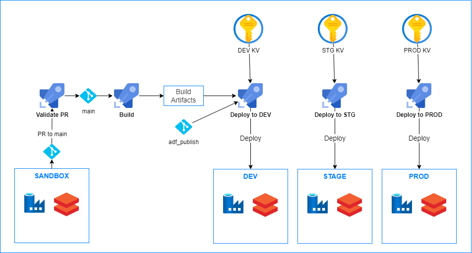

# DataOps

This repository contains numerous code samples and artifacts on how to apply DevOps principles to common data engineering patterns and architectures utilizing Microsoft data platform technologies.

The samples are either focused on a single microsoft service ([Single-Technology Samples](#single-technology-samples)) or showcases an end-to-end data pipeline solution as a reference implementation ([End-to-End Samples](#end-to-end-samples)). Each sample contains code and artifacts related to one or more of the following capabilities:

- Infrastructure as Code (IaC)
- Build and Release Pipelines (CI/CD)
- Testing
- Observability / Monitoring

## Single-Technology Samples

| Technology | Samples |
| ---------- | ------- |
| [Microsoft Fabric](./fabric/README.md) | ▪️ [CI/CD for Microsoft Fabric](./fabric/fabric_ci_cd/README.md) ▪️ [Gitlab CI/CD for Microsoft Fabric](./fabric/fabric_cicd_gitlab/README.md) ▪️ [Feature engineering on Microsoft Fabric](./fabric/feature_engineering_on_fabric/README.md) |
| [Azure SQL database](./azuresqldb/README.md) | ▪️ [CI/CD for Azure SQL database](./azuresqldb/azuresql_ci_cd/README.md) |
| [Azure Data Factory](./azuredatafactory/README.md) | ▪️ [CI/CD for ADF with Auto publish](./azuredatafactory/adf_cicd_auto_publish/README.md)  ▪️ [Data pre-processing using Azure Batch](./azuredatafactory/adf_data_pre_processing_with_azure_batch/README.md) |

## End-to-End Samples

### DataOps for Medallion with Azure Data Factory and Azure Databricks

This [sample](databricks/parking_sensors/) demonstrates batch, end-to-end data pipeline utilizing Azure Data Factory and Azure Databricks built according to the [medallion architecture](https://learn.microsoft.com/azure/databricks/lakehouse/medallion), along with a corresponding CI/CD process, observability and automated testing.

### DataOps for Medallion with Microsoft Fabric

- This [sample](./fabric/fabric_dataops_sample/) would demonstrate end-to-end batch data processing utilizing Microsoft Fabric built according to the [medallion architecture](https://learn.microsoft.com/fabric/onelake/onelake-medallion-lakehouse-architecture), along with a corresponding CI/CD process, observability and automated testing.

  In the current version, the sample is showcasing the deployment of Azure and Fabric resources together using Terraform. The deployment uses a service principal or managed identity for authentication where supported and falls back to Entra user authentication where it is not.

## Contributing

This project welcomes contributions and suggestions. Please see our [Contributing guide](/CONTRIBUTING.md).

## Data Collection

The software may collect information about you and your use of the software and send it to
Microsoft. Microsoft may use this information to provide services and improve our products
and services. You may turn off the telemetry as described below. There are also some features
in the software that may enable you and Microsoft to collect data from users of your applications.
If you use these features, you must comply with applicable law, including providing appropriate
notices to users of your applications together with a copy of Microsoft’s privacy statement. Our
privacy statement is located [here](https://go.microsoft.com/fwlink/?LinkID=824704). You can learn more
about data collection and use in the help documentation and our privacy statement. Your use of the
software operates as your consent to these practices.

The `partner_id` provider property in .tf files, `AZURE_HTTP_USER_AGENT` declaration in .sh files, and `attribution` 
resources in .bicep files enable anonymous telemetry that helps us justify ongoing investment in 
maintaining and improving this repository. Keeping these values enabled supports the project and future 
feature development. To opt out of this telemetry, simply remove `partner_id`, `AZURE_HTTP_USER_AGENT`, 
or `attribution` code blocks. When enabled, the specified IDs are appended to requests sent by the associated code.
