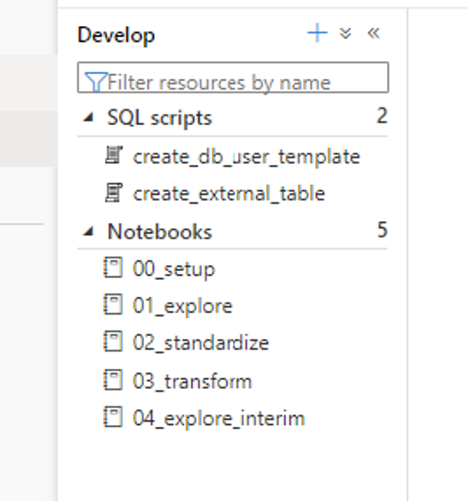
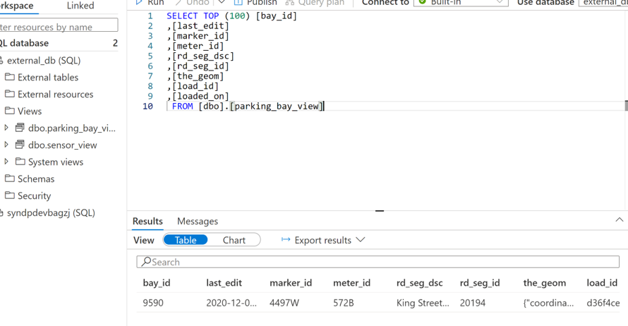
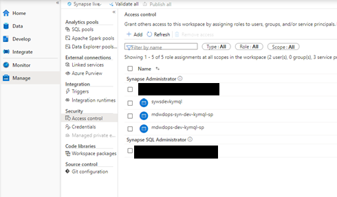
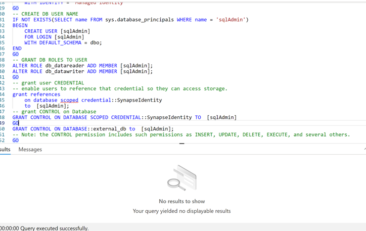
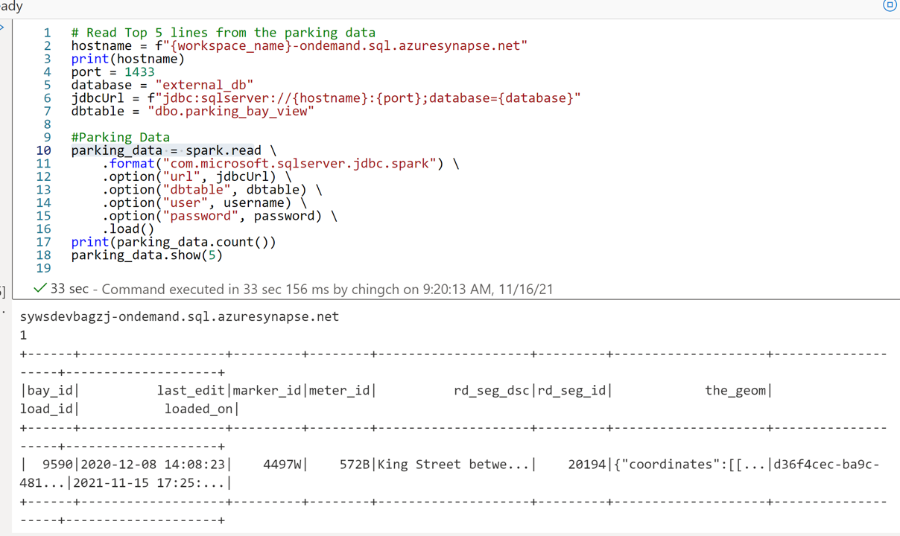

# External View in SQL Serverless

## Check deployment successfully

## Setup Pipeline

- To be able to create view with schema less, need to have data in the target location.
- Thus, need to run pipeline once before running the "create_external_table"

## Run SQL script to create view

- Make sure you are in the synapse sql admin role
- Execute "create_external_table.sql"
- Right click view and select query
- Check result can be queried successfully
  

## Query from notebook

- Need to either get ADToken or use username and password to connect to SQL Serverless
- clone "create_db_user_template.sql" to a new sql "create_db_user.sql"
- Update "create_db_user.sql". Replace `[<your sql login user name>]` and `[<your database name>]` with the setting in the keyvault of secret synapseSQLPoolAdminUsername

- Replace `<your password>` with the password setting in the keyvault of secret synapseSQLPoolAdminPassword
- Replace `<your password>` with the password setting in the keyvault of secret synapseSQLPoolAdminPassword
- Replace `[<your database name>]` to the database name created in previous step. Default is 'external_db'
- Execute the script "create_db_user.sql"

- Run Notebook `[01b_explore_sqlserverless]` to query from SQL Serverless View

