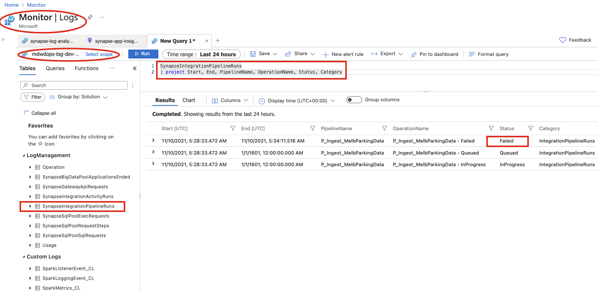
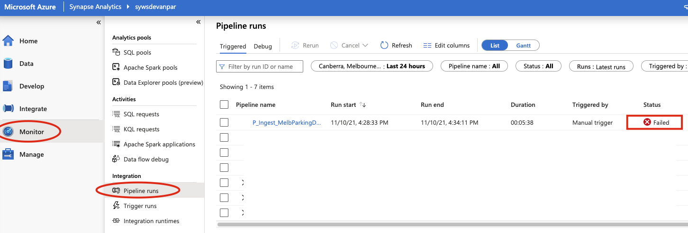
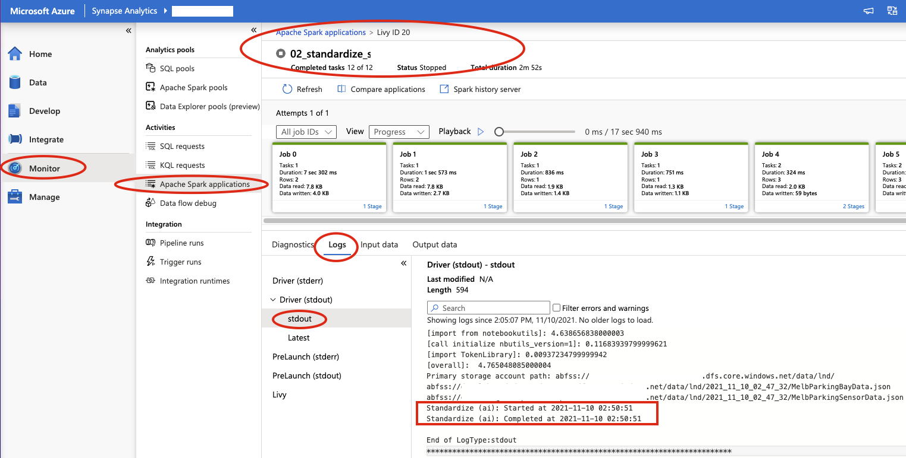
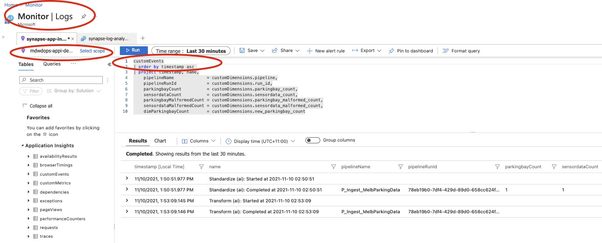
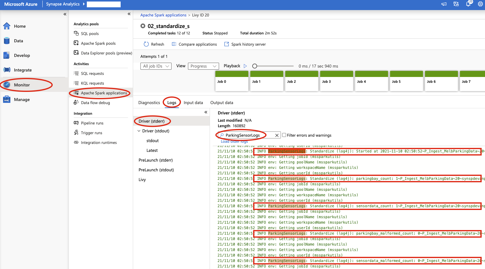
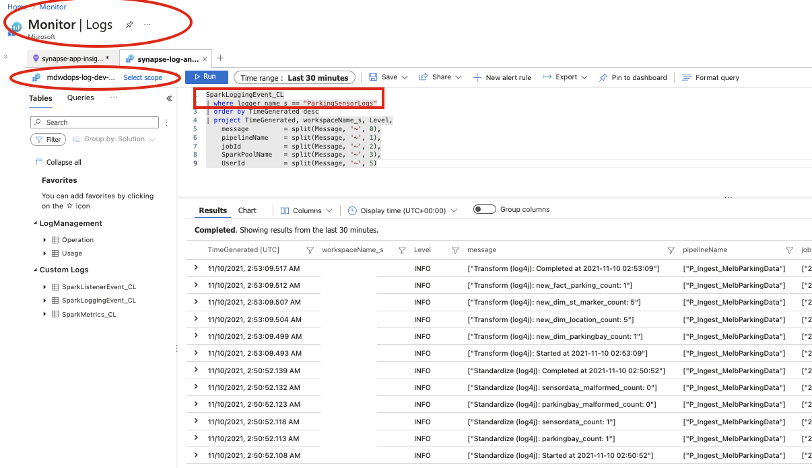

# Observability / Monitoring

## Using base-level infrastructure metrics, alerts, and logs

Azure Monitor provides base-level infrastructure metrics, alerts, and logs for most Azure services. Azure diagnostic logs are emitted by a resource and provide rich, frequent data about the operation of that resource. Azure Synapse Analytics can write diagnostic logs in Azure Monitor.

In this solution, the [diagnostic settings](https://docs.microsoft.com/en-us/azure/synapse-analytics/monitoring/how-to-monitor-using-azure-monitor#diagnostic-settings) have been enabled and the diagnostic logs are sent to Log Analytics Workspace (check [diagnostic_settings.bicep](../infrastructure/modules/diagnostic_settings.bicep)).

With that, the pipeline/activity/trigger runs status can be queries in Azure Monitor using Kusto queries. The screenshot below shows one such query. Under Azure Monitor -> Logs, the log analytics workspace has been selected as the scope. The Kusto query is based on "SynapseIntegrationPipelineRuns" Synapse workspace log and shows that the pipeline run has "failed".



The same information is also available in Synapse Studio under "Monitor" -> "Integration" -> "Pipeline runs" as shown below.



Please refer to the following Azure documentation for more information on this topic:

* [How to Monitor using Azure Monitor](https://docs.microsoft.com/en-us/azure/synapse-analytics/monitoring/how-to-monitor-using-azure-monitor)
* [Create alerts for Azure SQL Database and Azure Synapse Analytics using the Azure portal](https://docs.microsoft.com/en-us/azure/azure-sql/database/alerts-insights-configure-portal)

## Using custom application logs

Depending on the pipeline activities, the custom application logs can be written and pushed to Log Analytics Workspace and/or Azure Application Insights. The solution primarily focuses on the logging in relation to pyspark notebooks.

The two notebooks "02_standardize" and "03_transform" illustrate two different ways of writing custom logs.

### 1. Using Application Insights and OpenCensus Library

In the first method, the logging information is written to Azure Application Insights using OpenCensus Library. As part of the initial deployment, the application insights key has already been added to the Key Vault as secret key "applicationInsightsKey". Also, the "opencensus" package has been uploaded to the spark pool using "requirements.txt" file during the initial deployment.

In the "02_standardize" notebook ("03_transform" has the same observability code), the logger is then initialized using this key.

```python
# Getting Application Insights instrumentation key
appi_key = token_library.getSecretWithLS(keyvaultlsname,"applicationInsightsKey")

# Enable App Insights
aiLogger = logging.getLogger(__name__)
aiLogger.addHandler(AzureEventHandler(connection_string = 'InstrumentationKey=' + appi_key))
```

Note that it's also possible to set "custom_dimensions" with this approach which can be passed to the logger as a JSON object:

```python
properties = {"custom_dimensions": {"pipeline": pipelinename, "run_id": loadid, "parkingbay_count": parkingbay_count, "sensordata_count": sensordata_count, "parkingbay_malformed_count": parkingbay_malformed_count, "sensordata_malformed_count": sensordata_malformed_count}}
aiLogger.info("Standardize (ai): Completed at " + datetime.now().strftime("%Y-%m-%d %H:%M:%S"), extra=properties)
```

Once the pipeline "P_Ingest_MelbParkingData" has been executed, this logging information can be checked in Synapse Studio as shown below:



The same information can also be queried in Azure Monitor. For that, the relevant application insights instance has been selected for the scope under Azure Monitor -> Logs. The query is based on "customEvents" logs. The "customDimensions" has been parsed to get the individual metrics.



Please refer to [Set up Azure Monitor for your Python application](https://docs.microsoft.com/en-us/azure/azure-monitor/app/opencensus-python) for additional information on this topic.

### 2. Using Log Analytics Workspace and log4j logger

The other option is to use the "log4j" logger to send the logs to Log Analytics Workspace. To facilitate this, a spark configuration file "spark_loganalytics_conf.txt" has already been uploaded to the spark pool during the intial deployment. This configuration file has the following entries:

```text
spark.synapse.logAnalytics.enabled true
spark.synapse.logAnalytics.workspaceId <LOG_ANALYTICS_WORKSPACE_ID>
spark.synapse.logAnalytics.secret <LOG_ANALYTICS_WORKSPACE_KEY>
```

To access this file from Azure Portal, go to Synapse Workspace -> Apache Spark pools and select the spark pool name, it is available under "Spark configuration".

Once this configuration has been applied to the spark pool, the logged can be initialized and used in the notebooks which are attached to this spark pool. For illustration purpose, let's take the "02_standardize" notebook (The same pattern is used in "03_transform" notebook as well).

First, the log4j logger has been initiated and named "ParkingSensorLogs".

```python
# Enable Log Analytics using log4j
log4jLogger = sc._jvm.org.apache.log4j
logger = log4jLogger.LogManager.getLogger("ParkingSensorLogs")
```

The code further illustrates how some relevant information can also be extacted using "mssparkutils.env". This additional information, such as "job Id" or "pool name" can be useful for correlating log messages and debugging.

```python
def log(msg = ''):
    env = mssparkutils.env
    formatted_msg = f'Standardize (log4j): {msg}~{pipelinename}~{env.getJobId()}~{env.getPoolName()}~{env.getWorkspaceName()}~{env.getUserId()}'
    logger.info(formatted_msg)
```

Within the Synapse Studio, these log messages can be found under Monitor -> Apache Spark applications -> Logs -> Driver (stderr) as shown below:



For querying this information in Azure Monitor, go to Logs and select the relevant log analytics workspace instance as the scope. The custom logs get logged under Custom Logs -> SparkLoggingEvent_CL, here is a screenshot:



Please refer to [Monitor Apache Spark applications with Azure Log Analytics](https://docs.microsoft.com/en-us/azure/synapse-analytics/spark/apache-spark-azure-log-analytics) for detailed information on this topic.

**NOTE**: Here it's worth mentioning that the above examples are for general guidance only. Readers are encouraged to explore different options and customize the message formats as per their use-cases.
