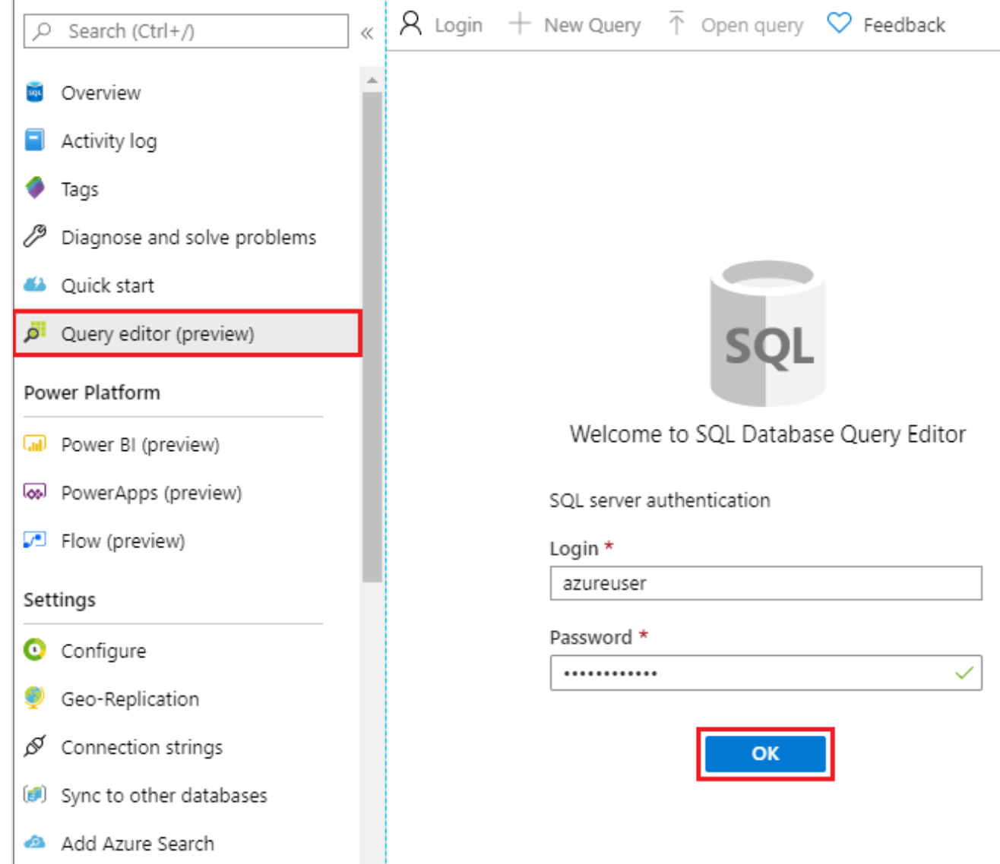
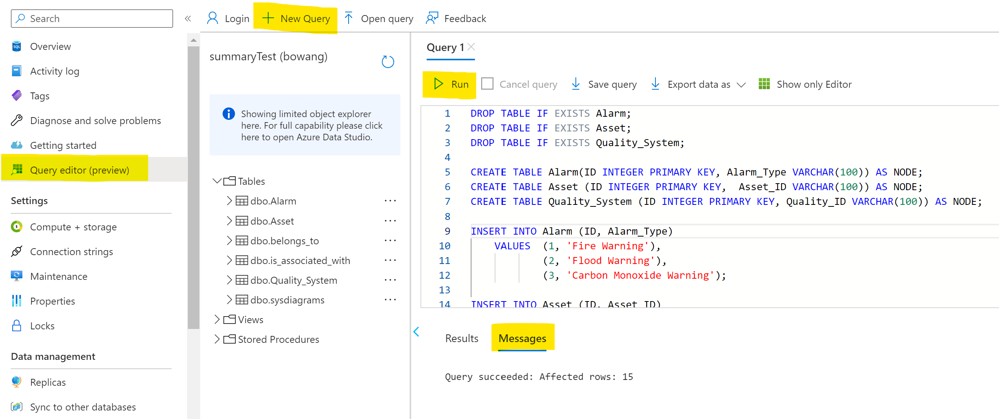
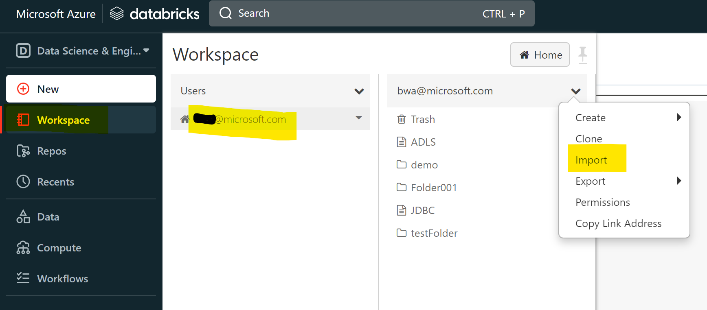
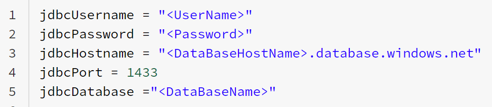
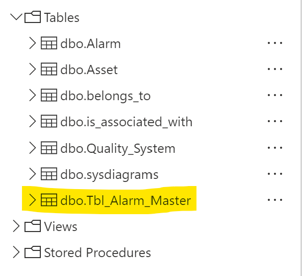

# Introduction

Data contextualization is a process to put related information together to make the data more useful and easier to digest and interpret. This sample code demonstrates how to contextualize data by looking up the relevant context from a graph model in Azure SQL Database.

## Getting Started

Take the following steps to run the sample solution:

1. If you don't have an Azure account, create one for free [here](https://azure.microsoft.com/en-us/free/).
2. Create [Azure Databricks workspace](https://learn.microsoft.com/en-us/azure/databricks/getting-started/).
3. Create a single database - [Azure SQL Database](https://learn.microsoft.com/en-us/azure/azure-sql/database/single-database-create-quickstart?view=azuresql&tabs=azure-portal)
4. Create Graph tables
    - Enter the following query in the Query editor pane.

    
    - Enter the [Create Graph Table Script](./src/sql/create-graph.sql) in the Query editor pane.

    
5. Import notebooks into Azure Databricks
    - Select import button from the menu.

    
    - select notebook sample code to upload
        - [demo-setup.py](./src/notebooks/demo-setup.py)
        - [demo-contextualizaion.py](./src/notebooks/demo-contextualizaion.py)
            - Please replace your database connection information

            
    - Run demo-setup notebook
    - Run demo-contextualizaion notebook
    - If you successfully run the nodebook, you will see contextualized tables in the database.

    
