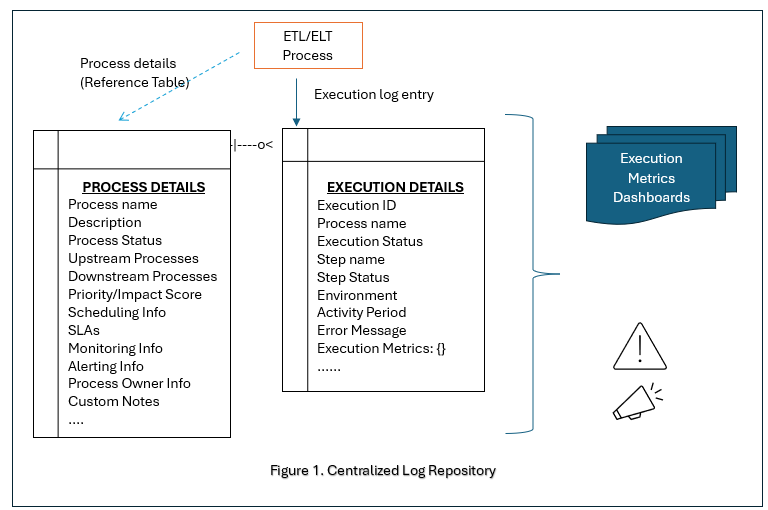

# Observability in Data Projects Using OpenTelemetry

TO DO:

- Update notebook links which are good examples for OTEL implementation.
- Replace the sample contents for python scripts (otel_monitor_invoker.py and otel_collector_invoker.py) with links.
- Where do we keep the config file related to OTEL
- What is the preferred setup for Collector setup (VM + Docker)?
- Including the monitoring module as part of the Fabric envs
- Code sample section updates - Need to add authentication and extensions - Check [Related feature](https://github.com/orgs/Azure-Samples/projects/47/views/5?pane=issue&itemId=67384645&issue=Azure-Samples%7Cmodern-data-warehouse-dataops%7C715)

## Introduction

Observability plays a crucial role in ensuring that a system or service is functioning as intended and **delivering value**. However, it is frequently neglected during the initial stages of a data project, leading to expensive rework and inadequate monitoring capabilities. Including observability from the very beginning is essential for assessing system performance, availability, planning future improvements based on resource utilization, and most importantly -monitoring the value delivered by the system. This article presents key considerations, best practices (such as naming conventions and common telemetry data schema), and a way to combine business data with monitoring data.

Furthermore, this article delves into the implementation of monitoring and observability through the utilization of an open-source and vendor-agnostic framework known as [OpenTelemetry [OTEL]](https://opentelemetry.io/docs/what-is-opentelemetry/). There are various facets of monitoring, some of which are highlighted below, along with the corresponding services provided by Microsoft Azure:

- Application monitoring
  - Performance
  - Business metrics/Data quality
- Service monitoring
  - [Azure Monitor](https://learn.microsoft.com/azure/azure-monitor/)
  - [Microsoft Fabric metrics](https://learn.microsoft.com/fabric/enterprise/metrics-app)
  - [Microsoft Fabric monitoring workspace](https://learn.microsoft.com/fabric/admin/monitoring-workspace)
  - [Microsoft Fabric monitoring hub](https://learn.microsoft.com/fabric/admin/monitoring-hub)
- Security monitoring
  - [User activity tracking](https://learn.microsoft.com/fabric/admin/track-user-activities)

This article focuses on application monitoring (user-generated telemetry).

## Monitoring and observability in data projects

Customers heavily rely on dashboards and metrics to evaluate the **business value** offered by a service or process. Therefore, it is crucial to capture all the necessary information at the appropriate granularity and frequency in order to generate these customer-facing dashboards. These dashboards can be operational-focused, functionality/business-focused, or a combination of both. The monitoring and observability (telemetry) data should enable reports on two main aspects of a data system/process:

- **Fit for for use**
  - Focus: Operational teams (SRE, INFRA/OPS etc.).
  - Purpose: Informs the users about the state of the system and its availability for use including any anomalies, issues, or errors.
  - Examples: Access logs/metrics, performance metrics, system activities, uptime/downtime, response times, latency, processing times, volume, throughput, etc.

- **Fit for purpose**
  - Focus: Business teams (end users/customers).
  - Purpose: Informs the users whether system is delivering value by performing the tasks as specified in business requirements.
  - Examples: Data quality, service quality, end user interactions, service interruptions, customer satisfaction, etc.

Monitoring should encompass all the necessary information to generate metrics and dashboards specified by the operational and business teams to address these two aspects. This is typically achieved through a multi-step process, as outlined below, enabling teams to work efficiently in parallel:

1. Focus on the raw metrics/logs in the ETL code.
2. Implement processing steps on top of this raw telemetry data to generate alerts, aggregations, trends/patterns, analytics, and dashboards. Types of analytics that can be derived include:
   - *Descriptive and diagnostic analytics* to see what happened and why.
   - Leveraging AI/ML for *predictive and prescriptive analytics* to make predictions and guide future actions/investments.

Here are some important considerations for observability:

- Establishing consistent [naming conventions](#sample-naming-conventions) and adopting [common schema/s](#sample-schema) for telemetry.
- Identifying Key Performance Indicators (KPIs) that are relevant to the business teams and customers.
- Understanding the operational requirements from SRE/INFRA/OPs teams.
- Defining alerts and monitoring requirements from both SRE/INFRA/OPs and business teams.
- Determining the type of monitoring needed, such as application, performance, user, infrastructure, or security monitoring. (Note: This article primarily focuses on application monitoring.)

In modern systems, telemetry data is crucial for reacting to failures, gaining insights into usage patterns, and proactively preparing the system for potential issues. For these reasons, it is important to treat observability data as a *data product* and apply the same level of rigor and standards to its development as with other core systems. For example, consider an infrastructure hosting service provider/vendor who charges customers based on their service usage. Here, proper tracking of resource usage becomes paramount as it directly impacts the revenue. Logs capturing usage patterns can also be valuable for generating additional revenue and facilitating cost optimization for both the vendor and the customer. The vendor can even market these logs as a product to the customer for deeper analysis by customer on their own, offering product recommendations and better usage planning.

## Using OpenTelemetry for monitoring and observability

In this section, we explore the implementation of  [OpenTelemetry [OTEL]](https://opentelemetry.io/docs/what-is-opentelemetry/) and its usage for capturing user-generated telemetry.

To understand the fundamentals of OpenTelemetry, you can refer to the [OpenTelemetry fundamentals](https://opentelemetry.io/docs/specs/otel/overview/#tracing-signal) documentation. Additionally, you can learn about OpenTelemetry signals and their significance in the [signals](https://opentelemetry.io/docs/concepts/signals/) section.

### Consider OpenTelemetry setup options

There are mainly two ways of OpenTelemetry setup to make a system observable:

1. Using [OpenTelemetry SDK](https://opentelemetry.io/docs/collector/deployment/no-collector/) directly (No Collector)
   - [When to use](https://opentelemetry.io/docs/collector/deployment/no-collector/#tradeoffs)
   - Example: The [Python code sample for Azure Monitor](#sample-python-script-with-opentelemetry-sdk-no-collector-using-azure-monitor-as-the-sink) shows the use of OpenTelemetry SDKs directly by the application with Azure AppInsights as the target for monitoring data.
   - See [steps involved](#setup---option-1---using-opentelemetry-sdk-directly-no-collector).
2. Using [OpenTelemetry Collector](https://opentelemetry.io/docs/collector/)
   - [When to use](https://opentelemetry.io/docs/collector/#when-to-use-a-collector)
   - Example: The [Python code sample using OTEL Collector](#sample-python-script---using-opentelemetry-collector) shows the use of Collector which has multiple targets configured to serve as the targets for monitoring data.
   - See [steps involved](#setup---option-2---using-otel-collector).

Using OpenTelemetry (Option 1), while easy to setup, it is not as scalable as the Collector based option (Option 2), which supports multiple targets as sinks for monitoring data using [exporters](https://opentelemetry.io/docs/concepts/components/#exporters).

Regardless of the chosen setup option, the process of generating traces, logs, and metrics remains the same. Refer to [sample OTEL implementation code](#creating-telemetry-events-with-opentelemetry-sdk-no-collector) to learn how this is achieved. Additional things to consider:

- Establish a [**common schema**](#sample-schema) for telemetry/observability data. This schema should define agreed-upon names and possible values for events, attributes, links, exceptions, etc. All developers should adhere to this schema when publishing traces, logs, and metrics. It should also include a section for custom attributes.
- Implement well defined [**naming convention**](#sample-naming-conventions) to facilitate easier correlation of events and artifacts, especially in cases where correlation IDs are not present. Using business-friendly terms or acronyms in artifact names or log messages, as opposed to system-generated IDs, significantly improves the user experience during log and event investigation.
- In situations where passing a *correlation ID* from one processes to another becomes impractical (see [context propagation](https://opentelemetry.io/docs/concepts/signals/traces/#context-propagation)), establish a convention to generate a unique, business-friendly ID that can be included in the telemetry. This ID can then be leveraged to combine, group, or relate events/spans/traces.

### Setup OpenTelemetry

The following sections describe setup needed for each OTEL setup option.

#### Setup - Option 1 - Using OpenTelemetry SDK directly (no Collector)

This doesn't require any setup other than using OpenTelemetry SDKs directly in the code as shown in the [OTEL library script](#sample-python-script-with-opentelemetry-sdk-no-collector-using-azure-monitor-as-the-sink) and the [code sample](#creating-telemetry-events-with-opentelemetry-sdk-no-collector) where traces, logs and metrics are generated using this library.

#### Setup - option 2 - Using OTEL Collector

This option shows [Code based solution](https://opentelemetry.io/docs/concepts/instrumentation/code-based/) using [OpenTelemetry Collector](https://opentelemetry.io/docs/collector/) as the means to gather telemetry data and export to supported target systems (like Azure Monitor, ADX, Fabric Kusto instance etc.,). It involves the following components/steps:

1. *One time setup* - install the OTEL Collector and configure it - typically done by infrastructure team/s:

      1.1. Installing the [Collector](https://opentelemetry.io/docs/collector/installation/). Ensure the Collector is accepting requests from the clients (where telemetry is being generated).

      1.2. Creating the [Collector configuration file](https://opentelemetry.io/docs/collector/configuration/#basics). See the [sample file](#sample-otel-collector-configuration-file) below.

      1.3. Ensure Collector is up and running. See the sample commands to [kick-off Collector running on Docker](#sample-docker-based-collector-kickoff).

1. *One time setup* - perform target specific setup - typically done by Infrastructure team/development team:

    - Example: For [ADX and Kusto](https://github.com/open-telemetry/opentelemetry-collector-contrib/tree/main/exporter/azuredataexplorerexporter) you need to [create tables and enable streaming ingestion](https://github.com/open-telemetry/opentelemetry-collector-contrib/tree/main/exporter/azuredataexplorerexporter#database-and-table-definition-scripts).

1. *One time development activity* - Create [OTEL collector code](#sample-python-script---using-opentelemetry-collector) packaged as a common library which creates OpenTelemetry providers for traces, metrics and logs using the Collector.

1. *Regular development activity* - Use common OTEL library, from above step, in the code to [capture observability data](https://opentelemetry.io/docs/languages/python/instrumentation/).

   - Understand different ways to [create spans](#create-tracesspans).
   - The [code sample](#creating-telemetry-events-with-opentelemetry-collector) shows a way to generate the telemetry.

### Create telemetry data

The following explains different types of OTEL spans and ways to create them and the [samples](#sample-files) contains examples of a [common schema](#sample-schema) and combining business data with telemetry data.

#### Understand OpenTelemetry span types

Spans are one type of [signals](https://opentelemetry.io/docs/concepts/signals/) generated by OpenTelemetry. There are primarily [two types of Spans](https://opentelemetry-python.readthedocs.io/stable/api/trace.html):

1. *Attached spans* which have *implicit context propagation*.

    Here new spans are *attached* to the context in that they are created as children of the currently active span, and the newly-created span can optionally become the new active span.

      Example:

      ```python
      # Create a new root span, set it as the current span in context
      with tracer.start as current span("parent"):
          # Attach a new child and update the current span
          with tracer.start as current span("child"):
              do work():
          # Close child span, set parent as current
      # Close parent span, set default span as current
      ```

2. *Detached spans* which needs to have *context set explicitly*.

    Here a span is *detached* from the context the active span doesn’t change, and the caller is responsible for managing the span’s lifetime.

      Example:

      ```python
      # Explicit parent span assignment is done via the Context
      from opentelemetry.trace import set span in context
      context = set span in context(parent)
      child = tracer.start span("child", context=context)

      try:
          do work(span=child)
      finally:
          child.end()
      ```

#### Create traces/spans

See [Opentelemetry Cook book for Python](https://opentelemetry.io/docs/languages/python/cookbook/) for examples on how to create a new span or a trace.

Typical flow looks like:

1. Create the *root span* as the very first step of the process/execution.

    1.1. Add *resource attributes* which are common for the entire process.

    1.2. Do your processing. Create child spans, events, logs and metrics as needed. Keep adding them to relevant spans.

1. Add the required attributes which are run/execution specific to the *root span* just before the end of the process/execution.

1. Close the *root span* and exit the process/execution.

See  [code sample creating telemetry events](#creating-telemetry-events-with-opentelemetry-sdk-no-collector) for implementation example.

Span creation can be done in multiple ways:

- By using the statements above (attached or detached span).
- By using [Python decorators](https://opentelemetry.io/docs/languages/python/instrumentation/#creating-spans-with-decorators).

Note:

- Any log message (using `logging.*`) in a *detached span* may not have traceId/SpanId information unlike an *attached span*.
- If you are creating spans using decorators then you should have `tracer` available before defining the functions so that it can be used as a *python decorator*.

## Sample files

### Sample Python script with OpenTelemetry SDK (No Collector) Using Azure Monitor as the Sink

```python
#####################################
# script_name: otel_monitor_invoker.py
#####################################

# Python dependencies:
#  azure-monitor-opentelemetry-exporter

# This examples uses advanced config using monitor exporters. See [OTEL for Azure Monitor](https://github.com/Azure/azure-sdk-for-python/tree/main/sdk/monitor/azure-monitor-opentelemetry-exporter#microsoft-opentelemetry-exporter-for-azure-monitor) for details.

# Simple configuration could also be done using as below in which case, tracer, logger and meter are pre-configured to send data to azure-monitor. See [enabling OTEL](https://learn.microsoft.com/azure/azure-monitor/app/opentelemetry-enable?tabs=python) for details.
# ```
# from azure.monitor.opentelemetry import configure_azure_monitor

# # Configure to authenticate with Azure Monitor - without managed identity
# configure_azure_monitor(
#     connection_string="your-connection-string"
# )

# # using a managed identity credential.
# configure_azure_monitor(
#     connection_string="your-connection-string",
#     credential=ManagedIdentityCredential(),
# )
# ```
# - https://learn.microsoft.com/en-us/python/api/overview/azure/monitor-opentelemetry-exporter-readme?view=azure-python-preview

import logging

# from azure.monitor.opentelemetry import configure_azure_monitor # We are using the advanced configs shown below using AzureMonitor*Exporter.
from azure.monitor.opentelemetry.exporter import (
    AzureMonitorTraceExporter,
    AzureMonitorLogExporter,
    AzureMonitorMetricExporter
)
# traces
from opentelemetry import trace
from opentelemetry.trace import SpanKind
from opentelemetry.trace.status import StatusCode
from opentelemetry.sdk.trace import TracerProvider
from opentelemetry.sdk.trace.export import BatchSpanProcessor
# logs
from opentelemetry._logs import set_logger_provider
from opentelemetry.sdk._logs import (
    LoggerProvider,
    LoggingHandler,
)
from opentelemetry.sdk._logs.export import BatchLogRecordProcessor
from opentelemetry.sdk.resources import SERVICE_NAME, Resource
# metrics
from opentelemetry import metrics
from opentelemetry.sdk.metrics import MeterProvider
from opentelemetry.sdk.metrics.export import PeriodicExportingMetricReader


logging.basicConfig(level=logging.INFO)

class OpenTelemetryAppInsightsExporter:
    def __init__(self, conn_string: str) -> None:
        """
        Initializes the OpenTelemetryExporter class.

        Args:
            conn_string (str): Azure AppInsights connection string.
        """
        self.conn_string = conn_string

        return None


    def get_otel_tracer(self, trace_resource_attributes: dict, tracer_name: str = __name__) -> object:
        """
        Creates and returns an OpenTelemetry tracer object.

        Args:
            trace_resource_attributes (dict): The OpenTelemetry resource attributes in dictionary format
            tracer_name (str): The name of the tracer. Default is __name__.
        Returns:
            tracer: OpenTelemetry tracer object
        """
        resource = Resource(attributes=trace_resource_attributes)
        trace.set_tracer_provider(TracerProvider(resource=resource))
        tracer = trace.get_tracer(__name__)
        # Exporter to send data to AppInsights
        trace_exporter = AzureMonitorTraceExporter(connection_string=self.conn_string)
        span_processor = BatchSpanProcessor(trace_exporter)
        trace.get_tracer_provider().add_span_processor(span_processor)
        return tracer


    def get_otel_logger(self, log_resource_attributes: dict, logger_name: str = __name__, add_console_handler: bool = True) -> object:
        """
        Creates and returns an OpenTelemetry logger object.

        Args:
            log_resource_attributes (dict): The OpenTelemetry resource attributes in dictionary format
            logger_name (str): The name of the logger. Default is __name__.
            add_console_handler (bool): Whether to add a console handler to the logger. Default is True.
        Returns:
            logger: OpenTelemetry logger object
        """
        resource = Resource(attributes=log_resource_attributes)
        log_exporter = AzureMonitorLogExporter(connection_string=self.conn_string)

        logger_provider = LoggerProvider(resource=resource)
        logger_provider.add_log_record_processor(BatchLogRecordProcessor(log_exporter))
        handler = LoggingHandler(level=logging.INFO, logger_provider=logger_provider)
        logging.getLogger().addHandler(handler) # Attach OTLP handler to root logger

        logger = logging.getLogger(logger_name) # get namespaced logger

        # # Create a console handler  - Optional
        if add_console_handler:
            console_handler = logging.StreamHandler()
            console_handler.setLevel(logging.INFO)
            logger.addHandler(console_handler)

        return logger


    def get_otel_metrics(self, metric_resource_attributes: dict, metric_name: str = __name__, metric_version: str = "0") -> object:
        """
        Creates and returns an OpenTelemetry metrics object.

        Args:
            metric_resource_attributes (dict): The OpenTelemetry resource attributes in dictionary format
            metric_name (str): The name of the metric. Default is __name__.
            metric_version (str): The version of the metric. Default is "0".
        Returns:
            meter: OpenTelemetry meter object
        """
        resource = Resource(attributes=metric_resource_attributes)
        metrics_exporter = AzureMonitorMetricExporter(connection_string=self.conn_string)
        metrics_reader = PeriodicExportingMetricReader(metrics_exporter)
        metrics_provider = MeterProvider(resource=resource, metric_readers=[metrics_reader])
        metrics.set_meter_provider(metrics_provider)
        meter = metrics.get_meter_provider().get_meter(name=metric_name, version=metric_version)

        return meter
```

#### Creating telemetry events with OpenTelemetry SDK (No Collector)

See [Creating traces and spans](#create-tracesspans) for typical flow.

Assuming [the code for SDK option](#sample-python-script-with-opentelemetry-sdk-no-collector-using-azure-monitor-as-the-sink) is stored `otel_monitor_invoker.py` here is the sample code to use for generating telemetry.

```python

from opentelemetry.trace import SpanKind
from opentelemetry.trace.status import StatusCode

import otel_monitor_invoker as otel  # OTEL code saved as the code module

otlp_exporter = otel.OpenTelemetryAppInsightsExporter(conn_string=<< replace this with Azure Monitor connection string>>)

# set resources - This is only a sample. Make it detailed enough so that SRE/OPS have information for their monitoring needs.
resource_attributes = {
    # ---------- Reserved attribute names
    "service.name": "your service_name",
    "service.version": "your service_version",
    "service.namespace": "your name space",
    "service.instance.id": " your job execution id",
    "process.executable.name": "business friendly process name",
    "deployment.environment": "environment name",
    # ---------- custom attributes - we can also add common attributes like appid, domain id etc
    # Here "jobexec.*" is a custom namespace to denote all job execution information.
    "jobexec.context": "your execution context"
    "jobexec.cluster.region": "your region name",
    "jobexec.app.name": "your app name",
    "jobexec.instance.name": "your unique job execution instance id",
}

# Typically, logging is performed within the context of a span.
#   This allows log messages to be associated with trace information through the use of trace IDs and span IDs.
#   As a result, it's generally not necessary to include resource information in log messages.
# Note that trace IDs and span IDs will be null when logging is performed outside of a span context.
log_attributes = {"jobexec.instance.name": "your unique job execution instance id"}
trace_attributes = resource_attributes

# Only showing tracer and logger but not metrics. But the concept is same.
tracer = otlp_exporter.get_otel_tracer(trace_resource_attributes=trace_attributes)
logger = otlp_exporter.get_otel_logger(
    log_resource_attributes=log_attributes,
    logger_name="parking-logger",
    add_console_handler=False,
)
logger.setLevel("INFO")

# Use tracer and logger as needed

root_span_name = <<create a unique rootname - make it user friendly for easy querying>>

with tracer.start_as_current_span(root_span_name, kind=SpanKind.INTERNAL) as root_span:
    try:
        # sample event addition
        root_span.add_event(
            name="010_first_Step", # some name for this particular event
            attributes={"key1": value1, "Key2": value2}, # custom attributes related to first_Step as elements of a dictionary
        )
        << code related to first_step>>

        << create child spans as needed >>

        << add as many events and spans as required>>

    except Exception as e:
        error_message = "<<your error message >> Error is:\n" + e
        logger.exception(error_message)
        root_span.set_status(StatusCode.ERROR, error_message) # set failure status on root level in case of failures
        root_span.record_exception(e)
        raise # raise or continue as needed
    else:
        root_span.set_status(StatusCode.OK) # set success status on root level in case of success
        logger.info("Setup process is successful.")
    finally:
        logger.info(
            "\n** Setup process is complete. Check the logs for execution status. End of setup process. **\n\n"
        )

```

### Sample Python script - Using OpenTelemetry Collector

```Python
#######################################
#script_name: otel_collector_invoker.py
#######################################

# Python dependencies:
#  opentelemetry-exporter-otlp

import os
from datetime import datetime
import logging

from opentelemetry.sdk.resources import SERVICE_NAME, Resource
from opentelemetry.trace.status import StatusCode
from opentelemetry.trace import SpanKind

# Logs
from opentelemetry._logs import set_logger_provider
from opentelemetry.sdk._logs import LoggerProvider, LoggingHandler
from opentelemetry.sdk._logs.export import BatchLogRecordProcessor

# Traces
from opentelemetry import trace
from opentelemetry.sdk.trace import TracerProvider
from opentelemetry.sdk.trace.export import (
    BatchSpanProcessor,
    ConsoleSpanExporter)

# Metrics
from opentelemetry import metrics
from opentelemetry.sdk.metrics import MeterProvider
from opentelemetry.sdk.metrics.export import PeriodicExportingMetricReader

logging.basicConfig(level=logging.INFO)

class OpenTelemetryExporter:
    def __init__(self, port_type: str, otel_collector_ip: str) -> None:
        """
        Initializes the OpenTelemetryExporter class.

        Args:
            port_type (str): The type of port to use for communication ("http" or "grpc").
            otel_collector_ip (str): The IP address of the OpenTelemetry collector.
            resource_attributes (dict): The OpenTelemetry resource attributes in dictionary format
        """

        global OTLPSpanExporter, OTLPMetricExporter, OTLPLogExporter

        self.port_type = port_type
        self.otel_collector_ip = otel_collector_ip

        # see endpoint configuration: https://opentelemetry.io/docs/specs/otel/protocol/exporter/#configuration-options
        if self.port_type == "http":
            self.http_port = "4318"
            self.otlp_end_point = f"http://{self.otel_collector_ip}:{self.http_port}"
            self.traces_end_point = f"{self.otlp_end_point}/v1/traces"
            self.logs_end_point = f"{self.otlp_end_point}/v1/logs"
            self.metrics_end_point = f"{self.otlp_end_point}/v1/metrics"
            from opentelemetry.exporter.otlp.proto.http.trace_exporter import OTLPSpanExporter
            from opentelemetry.exporter.otlp.proto.http.metric_exporter import OTLPMetricExporter
            from opentelemetry.exporter.otlp.proto.http._log_exporter import OTLPLogExporter
        elif self.port_type == "grpc":
            self.grpc_port = "4317"
            self.otlp_end_point = f"http://{self.otel_collector_ip}:{self.grpc_port}"
            self.metrics_end_point = self.logs_end_point = self.traces_end_point = self.otlp_end_point
            from opentelemetry.exporter.otlp.proto.grpc.trace_exporter import OTLPSpanExporter
            from opentelemetry.exporter.otlp.proto.grpc.metric_exporter import OTLPMetricExporter
            from opentelemetry.exporter.otlp.proto.grpc._log_exporter import OTLPLogExporter
        else:
            raise ValueError("Invalid port type {self.port_type} - allowed values are 'http' or 'grpc'")

        return None


    def get_otel_tracer(self, trace_resource_attributes: dict, tracer_name: str = __name__)-> object:
        """
        Creates and returns an OpenTelemetry tracer object.

        Args:
            trace_resource_attributes (dict): The OpenTelemetry resource attributes in dictionary format
            tracer_name (str): The name of the tracer. Default is __name__.
        Returns:
            tracer: OpenTelemetry tracer object
        """
        resource = Resource(attributes=trace_resource_attributes)
        traceProvider = TracerProvider(resource=resource)
        otlp_exporter = OTLPSpanExporter(
            endpoint=self.traces_end_point,
            # credentials=ChannelCredentials(credentials),
            # headers=(("metadata", "metadata")),
        )
        processor = BatchSpanProcessor(otlp_exporter)
        traceProvider.add_span_processor(processor)
        trace.set_tracer_provider(traceProvider)

        # # write to console
        # console_processor = BatchSpanProcessor(ConsoleSpanExporter())
        # traceProvider.add_span_processor(console_processor)

        tracer = trace.get_tracer(tracer_name)

        return tracer


    def get_otel_logger(self, log_resource_attributes: dict, logger_name: str = __name__, add_console_handler: bool = True)-> object:
        """
        Creates and returns an OpenTelemetry logger object.

        Args:
            log_resource_attributes (dict): The OpenTelemetry resource attributes in dictionary format
            logger_name (str): The name of the logger. Default is __name__.
            add_console_handler (bool): Whether to add a console handler to the logger. Default is True.
        Returns:
            logger: OpenTelemetry logger object
        """
        resource = Resource(attributes=log_resource_attributes)
        logger_provider = LoggerProvider(resource=resource)
        # set_logger_provider(logger_provider)
        log_exporter = OTLPLogExporter(
            endpoint= self.logs_end_point, # os.getenv('OTEL_EXPORTER_OTLP_ENDPOINT')
            )
        logger_provider.add_log_record_processor(BatchLogRecordProcessor(log_exporter))
        handler = LoggingHandler(level=logging.INFO, logger_provider=logger_provider)
        logging.getLogger().addHandler(handler) # Attach OTLP handler to root logger

        logger = logging.getLogger(logger_name) # get namespaced logger

        # # Create a console handler  - Optional
        if add_console_handler:
            console_handler = logging.StreamHandler()
            console_handler.setLevel(logging.INFO)
            logger.addHandler(console_handler)

        return logger


    def get_otel_metrics(self, metric_resource_attributes: dict, metric_name: str = __name__, metric_version: str = "0") -> object:
        """
        Creates and returns an OpenTelemetry metrics object.

        Args:
            metric_resource_attributes (dict): The OpenTelemetry resource attributes in dictionary format
            metric_name (str): The name of the metric. Default is __name__.
            metric_version (str): The version of the metric. Default is "0".
        Returns:
            meter: OpenTelemetry meter object
        """
        resource = Resource(attributes=metric_resource_attributes)
        metrics_exporter = OTLPMetricExporter(
            endpoint=self.metrics_end_point
            )
        metrics_reader = PeriodicExportingMetricReader(metrics_exporter)
        metrics_provider = MeterProvider(resource=resource, metric_readers=[metrics_reader])
        metrics.set_meter_provider(metrics_provider)
        meter = metrics.get_meter_provider().get_meter(name=metric_name, version=metric_version)

        return meter
```

#### Creating telemetry events with OpenTelemetry Collector

See [Creating traces and spans](#create-tracesspans) for typical flow.

Assuming [the code for Collector option](#sample-python-script---using-opentelemetry-collector) is stored as `otel_collector_invoker.py` here is the sample code to use for generating telemetry.

- The code will be same as [telemetry events generation using SDK](#creating-telemetry-events-with-opentelemetry-sdk-no-collector) after replacing the the two lines as shown below:

Replace

```python
import otel_monitor_invoker as otel  # OTEL code saved as the code module

otlp_exporter = otel.OpenTelemetryAppInsightsExporter(conn_string=<< replace this with Azure Monitor connection string>>)
```

with

```python
import otel_collector_invoker as otel # OTEL code saved as the code module

otlp_exporter = otel_invoker.OpenTelemetryExporter(
        <<port type either http or grpc>>,
        <<ip for OTEL collector which is accepting the telemetry events on 4318 for http or 4317 for grpc>>
    )
```

### Sample naming conventions

- Use a naming convention for resources and data operations. Here are a few references:
  - [Azure resources abbreviations](https://learn.microsoft.com/azure/cloud-adoption-framework/ready/azure-best-practices/resource-abbreviations)
  - OpenTelemetry recommendations(names and namespaces):
    - [OTEL Attribute Naming](https://opentelemetry.io/docs/specs/semconv/general/attribute-naming/)
    - [OTEL Semantic conventions](https://opentelemetry.io/docs/concepts/semantic-conventions/)
- Understand the limitations/constraints of the technology/tool being used (Examples: length limitation, usage of special characters etc.).
- Avoid usage of delimiters which could cause issues based on the OS (Examples: `;`, `/`, `:`, space etc.).
- Maintain a consistent case (lower or camel etc.).

- Use abbreviations for frequently used ones as much possible. Examples include: domains, organizations, Azure resources, work-stream names, application names etc.
- Use descriptive names for databases, tables and schemas.
- For files use a combination of common business prefixes, when the file was generated and by which process, data periods etc. See the example below.
- Keep common portions as prefix. This will make sorting and searching easier.
- Use a sequence number to convey a flow/execution sequence. Account for growth and space them appropriately. For example, instead of using 1, 2, 3 try a series like – 100, 200, 300. In future if there is a new process between 100 and 200 – you can use something like 110 and so on.

Examples:

- Common prefix to indicate a group of processes: `common prefix` = `<org prefix>#<domain>#<subdomain>#<business-prefix>`
- Use this common prefix for naming processes, inputs and outputs:
  - `process name` = `<common prefix>#<sequencenumber>#<process name>`
  - `runid` = `<process name>#<runtime expressed as YYYYmmDDTHHMMSSZ>`

### Sample schema

#### Consider the list of attributes

Adopt common schemas covering the entire data estate such as alerts and monitoring, data reconciliation, data exchange, triggering events etc. All the names should be following a [naming convention](#sample-naming-conventions).

- Part of predefined schema (a partial list):
  - trace id
  - span id
  - span name
  - system timestamp (start and end)
  - span status
  - correlation id (if applicable)

- Required custom properties:
  - pipeline run id
  - business organization name
  - business domain name
  - data product name
  - work-stream id
  - sub work-stream id
  - environment (pick a value from pre-determined list)
  - tenant id
  - region (pick a value from pre-determined list)
  - pipeline name(follow good naming convention, number in the name helps with identifying execution sequence)
  - data period (if applicable)
  - data start date(if applicable )
  - data end date(if applicable)
  - inputs (if applicable)
    - [{type: “file”, location: “file/location.txt”}, …]
  - outputs (if applicable)
    - [{type: “table”, location: “mylakehouse.myschema.mytable”}, …]
      - exception(if applicable)
  - {exception : {message : “custom message”, type:  “OSError”, stacktrace: “error stack trace”}}
  - process custom attributes (Custom properties specific to individual business process/teams)
    - {key: value, key2: value2}

#### Sample telemetry schema

The following is a sample trace output, shown as a YAML file, using above elements as a reference for telemetry. This has 3 events - *data-extraction, data-transformation and data-load*. Note the usage of namespaces.

```yml
# This example (a sample trace output at ROOT level), shown using YAML format.
TraceID: "<<trace id>>"
SpanID: "<<span id>>"
ParentID: "Null" # This is null as it is a root span
SpanName: "root#orgname#domainname#subdomain#appid123#env-dev#process-prefix#20240208211306" # used '#' instead of '.' to be consistent with usage in file names – this could be made shorter too – make it business friendly. This is the name of the span we used in the code.
SpanStatus: "STATUS.CODE_OK" # See OpenTelemetry Status codes
SpanKind: "SPAN_KIND.INTERNAL" # See OpenTelemetry Span kinds
StartTime: "2024-02-08T21:13:06.3641182Z"
EndTime: "2024-02-08T21:14:12.6966949Z"
ResourceAttributes:
  # Reserved attribute names
  deployment.environment: "prod"
  process.executable.name: "my-awesome-process-400" # process name
  service.instance.id: "In Fabric notebook, result of - mssparkutils.env.getJobId()"
  service.name: "x123" # business Organziation
  service.namespace: "d34" # domain
  service.version: "0.1"
  # custom attributes - business context
  service.project: "proj1"
  service.workstream.id: "ABC1234" # we can add sub-workstream ids as well as needed
  # custom attributes - execution context
  jobexec.region: "eastus"
  jobexec.environment: "dev"
  jobexec.tenant.id: "tenantid"
  jobexec.cluster.id: "In Fabric notebook, result of - mssparkutils.env.getClusterId()"
  jobexec.cluster.name: "In Fabric notebook, result of - mssparkutils.env.getPoolName()"
  jobexec.instance.name: "business friendly unique id - orgname#domainname#subdomain#appid123#env-dev#process-prefix#20240208211306"
  jobexec.workspacename: "In Fabric notebook, result of - mssparkutils.env.getWorkspaceName()"
  jobexec.context: "In Fabric notebook, result of -  string(mssparkutils.runtime.context)"
  jobexec.username: "In Fabric notebook, result of - mssparkutils.env.getUserName()"
  jobexec.userid: "In Fabric notebook, result of - mssparkutils.env.getUserId()"
TraceAttributes:
  # Reserved/default attributes
  scope.name: "__main__" # calling function
  # custom attributes - add them as needed
  etl.lakehouse.table name: "tbl city safety data"
  etl.src sql: "select * from city safety data"
  etl.custom attributes: { "key1": "value1", "key2": "value2" }
Events:
  # Add (custom) EventAttributes to each event as needed
  - EventName: "data-extraction"
    Timestamp: "2024-02-08T21:13:24.8623013Z"
    EventAttributes:
      inputs:
        - type: "file"
          location: "file/location.txt"
        - type: "table"
          location: "mylakehouse.myschema.myinputtable"
  - EventName: "data-transformation"
    Timestamp: "2024-02-08T21:13:27.4235698Z"
    EventAttributes:
      record count: 10202921
  - EventName: "data-load"
    Timestamp: "2024-02-08T21:13:27.4459314Z"
    EventAttributes:
      delta mode: "append"
      outputs:
        - type: "table"
          location: "mylakehouse.myschema.myoutputtable"
        - type: "file"
          location: "file/outputs YYYYMMDD/myfile.parquet"
Links: []
```

### Sample use cases for telemetry data

#### Combining reference data with telemetry data for alerting and additional metrics

Alerts based on thresholds and user notifications are often necessary. This can be achieved by using pre-defined configuration files or tables. The diagram below illustrates a straightforward approach to capturing execution metrics during application processing. These metrics are then combined with static/reference information about the process to generate alerts and dashboards as required.



To effectively gather information such as response time, error rates, run times, etc., it is important to consider the following aspects:

- **What**: Define the specific metrics you want to capture, such as response time, error rates, run times, run time context etc. This will help in setting up the appropriate monitoring and alerting mechanisms.
- **How**: Capture the execution mechanism (pipelines, notebooks, spark jobs, direct invocation, called as a subprocess etc.).
- **Where**: Identify the environment or system where the application is running.
- **When**: Identify the time of events related to data (data periods/dates) and executions(system dates).
- **Who**: Determine the relevant identifiers for tracking the execution of the application. This could involve capturing execution IDs, user information, or any other relevant metadata that helps in correlating the metrics with specific executions or users.

#### Combine monitoring data with business data

Some common aspects that needs to monitored are:

- **Business metrics**: All applications in the end should contribute to generating value for the organization. So, it is extremely important to understand the Key Performance Indicators (KPIs) for the business team and incorporate logic to generate those logs/metrics for further analysis.
- **Performance metrics**: Performance monitoring involves measuring and analyzing the performance of the system by tracking metrics such as CPU usage, memory consumption, network latency, and response times. It may also include monitoring the application ability to meet the SLAs. Putting the system through large volumes of data (higher resource consumption, high concurrency processing etc.,) and gathering related execution metrics, combined with metrics from Infrastructure monitoring will indicate how the system is performing under load.
- **Data Quality metrics**: Data Quality Monitoring ensures that the data being used in the project is of high quality. It involves tracking metrics such as data completeness, accuracy, consistency, and timeliness and more. Data quality monitoring helps to identify data issues early on and allows for corrective action to be taken before it impacts the project outcomes.
- **Usage metrics**: It is important to gather metrics which enable customers to:
  - Identify and report resource use/Utilization details by each of their organisations/domains/customers.
  - For ISV like scenarios, have clear and controllable boundaries- distinguish between common portions and customer specific portions. For example in Microsoft Fabric the possible control boundaries are: domains, workspaces and compute capacity.
  - Present information with varied levels of granularity (At the service level and then service + customer level and so on.).

All these metrics can be combined with execution metrics as described in [the above section](#combining-reference-data-with-telemetry-data-for-alerting-and-additional-metrics) to correlate business events with operational events. For example, increased in number of invalid records due to a service outage, drop in customer ratings with increase in system response time, increased failure rate during quarter end for a financial organization etc.

### Sample OTEL Collector configuration file

Refer to [OTEL Collector configuration](https://opentelemetry.io/docs/collector/configuration/), [available exporters](https://opentelemetry.io/docs/languages/python/exporters/) and [End points and environment configuration](https://opentelemetry.io/docs/specs/otel/protocol/exporter/#configuration-options) for more details on available exporters and advanced configuration.

**Where data is sent**:

Given the sample configuration file contents below:

- For [ADX](https://github.com/open-telemetry/opentelemetry-collector-contrib/tree/main/exporter/azuredataexplorerexporter) data will be seen in `oteldb` (See [ADX DDLs](https://github.com/open-telemetry/opentelemetry-collector-contrib/tree/main/exporter/azuredataexplorerexporter#database-and-table-definition-scripts) ). Table names will be `OTELTraces` for Traces, `OTELLogs` for logs and `OTELMetrics` for metrics.
- For [App Insights/Azure monitor](https://github.com/open-telemetry/opentelemetry-collector-contrib/tree/main/exporter/azuremonitorexporter)
  - Data will be seen in as follows:
    - Traces:
      - "dependency" for Spankind in [CLIENT, PRODUCER, INTERNAL]
      - "requests" for Spankind in [SERVER, CONSUMER]
    - Logs: "traces"
    - Metrics: "customMetrics"
    - Exception events: "exceptions"

The sample Collector configuration below uses an Environment file(`env.cfg`) placed on the machine where Collector is setup.

```bash
####################
# file_name: env.cfg
#####################
# Azure App Insights
APPINSIGHTS CONNECTION STRING="<<App-insgights-connection-string>>"

# ADX and Kusto
AZURE TENANT ID="<<app-tenant-id>>"
RTI APP ID="<<app-id mentioned in `.add database oteldb ingestors ('aadapp=<clientid>')` in Kusto >>"
RTI APP KEY="<<secret key for RTI APP ID"
RTI CLUSTER URI="https://<fabric kusto cluster id>.kusto.fabric.microsoft.com"
ADX CLUSTER URI="https://<adx cluster name>.<adx cluster region name>.kusto.windows.net"
RTI DB NAME="oteldb"
```

**Collector configuration file** - This example assumes the targets are Azure Data Explorer (this supports both ADX clusters in Azure and Kusto databases in Microsoft Fabric) and Azure App insights.

```yaml
#######################################
# file_name: otel-collector-config.yaml
#######################################
receivers:
  otlp:
    protocols:
      grpc:
      http:

exporters:
  debug:
    verbosity: detailed
  # AppInsights
  azuremonitor:
    connection string: ${env:APPINSIGHTS CONNECTION STRING}
  # ADX
  azuredataexplorer:
    cluster uri: ${env:ADX CLUSTER URI}
    application id: ${env:RTI APP ID}
    application key: ${env:RTI APP KEY}
    tenant id: ${env:AZURE TENANT ID}
    db name: ${env:RTI DB NAME}
    metrics table name: "OTELMetrics"
    logs table name: "OTELLogs"
    traces table name: "OTELTraces"
    ingestion type : "managed"
  # Kusto
  azuredataexplorer/2:
    cluster uri: ${env:RTI CLUSTER URI}
    application id: ${env:RTI APP ID}
    application key: ${env:RTI APP KEY}
    tenant id: ${env:AZURE TENANT ID}
    db name: ${env:RTI DB NAME}
    metrics table name: "OTELMetrics"
    logs table name: "OTELLogs"
    traces table name: "OTELTraces"
    ingestion type : "queued"
    # ingestion type : "managed"

processors:
  batch:

service:
  pipelines:
    traces:
      receivers: [otlp]
      processors: [batch]
      exporters: [azuredataexplorer/2]
    traces/2:
      receivers: [otlp]
      processors: [batch]
      exporters: [azuredataexplorer, azuremonitor]
    metrics:
      receivers: [otlp]
      processors: [batch]
      exporters: [azuredataexplorer, azuremonitor]
    logs:
      receivers: [otlp]
      processors: [batch]
      exporters: [azuredataexplorer, azuremonitor]
```

### Sample Docker based Collector kickoff

Assumptions:

- The Collector is running and where the server/machine where it installed is allowing traffic (check the ports for the Protocol used HTTP vs GRPC etc.,) from the clients which are sending telemetry data (either through authentication tokens which are part of api calls or by allowing the IPs/Services using network access controls/security group settings).
- The Collector configuration file is named `otel-collector-config.yaml` and optionally environment globals are in `env.cfg`.

Given the above assumptions, for a *Docker based installation* the Collector service can be started using something like :

```bash
docker run -p 4317:4317 -p 4318:4318 --rm -v <collector-config-file.yaml>:<docker volume> <docker image to use>
```

Example:

```bash
docker run -p 4317:4317 -p 4318:4318 --rm -v "<path-to-config-file>\otel-collector-config.yaml:/etc/otelcol-contrib/config.yaml" otel/opentelemetry-collector-contrib:latest
```

with name for the container and using an environment file (env.cfg):

```bash
docker run --name otel-collector -p 4317:4317 -p 4318:4318 --env-file <path-to-env-file>/env.cfg -v <path-to-config-file>/otel-collector-config.yaml:/etc/otelcol-contrib/config.yaml otel/opentelemetry-collector-contrib:latest
```

## For more information

- [Azure monitoring best practices](https://learn.microsoft.com/azure/architecture/best-practices/monitoring)
- [Azure monitor and OpenTelemetry](https://learn.microsoft.com/azure/azure-monitor/app/opentelemetry-overview)
- [OpenTelemetry Logs Data model](https://github.com/open-telemetry/opentelemetry-specification/blob/main/specification/logs/data-model.md)
- [OpenTelemetry Cookbook](https://opentelemetry.io/docs/languages/python/cookbook/)
- [MS Learn Playbook: Data observability](https://learn.microsoft.com/data-engineering/playbook/capabilities/data-observability/)
