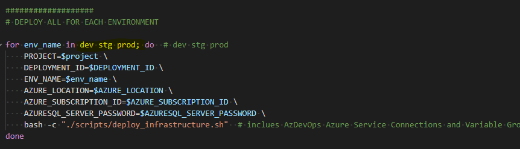

# Troubleshooting - Parking Sensors

## AAD Token expiration

**Problem**:

AAD token expires prior to deployment completing.

**Solution**:

This error can occur in very rare cases when the deployment takes too long that the AAD token expires. You can  try rerunning the `deploy.sh` script.

If error persists, you can try deploying one environment at a time. Do this by by navigating `deploy.sh` and changing the following highlighted line (below) from `dev stg prod` to only `dev` first, then running the deployment script. Do the same for `stg` and `prod`.

> **IMPORTANT**: Ensure you set the `DEPLOYMENT_ID` environment variable to ensure succeeding reruns of the `deploy.sh` target the same deployment.



## Conditional Access error

**Problem**:

When deploying the solution from within a devcontainer running on a Mac, you run into the following error

```text
ERROR: AADSTS50005: User tried to log in to a device from a platform (Unknown) that's currently not supported through Conditional Access policy.
```


The exact line that fails:

```bash
databricks_aad_token=$(az account get-access-token --resource 2ff814a6-3304-4ab8-85cb-cd0e6f879c1d --output json | jq -r .accessToken)
```

This error seems to only happen when:

1. Running from the devcontainer.
2. Base OS is Mac.
3. Target AAD tenant has [Conditional Access Policy](https://docs.microsoft.com/en-us/azure/active-directory/conditional-access/overview) turned on.

**Solution**:

Assuming that your target AAD tenant Conditional Access Policy supports the base machine OS you are running the deployment process from, you have two potential workarounds:

- Avoid using the devcontainer. Deploy from base OS.
- Generating the databricks_aad_token first prior to running the deployment script, then hard-coding this to the variable `databricks_aad_token` in the `scripts/deploy_infrastructure.sh` script.

## Deployed Release Pipeline does not have Approval Gates or Environments provision

**Problem**:

Deploy script does not deploy Approval Gates or Environments.

**Solution**:

Creation of Approval Gates and Environments currently cannot be automated. These need to be manually created.
