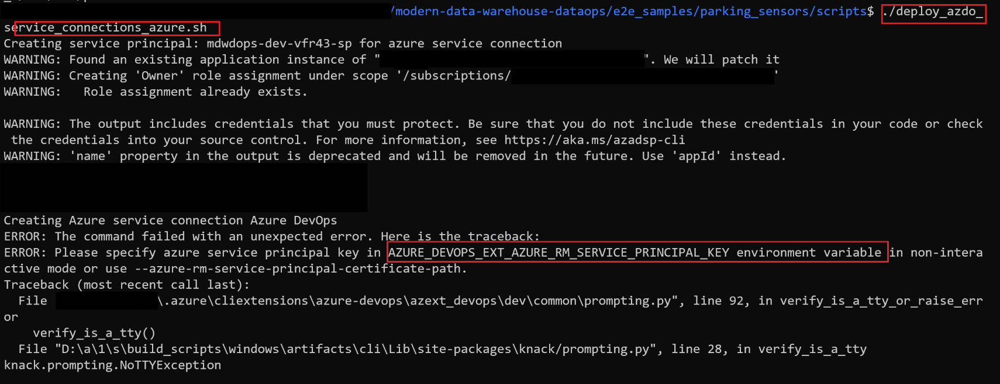

# Troubleshooting - Parking Sensors

## AAD Token expiration

**Problem**:

AAD token expires prior to deployment completing.

**Solution**:

This error can occur in very rare cases when the deployment takes too long that the AAD token expires. You can  try rerunning the `deploy.sh` script.

If error persists, you can try deploying one environment at a time. Do this by by navigating `deploy.sh` and changing the following highlighted line (below) from `dev stg prod` to only `dev` first, then running the deployment script. Do the same for `stg` and `prod`.

> **IMPORTANT**: Ensure you set the `DEPLOYMENT_ID` environment variable to ensure succeeding reruns of the `deploy.sh` target the same deployment.


## Conditional Access error

**Problem**:

When deploying the solution from within a devcontainer running on a Mac, you run into the following error

```text
ERROR: AADSTS50005: User tried to log in to a device from a platform (Unknown) that's currently not supported through Conditional Access policy.
```


The exact line that fails:

```bash
databricks_aad_token=$(az account get-access-token --resource 2ff814a6-3304-4ab8-85cb-cd0e6f879c1d --output json | jq -r .accessToken)
```

This error seems to only happen when:

1. Running from the devcontainer.
2. Base OS is Mac.
3. Target AAD tenant has [Conditional Access Policy](https://docs.microsoft.com/en-us/azure/active-directory/conditional-access/overview) turned on.

**Solution**:

Assuming that your target AAD tenant Conditional Access Policy supports the base machine OS you are running the deployment process from, you have two potential workarounds:

- Avoid using the devcontainer. Deploy from base OS.
- Generating the databricks_aad_token first prior to running the deployment script, then hard-coding this to the variable `databricks_aad_token` in the `scripts/deploy_infrastructure.sh` script.

## Deployed Release Pipeline does not have Approval Gates or Environments provision

**Problem**:

Deploy script does not deploy Approval Gates or Environments.

**Solution**:

Creation of Approval Gates and Environments currently cannot be automated. These need to be manually created.

## WSL cannot recognize declared environment variables issue

**Problem**:
When running the deploy.sh with WSL (Windows Subsystem Linux) environment, it might occur that WSL session (ex: Ubuntu session) could not find the following environment variables:

- AZURE_DEVOPS_EXT_AZURE_RM_SERVICE_PRINCIPAL_KEY
- AZURE_DEVOPS_EXT_GITHUB_PAT
  
and this error will result in deployment process stopped and failed.

The detail issue can refer the following:

**failed shell script:**

```bash
deploy_azdo_service_connections_azure.sh
deploy_azdo_service_connections_github.sh
```

**failed command:**

```bash
az devops service-endpoint azurerm create
az devops service-endpoint github create
```

**error message:**


**Solution**:
Make above 2 environment variables become **shareable** between WSL and Windows environment.

Steps:

1. Open Powershell or CMD session
1. Set the variables that you want to be referred in WSL session at PS/CMD session, can assign any value for now since we will re-assign value in WSL session when executing deploy shell script.

    ```Powershell
    PS session
    setx AZURE_DEVOPS_EXT_AZURE_RM_SERVICE_PRINCIPAL_KEY testkey
    setx AZURE_DEVOPS_EXT_GITHUB_PAT testpat
    ```

    ```CMD
    CMD session
    set AZURE_DEVOPS_EXT_AZURE_RM_SERVICE_PRINCIPAL_KEY=testkey
    set AZURE_DEVOPS_EXT_GITHUB_PAT=testpat
    ```

1. Set **WSLENV** variable

    ```Powershell
    PS session
    setx WSLENV WT_SESSION:WT_PROFILE_ID:AZURE_DEVOPS_EXT_AZURE_RM_SERVICE_PRINCIPAL_KEY/u:AZURE_DEVOPS_EXT_GITHUB_PAT/u
    ```

    ```CMD
    CMD session
    set WSLENV=WT_SESSION:WT_PROFILE_ID:AZURE_DEVOPS_EXT_AZURE_RM_SERVICE_PRINCIPAL_KEY/u:AZURE_DEVOPS_EXT_GITHUB_PAT/u
    ```

1. Type "**wsl**" to open WSL session **from current PS/CMD session**

    > **IMPORTANT**: Ensure you initiate the WSL session based on current PS or CMD session so that can achieving shareable variables.

1. Verify: echo the env variables that you set previously, if you can get the values that you set in PS/CMD session in WSL session, then it means successfully setup shareable environment variables between WSL and Windows environments.

Reference: [Share Environment Vars between WSL and Windows](https://devblogs.microsoft.com/commandline/share-environment-vars-between-wsl-and-windows/)

## Release pipeline fails on rerun with: "ERROR: A workspace package with name already exists."

**Problem**:

The release pipeline fails with error: "ERROR: A workspace package with name 'ddo_transform-1.1.XXXX-py2.py3-none-any.whl' already exists."


This fails because the pipeline is attempting to upload the same package with the same version.

**Solution**:

To resolve this, rerun the CI pipeline (`mdwdops-ci-artifacts`) to generate a new package with a new version for the CD pipeline to pickup, then rerun CD pipeline.

## General Troubleshooting

Still encountering errors? Uncomment the `set -o xtrace` in the deployments scripts for full logging of the deployment.


If you are still stuck, please file a [Github Issue](https://github.com/Azure-Samples/modern-data-warehouse-dataops/issues/new?assignees=&labels=bug&template=bug.md&title=) with environment details and repro steps.
