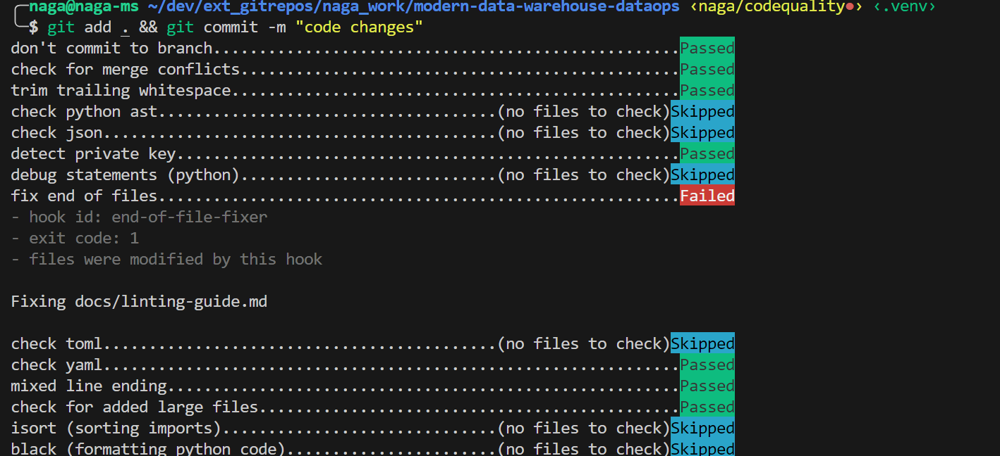

# Pre-commit Guide (Formatting, Linting & Other code quality checks) <!-- omit in toc -->

This guide explains how to set up and use the pre-commit hooks configured in this repository. These hooks help ensure code quality and consistency by automatically checking and formatting code before it is committed.

**Note:** These checks are currently enabled only for [e2e_samples/fabric_dataops_sample](../e2e_samples/fabric_dataops_sample/).

## Table of Contents <!-- omit in toc -->

- [Introduction](#introduction)
- [Installation](#installation)
  - [Contributors using dev container setup](#contributors-using-dev-container-setup)
  - [Contributors using local setup](#contributors-using-local-setup)
- [Configuration](#configuration)
- [Usage](#usage)
  - [On every commit](#on-every-commit)
  - [Running all hooks manually](#running-all-hooks-manually)
  - [Running a specific hook](#running-a-specific-hook)
- [List of hooks](#list-of-hooks)
- [Integration with github actions](#integration-with-github-actions)
- [Troubleshooting](#troubleshooting)
  - [Common issues](#common-issues)

## Introduction

Pre-commit hooks are scripts that run automatically before each commit to catch common issues like syntax errors, formatting problems, and security vulnerabilities. This repository uses a variety of hooks to maintain code quality.

## Installation

### Contributors using dev container setup

If you are using dev container setup, all these are pre-configured/pre-installed for you.

### Contributors using local setup

- Clone the repository and navigate to the sample folder (e.g., `e2e_samples\fabric_dataops_sample`):

   ```bash
   git clone https://github.com/Azure-Samples/modern-data-warehouse-dataops.git
   cd <repo-folder>
   ```

- Run below steps:

    ```python
    # setup venv
    python -m venv .venv

    # activate venv
    source .venv/bin/activate

    # install necessary development libraries
    pip install --upgrade pip setuptools wheel
    pip install -e .[dev]

    # install pre-commit
    pre-commit install
    ```

- Apart from these, there are few tools you need to install on your local machine (e.g., terraform, tfLint, trivy). Please refer to the tool documentation to get installation instructions depending on your Operating System. Sample Ubuntu instructions can be found inside [dev container's docker file](../e2e_samples/fabric_dataops_sample/.devcontainer/Dockerfile)

These steps will set up the hooks to run automatically before every commit.

## Configuration

The pre-commit hooks are configured in the [`.pre-commit-config.yaml`](./../.pre-commit-config.yaml) file. This file specifies the repositories and hooks to be used, along with their versions and any specific arguments.

In addition to [`.pre-commit-config.yaml`](../.pre-commit-config.yaml), [`pyproject.toml`](../pyproject.toml) is used for configuring tools like **black**, **isort**, **ruff**, and **mypy**. This file allows us to define custom inclusions, exclusions, and other tool-specific settings.

## Usage

### On every commit

Once installed, the pre-commit hooks will run automatically on every commit. If any hook fails, the commit will be aborted, and you will need to fix the issues before committing again.

```bash
git commit -m "Your commit message"
```

If any checks fail, the commit will be blocked. You need to fix the issues and try committing again.

For example:



### Running all hooks manually

To run all configured hooks manually on the entire codebase:

```bash
pre-commit run --all-files
```

For example:


### Running a specific hook

To run a specific hook, use:

```bash
pre-commit run <hook-id> --all-files
```

For example:

```bash
# To invoke black formatting on all .py files
pre-commit run black --all-files
# To invoke terraform linting on all .tf files
pre-commit run terraform_tflint --all-files
```

## List of hooks

Below is a list of the currently configured hooks with brief descriptions. Note that this list may change or evolve as the repository and workflows are updated.

1. **General Checks:**
   - `check-merge-conflict`: Checks for unresolved merge conflicts.
   - `trailing-whitespace`, `end-of-file-fixer`, `mixed-line-ending`: Enforces consistent whitespace formatting.
   - `check-ast`, `check-json`, `check-toml`, `check-yaml`: Validates syntax for various file types.
   - `detect-private-key`: Detects accidental inclusion of private keys.
   - `check-added-large-files`: Prevents adding files larger than 1 MB.

2. **Python Code Formatting:**
   - `isort`: Sorts and organizes imports.
   - `black`: Formats Python code to follow PEP 8 guidelines.

3. **Python Linting:**
   - `ruff`: Lints Python code for style and syntax issues.
   - `mypy`: Performs static type checking.

4. **YAML and Markdown Linting:**
   - `yamllint`: Lints YAML files.
   - `markdownlint`: Lints Markdown files.

5. **Jupyter Notebook Checks:**
   - `nbqa-isort`, `nbqa-black`, `nbqa-ruff`, `nbqa-mypy`: Runs respective checks on Jupyter Notebooks.

6. **Terraform Checks:**
   - `terraform_fmt`, `terraform_tflint`, `terraform_validate`, `terraform_trivy`: Runs formatting, linting, validation, and vulnerability scans on Terraform files.

7. **Shell Script Formatter (Optional):**
   - `shfmt`: Formats shell scripts. Due to limitations around passing arguments via pre-commit hooks, this check is not enabled by default. However, it is included in the dev container setup. You can run [shfmt](https://github.com/mvdan/sh/blob/master/cmd/shfmt/shfmt.1.scd) manually if needed, as shown below:

     ```bash
     shfmt -i 2 -ci -bn <file-name>
     ```

## Integration with github actions

In addition to running pre-commit hooks locally, these hooks are also invoked as part of the **GitGub Actions** [workflow](../.github/workflows/code_quality_checks.yaml). This ensures that code quality checks are performed automatically during pull requests and pushes to the repository.

## Troubleshooting

### Common issues

1. **Pre-commit hook fails:**
   - Fix the reported issues and try committing again.
   - If needed, run the hooks manually to debug: `pre-commit run --all-files`.

2. **Hooks not installed:**
   - Ensure you have installed the hooks with `pre-commit install`.

3. **Skipping hooks:**
   - If necessary, you can bypass the hooks (not recommended) using:

     ```bash
     git commit --no-verify
     ```
