# Config Driven Data Pipelines

The sample demonstrate how an end to end data pipeline can be deployed by changing the configuration of an existing template implemented in Azure Databricks.

## Contents <!-- omit in toc -->

- [Solution Overview](#solution-overview)
  - [Archictecture](#architecture)
  - [Folder structure](#folder-structure)
- [How to use the sample](#how-to-use-the-sample)
  - [Prerequisites](#prerequisites)

  - [Run the example](#setup-and-deployment)


  - [Known Issues, Limitations and Workarounds](#known-issues-limitations-and-workarounds)
 
- [Key Learnings](#key-learnings)
  


---------------------
## Solution Overview
The diagram below showed the overall architecture of the solution. 

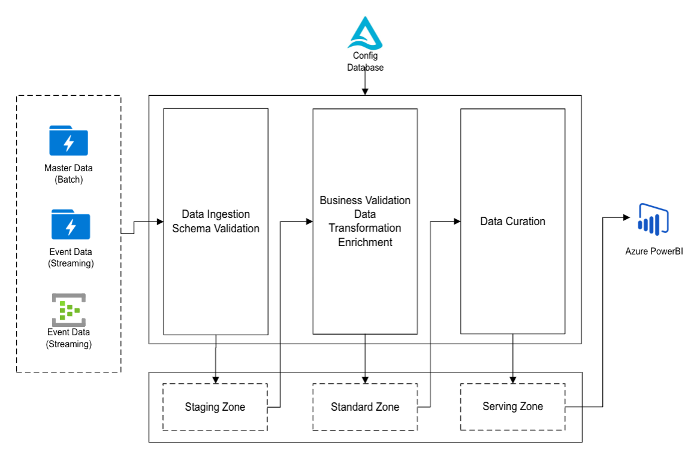

There are two data pipelines: the one handels the configuration or master data management, i.e., defines the source and target data schema, and the one handles the transformation of fact data or event data coming from the on premise system. 

The architecture framework is buit based on Azure Databricks by spark batch job and spark streaming job. 

### Archictecture (TBC)


### Folder Structure
* The ".devcontainer" and "dev" contains the the configuration files if you plan to develop using devcontainer or on your local environment. 
* The "notebooks" are the folder contains the source notebooks files for databricks to create the controller for batch jobs (for master data processing) and streaming jobs (for event data processing). 
* The "src' folder contains the template (classes) for the CDDP solution that could be used as a foundation by changing the configuration of the template to process other type of applications data. 
* The 'test' folder contains the sample use case that developed based on the common solution template. 'fruit' is the sample application. You can refer to the example and develop your own application and define your data processing logic.  
  * Under the test folder, the 'cddp_fruit_app' folders contains the customized code to define the rules for master data and event data processing, based on the common solution template. 
  * 'cddp_fruit_app_customers' contains the different customer configurations using the same fruit application. 'config.json' is the configuration file that defines the specific information related with the customer, like customer_id, blob storage name, data transoformation rules,  etc., that the databricks job controller needs to run the pipeline for the specific customer. 

## How to use the sample

**Prerequisite**

**Option1: Use DevContainer**
* Install Microsoft VSCode Remote-Containers extension
* In VSCode, open Command Pallete and type Remote-Containers: Open Folder in Container...
* Choose the folder named ***\config_driven_data_pipelines
* Wait for the devcontainer to start. It may take a couple of minustes for the first time. 
* Recommend to use the DevContainer as it wont mess up your local environment and easily to rebuid the DevContainer when something goes terribly wrong. 
  
**Option2: Install Local Pyspark Environment**
* If you prefer not using DevcContainer, but setup local Spark with this [document](https://sigdelta.com/blog/how-to-install-pyspark-locally/)
* Open a cmd terminal window and run the script below to setup the project development. 
```
pip install -r ./src/requirements.txt
```
**Run the test example**

**option1: Run the test example locally**

The 'cddp_fruit_app_customers' under the 'tests' folder contains the sample customer data, and customer_2 will be the one used in the example, which contains a sample master data and mocked event data as well. 

#### Step1: Master data ingestions and transformation

Sample master data has been defined in "tests/cddp_fruit_app_customers/customer_2/config.json". 
```shell
python -m cddp_solution.common.master_data_ingestion_runner tests.cddp_fruit_app customer_2 tests
python -m cddp_solution.common.master_data_transformation_runner tests.cddp_fruit_app customer_2 tests
```

#### Step2: Event data transformation
Mock events are stroed in tests/cddp_fruit_app_customers/customer_2/mock_events. 
```shell
python -m cddp_solution.common.event_data_transformation_runner tests.cddp_fruit_app customer_2 tests
```
#### step3: Event curation

```shell
python -m cddp_solution.common.event_data_curation_runner tests.cddp_fruit_app customer_2 tests
```

#### step4: Data Exoprt

```shell
python -m cddp_solution.common.curation_data_export_runner tests.cddp_fruit_app customer_2 tests
```
#### step5: check the results locally
Copy the below codes into your local notebook file, e.g., query.ipynb: 

```python
# environment setup in local notebook
from pyspark.sql import SparkSession
from pyspark import SparkConf

spark = SparkSession.getActiveSession()
if not spark:
    conf = SparkConf().setAppName("data-app").setMaster("local[*]")
    spark = SparkSession.builder.config(conf=conf)\
        .config("spark.jars.packages",
                "io.delta:delta-core_2.12:1.2.0,com.microsoft.azure:azure-eventhubs-spark_2.12:2.3.21") \
        .config("spark.sql.catalog.spark_catalog", "org.apache.spark.sql.delta.catalog.DeltaCatalog")\
        .config("spark.sql.extensions", "io.delta.sql.DeltaSparkSessionExtension")\
        .config("spark.driver.memory", "24G")\
        .config("spark.driver.maxResultSize", "24G")\
        .enableHiveSupport()\
        .getOrCreate()

spark.sql(f"select * from customer_2_rz_fruit_app.raw_fruits_1")

# to print the tables created in raw zone
schema_name = "customer_2_rz_fruit_app"

tables = spark.sql(f"show tables in {schema_name}")

tables_collection = tables.collect()
for table in tables_collection:
    table_name = table['tableName']
    print(f"{schema_name}.{table_name}")
    

# Uncomment and replace the <> with the table name printed from above and query on the table contents 
# df = park.sql(f"select * from <table name>)
df.show()


# to print the tables created in processed zone
schema_name = "customer_2_pz_fruit_app"

tables = spark.sql(f"show tables in {schema_name}")

tables_collection = tables.collect()
for table in tables_collection:
    table_name = table['tableName']
    print(f"{schema_name}.{table_name}")

# Uncomment and replace the <> with the table name printed from above and query on the table contents 
# df = park.sql(f"select * from <table name>)
df.show()

# shutdown the notebook spark session
spark.sparkContext.stop()
spark.stop()
```
The sample table is like below: 
 

**Option2: Run the example on databricks**

The below stpes are installing wheel files into Databricks cluster for running the jobs and tasks. Refer to the [doc](https://realpython.com/python-wheels/) here for what and why choose Python wheel files. 

**Step1**: Create wheelfile for the common solution

Change the dir to the cddp_solution folder. 
```
cd src/cddp_solution/
```
Run the command to create wheel file, which will refer to the setup.cfg in the folder for the related parameters and configurations. The setup.cfg file will be mentioned in later step also and that's how/where the parameters shall be referred when configure Databricks job. 
```python
python -m build . --wheel
```
After the successful run, there will be a 'dist' folder created in the same level, containing the wheel file naming like 'cddp_solution-0.0.1-py3-none-any.whl'. 

**Stpe2**: Create wheelfile for the new application

In this example, fruit is the sample application, so change to the folder containing the application code. 
```
cd tests/cddp_fruit_app 
python -m build . --wheel
```
This will create a 'dist' folder in the same level containing the wheel naming like 'cddp_fruit_app-0.0.1-py3-none-any.whl'. 

**Step3**: Create the wheel file for the specific customer

Then change the dir to the folder containing the implementation for a specific customer on top of an application. 
In this example, run 
```
cd cddp_fruit_app_customers/customer_2
python -m build . --wheel
```
As similiar in the first two steps, a wheel file naming like 'cddp_fruit_app_customers.customer_2-0.0.1-py3-none-any.whl' will be created in the same folder level. 

**Step4** Create Azure Databricks cluster and upload the 3 wheel files created. 

Refer to the [document](https://docs.microsoft.com/en-us/azure/databricks/clusters/create) to create a Azure Databricsk per your need. 

Refer to the diagrams below to upload the generated three wheel files to the Databricks cluster's liberary, install them until they are in 'installed' status. 

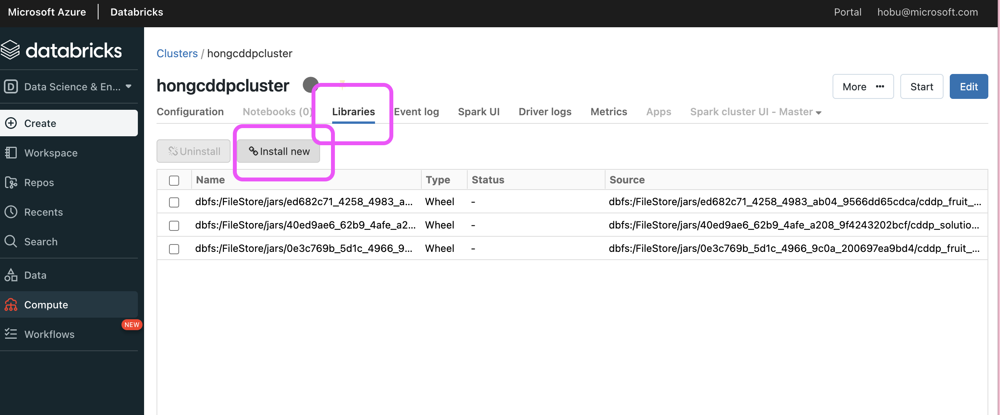
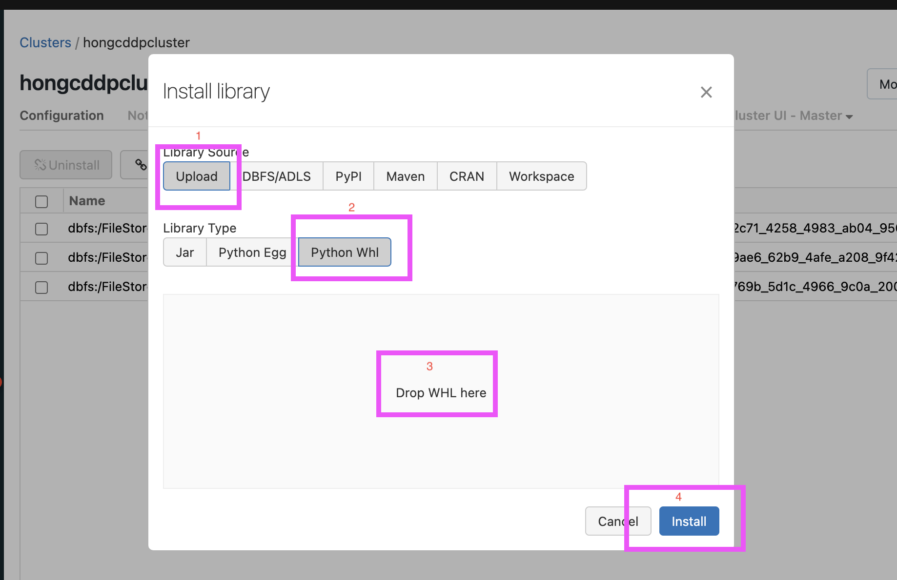

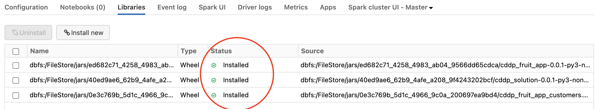

Then [start the cluster](https://docs.microsoft.com/en-us/azure/databricks/clusters/clusters-manage#--start-a-cluster) just created. 

**Step5** Mount the  customer config file

If you remember the test running in the local environment, the data ingestion or transformation rules specific to a customer are defined in the config.json file under each customer folder. 
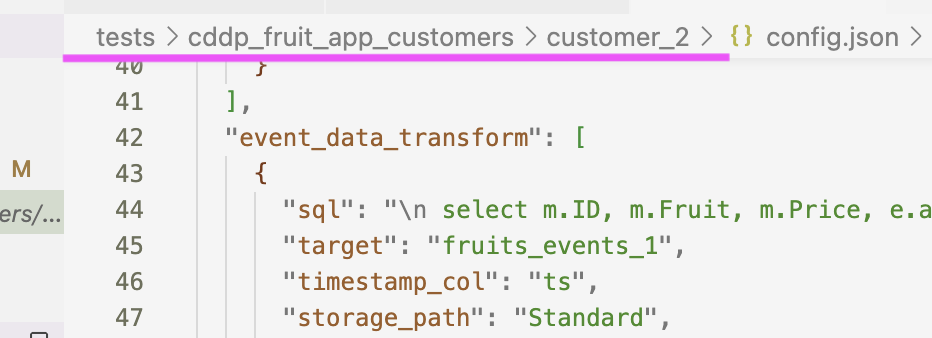

The same file needs to be uploaded to the Databricks DBFS folder. 

**Note**: Your config.json file path  should be like /*/.../cddp_fruit_app_customer/customer_2/config.json. It does matter the last two level of the path name should be the same as mentioned. 

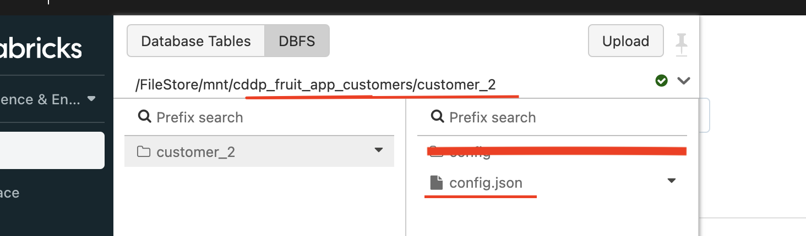

**Step6** Understand the parameters to be defined in the Databricks Job settings

Finally, we can create the jobs to run the master data ingestion pipeine! 

Before that, please be aware of some parameters that will be used in the job task setting. 

The setup.cfg under the cddp_slutions defines the basic parameters to run the application. 

The solution name is  showned in below diagram, 'cddp_solution' in our case. 

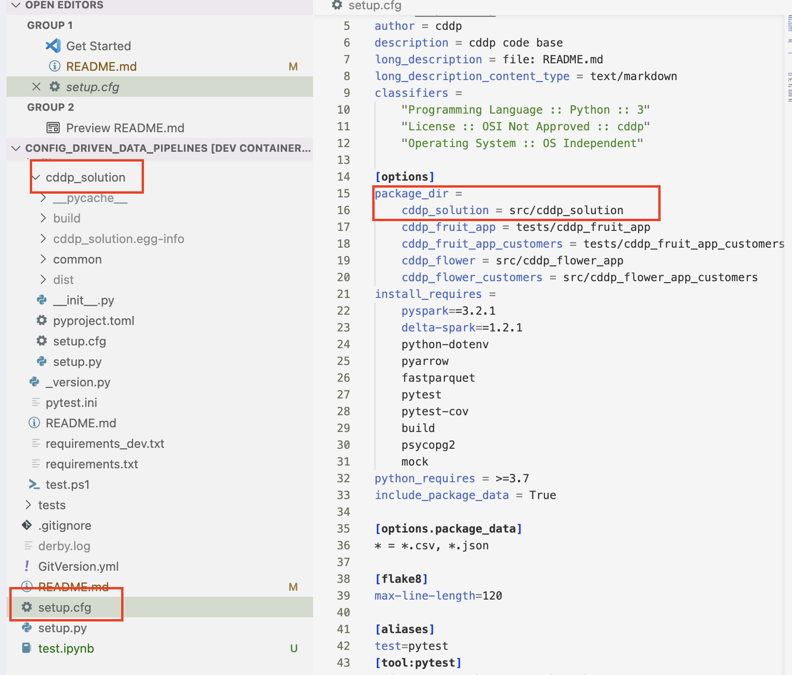

The entry points names are defined in the same file for the code running entry to start the corresponding databricks pipelines. In our sample repo, there are three demo code to run the 'master_data_ingest', 'master_data_transform' and 'event_data_tranform' pipelines seperatly. 

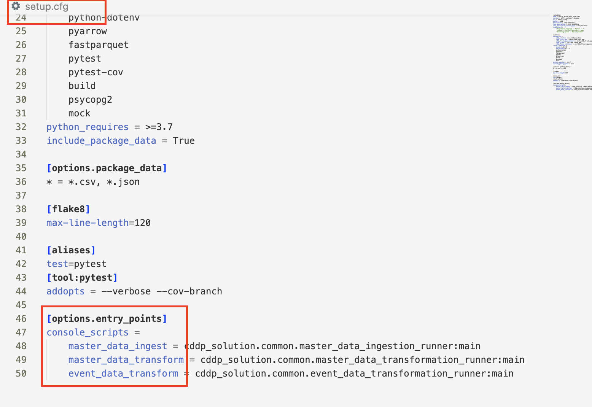

There are also system parameters orginiated from the common solution code base and need to be defined in Databriks job setting, shown in the diagram below. When you run the solution in local enviornment, the sample command already includes the parameters. 
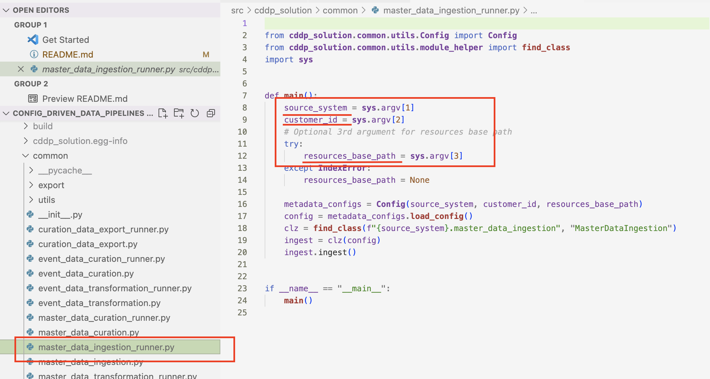 

**Step7** Create the Databricks job

The example showed the required parameter to define one databricsk job to run the master data ingestion pipeline. 

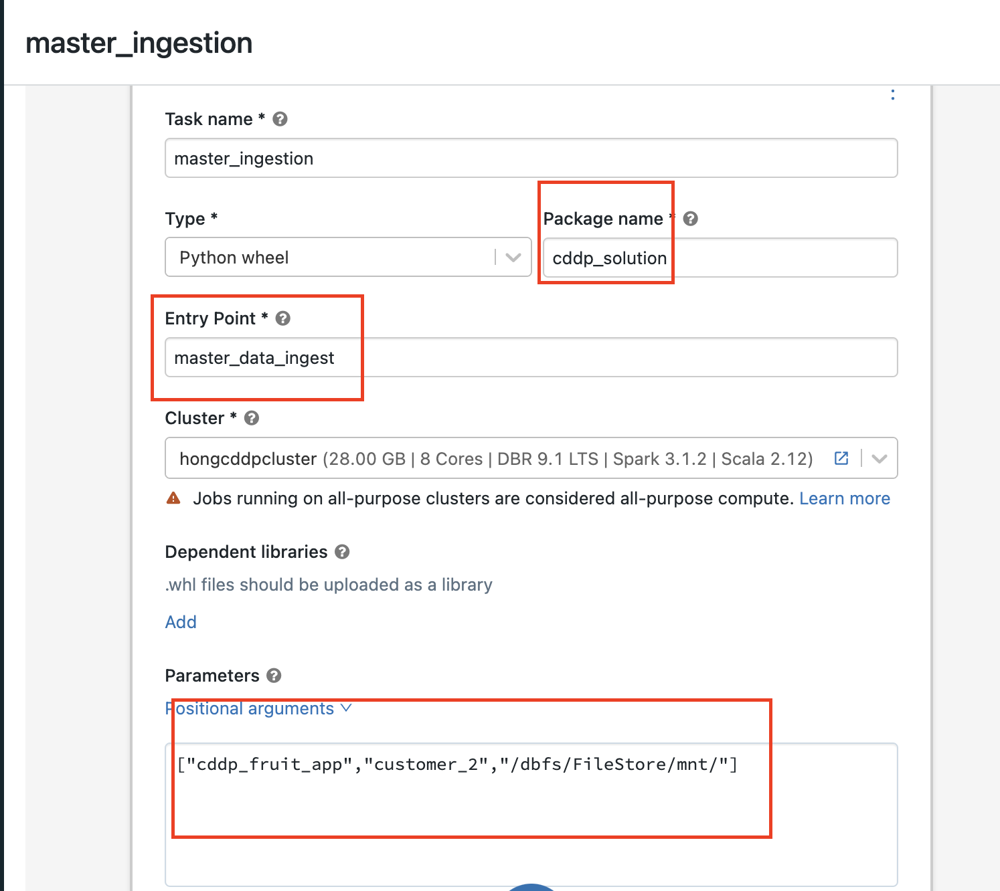

**The package name and entry point** have been explained in step6. 

**In the parameter field:**

The first parameter is about the source system, and in our example is the 'cddep_fruit_app'. Customer ID used 'customer_2'. These two parameters are defined in the setup.cfg under the customer_2 folder, which has been included in the wheel file created in previous step. 

The 3rd parameter is the customer config file path in DBFS, which has been uploaded in step5, and **only copy the patial path like shown in the diagram**. 

**Save the task**. 

**Step8** Run the job

Exciting moments comes finally! 

Run the job with the task just defined in step7. If no error occurs, a successful task run result will be shown as below. The length of the running time depends on the cluster size/memory/CPU/GPU selected in creation. 

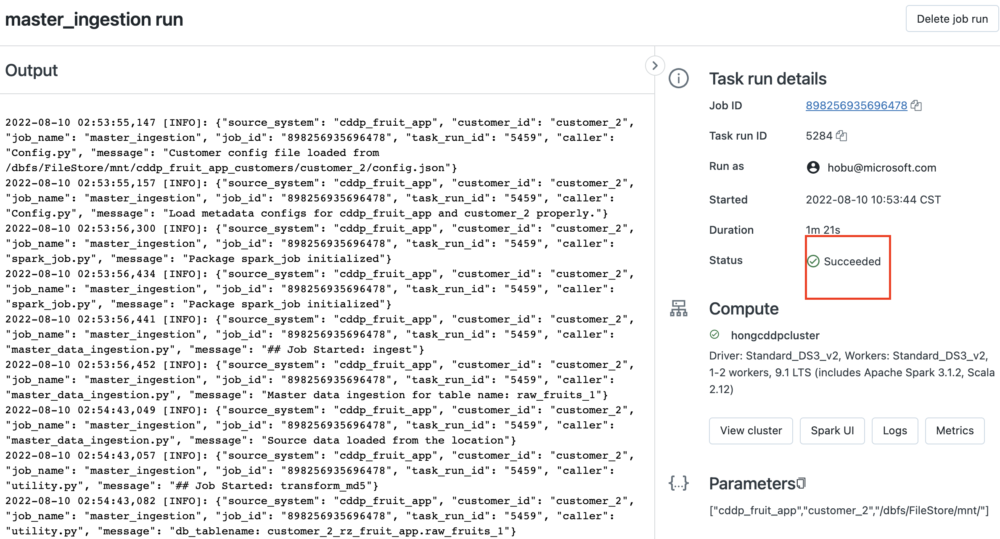

**Step9** Check the raw master data table created

In the data folder under your running databricks cluster, there will be three tables created. Now, since only the master data ingestion pipeline has been executed, only the customer_2_rz_fruit_app has valid data. 
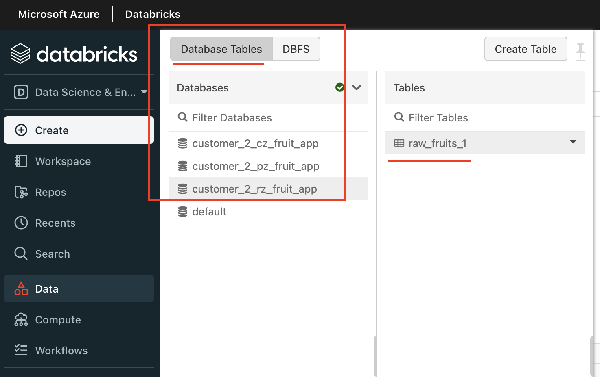
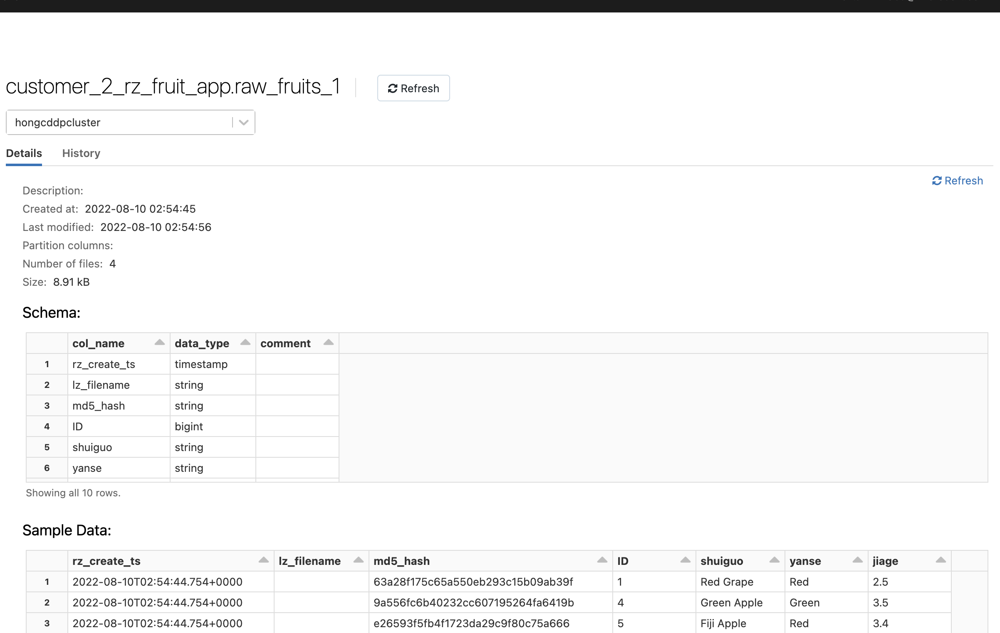

Well DONE! Now it is your time to solve the reamaining puzzles, to complete the master data transoformation and event data transformation pipeline! 

**Note**: The procedures are similar as master data ingestion pipeline, and the difference is on the entry point setting, which has been demonstrated in the step6. 

## Known Issues, Limitations and Workarounds


### 1. The Spark session running issue during local testing/debug
If you are using the Devcontainer enviornment to run the sample locally, and if you refer to the test notebook above for local DB query, you might encounter the Spark running time issue and got errors like 
```
...
Caused by: java.sql.SQLException: Failed to start database 'metastore_db' with class loader jdk.internal.loader.ClassLoaders$AppClassLoader@5ffd2b27, see the next exception for details.
...
```
Remember to close the test notebook spark session to avoid the spark session conflct with the local dev environment. 
```
spark.sparkContext.stop()
spark.stop()
```
Or you can also clear the session by clicking the restart button of notebook kernel (see diagram below). 
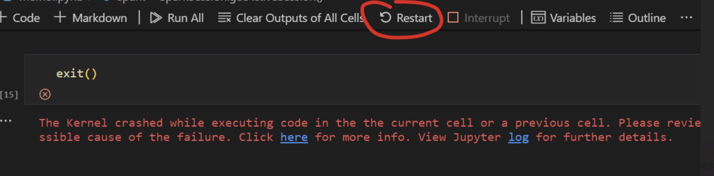


## Key Learnings in development

### 1. [Monitoring the Azure Databricks spark jobs.](docs/Logging.md)
### 2. [Adding unit test and integration test by Pytest framework.](tests/README.md) 
