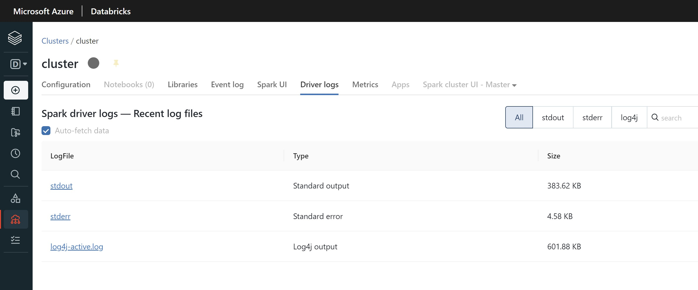
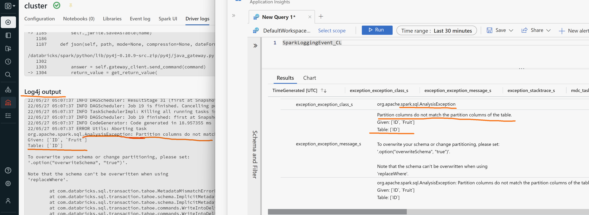
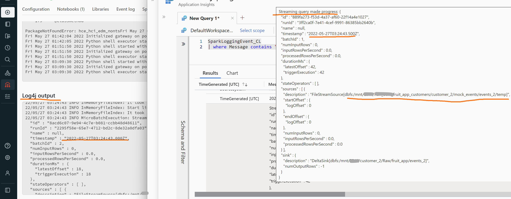
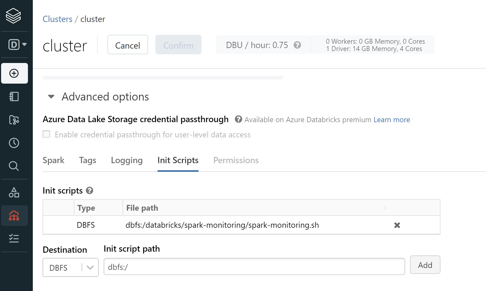
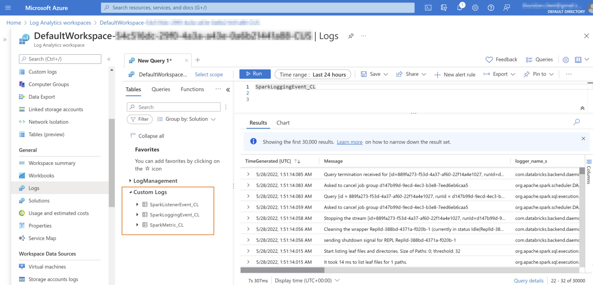
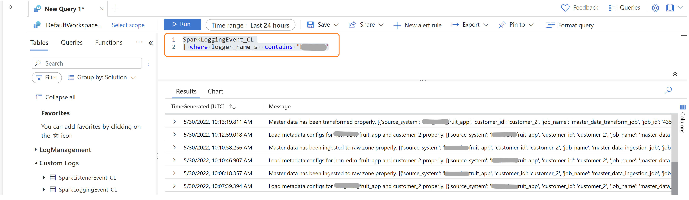

## About Spark driver logs

Spark driver logs are composed of Standard output, Standard error and Log4j output logs.



And all key Spark jobs processing logs could be found in Log4j output logs, which could be sent to Azure Log Analytics workspace with the help of [spark-monitoring](https://github.com/mspnp/spark-monitoring) library.   
Below are examples of Spark streaming events logs and Spark job processing runtime exception logs in Log Analytics sent from Log4j output logs; and in next section we'll introduce how to setup the spark-monitoring library in Databricks Spark cluster.   







### Setup spark-mornitoring in Databricks Spark cluster
#### Prerequisites
1. Install Databricks CLI, following [this guide](https://docs.microsoft.com/en-us/azure/databricks/dev-tools/cli/).
2. Install JDK of version 1.8 or higher.

#### Building spark-monitoring library jars
1. Clone repository spark-monitoring repo.
    ```sh
    git clone https://github.com/mspnp/spark-monitoring
    ```
2. Build jars following either Docker or Maven option described in the [README](https://github.com/mspnp/spark-monitoring/blob/main/README.md#build-the-azure-databricks-monitoring-library) markdown.

#### Upload shell and jars to DBFS of Databricks
1. Edit /spark-monitoring/src/spark-listeners/scripts/spark-monitoring.sh file, to save the target [_Log Analytics workspace ID and access key_](https://docs.microsoft.com/en-us/azure/azure-monitor/agents/agent-windows#workspace-id-and-key) to below entries, and those two values could be found here.
    ```sh
    export LOG_ANALYTICS_WORKSPACE_ID={workspace ID}
    export LOG_ANALYTICS_WORKSPACE_KEY={access key}
    ```

2. Use Databricks CLI to copy spark-monitoring shell and just built jar files to DBFS of Databricks cluster.
    ```sh
    # Skip below two commands if it's been done previously
    export DATABRICKS_TOKEN=<Databricks PAT token>
    export DATABRICKS_HOST=<Databricks workspace URL>

    dbfs mkdirs dbfs:/databricks/spark-monitoring 

    dbfs cp <local path to spark-monitoring.sh> dbfs:/databricks/spark-monitoring/spark-monitoring.sh

    dbfs cp --overwrite --recursive <local path to target folder> dbfs:/databricks/spark-monitoring/ 
    ```

#### Configure Databrick Spark cluster
1. Add the copied spark-monitoring shell as _Init Scripts_ of the target Databricks Spark cluster. 

    
    
2. Restart the Spark cluster.

#### Check Spark cluster Log4j output logs in Log Analytics workspace
1. After running some sample jobs in Databricks, go to Log Analytics workspace and check relevant Log4j output logs by querying _SparkLoggingEventCL_ table from _Custom Logs_ category.

    

    ```sh
    # Kusto queries
    # Query all Log4j output logs
    SparkLoggingEventCL

    # Query error logs
    SparkLoggingEventCL
    | where Level == "ERROR"
    ```

2. For the other two tables, please check more details from the README.md.
    - [SparkListenerEvent_CL](https://github.com/mspnp/spark-monitoring/blob/main/README.md#sparklistenerevent_cl)
    - [SparkMetric_CL](https://github.com/mspnp/spark-monitoring/blob/main/README.md#sparkmetric_cl)


## About Databricks data processing framework logs
Framework logs are also sent to Azure Log Analytics workspace, we could query relevant _SparkLoggingEvent_CL_ logs by filtering logger_name_s with "cddp" prefix.

``` sh
# Kusto queries
SparkLoggingEvent_CL
| where logger_name_s contains "cddp"
```



