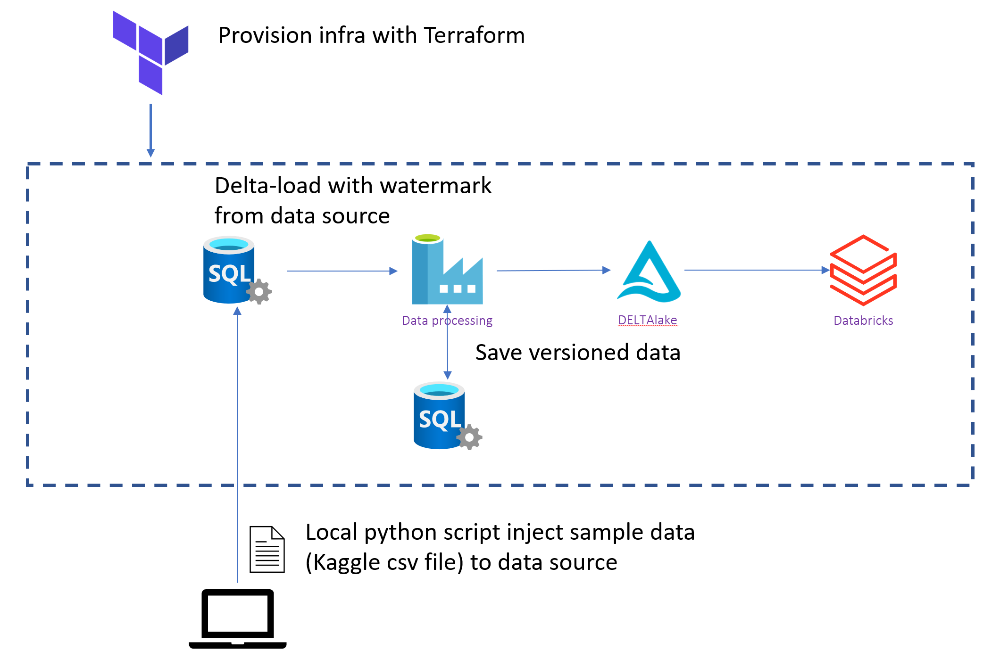
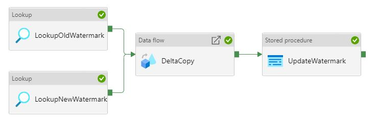

# DataOps - Dataset versioning demo

This sample demonstrates how to [incrementally ingest data](https://docs.microsoft.com/en-au/azure/data-factory/tutorial-incremental-copy-overview) from data source such an AzureSQL Database with [Azure Data Factory Dataflows](https://docs.microsoft.com/en-us/azure/data-factory/control-flow-execute-data-flow-activity). The ingested data in Data Lake is also versioned through the use of the [Delta format](https://delta.io/).

## Story

Contoso provides ML based loan prediction feature to end users. For keeping end-user experience, they want to keep updating ML model with latest data. It helps Contoso to keep end user satisfaction high and subscription-based contract.

However, while Contoso Data Engineers requires the data in the Data Lake to be kept reasonably up to date with the source operational system, the Data Scientists on the other hand requires a fixed version of the data to train and tune a model against in order to properly benchmark the accuracy of each model. Therefore, there is a need for the ability to consume a specific version the data ingested into the data lake.

## Solution overview

The solution demonstrates how to achieve the requirements described above by:

- Incrementally ingesting data from a source system such as AzureSQL Database.
  - Data pipeline (Azure Data Factory) utilizes a watermark to see new/updated data in the data source. It helps to copy data with shorter intervals.
- Data Pipeline stores **versioned data** in the sink.
- Users (ei. Data Scientists) can read versioned data from the datalake via Databricks by specifying version number per loaded data instance.

In addition to this, the sample also includes:

- Terraform scripts to automate the provisioning Azure infrastructure.
- Local python script inject data to data source (SQL Database) incrementally, in order to simulate data source update. For example, injecting 2020 data at first, then injecting succeeding years data to data source.



### Data used

We refer to [LendingClub issued Loans](https://www.kaggle.com/husainsb/lendingclub-issued-loans?select=lc_loan.csv) data hosted by Kaggle.

> If you want to use your custom data, you may want to modify read_csv function in main.py to customize for your sample.

### How to use the sample

1. Deploy sample infrastructure, ADF pipelines and AzureSQL objects.
    1. Provision infrastructure with Terraform. - [detailed steps](./infra/README.md)
    1. Create AzureSQL Database tables and stored procedure. - [detailed steps](./sql/ddl/README.md)
    1. Deploy Data Factory Pipelines. - [detailed steps](./datafactory/README.md)
2. Running the sample
    1. Load data into data source (Azure SQL Database).
        1. Use Python script to load "LendingClub issued Loans" data - [detailed steps](./sql/data_generator/README.md)
    2. Run Azure Data Factory pipeline to load Delta Lake.
        1. Go to provisioned Azure Data Factory, then click **Author & Monitor** button to open development portal.
        2. Click pencil button at left pane, then select `DeltaCopyPipeline`.
        3. Click **Debug** button to run pipeline.

        
    3. Use Databricks to query Delta versions - [detailed steps](./databricks/README.md#setup_and_deployment)
    4. Repeat loading data and running data factory to see multiple versioned data getting populated.
        1. Insert next version of data (ex. version 1)

            ```bash
            python main.py -v 1 -k https://sample.vault.azure.net -p ./lc_loan.csv
            ```

        2. Run Azure Data Factory pipeline.
        3. Run Notebook to see version 1 on Databricks.
3. Clean up
    1. Run `terraform destroy` to clean up existing resources.
    2. Alternatively, you can delete resource group manually.

## Contributing

### Before sending PR

1. Run [pre-commit](https://pre-commit.com/#install)
1. Make sure this README.md is updated.
