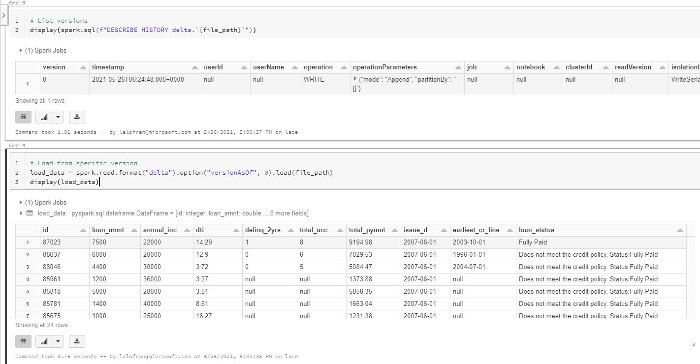

# Azure Databricks

## Delta Lake Time-travel

This sample makes use of [Databricks Delta time-travel capabilities](https://databricks.com/blog/2019/02/04/introducing-delta-time-travel-for-large-scale-data-lakes.html) which can efficiently version large-scale dataset. You can effectively query dataset versioned by either specifying a version number or a timestamp.

## Credential Passthrough

In this sample, we are using the Azure Databricks Credential Passthrough feature to securely access datalake. Credential passthrough is recommended over using the storage access key as it ensures that only users who have access to the underlying ADLS Gen2 storage can access it from Azure Databricks.

### High-Concurrency Clusters vs Standard Clusters with Credential Passthrough

When using a [High Concurrency Cluster](https://docs.microsoft.com/en-us/azure/databricks/clusters/configure#--high-concurrency-clusters) with credential passthrough, the cluster can be shared among multiple users and will take the identity of whoever is using the cluster and access datalake. For [Standard Clusters](https://docs.microsoft.com/en-us/azure/databricks/clusters/configure#--standard-clusters), only a single user's identity can be tied to each cluster, so every user will need to create their own cluster when using credential passthrough.

Currently, [MLFlow is not supported on High Concurrency clusters with Credential Passthrough](https://docs.microsoft.com/en-us/azure/databricks/security/credential-passthrough/adls-passthrough#--limitations). Because this sample makes use of MLFlow, it requires the usage of Standard Clusters instead.

### RBAC vs ACL

ACLs give you the ability to apply "finer grain" level of access to directories and files. Permission on RBAC is checked first and moved on to ACL. For more details please refer to the [official doc](https://docs.microsoft.com/en-us/azure/storage/blobs/data-lake-storage-access-control-model).

### Credential Passthrough vs Service Principal

The [official doc](https://docs.microsoft.com/en-us/azure/databricks/security/data-governance#secure-access-to-azure-data-lake-storage) mentioned:

- Will you be accessing your data in a more interactive, ad-hoc way, perhaps developing an ML model or building an operational dashboard? In that case, we recommend that you use Azure Active Directory (Azure AD) credential passthrough.
- Will you be running automated, scheduled workloads that require one-off access to the containers in your data lake? Then using service principals to access Azure Data Lake Storage is preferred.

## Setup and Deployment

### Prerequisites

- [Provisioned Azure Resources by IaC (Terraform)](../infra/README.md)

### Setup

1. Ensure you have the right permissions to ADLS Gen2 through ACLs.
     1. Navigating to your Storage account in the Azure Portal then clicking on `containers` -> `container(datalake)` -> `Manage ACL`
     2. Add your READ and EXECUTE permission and click save.
     3. [**Optional**] In case you have any existing files in the Data Lake container, you may need to propogate ACL permissions.
        1. Open up [Microsoft Azure Storage Explorer](https://azure.microsoft.com/en-us/features/storage-explorer/)
        2. Navigate to the storage account and right click on container to select **propagate access control list**.
        > Propagate access control list cannot be found: Try updating azure storage explorer to the latest version.

2. In your Databricks workspace, create a cluster ensuring you set the **Cluster Mode to Standard** and selecting **Enable credential passthrough for user-level access**.
3. Import the `data_versioning.py` notebook into your Databricks workspace. Set the `your_storage_account_name` variable with the name of your storage account that was created as part of the [provisioned Azure Resources by IaC (Terraform)](../infra/README.md) step.
4. Run the notebook.

 

See here for more information on [Credential Passthrough](https://docs.microsoft.com/en-us/azure/databricks/security/credential-passthrough/adls-passthrough).
