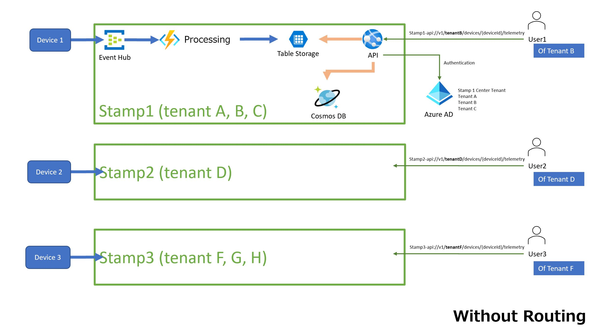

# DataOps - Scale-out Telemetry Processing Solution with Deployment Stamps Pattern <!-- omit in toc -->

This sample demonstrates how to scale-out a multi-tenant telemetry processing solution with the deployment stamps pattern.

## Contents <!-- omit in toc -->

- [Solution Overview](#solution-overview)
  - [Architecture](#architecture)
  - [How does it work?](#how-does-it-work)
- [How to use the sample](#how-to-use-the-sample)
  - [Prerequisites](#prerequisites)
  - [Setup and Deployment](#setup-and-deployment)
    - [Azure AD for Authentication](#azure-ad-for-authentication)
    - [Azure DevOps to Run the Pipeline](#azure-devops-to-run-the-pipeline)
    - [Create Sample Data](#create-sample-data)
    - [Send Telemetries](#send-telemetries)
    - [Access through API](#access-through-api)
- [Debug API and Function App Code Locally](#debug-api-and-function-app-code-locally
)  
  - [For API APP](#for-api-app)
  - [For Function APP](#for-function-app)

## Solution Overview

This sample sets up a pipeline which will create a new "stamp" each time.

 A *stamp* (or a *scale unit*) means a "group of resources to host and operate multiple workloads or tenants". For more detailed explanation of the deployment stamps pattern, please refer to [Azure Docs - Deployment Stamps pattern](https://docs.microsoft.com/en-us/azure/architecture/patterns/deployment-stamp).

> - In a multi-tenant environment, every stamp or scale unit can serve a predefined number of tenants.
> - Multiple stamps can be deployed to scale the solution almost linearly and serve an increasing number of tenants.
> - This approach can improve the scalability of your solution, allow you to deploy instances across multiple regions, and separate your customer data.

In this sample, a stamp is defined with ARM templates which includes following resources:

- an EventHub for streaming telemetry events
- a Function App for processing the events and save telemetry data to Table storage
- a Storage Account which hosts,
  - Table storage for saving the telemetries
  - necessary storage for other services in the stamp
- a Cosmos DB (SQL API) saving devices information
- a Web App for hosting API which can,
  - check authorization/authentication
  - retrieve data from Cosmos DB and Table Storage
  - response with latest telemetry data of a specified device id under a specified tenant id

### Architecture



### How does it work?

Stamps are copies of each other but also independent with each other.

In the above architecture, Stamp1 serves three Tenants A, B and C. Devices which belongs to the three Tenants are designed to send their telemetries to the Event Hub of Stamp1. End-users of the three Tenant are also designed to access data through the API of Stamp1.

When an end-user of any of the three Tenants, (i.e., User1, who belongs to Tenant B), sends a request to the API of Stamp1 to get latest telemetry data, the API will:

- first interact with Azure AD to check whether User1 belongs to Tenant B and whether the user has access to the data;
  > in this sample, Azure AD App registration, App roles, Users and Groups, Enterprise App are used to manage the multi-tenant environment. For more details of how to setup the authentication environment, please check [Authentication and Authorization](docs/AUTH.md).
- then query tenant details information from CosmosDB to check whether the specified device id belongs to Tenant B;
- once the access right has been confirmed, the latest telemetry data of the specified device id saved in Table storage will be returned to User1.

The same follow applies to Stamp2 and Stamp3 too. In this current version of sample, routing is not involved. You can add a front service before all the stamps thus users' requests will be directed the correct stamp.

## How to use the sample

### Prerequisites

1. [Azure DevOps account](https://dev.azure.com/)
2. [Azure Account](https://azure.microsoft.com/en-us/free/)  
*Permissions needed*: ability to create and deploy to an azure resource group, a service principal, and grant the collaborator role to the service principal over the resource group; ability to manage Azure AD to create App registration, Users, Groups and Enterprise App Registration.

### Setup and Deployment

#### Azure AD for Authentication

Before creating each of the stamp, follow [Authentication and Authorization](docs/AUTH.md) to create a center Azure AD Tenant first.

The center Tenant will be used by the API app to check authentication and authorization.

- Single Tenant Stamps
  - With the center tenant setup, the sample will already be able to work as a stamp serving a single tenant (like the "stamp2" in the Architecture). In this case, Tenant D and the center Tenant are the same Tenant. Test user 2 should be added to the center Tenant (which is also Tenant D).
  
- Multi-Tenants Stamps
  - For creating a multi-tenants stamp (like "stamp1" and "stamp3"), Azure AD Tenants besides the center Tenant should also be created and the test users under them should be added to the center Tenant as guest users ([Azure AD - Add guest users](https://docs.microsoft.com/en-us/azure/active-directory/external-identities/b2b-quickstart-add-guest-users-portal)).

  - For example, if you want to do a tryout of "stamp1" in the Architecture, create a center Tenant first; the center Tenant can be used as any of the three Tenants A, B and C; then create the other two Tenants and add their test users to the center Tenant as guest users.

#### Azure DevOps to Run the Pipeline

1. Create a service connection under your Azure DevOps project following steps in the official documentation [Azure DevOps - Manage service connections](https://docs.microsoft.com/en-us/azure/devops/pipelines/library/service-endpoints?view=azure-devops&tabs=yaml).
    - Set `Scope level` property to `Subscription` if all stamps are planned to be deployed to one subscription; to `Management Group` if stamps are planned to be deployed across subscriptions.
    - Leave `Resource Group` property empty.
2. Host the code in a Azure DevOps repository.
3. Create a pipeline with existing yaml file `pipelines/create-one-stamp.yaml`.
4. Save and run the pipeline. The pipeline will ask for following parameters:

    |Parameter|Description|
    |-|-|
    |Azure Resource Manager Connection Name | the service connection name for the pipeline to use to deploy stamps |
    |Subscription Id| the subscription to deploy the stamp |
    |Location| the location to deploy the stamp. i.e., "japaneast"|
    |Resource Group|  name of the resource group to deploy the stamp. If the resource group does not exist, a new one with the name will be created |
    |Base Name (a prefix used to create resources)|a global unique name used as identifier of the stamp as well as a prefix for creating the resources inside the stamp|
    |Tenant Id |the center tenant Id|
    |Client Id |the client/application id of the App registration |
    |Stamp Id | a customized stamp id for filtering stamp resources if multiple resources deployed to same resource group. This will used as tags attached to all resources of the stamp  |

5. Go to Azure portal to check the resource group. You will be able to use the tag of the stamp id you have input to run the pipeline.

#### Create Sample Data

Go to Azure portal and the resource group, you will find the CosmosDB instance of each stamp. Open Data Explorer to find the TenantDetails container, add a new device to a specific Tenant using the following template:

```json
{
  "id": "<any unique string>",
  "tenantId": "<guid, i.e. tenant id of Tenant B>",
  "deviceId": "<guid, i.e. device id of Device1>",
  "deviceName": "<any device name you like, i.e., Device1>",
  "deviceType": "<any device type you like>",
  "type": "Device"
}
```

#### Send Telemetries

Use the [azure-samples/iot-telemetry-simulator](https://github.com/Azure-Samples/Iot-Telemetry-Simulator) to send some test telemetries to the newly deploy Azure Eventhub. Set the device id to `Device1`.

#### Access through API

Use postman to test the Web API. See [POSTMAN readme](./docs/POSTMAN.md) for more detail.

Assume to be test user1 who belongs to Tenant B,

- Firstly use postman to achieve the token for user1
- Try retrieve telemetries of Tenant B with following url,

  ```text
  https://{api-url}/v1/{tenantB-Id}/devices/{device1-Id}/Telemetries
  ```

  The json of `Device1` telemetries (which are sent to Event Hub with iot-telemetry-simulator in previous step) will be returned.

- Try to retrieve telemetries of another Tenant C with following url,

  ```text
  https://{api-url}/v1/{tenantC-Id}/devices/{any-device-Id}/Telemetries
  ```

  Error of 401 unauthorized will be returned.

- Try to retrieve telemetries of a not existed device in Tenant B with following url,

  ```text
  https://{api-url}/v1/{tenantB-Id}/devices/{non-existed-device-Id}/Telemetries
  ```

  Error of 404 not found will be returned.

## Debug API and Function App Code Locally

Both of the API and Function App can be debugged locally. Setup the testing environment by creating a stamp first.

### For API App

.NET 5.0 is needed for running the API App. [[download .NET 5.0]](https://dotnet.microsoft.com/download/dotnet/5.0)

Update following values in the `appsettings.json` with resources in the created stamp

- Cosmos DB connection string
- Storage Account connection string
- Azure AD tenant and client ID

Change directory to **.\api\WebApi\\** and run command `dotnet run`.

### For Function App

Azure Functions Core Tools is needed for debugging Function App locally. [[download Version 3.x]](https://docs.microsoft.com/en-us/azure/azure-functions/functions-run-local?tabs=windows%2Ccsharp%2Cportal%2Cbash%2Ckeda#v2)

Copy `.local.settings.json` to `local.settings.json` and update following values of resources in the created stamp,

- Storage Account connection string
- Event Hub Connection string

Change directory to **.\functions\TelemetryProcessor\\** and run command `func start`.
