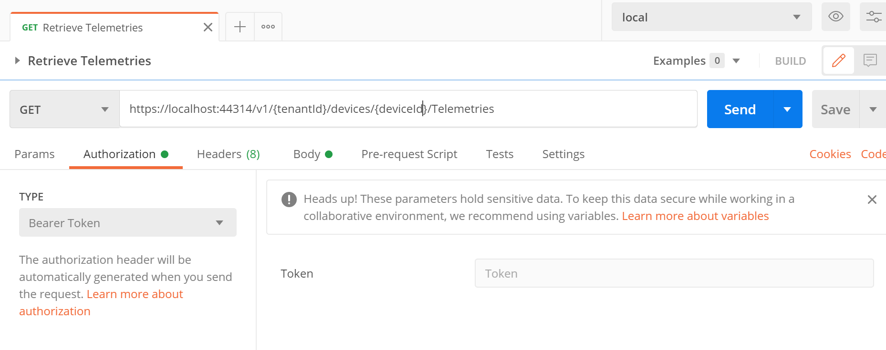
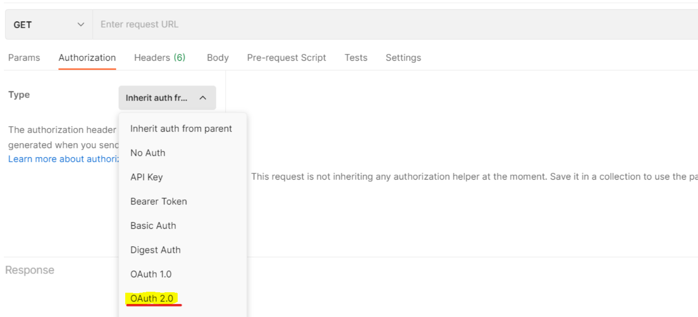
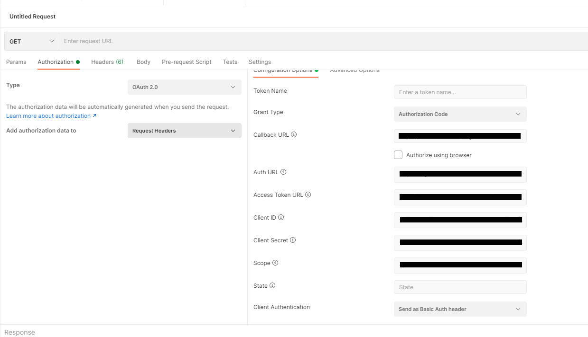
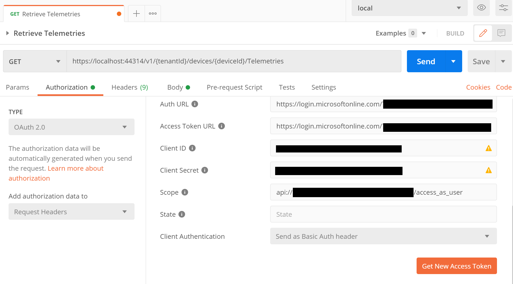
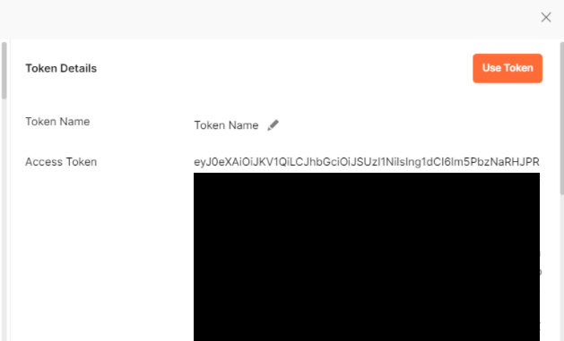
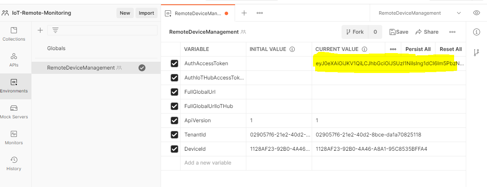

# Postman

Use Postman to test API app easily.

## Get WebApps token

Perform the following operations to get an access token.

1\. Click [+] from the **Postman tab**.



2\. Select **OAuth 2.0** from the **Authorization tab**.



3\. Enter the settings on the configuration. Please be noticed that the configuration required here belongs to the **center Tenant**.



4\. Click **Get New Access Token** to authenticate. Execute **Proceed** when authentication is completed.



5\. Copy the token obtained by performing authentication.



6\. Paste it in **CURRENT VALUE of AuthAccessToken** of Environment and save it.



*Tokens expire on a regular basis, so do the same when they expire.

## Retrieve

Set the Get Url as following and click "Send" button.

```text
https://{api-url}/v1/{tenantId}/devices/{deviceId}/Telemetries
```
