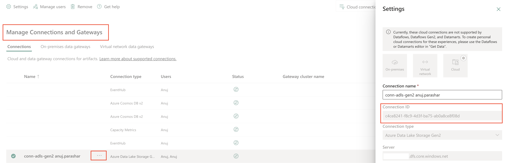

# Microsoft Fabric DataOps Sample <!-- omit in toc -->

Microsoft Fabric is an end-to-end analytics and data platform designed for enterprises that require a unified solution. It encompasses data movement, processing, ingestion, transformation, real-time event routing, and report building. Operating on a Software as a Service (SaaS) model, Fabric brings simplicity and integration to data and analytics solutions.

However, this simplification comes with a cost. The SaaS nature of Fabric makes the DataOps process more complex. Customer needs to learn new ways of deploying, testing, and handling workspace artifacts. The CI/CD process for Fabric workspaces also differs from traditional CI/CD pipelines. For example, using Fabric deployment pipelines for promoting artifacts across environments is a unique feature of Fabric, and doesn't have a direct equivalent in other CI/CD tools.

This sample aims to provide customers with a reference end-to-end (E2E) implementation of DataOps on Microsoft Fabric, covering non-functional aspects such as observability, security, data quality, and testing. It is designed as a reference implementation and should be customized to meet specific customer requirements.

## Contents <!-- omit in toc -->

- [Architecture](#architecture)
  - [Deployed resources](#deployed-resources)
- [How to use the sample](#how-to-use-the-sample)
  - [Pre-requisites](#pre-requisites)
  - [Deploying infrastructure](#deploying-infrastructure)
- [Optional: Setting up an Azure VM for authentication with managed identity](#optional-setting-up-an-azure-vm-for-authentication-with-managed-identity)
- [Cleaning up](#cleaning-up)
- [Frquently asked questions](#frquently-asked-questions)
  - [Deploymeny related FAQs](#deploymeny-related-faqs)
- [References](#references)

## Architecture

While Fabric is an end-to-end platform, it works best when integrated with other Azure services such as Application Insights, Azure Key Vault, ADLS Gen2, Microsoft Purview and so. This dependency is also because customers have existing investments in these services and want to leverage them with Fabric.

### Deployed resources

The sample deploys both Azure and Fabric resources.

The Azure resources are deployed using Terraform. The sample uses the local backend for storing the Terraform state, but it can be easily modified to use remote backends.

Microsoft Fabric resources are deployed using the [Microsoft Fabric terraform provider](https://registry.terraform.io/providers/microsoft/fabric/latest/docs) whenever possible, or using [Microsoft Fabric REST APIs](https://learn.microsoft.com/rest/api/fabric/articles/) for resources that are still not supported by the terraform provider.

Here is a list of resources that are deployed:

- Azure Resources
  - Azure Data Lake Storage Gen2 (ADLS Gen2)
  - Azure Key Vault
  - Azure Log Analytics Workspace
  - Azure Application Insights
  - Optional: Microsoft Fabric Capacity (an existing Capacity can be used)
- Fabric Resources
  - Microsoft Fabric Workspace
  - Microsoft Fabric Lakehouse
  - Azure Data Lake Storage Gen2 shortcut
  - Microsoft Fabric Environment
  - Microsoft Fabric Notebooks
  - Microsoft Fabric Data pipelines

## How to use the sample

### Pre-requisites

- An Entra user that can access Microsoft Fabric (Free license is enough).
- An Azure subscription with the following:
  - The `Microsoft.Fabric` [resource provider](https://learn.microsoft.com/azure/azure-resource-manager/management/resource-providers-and-types#register-resource-provider) has been registered on the Azure subscription.
  - A resource group to which your user should be granted [Contributor](https://learn.microsoft.com/azure/role-based-access-control/built-in-roles/privileged#contributor) and [User Access Administrator](https://learn.microsoft.com/azure/role-based-access-control/built-in-roles/privileged#user-access-administrator) privileged roles.
  - A [managed identity](https://learn.microsoft.com/entra/identity/managed-identities-azure-resources/overview) OR a [service principal](https://learn.microsoft.com/entra/identity-platform/app-objects-and-service-principals):
    - If you **cannot** create a service principal on your own, request the creation of a service principal as per your organization's policy.
  - Request that a Fabric administrator grant the above service principal or managed identity permission to [use Fabric APIs](https://learn.microsoft.com/fabric/admin/service-admin-portal-developer#service-principals-can-use-fabric-apis).
  - Grant the service principal or managed identity the `Contributor` and `User Access Administrator` privileged roles on the Azure resource group.
- An existing Entra [security group](https://learn.microsoft.com/entra/fundamentals/concept-learn-about-groups) for Fabric Workspace admins. This group is added as an admin to the deployed Fabric workspace.
- If you want to use an **existing** Microsoft Fabric capacity, ensure that both your user account and the principal (service principal or managed identity) are [added as Capacity Administrators](https://learn.microsoft.com/fabric/admin/capacity-settings?tabs=fabric-capacity#add-and-remove-admins) to that capacity.
- A bash shell with the following installed:
  - [Azure CLI](https://docs.microsoft.com/cli/azure/install-azure-cli?view=azure-cli-latest)
  - [jq](https://jqlang.github.io/jq/download/)
  - terraform
  - python version 3.9+ with `requests` package installed
- Access to an Azure DevOps organization and project.
  - Contributor permissions to an Azure Repo in such Azure DevOps environment.

### Deploying infrastructure

* Clone the repository:

    ```bash
    cd "<installation_folder>"
    # Repo clone
    git clone https://github.com/Azure-Samples/modern-data-warehouse-dataops.git
    ```

* Change the directory to the `infra` folder of the sample:

    ```bash
    cd ./modern-data-warehouse-dataops/e2e_samples/fabric_dataops_sample/infra
    ```

* Rename the [.envtemplate](./infra/.envtemplate) file to `.env` and fill in the required environment variables. Here is a list of all the variables:

    ```bash
    export TENANT_ID="The Entra ID (Azure AD Tenant Id) of your Fabric tenant"
    export SUBSCRIPTION_ID="The Azure subscription ID that will be used to deploy azure resources."
    export RESOURCE_GROUP_NAME="The Azure resource group where all azure resources will be deployed."
    export BASE_NAME="The base name of the Fabric project. This name is used for naming the Azure and Fabric resources."
    # Service Principal Authentication only: Use the below only if you are authenticating with a Service principal with the terraform provider
    export APP_CLIENT_ID="The service principal client ID."
    export APP_CLIENT_SECRET="The service principal client secret."
    # Azure DevOps variables
    export GIT_ORGANIZATION_NAME="The Azure DevOps organization."
    export GIT_PROJECT_NAME="The Azure Devops project."
    export GIT_REPOSITORY_NAME="Your repository under the Azure DevOps project."
    export GIT_BRANCH_NAME="The branch where Fabric items will be committed to."
    export GIT_DIRECTORY_NAME="The folder where Fabric items will be committed" # Note: Other than the root folder "/", the directory must already exist.
    # Workspace admin variables
    export FABRIC_WORKSPACE_ADMIN_SG_NAME="The name of the Entra security groups with admin members."
    # Fabric Capacity variables
    export EXISTING_FABRIC_CAPACITY_NAME="" # The name of an existing Fabric capacity. If this is empty, then a new capacity will be created.
    export FABRIC_CAPACITY_ADMINS="yourusername@yourdomain,sp_object_id" # Comma separated list. When creating a new Fabric capacity, these users/apps would be added as capacity admin.
    # ADLS Gen2 connection variable
    export ADLS_GEN2_CONNECTION_ID="" # The connection ID for the ADLS Gen2 Cloud Connection. If not provided, the ALDS Gen2 shortcut creation would be skipped.
    ```

    Most of these variables are self-explanatory. Here are a few additional notes:

    - `BASE_NAME` is used as a suffix to name all the Azure and Fabric resources. If skipped, the terraform script will generated a random six character string and use it as the base name.
    - `APP_CLIENT_ID` and `APP_CLIENT_SECRET` are required only if you are using service principal authentication. If you are using Managed Identity authentication, you can leave these blank.
    - `EXISTING_FABRIC_CAPACITY_NAME` is the name of an existing Fabric capacity. If you want to create a new capacity, leave this blank.
    - `FABRIC_CAPACITY_ADMINS` is a comma-separated list of users and service principals that will be added as capacity admins to the newly created Fabric capacity. If you are using an existing capacity, you can leave this blank. But in that case, make sure that your account and the principal (service principal or managed identity) are [added as Capacity Administrators](https://learn.microsoft.com/fabric/admin/capacity-settings?tabs=fabric-capacity#add-and-remove-admins) to that capacity, as mentioned in the [pre-requisites](#pre-requisites).
    - Leave `ALDS_GEN2_CONNECTION_ID` blank for the first run. The creation of the Fabric connection to ADLS Gen2 is a manual step which is done after the deployment of the resources. Once the connection is manually created, the connection ID is then updated in the `.env` file and the script is run again. This time, the script will create the Lakehouse shortcut to your ALDS Gen2 storage account.

* For the following step you have 2 authentication options:

   1. Managed Identity authentication (Recommended as it does not require dealing with secrets)

      - Create or use an existing Azure VM and assign it a Managed Identity. If you need to create a new VM, follow the instructions in the [Setting up an Azure VM for Authentication with Managed Identity](#optional-setting-up-an-azure-vm-for-authentication-with-managed-identity) section.
      - Connect to the VM and open a bash shell
      - Authenticate to Azure using the VM Managed Identity
         ```bash
         az login --identity
         ```
      - Execute following steps from this authenticated shell

   2. Service Principal + Client Secret authentication (Consider using [certificate credentials](https://registry.terraform.io/providers/microsoft/fabric/latest/docs/guides/auth_spn_cert) instead of secrets)

      - [Create a secret](https://registry.terraform.io/providers/microsoft/fabric/latest/docs/guides/auth_spn_secret#creating-client-secret) for the service principal. If you are not permitted to create secrets, request the secret from the team responsible for secret management.
      - Update `.env` file with the `APP_CLIENT_ID` and `APP_CLIENT_SECRET` values.
      - Import the environment variables file and authenticate to Azure with Service Principal
        ```bash
        source .env
        az login --service-principal -u $client_id -p $client_secret --tenant $tenant_id
        ```
      - Execute following steps from this authenticated shell

* Review [setup-infra.sh](./infra/setup-infra.sh) script and see if you want to adjust the derived naming of variable names of Azure/Fabric resources.

* The Azure and Fabric resources are created using Terraform. The naming of the Azure resources is derived from the `BASE_NAME` environment variable. Please review the [main.tf](./infra/terraform/main.tf) file to understand the naming convention, and adjust it as needed.

* Run the [setup-infra.sh](./infra/setup-infra.sh) script:

   ```bash
   ./setup-infra.sh
   ```

   The script is designed to be idempotent. Running the script multiple times will not result in duplicate resources. Instead, it will either skip or update existing resources. However, it is recommended to review the script, the output logs, and the created resources to ensure everything is as expected.

   Also, note that the bash script calls a python script [setup_fabric_environment.py](./infra/scripts/setup_fabric_environment.py) to upload custom libraries to the Fabric environment.

* Once the deployment is complete, login to Fabric Portal and create the cloud connection to ADLS Gen2 based on the [documentation](https://learn.microsoft.com/en-us/fabric/data-factory/connector-azure-data-lake-storage-gen2#set-up-your-connection-in-a-data-pipeline). Note down the connection id.

    

* Update the `ALDS_GEN2_CONNECTION_ID` variable in the `.env` file with the connection id fetched above.

* From this step onward you will need to authenticate using your user context. Authenticate **with user context** (required for the second run) and run the setup script again:

   ```bash
   az config set core.login_experience_v2=off
   az login --tenant $tenant_id
   az config set core.login_experience_v2=on
   ./setup-infra.sh
   ```

    This time, the script will create the Lakehouse shortcut to your ALDS Gen2 storage account. All previously deployed resources will remain unchanged.
    Fabric items whose REST APIs and terrafrom provider don't support Service Principal / Managed Identity authentication (i.e. Data Pipelines and others) will be deployed with user context authentication.

## Optional: Setting up an Azure VM for authentication with managed identity

If you need to create a new Linux VM, it is recommended that you:
- create an [Ubuntu VM](https://learn.microsoft.com/azure/virtual-machines/linux/quick-create-portal?tabs=ubuntu).

- enable [Entra login to the VM](https://learn.microsoft.com/entra/identity/devices/howto-vm-sign-in-azure-ad-linux), this way you will have to deal with less secrets as you will be able to login to the VM from Azure cloud shell.

- leave access to the VM [disabled by default](https://learn.microsoft.com/azure/defender-for-cloud/just-in-time-access-overview), and [enable just-in-time (JIT) access to the VM](https://learn.microsoft.com/azure/defender-for-cloud/just-in-time-access-usage).

Follow the steps to [assign a Managed Identity](https://learn.microsoft.com/entra/identity/managed-identities-azure-resources/how-to-configure-managed-identities) to your VM.

On the VM make sure you have installed the following (below instructions are for Ubuntu):
- Install nano or shell text editor:
  ```bash
  sudo apt install nano
  ```
- Install Azure CLI. Below instructions are for Ubuntu, for other distributions see instructions for [installing Azure CLI on Linux](https://learn.microsoft.com/cli/azure/install-azure-cli-linux?):
  ```bash
  curl -sL https://aka.ms/InstallAzureCLIDeb | sudo bash
  ```
- Install git:
  ```bash
  sudo apt install git
  ```
- [Install terraform](https://developer.hashicorp.com/terraform/install)
- Install jq:
  ```bash
  sudo apt install jq -y
  ```
- Install pip:
  ```bash
  sudo apt install python3-pip -y
  ```
- Install python requests package:
  ```bash
  python -m pip install requests
  ```

## Cleaning up

## Frquently asked questions

### Deploymeny related FAQs

* Why is an existing resource group required? Why can't the script create one instead?

   This sample adheres to the principle of least privilege and aligns with enterprise practices, where the IT infrastructure or platform team creates the resource group and grants only the required permissions on that specific group. This approach avoids the need for subscription-level permissions

## References

- [Single-tech Sample - Fabric DataOps](./../../single_tech_samples/fabric/fabric_ci_cd/README.md)
- [Single-tech Sample - Multi-git Fabric DataOps](./../../single_tech_samples/fabric/fabric_cicd_gitlab/README.md)
- [E2E Sample - MDW Parking Sensors](./../parking_sensors/README.md)
