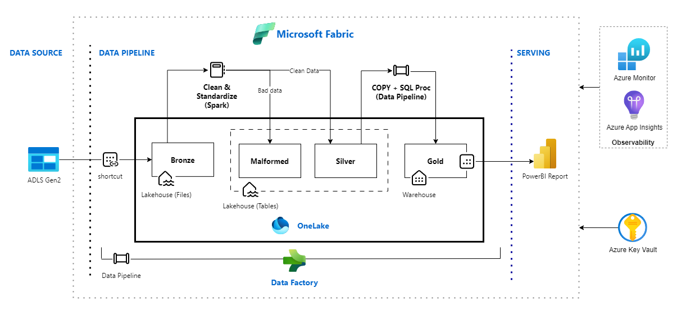
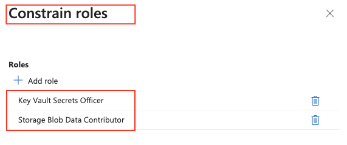

# Microsoft Fabric DataOps Sample <!-- omit in toc -->

Microsoft Fabric is an end-to-end analytics and data platform designed for enterprises that require a unified solution. It encompasses data movement, processing, ingestion, transformation, real-time event routing, and report building. Operating on a Software as a Service (SaaS) model, Fabric brings simplicity and integration to data and analytics solutions.

However, this simplification comes with a cost. The SaaS nature of Fabric makes the DataOps process more complex. Customer needs to learn new ways of deploying, testing, and handling workspace artifacts. The CI/CD process for Fabric workspaces also differs from traditional CI/CD pipelines. For example, using Fabric deployment pipelines for promoting artifacts across environments is a unique feature of Fabric, and doesn't have a direct equivalent in other CI/CD tools.

This sample aims to provide customers with a reference end-to-end (E2E) implementation of DataOps on Microsoft Fabric, covering non-functional aspects such as observability, security, data quality, and testing. It is designed as a reference implementation and should be customized to meet specific customer requirements.

## Contents <!-- omit in toc -->

- [Architecture](#architecture)
  - [High-level deployment sequence](#high-level-deployment-sequence)
  - [Deployed resources](#deployed-resources)
- [How to use the sample](#how-to-use-the-sample)
  - [Pre-requisites](#pre-requisites)
  - [Familiarize yourself with known issues, limitations, and workarounds](#familiarize-yourself-with-known-issues-limitations-and-workarounds)
  - [Deploying infrastructure](#deploying-infrastructure)
  - [Verifying the infrastructure deployment](#verifying-the-infrastructure-deployment)
- [Cleaning up](#cleaning-up)
- [Frequently asked questions](#frequently-asked-questions)
  - [Infrastructure deployment related](#infrastructure-deployment-related)
    - [Why an existing resource group is required?](#why-an-existing-resource-group-is-required)
    - [How to use a managed identity for authentication?](#how-to-use-a-managed-identity-for-authentication)
    - [Why is the variable FABRIC\_CAPACITY\_ADMINS required?](#why-is-the-variable-fabric_capacity_admins-required)
    - [What is the significance of `use_cli` and `use_msi` flags?](#what-is-the-significance-of-use_cli-and-use_msi-flags)
- [References](#references)

## Architecture



### High-level deployment sequence

At a high level, the deployment sequence proceeds as follows:

- Update the `.env` file with the required environment variables.
- Run the deployment script to create Azure and supported Fabric resources, **using either a service principal or managed identity** for authentication.
- Manually set up a cloud connection to ADLS Gen2 in the newly created Fabric workspace.
- Update the `.env` file with the ADLS Gen2 connection ID.
- Run the deployment script again, **this time using an Entra ID user** for authentication. This step will create the Lakehouse shortcut to the ADLS Gen2 storage account and deploy Fabric items that cannot be authenticated via service principal or managed identity.

Please follow the [How to use the sample](#how-to-use-the-sample) section for detailed instructions.

### Deployed resources

While Fabric is an end-to-end platform, it works best when integrated with other Azure services such as Application Insights, Azure Key Vault, ADLS Gen2, Microsoft Purview and so. This dependency is also because customers have existing investments in these services and want to leverage them with Fabric.

The sample deploys both Azure and Fabric resources, primarily utilizing Terraform for resource provisioning. By default, the Terraform state is stored in a local backend; however, the configuration can be easily adjusted to use remote backends if needed.

Microsoft Fabric resources are deployed using the [Microsoft Fabric terraform provider](https://registry.terraform.io/providers/microsoft/fabric/latest/docs) whenever possible, or using [Microsoft Fabric REST APIs](https://learn.microsoft.com/rest/api/fabric/articles/) for resources that are still not supported by the terraform provider.

Here is a list of resources that are deployed:

- Azure Resources
  - Azure Data Lake Storage Gen2 (ADLS Gen2)
  - Azure Key Vault
  - Azure Log Analytics Workspace
  - Azure Application Insights
  - Optional: Microsoft Fabric Capacity (an existing Capacity can be used)
- Fabric Resources
  - Microsoft Fabric Workspace
  - Microsoft Fabric Lakehouse
  - ADLS Gen2 shortcut
  - Microsoft Fabric Environment
  - Microsoft Fabric Notebooks
  - Microsoft Fabric Data pipelines
- Additional Resources
  - Fabric workspace GIT integration
  - Azure Role assignments to entra security group and workspace identity

## How to use the sample

### Pre-requisites

- An Entra user that can access Microsoft Fabric (Free license is enough).
- An existing Entra [security group](https://learn.microsoft.com/entra/fundamentals/concept-learn-about-groups) for Fabric Workspace admins. This group is added as an admin to the deployed Fabric workspace.
- An Azure subscription with the following:
  - The `Microsoft.Fabric` [resource provider](https://learn.microsoft.com/azure/azure-resource-manager/management/resource-providers-and-types#register-resource-provider) has been registered on the Azure subscription.
  - A resource group to which your user should be granted [Contributor](https://learn.microsoft.com/azure/role-based-access-control/built-in-roles/privileged#contributor) and [User Access Administrator](https://learn.microsoft.com/azure/role-based-access-control/built-in-roles/privileged#user-access-administrator) privileged roles.
  - A [managed identity](https://learn.microsoft.com/entra/identity/managed-identities-azure-resources/overview) OR a [service principal](https://learn.microsoft.com/entra/identity-platform/app-objects-and-service-principals)
  - Request that a Fabric administrator grant the above service principal or managed identity permission to [use Fabric APIs](https://learn.microsoft.com/rest/api/fabric/articles/identity-support#service-principals-and-managed-identities-support). To allow an app to use a service principal as an authentication method, the service principal must be added to an allowed security group. Note that this is a different security group than the one used for workspace admins. This group is then mentioned in the tenant settings as shown below:

    

  - Grant the service principal or managed identity the `Contributor` and `User Access Administrator` privileged roles on the Azure resource group. For `User Access Administrator` role, you would need to add delegate condition during role assignment. A condition is an additional check to provide more fine-grained access control. Check the [documentation](https://learn.microsoft.com/azure/role-based-access-control/delegate-role-assignments-portal?tabs=template) for more details. During the deployment, the `Storage Blob Data Contributor` and the `Key Vault Secrets Officer` roles are granted to a newly created service principal (Fabric workspace identity) and an existing Entra security group (Fabric workspace admins). Here is a valid sample condition for the `User Access Administrator` role assignment:

    

- Microsoft Graph API permissions:
  - For service principal, grant the Graph API application permission `Group.Read.All` to read the security group properties.

    

  - For managed identity, assign the elevated [Directory Readers](https://learn.microsoft.com/en-us/entra/identity/role-based-access-control/permissions-reference#directory-readers) role to read the security group properties. For this, go to `Azure Active Directory > Roles and administrators > Directory Readers > Add assignment`, and add the the managed identity.

    

- Configure Fabric capacity administrators.
  - If you want to use an **existing** Fabric capacity, ensure that both your user account and the principal (service principal or managed identity) are [added as Capacity Administrators](https://learn.microsoft.com/fabric/admin/capacity-settings?tabs=fabric-capacity#add-and-remove-admins) to that capacity.
  - If you are creating a **new** Fabric capacity, you need to provide a list of users and principals (service principal or managed identity) that will be added as capacity admins in the `FABRIC_CAPACITY_ADMINS` environment variable. For users, mention 'userPrincipalName'. For principals (sp/mi), mention 'Object ID'. Don't add spaces after the comma.
- A bash shell with the following installed:
  - [Azure CLI](https://docs.microsoft.com/cli/azure/install-azure-cli?view=azure-cli-latest)
  - [jq](https://jqlang.github.io/jq/download/)
  - terraform
  - python version 3.9+ with `requests` package installed
- Access to an Azure DevOps organization and project:
  - Contributor permissions to an Azure Repo in such Azure DevOps environment.
  - A branch and a folder in the repository where the Fabric items will be committed. The folder must already exist.

### Familiarize yourself with known issues, limitations, and workarounds

Refer to the [known issues, limitations, and workarounds](docs/issues_limitations_and_workarounds.md) page for details. Reviewing this page is highly recommended to understand the limitations, issues, and challenges you may encounter while building CI/CD pipelines for Fabric. It also provides workarounds and alternative approaches to overcome these challenges. This information will also help you understand why certain approaches are used in the infrastructure deployment scripts and Azure DevOps pipelines.

### Deploying infrastructure

- Clone the repository:

  ```bash
  cd '<installation_folder>'
  # Repo clone
  git clone https://github.com/Azure-Samples/modern-data-warehouse-dataops.git
  ```

- Change the directory to the sample folder:

  ```bash
  cd ./modern-data-warehouse-dataops/e2e_samples/fabric_dataops_sample
  ```

- Rename the [.envtemplate](./.envtemplate) file to `.env` and fill in the required environment variables. Here is a list of all the variables:

  ```bash
  export TENANT_ID="The Entra ID (Azure AD Tenant Id) of your Fabric tenant"
  export SUBSCRIPTION_ID="The Azure subscription ID that will be used to deploy azure resources."
  export RESOURCE_GROUP_NAME="The Azure resource group where all azure resources will be deployed."
  export BASE_NAME="The base name of the Fabric project. This name is used for naming the Azure and Fabric resources."
  # Service principal authentication: For managed identity or Entra ID user authentication, you can leave the following two variables blank.
  export APP_CLIENT_ID="The service principal client ID."
  export APP_CLIENT_SECRET="The service principal client secret."
  # Azure DevOps variables (The project, repository, branch, and folder must be created in advance)
  export GIT_ORGANIZATION_NAME="The Azure DevOps organization."
  export GIT_PROJECT_NAME="The Azure Devops project."
  export GIT_REPOSITORY_NAME="Your repository under the Azure DevOps project."
  export GIT_BRANCH_NAME="The branch where Fabric items will be committed to."
  export GIT_DIRECTORY_NAME="The folder where Fabric items will be committed" # Note: Other than the root folder "/", the directory must already exist. Must start with a forward-slash. Example: "/fabric"
  # Workspace admin variables
  export FABRIC_WORKSPACE_ADMIN_SG_NAME="The name of the Entra security groups with admin members."
  # Fabric Capacity variables
  export EXISTING_FABRIC_CAPACITY_NAME="" # The name of an existing Fabric capacity. If this is empty, then a new capacity will be created.
  export FABRIC_CAPACITY_ADMINS="yourusername@yourdomain,sp_mi_object_id" # Comma separated list. When creating a new Fabric capacity, these users/apps would be added as capacity admin. For users, mention "userPrincipalName". For principals (sp/mi), mention "Object ID". Don't add spaces after the comma.
  # ADLS Gen2 connection variable
  export ADLS_GEN2_CONNECTION_ID="" # The connection ID for the ADLS Gen2 Cloud Connection. If not provided, the ADLS Gen2 shortcut creation would be skipped.
  ```

  Most of these variables are self-explanatory. Here are a few additional notes:

  - `BASE_NAME` is used as a suffix to name all the Azure and Fabric resources. If skipped, the terraform script will generated a random six character string and use it as the base name.
  - `APP_CLIENT_ID` and `APP_CLIENT_SECRET` are required only if you are using service principal authentication. If you are using Managed Identity authentication, you can leave these blank.
  - `EXISTING_FABRIC_CAPACITY_NAME` is the name of an existing Fabric capacity. If you want to create a new capacity, leave this blank.
  - `FABRIC_CAPACITY_ADMINS` is a comma-separated list of users and service principals that will be added as capacity admins to the newly created Fabric capacity. If you are using an existing capacity, you can leave this blank. But in that case, make sure that your account and the principal (service principal or managed identity) are [added as Capacity Administrators](https://learn.microsoft.com/fabric/admin/capacity-settings?tabs=fabric-capacity#add-and-remove-admins) to that capacity, as mentioned in the [pre-requisites](#pre-requisites).
  - Leave `ADLS_GEN2_CONNECTION_ID` blank for the first run. The creation of the Fabric connection to ADLS Gen2 is a manual step which is done after the deployment of the resources. Once the connection is manually created, the connection ID is then updated in the `.env` file and the script is run again. This time, the script will create the Lakehouse shortcut to your ADLS Gen2 storage account.

- For the following step you have 2 authentication options:

  1. **Managed Identity authentication** (Recommended as it does not require dealing with secrets)
      - Create or use an existing Azure VM and assign it a Managed Identity. If you need to create a new VM, see the instructions [here](#how-to-use-a-managed-identity-for-authentication).
      - Connect to the VM and open a bash shell
      - Authenticate to Azure using the VM Managed Identity

        ```bash
        az login --identity
        ```

      - Execute following steps from this authenticated shell
  2. **Service Principal + Client Secret authentication** (Consider using [certificate credentials](https://registry.terraform.io/providers/microsoft/fabric/latest/docs/guides/auth_spn_cert) instead of secrets)
      - [Create a secret](https://registry.terraform.io/providers/microsoft/fabric/latest/docs/guides/auth_spn_secret#creating-client-secret) for the service principal. If you are not permitted to create secrets, request the secret from the team responsible for secret management.
      - Update `.env` file with the `APP_CLIENT_ID` and `APP_CLIENT_SECRET` values.
      - Import the environment variables file and authenticate to Azure with Service Principal

        ```bash
        source .env
        az login --service-principal -u $APP_CLIENT_ID -p $APP_CLIENT_SECRET --tenant $TENANT_ID --allow-no-subscription
        ```

      - Execute following steps from this authenticated shell

- Review [deploy.sh](./deploy.sh) script and see if you want to adjust the derived naming of variable names of Azure/Fabric resources. The Azure and Fabric resources are created using Terraform. The naming of the Azure resources is derived from the `BASE_NAME` environment variable. Please review the [main.tf](./infrastructure/terraform/main.tf) file to understand the naming convention, and adjust it as needed.

- Run the [deploy.sh](./deploy.sh) script from the authenticated shell in the previous step to deploy the Azure and Fabric resources:

  ```bash
  ./deploy.sh
  ```

  The script is designed to be idempotent. Running the script multiple times will not result in duplicate resources. Instead, it will either skip or update existing resources. However, it is recommended to review the script, the output logs, and the created resources to ensure everything is as expected.

  Also, note that the bash script calls a python script [setup_fabric_environment.py](./scripts/setup_fabric_environment.py) to upload custom libraries to the Fabric environment.

- Once the deployment is complete, login to Fabric Portal and create a cloud connection to ADLS Gen2 based on the [documentation](https://learn.microsoft.com/en-us/fabric/data-factory/connector-azure-data-lake-storage-gen2#set-up-your-connection-in-a-data-pipeline).

  

  Once the connection has been created successfully, note down the 'Connection ID'.

  

- Update the `ADLS_GEN2_CONNECTION_ID` variable in the `.env` file with the 'Connection ID' fetched above.

- From this step onward, you will need to authenticate using your user context. Authenticate **with user context** (required for the second run) and run the setup script again:

  ```bash
  source .env
  az config set core.login_experience_v2=off
  az login --tenant $TENANT_ID
  az config set core.login_experience_v2=on
  ./deploy.sh
  ```

  This time, the script will create the Lakehouse shortcut to your ADLS Gen2 storage account. All previously deployed resources will remain unchanged. Fabric items whose REST APIs and terraform provider don't support service principal / managed identity authentication (i.e. data pipelines and others) will be deployed with user context authentication.

### Verifying the infrastructure deployment

Once the deployment is complete, you can verify the resources created in the Azure portal and the Fabric portal. Below is a list of the created resources along with their default names:

| Resource type | Default name | Deployed via |
| --- | --- | --- |
| Azure - Storage account (ADLS Gen2) | 'st`BASE_NAME`' | Terraform |
| Azure - Key vault | 'kv-`BASE_NAME`' | Terraform |
| Azure - Log Analytics workspace | 'la-`BASE_NAME`' | Terraform |
| Azure - Application Insights | 'appi-`BASE_NAME`' | Terraform |
| Azure - Fabric Capacity | 'cap`BASE_NAME`' | Terraform |
| Microsoft Fabric - Workspace | 'ws-`BASE_NAME`' | Terraform |
| Microsoft Fabric - Lakehouse | 'lh_`BASE_NAME`' | Terraform |
| Microsoft Fabric - ADLS Shortcut | 'sc-adls-main' | Fabric REST API |
| Microsoft Fabric - Environment | 'env-`BASE_NAME`' | Terraform |
| Microsoft Fabric - Setup Notebook | 'nb-setup' | Terraform |
| Microsoft Fabric - Standardize Notebook | 'nb-standardize' | Terraform |
| Microsoft Fabric - Transform Notebook | 'nb-transform' | Terraform |
| Microsoft Fabric - Main Pipeline | 'pl-main' | Terraform |

Below is a screenshot of the Azure resources that are created:


Below is a screenshot of the Fabric resources that are created:


Note that all Fabric items, except for the Fabric pipeline, are owned by the service principal ('app-fabric-sp' in this case) used for the deployment. The Fabric pipeline is owned by the user who authenticated in the user context.

When you open the lakehouse, you will see the shortcut to the ADLS Gen2 storage account, as shown below:


Additionally, note that the Fabric workspace Git integration has been configured. You can review the Azure DevOps repository to locate the branch and folder where the Fabric items have been committed, as shown below:


_**Note: Please note that the Fabric notebook and pipeline deployed are placeholder items and are not functional. These are included to demonstrate the [tokenization](https://registry.terraform.io/providers/microsoft/fabric/latest/docs/guides/gotemplates) functionality during the Terraform deployment of these resources. These items will be replaced with functional versions in the next release._

## Cleaning up

Once you have finished with the sample, you can delete the deployed resources by running the cleanup script.

The [cleanup script](./cleanup.sh) performs the following actions:

- Deletes all the deployed Azure and Fabric resources.
- Deletes Fabric connection to ADLS Gen2 storage.
- Resets corresponding `ADLS_GEN2_CONNECTION_ID` variable in the .env file.
- Ensures that the Azure Key Vault is purged.
- Removes intermediate Terraform files created during deployment process including state files.

You will need to authenticate **with user context** and run the cleanup script.

  ```bash
  source .env
  az config set core.login_experience_v2=off
  az login --tenant $TENANT_ID
  az config set core.login_experience_v2=on
  ./cleanup.sh
  ```

## Frequently asked questions

### Infrastructure deployment related

#### Why an existing resource group is required?

This sample adheres to the principle of least privilege and aligns with enterprise practices, where the IT infrastructure or platform team creates the resource group and grants only the required permissions on that specific group. If a new resource group is to be created as part of the deployment, it would require subscription-level permissions, which is not recommended.

For the same reason, the script requires an existing security group for Fabric workspace admins instead of creating a new one.

#### How to use a managed identity for authentication?

When using a user-assigned managed identity, you assign the managed identity to the 'source' azure resource, such as Virtual Machine (VM), Azure Function and such. Here are the instructions to setup up an Azure VM for authentication with managed identity.

If you need to create a new Linux VM, it is recommended that you create an [Ubuntu VM](https://learn.microsoft.com/azure/virtual-machines/linux/quick-create-portal?tabs=ubuntu) and enable [Entra login to the VM](https://learn.microsoft.com/entra/identity/devices/howto-vm-sign-in-azure-ad-linux). Leave access to the VM [disabled by default](https://learn.microsoft.com/azure/defender-for-cloud/just-in-time-access-overview), and [enable just-in-time (JIT) access to the VM](https://learn.microsoft.com/azure/defender-for-cloud/just-in-time-access-usage).

Next, you need to assign a managed identity to this virtual machine. Refer to [assign a Managed Identity](https://learn.microsoft.com/entra/identity/managed-identities-azure-resources/how-to-configure-managed-identities) for detail.

On the VM make sure you have installed the following (below instructions are for Ubuntu):

```bash
# Install nano or shell text editor of your choice
sudo apt install nano

# Install Azure CLI. Below instructions are for Ubuntu, for other distributions see https://learn.microsoft.com/cli/azure/install-azure-cli-linux?
curl -sL https://aka.ms/InstallAzureCLIDeb | sudo bash

# Install git
sudo apt install git

# Install terraform - https://developer.hashicorp.com/terraform/install

# Install jq
sudo apt install jq -y

# Install pip
sudo apt install python3-pip -y

# Install python requests package
python -m pip install requests
```

#### Why is the variable FABRIC_CAPACITY_ADMINS required?

This variable is required due to a current Fabric limitation, where adding a security group as a capacity administrator is not supported. Ideally, customers would create a security group for capacity administrators and assign that group as an admin for the capacity. However, due to this limitation, the script requires a list of users and service principals to be added as capacity admins to the newly created Fabric capacity.

Additionally, the current design of the Fabric capacity template results in all existing capacity admins being removed and replaced with only those specified in the `FABRIC_CAPACITY_ADMINS` variable. Therefore, it’s essential to include all intended capacity admins in this variable.

For an existing capacity, the principal executing the script must have permission to read the capacity details. As a prerequisite, all user accounts and the principal (service principal or managed identity) used for deployment should already be assigned as Capacity Administrators for that capacity.

#### What is the significance of `use_cli` and `use_msi` flags?

These flags are used to determine the authentication method to be used during the deployment based on the login context. The following table covers the possible scenarios:

| Logged-in As | `use_cli` | `use_msi` | `APP_CLIENT_ID` | `APP_CLIENT_SECRET` |
| --- | --- | --- | --- | --- |
| Service Principal | `false` | `false` | Required | Required |
| Managed Identity | `false` | `true` | Not Required | Not Required |
| Entra ID User | `true` | `false` | Not Required | Not Required |

Terraform also uses these flags to determine the authentication method for the Fabric provider. If both `use_cli` and `use_msi` are set to `false`, the `client_id` and `client_secret` attributes are set for the provider to use service principal authentication.

Additionally, in [main.tf](./infrastructure/terraform/main.tf), some modules are deployed only when `use_cli` is set to `true`. This is necessary for Fabric items that do not support service principal or managed identity authentication. These items are deployed using user-context authentication.

## References

- [Single-tech Sample - Fabric DataOps](./../../single_tech_samples/fabric/fabric_ci_cd/README.md)
- [Single-tech Sample - Multi-git Fabric DataOps](./../../single_tech_samples/fabric/fabric_cicd_gitlab/README.md)
- [E2E Sample - MDW Parking Sensors](./../parking_sensors/README.md)
