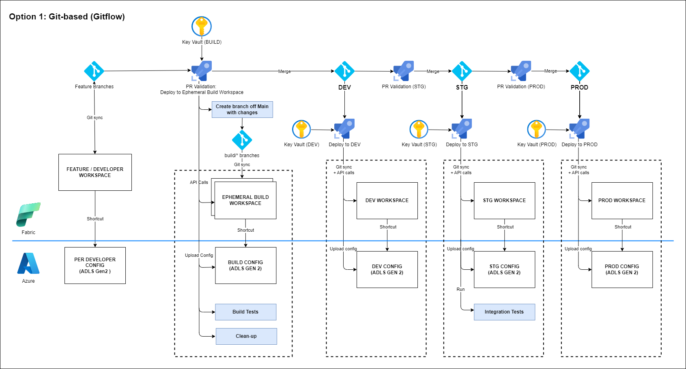
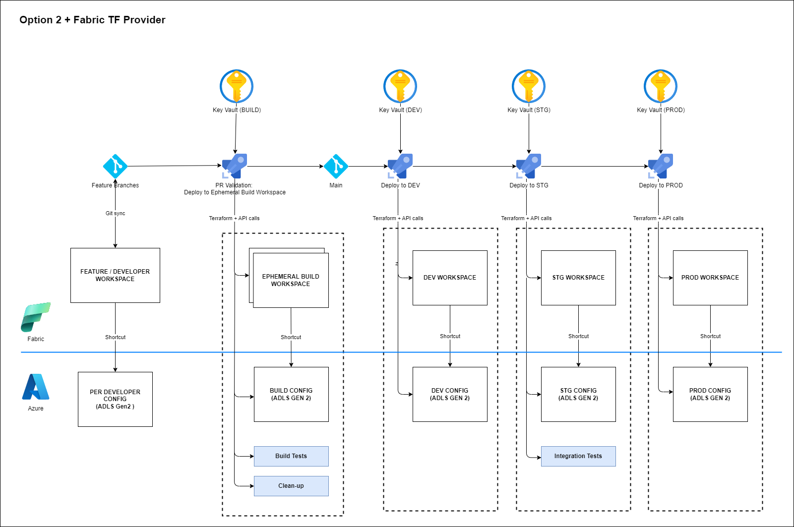

# Fabric CICD

## Status

Proposed

## Context

This ADR aims to document the decision(s) around the overall CI/CD architecture of the Fabric E2E sample.

Currently, there a number of documented options to do CI/CD for Fabric as explained [here](https://learn.microsoft.com/en-us/fabric/cicd/manage-deployment).

Key considerations:

- Technical simplicity - simpler is better.
- Viability of an E2E solution - can we build a full E2E DataOps sample with this option?
- Functionality offered - any key capabilities needed as informed by real-world requirements?
- Long-term relevance - alignment to [Microsoft Fabric roadmap](https://learn.microsoft.com/en-us/fabric/release-plan/) to ensure longer-term relevance of the sample.
- Existing samples - are there existing samples already?

|                           | Option 1 | Option 2 | Option 3 | Option 4 |
|---------------------------|----------|----------|----------|----------|
| Technical simplicity      | Medium   | Low      | High     | Low      |
| Viability of E2E solution | High     | High     | Low      | Medium   |
| Functionality offered     | High     | High     | Medium   | High     |
| Long-term relevance       | High     | Medium   | High     | Medium   |
| Existing samples          | No       | No       | Yes      | No       |

## Proposal details

Based on the key consideration, **option 1** and **option 2** were considered extensively. However, due to the very high technical complexity of option 2 specifically around item dependency management and need to track individual item IDs manually, Option 1 is the preferred **Option 1** for this milestone.

The following are CI/CD flow diagrams built as part of this ADR:

Option 1:

Option 2:

Propose option is "option #2 - Git-based deployments using Build environments".

## Decision

To be agreed

## Next steps

If accepted:

- Proceed with build of the sample accordingly.
- Spikes to validate any assumptions, specifically around automated deployments and ephemeral build/test workspaces.
