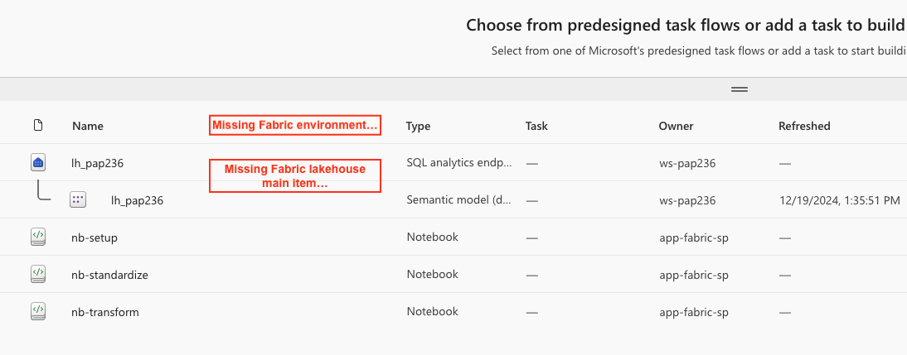
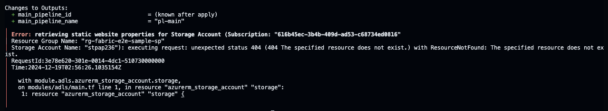
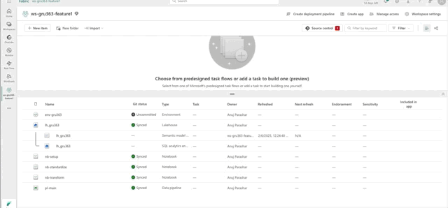
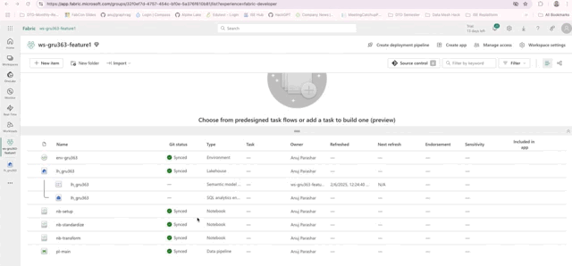

# Known issues, limitations, and FAQs <!-- omit in toc -->

This document lists the known issues and limitations specific to the sample, as well as to Fabric in general. These issues and limitations are based on the current state of the Fabric REST APIs and Fabric deployment pipelines. The document also provides recommendations on how to handle these challenges.

The [frequently asked questions (FAQs)](#frequently-asked-questions) section addresses common questions related to the deployment scripts, application code, and execution.

## Contents <!-- omit in toc -->

- [Known issues](#known-issues)
  - [Missing lakehouse/environment in the new workspace](#missing-lakehouseenvironment-in-the-new-workspace)
  - [Storage account related error](#storage-account-related-error)
  - [Fabric environment shown as 'Uncommitted' after branch-out](#fabric-environment-shown-as-uncommitted-after-branch-out)
  - [The lakehouse is empty after branch-out](#the-lakehouse-is-empty-after-branch-out)
  - [The default lakehouse attached to notebooks is incorrect after branch-out](#the-default-lakehouse-attached-to-notebooks-is-incorrect-after-branch-out)
  - [Fabric spark custom pool settings are not synced during branch-out](#fabric-spark-custom-pool-settings-are-not-synced-during-branch-out)
  - [Incorrect details in pipeline's snapshot](#incorrect-details-in-pipelines-snapshot)
- [Limitations](#limitations)
  - [Fabric REST APIs limitations](#fabric-rest-apis-limitations)
  - [Fabric Environment does not recognize change in custom libraries with same file name](#fabric-environment-does-not-recognize-change-in-custom-libraries-with-same-file-name)
- [Frequently asked questions](#frequently-asked-questions)
  - [Infrastructure deployment related](#infrastructure-deployment-related)
    - [Why existing resource groups are required?](#why-existing-resource-groups-are-required)
    - [How to use a managed identity for authentication?](#how-to-use-a-managed-identity-for-authentication)
    - [Why is the variable FABRIC\_CAPACITY\_ADMINS required?](#why-is-the-variable-fabric_capacity_admins-required)
    - [What is the significance of `use_cli` and `use_msi` flags?](#what-is-the-significance-of-use_cli-and-use_msi-flags)
    - [What are the implications of changing default values in the `.env` file?](#what-are-the-implications-of-changing-default-values-in-the-env-file)
  - [Application code and execution related](#application-code-and-execution-related)
    - [Why are lakehouse mount points created in notebooks?](#why-are-lakehouse-mount-points-created-in-notebooks)
    - [What datasets are used in the sample?](#what-datasets-are-used-in-the-sample)

## Known issues

### Missing lakehouse/environment in the new workspace

When the `deploy.sh` script is executed for the first time in the service principal or managed identity context, the Fabric items, including notebooks, the lakehouse, and the environment are created in the dev workspace. The script also add the Fabric admin's security group as the workspace admin. But if you login to the workspace as a user who is part of above security group (and thus a workspace 'Administrator'), you may sometimes find that the lakehouse and environment are missing from the workspace.



In reality, the lakehouse and environment are present in the workspace, but they are not visible to the user. This appears to be a race condition, and it is currently being investigated by the Fabric team.

#### Workaround  <!-- omit in toc -->

There are two workarounds to resolve this issue:

1. Go to the 'Manage access' section in the workspace and change the role of the Fabric admin's security group from `Administrator` to `Contributor`. After that, refresh the browser a couple of times. This will make the lakehouse and environment visible in the workspace.

   Once done, you can change the role of the Fabric admin's security group back to `Administrator` by running the deployment script again in the service principal/managed identity context. This will revert the role of the security group to `Administrator`, and the lakehouse and environment will remain visible. Alternatively, a Tenant administrator can also switch this role from the Admin portal.

1. Instead of relying on the security group, directly grant the user the 'Administrator' workspace role. This will also result in making the lakehouse and environment visible in the workspace.

### Storage account related error

When you deploy the sample, you may encounter an error during the Terraform state refresh. The error message will be `Error: retrieving static website properties for Storage Account`. The error typically occurs when you redeploy the sample without changing the `BASE_NAME` in the environment file.



Again, this appears to be a race condition in which the previously deleted storage account is not cleaned up in time.

#### Workaround  <!-- omit in toc -->

If you encounter this issue, the cleanup script will not work because the Terraform state refresh will fail. In this case, the only option is to manually destroy the deployment. Once everything is deleted, you can do a clean deployment, but be sure to update the `BASE_NAME` to a different value in the environment file.

### Fabric environment shown as 'Uncommitted' after branch-out

After branching-out to a new workspace, the Git status of the Fabric environment in the new workspace is shown as `Uncommitted`. If you open the environment, you will see that the environment does not have the public and custom libraries that were originally uploaded to the dev environment. However, these files are present in the repository.



If you attempt to commit the changes, the libraries in the repository will be deleted. If you try to `undo` the changes, you will receive the notification `Your selected changes were undone`, but the Git status will remain `Uncommitted`.

#### Workaround <!-- omit in toc -->

To resolve this issue, you need to manually upload the required libraries to the new workspace and publish the changes. Make sure to publish only the libraries related changes and nothing else. With that, you will be able to commit the changes without losing the libraries.

### The lakehouse is empty after branch-out

After branching-out to a new workspace, the lakehouse in the new workspace is empty. This is expected behavior, as the lakehouse sub-items such as `Tables` and `Folder` are not synced to Git and are not part of the repository. Therefore, they are not copied to the new workspace.

However, this makes the lakehouse unusable for development in the new workspace. Developers need the lakehouse schemas and tables (even if they are empty) and config files to start development. There should be a way to hydrate the lakehouse in the new workspace.

#### Workaround <!-- omit in toc -->

There are several approaches to handle this. Here is a possible workaround in the context of this sample:

- The sample hosts the config and reference files externally on ADLS Gen2 storage and makes them available in the lakehouse using a OneLake ADLS Gen2 shortcut. To make this config data available in the feature workspace, developers can create a new OneLake shortcut in the new workspace pointing to the dev workspace's shortcut. This way, the config files become available in the new workspace.

  

- For lakehouse tables, there are two options:
  - **Option 1**: Create OneLake [schema shortcuts](https://learn.microsoft.com/fabric/data-engineering/lakehouse-schemas#bring-multiple-tables-with-schema-shortcut) similar to the above. As the sample uses lakehouse schemas to organize the tables, creating schema shortcuts will make all the tables in the schema available in the new workspace. Please note that the lakehouse schemas are currently in public preview.
  - **Option 2**: Run the [nb-setup](./../src/notebooks/00_setup.ipynb) notebook in the new workspace to create the tables. This time the tables will be empty, but the schema and table structure will be available for development. It would allow developers to develop the code and test it in isolation.

### The default lakehouse attached to notebooks is incorrect after branch-out

This issue is a side effect of how Fabric Git sync works. When you branch out to a new workspace, the notebook definition file in Git contains a reference (added as a metadata comment) to the lakehouse in the development workspace. When this file is synced, the same reference is carried over to the new workspace. As a result, the default lakehouse attached to the notebooks still points to the development workspace's lakehouse, which is incorrect.

#### Workaround <!-- omit in toc -->

Here are some recommendation approaches to handle this issue:

- **Avoid relying on the default lakehouse:** Write notebooks in a way that they do not depend on the attached default lakehouse. This ensures that even if the reference is incorrect, the notebooks will still function properly and, more importantly, will not modify data in the wrong lakehouse. The notebooks used in this sample follow this approach.
- **Manually update the lakehouse reference:** You can manually change the lakehouse reference in the feature workspace to point to the correct lakehouse. However, this approach has a major drawback—updating the default lakehouse in the notebook will appear as an uncommitted change in the workspace. If you commit this change, it will eventually be merged into the development workspace through a pull request, modifying the lakehouse reference there and potentially breaking the development workspace. This issue applies generally to any post-processing done on Fabric items that are Git-synced.
- **Automate the branch-out and post-processing steps:** Automating the branch-out and post-processing can help update the lakehouse reference in notebooks seamlessly. While this is a code-intensive approach, it provides greater flexibility in handling Fabric Git sync issues. The post-processing steps can be implemented as a notebook that users can execute or as an Azure DevOps (AzDo) pipeline that developers can trigger. The sample will be updated in the future to include this automation.

### Fabric spark custom pool settings are not synced during branch-out

The sample deploys a custom spark pool and configures the spark workspace settings as part of the Terraform deployment. However, these settings are not Git-synced and are not included in the repository. As a result, when you branch out to a new workspace, the custom spark pool settings are not carried over. This can cause issues when running notebooks that rely on these settings.

#### Workaround <!-- omit in toc -->

In some cases, it might be acceptable to use different pool settings or default values in the feature workspace. In such case, it can be left to the developer to update the pool and workspace spark settings as needed. As these settings are not Git synced, they will not be part of the pull request and will not affect the development workspace.

Otherwise, these update can be applied as part of the post-processing step mentioned above. This post processing step can read the settings of the dev workspace and apply the same to the feature workspace using the [Fabric REST APIs](https://learn.microsoft.com/rest/api/fabric/spark/workspace-settings/update-spark-settings?tabs=HTTP).

### Incorrect details in pipeline's snapshot

For pipeline executions, regardless of the user's selection, the first notebook's execution snapshot is shown, and other snapshots are inaccessible.

#### Workaround <!-- omit in toc -->

To view the snapshot of a specific notebook execution, follow these steps:

- Get the end point, workspace id, and artifact id for the notebook under consideration. These are constant for a given notebook and will not change for each execution.
- From Pipeline execution, go to the execution for the above notebook, click on 'output' and from the output copy the `run id`. Note that each notebook activity may have a different value, even if all these notebooks are part of the same pipeline execution.
- Snapshot URL can be obtained like this: `https://{endpoint}/groups/{workspaceId}/synapsenotebooks/{artifactId}/snapshots/{runId}`.
- Open the URL browser to see the snapshot.

## Limitations

### Fabric REST APIs limitations

The support for managed identities and service principals is not available in few of the Fabric REST APIs. The most notable APIs (in context of this sample) that do not support managed identities are:

- [Git APIs](https://learn.microsoft.com/rest/api/fabric/core/git)
- [Data pipelines](https://learn.microsoft.com/en-us/rest/api/fabric/datapipeline/items)

To handle this limitation, the sample requires executing the deployment script twice - once with the managed identity or service principal and once with the user's credentials. The Git integration and data pipeline are created using the user's credentials.

### Fabric Environment does not recognize change in custom libraries with same file name

Currently, the Fabric environment does not recognize changes in custom libraries with the same file name. For example, the sample uses a custom library named [ddo_transform_standardize.py](./../libraries/src/ddo_transform_standardize.py), which is referenced in the notebooks. If you make changes to this file and upload it to the environment, the environment does not recognize that the content of the file has changed and does not update the library. This behavior is same for both REST APIs and the UI experience. This issue is under investigation by the Fabric team.

#### Workaround <!-- omit in toc -->

There are two workarounds to handle this issue:

- **Add versioning to the file name:** To ensure that the environment recognizes the change, you can add a version number to the file name. For example, you can rename the file to `ddo_transform_standardize_v2.py`. This way, the environment will recognize the new file as a different library and update it accordingly.

## Frequently asked questions

### Infrastructure deployment related

#### Why existing resource groups are required?

This sample follows the principle of least privilege and aligns with enterprise best practices, where the IT infrastructure or platform team is responsible for creating resource groups and granting only the necessary permissions to those specific groups. Allowing resource groups to be created as part of the deployment would require subscription-level permissions, which is not recommended.

For the same reason, the script requires existing security groups for Fabric workspace admins instead of creating new ones.

Having said that, a privileged user with `Contributor` and `User Access Administrator` roles at the subscription level can use the [configure_resource_groups.sh](./../scripts/configure_resource_groups.sh) script can be used to create the required resource groups and assigning the necessary roles. This script creates the required resource groups for each stage/environment and assigns the `Contributor` and `User Access Administrator` roles to the specified Entra security group. The `User Access Administrator` role is assigned with a delegate condition to provide more fine-grained access control.

#### How to use a managed identity for authentication?

When using a user-assigned managed identity, you assign the managed identity to the 'source' azure resource, such as Virtual Machine (VM), Azure Function and such. Here are the instructions to setup up an Azure VM for authentication with managed identity.

If you need to create a new Linux VM, it is recommended that you create an [Ubuntu VM](https://learn.microsoft.com/azure/virtual-machines/linux/quick-create-portal?tabs=ubuntu) and enable [Entra login to the VM](https://learn.microsoft.com/entra/identity/devices/howto-vm-sign-in-azure-ad-linux). Leave access to the VM [disabled by default](https://learn.microsoft.com/azure/defender-for-cloud/just-in-time-access-overview), and [enable just-in-time (JIT) access to the VM](https://learn.microsoft.com/azure/defender-for-cloud/just-in-time-access-usage).

Next, you need to assign a managed identity to this virtual machine. Refer to [assign a Managed Identity](https://learn.microsoft.com/entra/identity/managed-identities-azure-resources/how-to-configure-managed-identities) for detail.

On the VM make sure you have installed the following (below instructions are for Ubuntu):

```bash
# Install nano or shell text editor of your choice
sudo apt install nano

# Install Azure CLI. Below instructions are for Ubuntu, for other distributions see https://learn.microsoft.com/cli/azure/install-azure-cli-linux?
curl -sL https://aka.ms/InstallAzureCLIDeb | sudo bash

# Install git
sudo apt install git

# Install terraform - https://developer.hashicorp.com/terraform/install

# Install jq
sudo apt install jq -y

# Install pip
sudo apt install python3-pip -y

# Install python requests package
python -m pip install requests
```

#### Why is the variable FABRIC_CAPACITY_ADMINS required?

This variable is required due to a current Fabric limitation, where adding a security group as a capacity administrator is not supported. Ideally, customers would create a security group for capacity administrators and assign that group as an admin for the capacity. However, due to this limitation, the script requires a list of users and service principals to be added as capacity admins to the newly created Fabric capacity.

Additionally, the current design of the Fabric capacity template results in all existing capacity admins being removed and replaced with only those specified in the `FABRIC_CAPACITY_ADMINS` variable. Therefore, it’s essential to include all intended capacity admins in this variable.

For an existing capacity, the principal executing the script must have permission to read the capacity details. As a prerequisite, all user accounts and the principal (service principal or managed identity) used for deployment should already be assigned as Capacity Administrators for that capacity.

#### What is the significance of `use_cli` and `use_msi` flags?

These flags are used to determine the authentication method to be used during the deployment based on the login context. The following table covers the possible scenarios:

| Logged-in As | `use_cli` | `use_msi` | `APP_CLIENT_ID` | `APP_CLIENT_SECRET` |
| --- | --- | --- | --- | --- |
| Service Principal | `false` | `false` | Required | Required |
| Managed Identity | `false` | `true` | Not Required | Not Required |
| Entra ID User | `true` | `false` | Not Required | Not Required |

Terraform also uses these flags to determine the authentication method for the Fabric provider. If both `use_cli` and `use_msi` are set to `false`, the `client_id` and `client_secret` attributes are set for the provider to use service principal authentication.

Additionally, in [main.tf](./../infrastructure/terraform/main.tf), some modules are deployed only when `use_cli` is set to `true`. This is necessary for Fabric items that do not support service principal or managed identity authentication. These items are deployed using user-context authentication.

#### What are the implications of changing default values in the `.env` file?

The sample uses the `ENVIRONMENT_NAMES` variable in the [.env](./../.envtemplate) file to define the environment names. By default, it includes three values: `dev`, `stg`, and `prod`. It's highly recommended to use these values as-is. Additionally, it is recommended to use the same values for branch names as part of the `GIT_BRANCH_NAMES` variable.

If you need to change these values, you may need to update the following:

- The [prepare_azure_repo.sh](./../prepare_azure_repo.sh) script
- The [deploy.sh](./../deploy.sh) script
- The [cleanup.sh](./../cleanup.sh) script
- The [Azure DevOps pipeline](./../devops/templates/pipelines/) YAML files

### Application code and execution related

#### Why are lakehouse mount points created in notebooks?

If you need to read non-data files (e.g., config/yaml), referring them via ABFS path does not work. In such scenarios, you can mount lakehouse path as mount point and then access the required files.

#### What datasets are used in the sample?

The data used in this sample is synthetically generated for testing and demonstration purposes only. It is not based on real-world data and may lack logical or practical accuracy for analytical use. It should be treated solely as sample data for validating Fabric notebook/pipeline functionality, rather than for analysis, decision-making, or reporting showcases.

Each time the data pipeline runs, the same dataset is downloaded into a new subfolder within the landing directory and reprocessed.

The use of synthetic data helps avoid dependencies on external APIs and safeguards against copyrights issues. In future, we plan to introduce synthetic data generation capabilities within the sample. This feature will allow users to generate realistic data for simulating real-world data engineering scenarios.
