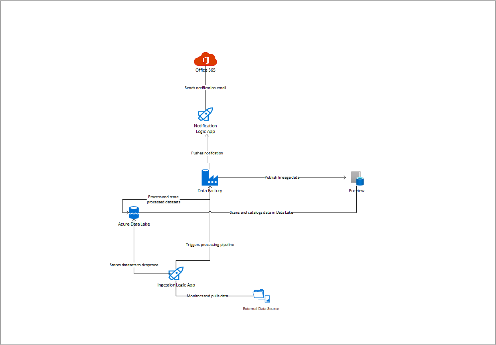

# Modern Data Warehouse Data Governance end-to-end deployment with Purview <!-- omit in toc -->

This sample demonstrates how to provision end-to-end modern data warehouse solution using Azure DevOps pipelines to deploy Dev, Test and Prod environments. It focuses on data governance, using Purview, to track data assets and lineage to allow data managers to understand the quality and source of the data, as well as to understand if there is PII etc. in the data estate. It also uses [presidio](https://github.com/microsoft/presidio), to anonymize parts of the scanned data and reduce the potential to expose PII.

## Contents <!-- omit in toc -->

- [Solution Overview](#solution-overview)
  - [Architecture](#architecture)
  - [Technologies used](#technologies-used)
- [Key Learnings](#key-learnings)
  - [1. Use private endpoints and peered network to secure the solution](#1-use-private-endpoints-and-peered-network-to-secure-the-solution)
  - [2. Edit your ADF pipelines only in Dev](#2-edit-your-adf-pipelines-only-in-dev)
- [Key Concepts](#key-concepts)
  - [Environments](#environments)
- [How to use the sample](#how-to-use-the-sample)
  - [Prerequisites](#prerequisites)
  - [Setup and Deployment](#setup-and-deployment)
    - [Deployed Resources](#deployed-resources)
    - [Running the sample](#running-the-sample)
  - [Promoting development and test environment](#promoting-development-and-test-environment)

## Solution Overview

This solution sets up an Azure Data Lake storage account, with two containers: Datalake and Dropzone. The folder structure in datalake is structured to enable data tiering (Bronze, Silver, Gold), hold shared data (Reference) and shared libraries (Sys). Azure Data Factory instance with linked services connecting to the Azure Data Lake, Azure Key Vault, Azure Databricks and Azure Purview. Application Insights is used for event logging and Office365 API Connection in combination with Logic Apps is used for sending notification emails. A Virtual Network and Private Endpoints are deployed for Data Lake and Key Vault, however the firewall on the services is left open in the initial deployment. Additionally the Databricks virtual network is not peered to the solution's and the databricks public IP is enabled. To fully secure the solution, the Virtual Network should be peered to an internal corporate network, and firewall closed on those services, and follow the [Databricks single tech sample](https://github.com/Azure-Samples/modern-data-warehouse-dataops/tree/main/single_tech_samples/databricks/sample2_enterprise_azure_databricks_environment) for more information on locking down a databricks environment.

The Azure Data Factory contains an ADF Pipeline that is stored in a git repository, that is taking data from the Dropzone and ingesting it into the bronze folder, after anonymizing its content using [Presidio](https://github.com/microsoft/presidio). The data files for running the pipeline can be found in [Data](./data) folder of this repository.

### Architecture

The following shows the architecture of the solution.

### Technologies used

- [Azure Purview](https://azure.microsoft.com/en-au/services/devops/)
- [Azure Data Factory](https://azure.microsoft.com/en-au/services/data-factory/)
- [Azure Data Lake Gen2](https://docs.microsoft.com/en-us/azure/storage/blobs/data-lake-storage-introduction)
- [Azure Databricks](https://docs.microsoft.com/en-us/azure/databricks/)
- [Azure Key Vault](https://azure.microsoft.com/en-us/services/key-vault/)
- [Application Insights](https://docs.microsoft.com/en-us/azure/azure-monitor/app/app-insights-overview)
- [Office365 API Connection](https://docs.microsoft.com/en-us/azure/connectors/connectors-create-api-office365-outlook)
- [Azure Virtual Network](https://docs.microsoft.com/en-us/azure/virtual-network/virtual-networks-overview)
- [Private Endpoint](https://docs.microsoft.com/en-us/azure/private-link/private-endpoint-overview)
- [Azure Function](https://docs.microsoft.com/en-us/azure/azure-functions/)
- [Azure Logic App](https://azure.microsoft.com/en-us/services/logic-apps/)
- [Azure Private DNS](https://docs.microsoft.com/en-us/azure/dns/private-dns-overview)

## Key Learnings

The following summarizes key learnings and best practices demonstrated by this sample solution

### 1. Use private endpoints and peered network to secure the solution

To enable a network layer protection, the services should reside on Virtual Network (VNET) and firewall for those services should be enabled to block external access. This can be done under Networking tab in the portal, by selecting "Allow access from selected networks". Support for Private Endpoints varies in different services, where Data Lake and Key Vault have full support, Data Factory, Databricks and Purview require some additional steps.

To establish a private connection from Data Factory you need to create an [Azure Integration Runtime](https://docs.microsoft.com/en-us/azure/data-factory/create-azure-integration-runtime), and then create a link to Key Vault and Data Lake.

Purview at this time (feb-2021) does not yet fully support Private Endpoints, but since it is considered a trusted Azure Service, it can reach the services that have the firewall enabled when the "[Allow trusted Microsoft services to access](https://docs.microsoft.com/en-us/azure/storage/common/storage-network-security?tabs=azure-portal)..." exception is checked.

Azure Databricks can be either provisioned in the virtual network (vnet-injection) in the Premium tier, or its managed virtual network can be peered to the solution's virtual network so that the cluster's nodes would have secure access to the data in Azure Storage. Additionaly, its [public IP should be disabled](https://docs.microsoft.com/en-us/azure/databricks/security/secure-cluster-connectivity) and routed through corporate network.

Notice that once the firewall is enabled, and access is blocked from external IPs, you will not be able to access the resources directly, unless the VNET is peered into your internal network (e.g. with firewall on, you would not be able to use Azure Storage Explorer to access Data Lake, unless the network is peered).

### 2. Edit your ADF pipelines only in Dev

While you could technically connect each Azure Data Factory into Git repository, you should follow data ops principles and once the development work is done, publish the working data pipeline, and then move it through Data Ops into Test instance of Data Factory.

## Key Concepts

### Environments

- **Dev** - the DEV resource group is used by developers to build and test their solutions.
- **Test** - the Test resource group is used to test deployments prior to going to production in a production-like environment. Any integration tests are run in this environment
- **Production** - the PROD resource group is the final Production environment

Each environment has an identical set of resources

## How to use the sample

### Prerequisites

1. [Azure DevOps account](https://dev.azure.com/)
2. [Azure Account](https://azure.microsoft.com/en-au/free/search/?&ef_id=Cj0KCQiAr8bwBRD4ARIsAHa4YyLdFKh7JC0jhbxhwPeNa8tmnhXciOHcYsgPfNB7DEFFGpNLTjdTPbwaAh8bEALw_wcB:G:s&OCID=AID2000051_SEM_O2ShDlJP&MarinID=O2ShDlJP_332092752199_azure%20account_e_c__63148277493_aud-390212648371:kwd-295861291340&lnkd=Google_Azure_Brand&dclid=CKjVuKOP7uYCFVapaAoddSkKcA)
   - *Permissions needed*: ability to create and deploy to an azure [resource group](https://docs.microsoft.com/en-us/azure/azure-resource-manager/management/overview), a [service principal](https://docs.microsoft.com/en-us/azure/active-directory/develop/app-objects-and-service-principals), and grant the [collaborator role](https://docs.microsoft.com/en-us/azure/role-based-access-control/overview) to the service principal over the resource group.

### Setup and Deployment

> **IMPORTANT NOTE:** As with all Azure Deployments, this will **incur associated costs**. Remember to teardown all related resources after use to avoid unnecessary costs. See [here](#deployed-resources) for list of deployed resources.
>
> **NOTE ABOUT AZURE PURVIEW PUBLIC PREVIEW** Azure Purview is currently in public preview, and due to this your subscription might be limited to only one Purview account per region, per subscription. Notice also that deleting Purview might take some time, due to the deletion of underlying resources. It might not always be visible from the Azure Portal, for example Purview might disappear from the resource list and Portal report resource as deleted, when in fact the process is continuing. In some rare cases, Portal might throw an error during the deletion, while the resources are still being deleted. Issue is usually solved by just deleting the resource again.

1. **Deploy the infrastructure**
   1. Create a new Azure DevOps project
   2. Create an [Azure Resource Group](https://docs.microsoft.com/en-us/azure/azure-resource-manager/management/manage-resource-groups-portal)
   3. In your Azure DevOps project, (under project settings) create a new [Service Connection](https://docs.microsoft.com/en-us/azure/devops/pipelines/library/service-endpoints?view=azure-devops&tabs=yaml) to the Resource Group created in the previous. Note that you should **NOT** use certificate based authentication, as the pipeline relies on service principal password to authenticate against Purview REST API.
   4. Select the new Service Connection in Azure Dev Ops and click on the Manage Service Principal link to find the full display name of the Service Principal
   5. In the Azure Portal, go to the Azure Resource Group you created, and grant this Service Principal the Owner role of the resource group (use the name found in the previous step to locate the Service Principal).
   6. With administrative privileges on the subscription, run `az provider register --namespace 'Microsoft.Purview'` to register Purview provider. Alternatively you can use the Azure Portal to search for and select Subscriptions, select the subscription you want to use, and then select Resource providers. Search and register Microsoft.Purview provider.
   7. Create a new repository in your Azure DevOps project and copy the contents of the `e2e_samples\mdw-governance` folder to the root of this repository.
   8. Update values of the variables to match the desired configuration by updating the `dev-environment.yml`, `test-environment.yml` and `prod-environment.yml` files to match your environment. Update at least:
        - **resourceGroup** - this is the name of the Resource Group where the resources will be deployed
        - **resourcePrefix** - this prefix will be appended to all resource names to make them unique (notice: lower-case letters only, no special characters allowed
        - **location** - location where resources should be deployed
        - **locationFormatted** - full name of location where resources should be deployed
        - **purviewAdmins** - an [objectID](https://docs.microsoft.com/en-us/azure/marketplace/find-tenant-object-id) of the user/user group to be assigned admin rights to Purview (e.g. your Azure AD objectID). To find the object id of the current logged in user in `az cli`, run `az ad signed-in-user show --output json | jq -r '.objectId'`
        - **azureResourceManagerConnection** - name of the service connection (by default this is derived from resource group name e.g. "SC-My-Resource-Group")
   9. Create a new pipeline from existing yml in Azure DevOps by selecting the repository and importing the `create-infrastructure.yml` YAML file (see [this post](https://stackoverflow.com/a/59067271) to learn how).
   10. Run the `create-infrastructure.yml` pipeline.

2. **Setup an ADF git integration in DEV Data Factory**
    1. In the Azure Portal, navigate to the Data Factory in the **DEV** environment.
    2. Click "Author & Monitor" to launch the Data Factory portal.
    3. On the landing page, select "Set up code repository". For more information, see [here](https://docs.microsoft.com/en-us/azure/data-factory/source-control).
    4. Fill in the repository settings with the following:
        - Repository type: **Azure DevOps Git**
        - Azure DevOps Account: **Your DevOps account**
        - Project name: **Name of the project that has the git repo where you imported this Github repository**
        - Repository name: **Use existing - select name of the repository where you imported this Github repository**
        - Collaboration branch: **main**
        - Root folder: **/adf**
        - Import Existing Data Factory resource to repository: **Selected**
        - Branch to import resource into: **Use Collaboration**
    5. When prompted to select a working branch, select **main**

   > **IMPORTANT NOTE:** Only the **DEV** Data Factory should be setup with Azure DevOps integration. Do **NOT** setup git integration in the Test and PROD Data Factories.

3. **Authorize Office 365 connector to send emails**
    1. In the Azure Portal, navigate to the Office 365 connector (default name value is: "office365")
    2. Click on Edit API connection
    3. Enter the sender email for sending the notifications
    4. Press Authorize

Congratulations!! 🥳 You have successfully deployed the solution.

#### Deployed Resources

After a successful deployment, you should have 15 resources deployed per environment:

- **Data Factory** - with pipelines, datasets and linked services, a connection to Purview (tag), with Data Factory Managed Service Identity having Data Contributor rights in Purview
- **Data Lake Store Gen2**
- **Databricks** - with cluster-setup scripts and annymization notebook. Notice that there are additional resources deployed in a resource group named "databricks-rg-[prefix name of you solution]"
- **KeyVault** with all relevant secrets stored.
- **Purview** with the following connected services in Purview:
  - One Data Factory connection
  - One Data Source (Azure Data Lake) with one Scan
  - One Key Vault connection
- **App Service Plan** and **Azure Function** used for data log collection
- **Logic app** and **Office 365** connector, used for emailing notifications
- **Virtual Network** and two **Private Endpoints** and two **Virtual Network Interfaces**: used to connect Data Lake and Key Vault to Data Factory over private connection

#### Running the sample

In the datalake storage, under the container named "dropzone" you will find the csv datasource On-street_Parking_Bay_Sensors_baylist.csv, which has the column "rd_seg_dsc". Start a debug execution of the ADF pipeline and input the name of the source file.
The name of the column to be anonymized (rd_seg_dsc) is an input parameter to the ADF Databricks Notebook job, if you are using a different dataset, make sure to change the column name to fit your data scheme.

### Promoting development and test environment

The core infrastructure pipeline (`create-infrastructure.yml`) defines stages for each environment. By default, the stages run sequentially from development environment to test and finally to production. Setting up gate keeping - so that development environment is not automatically promoted to test - is a one-time manual process in Azure DevOps:

1. Navigate to **Pipelines** > **Environments**
2. Select the environment to apply the approval step for (e.g. "Test")
3. Click the **More actions** button in the top-right corner (the one with three dots) and from the pop-up list select **Approvals and checks**
4. Click the plus icon in the top-right corner and select **Approvals** and click **Next**
5. Add the desired gatekeepers and click **Create**

For more information, see [Define approvals and checks](https://docs.microsoft.com/en-us/azure/devops/pipelines/process/approvals).
