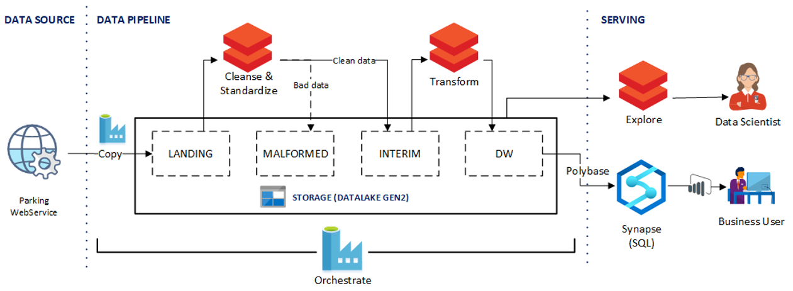
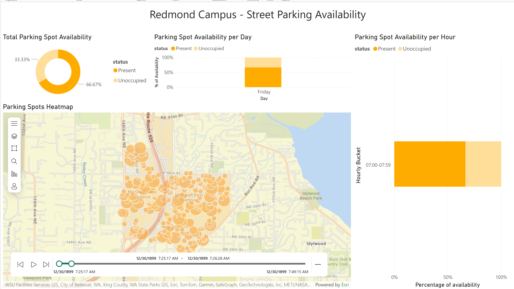
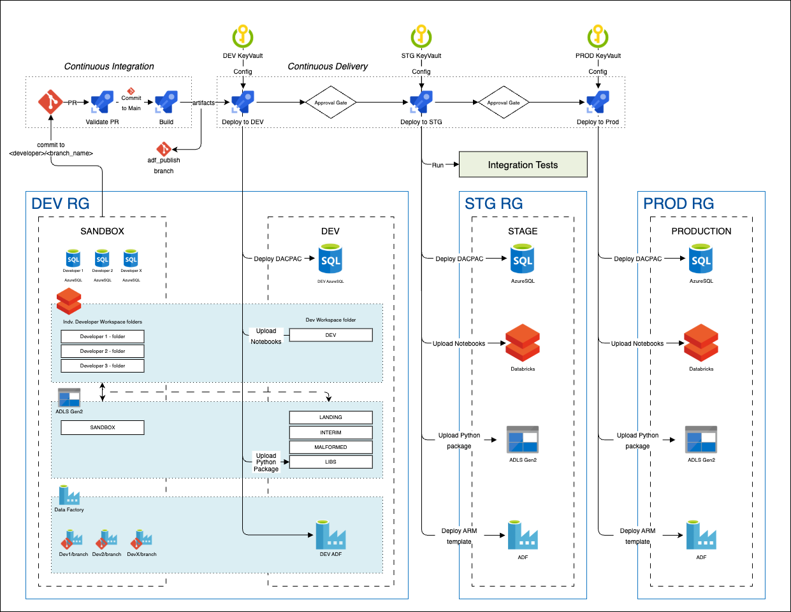
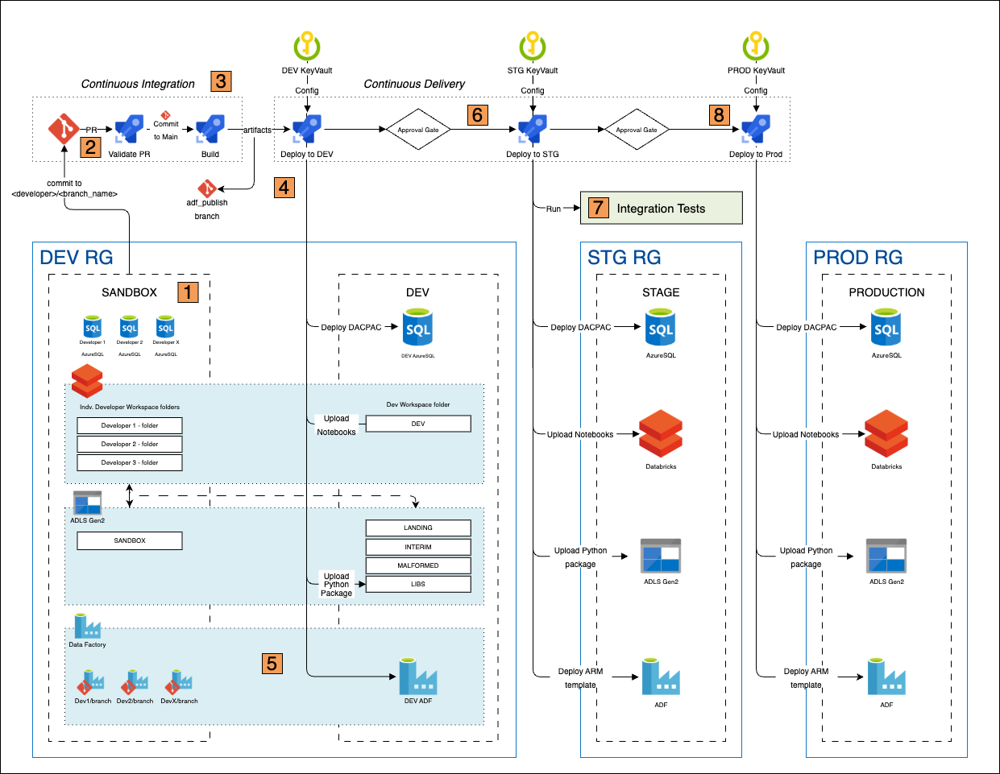
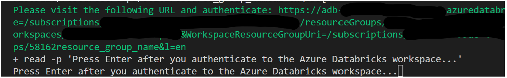
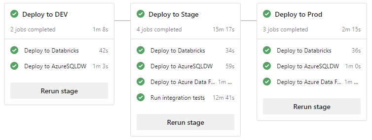
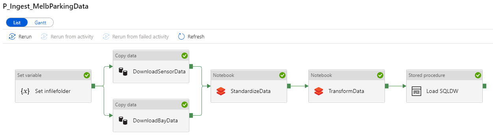

# DataOps - Parking Sensor Demo <!-- omit in toc -->

The sample demonstrate how DevOps principles can be applied end to end Data Pipeline Solution built according to the [Medallion architecture](https://learn.microsoft.com/en-us/azure/architecture/solution-ideas/articles/azure-databricks-modern-analytics-architecture) pattern.

## Contents <!-- omit in toc -->

- [Solution Overview](#solution-overview)
  - [Architecture](#architecture)
  - [Continuous Integration and Continuous Delivery (CI/CD)](#continuous-integration-and-continuous-delivery-cicd)
  - [Technologies used](#technologies-used)
- [Key Learnings](#key-learnings)
  - [1. Use Data Tiering in your Data Lake](#1-use-data-tiering-in-your-data-lake)
  - [2. Validate data early in your pipeline](#2-validate-data-early-in-your-pipeline)
  - [3. Make your data pipelines replayable and idempotent](#3-make-your-data-pipelines-replayable-and-idempotent)
  - [4. Ensure data transformation code is testable](#4-ensure-data-transformation-code-is-testable)
  - [5. Have a CI/CD pipeline](#5-have-a-cicd-pipeline)
  - [6. Secure and centralize configuration](#6-secure-and-centralize-configuration)
  - [7. Monitor infrastructure, pipelines and data](#7-monitor-infrastructure-pipelines-and-data)
- [Key Concepts](#key-concepts)
  - [Build and Release Pipeline](#build-and-release-pipeline)
    - [Environments](#environments)
    - [Build and Release Sequence](#build-and-release-sequence)
  - [Testing](#testing)
  - [Observability / Monitoring](#observability--monitoring)
    - [Databricks](#databricks)
    - [Data Factory](#data-factory)
- [How to use the sample](#how-to-use-the-sample)
  - [Setup](#setup)
    - [Prerequisites](#prerequisites)
    - [Deployment Options](#deployment-options)
      - [Software Prerequisites if you use Dev Container](#software-prerequisites-if-you-use-dev-container)
      - [Software Prerequisites if you do not use Dev Container](#software-prerequisites-if-you-do-not-use-dev-container)
  - [Deployment](#deployment)
  - [Deployed Resources](#deployed-resources)
    - [Clean up](#clean-up)
  - [Data Lake Physical layout](#data-lake-physical-layout)
  - [Known Issues, Limitations and Workarounds](#known-issues-limitations-and-workarounds)

<!-- 
## Contents

1. [Solution Overview](./README.md#Solution-Overview)
2. [Key Learnings](./README.md#key-learnings)
   1. [Use Data-Tiering in your Data Lake](./README.md#1-use-data-tiering-in-your-data-lake)
   2. [Validate data early in your pipeline](./README.md#2-validate-data-early-in-your-pipeline)
   3. [Make your data pipelines replayable and idempotent](./README.md#3-Make-your-data-pipelines-replayable-and-idempotent)
   4. [Ensure data transformation code is testable](./README.md#4-ensure-data-transformation-code-is-testable)
   5. [Have a CI/CD pipeline](./README.md#5-Have-a-CICD-pipeline)
   6. [Secure and centralize configuration](./README.md#6-Secure-and-centralize-configuration)
   7. [Monitor infrastructure, pipelines and data](./README.md#7-Monitor-infrastructure-pipelines-and-data)
3. [Key Concepts](./README.md#key-concepts)
   1. [Build and Release](./README.md#build-and-release)
   2. [Testing](./README.md#testing)
   3. [Observability and Monitoring](./README.md#observability-and-monitoring)
4. [How to use the sample](./README.md#how-to-use-the-sample)
   1. [Prerequisites](./README.md#prerequisites)
   2. [Setup and Deployment](./README.md#setup-and-deployment)
   3. [Deployed resources](./README.md#deployed-resources)
   4. [Known Issues, Limitations and Workarounds](./README.md#known-issues-limitations-workarounds) -->
---------------------

## Solution Overview

The solution pulls near realtime [Melbourne Parking Sensor data](https://www.melbourne.vic.gov.au/about-council/governance-transparency/open-data/Pages/on-street-parking-data.aspx) from a publicly available REST api endpoint and saves this to [Azure Data Lake Gen2](https://docs.microsoft.com/en-us/azure/storage/blobs/data-lake-storage-introduction). It then validates, cleanses, and transforms the data to a known schema using [Azure Databricks](https://azure.microsoft.com/en-us/products/databricks/). A second Azure Databricks job then transforms these into a [Star Schema](https://en.wikipedia.org/wiki/Star_schema) which are then loaded into [Azure Synapse Analytics (formerly SQLDW)](https://azure.microsoft.com/en-us/products/synapse-analytics/) using [Polybase](https://docs.microsoft.com/en-us/sql/relational-databases/polybase/polybase-guide?view=sql-server-ver15). The entire pipeline is orchestrated with [Azure Data Factory](https://azure.microsoft.com/en-us/products/data-factory/).

### Architecture

The following shows the overall architecture of the solution.



Sample PowerBI report



### Continuous Integration and Continuous Delivery (CI/CD)

The following shows the overall CI/CD process end to end.



See [here](#build-and-release-pipeline) for details.

### Technologies used

It makes use of the following azure services:

- [Azure Data Factory](https://azure.microsoft.com/en-us/products/data-factory/)
- [Azure Databricks](https://azure.microsoft.com/en-us/products/databricks/)
- [Azure Data Lake Gen2](https://docs.microsoft.com/en-us/azure/storage/blobs/data-lake-storage-introduction)
- [Azure Synapse Analytics (formerly SQLDW)](https://azure.microsoft.com/en-us/products/synapse-analytics/)
- [Azure DevOps](https://azure.microsoft.com/en-us/products/devops/)
- [Application Insights](https://docs.microsoft.com/en-us/azure/azure-monitor/app/app-insights-overview)
- [PowerBI](https://www.microsoft.com/en-us/power-platform/products/power-bi/)

For a detailed walk-through of the solution and key concepts, watch the following video recording:

[](https://www.youtube.com/watch?v=Xs1-OU5cmsw")

## Key Learnings

The following summarizes key learnings and best practices demonstrated by this sample solution:

### 1. Use Data Tiering in your Data Lake

- Generally, you want to divide your data lake into three major areas which contain your Bronze, Silver and Gold datasets.
     1. *Bronze* - This is a landing area for your raw datasets with no to minimal data transformations applied, and therefore are optimized for writes / ingestion. Treat these datasets as an immutable, append only store.
     2. *Silver* - These are cleansed, semi-processed datasets. These conform to a known schema and predefined data invariants and might have further data augmentation applied. These are typically used by Data Scientists.
     3. *Gold* - These are highly processed, highly read-optimized datasets primarily for consumption of business users. Typically, these are structured in your standard Fact and Dimension tables.

### 2. Validate data early in your pipeline

- Add data validation between the Bronze and Silver datasets. By validating early in your pipeline, you can ensure all succeeding datasets conform to a specific schema and known data invariants. This also can potentially prevent data pipeline failures in cases of unexpected changes to the input data.
- Data that does not pass this validation stage can be rerouted to a Malformed Record store for diagnostic purpose.
- It may be tempting to add validation prior to landing in the Bronze area of your data lake. This is generally not recommended. Bronze datasets are there to ensure you have as close of a copy of the source system data. This can used to replay the data pipeline for both testing (ei. testing data validation logic) and data recovery purposes (ei. data corruption is introduced due to a bug in the data transformation code and thus pipeline needs to be replayed).

### 3. Make your data pipelines replayable and idempotent

- Silver and Gold datasets can get corrupted due to a number of reasons such as unintended bugs, unexpected input data changes, and more. By making data pipelines replayable and idempotent, you can recover from this state through deployment of code fix and replaying the data pipelines.
- Idempotency also ensures data-duplication is mitigated when replaying your data pipelines.

### 4. Ensure data transformation code is testable

- Abstracting away data transformation code from data access code is key to ensuring unit tests can be written against data transformation logic. An example of this is moving transformation code from notebooks into packages.
- While it is possible to run tests against notebooks, by shifting tests left you increase developer productivity by increasing the speed of the feedback cycle.

### 5. Have a CI/CD pipeline

- This means including all artifacts needed to build the data pipeline from scratch in source control. This includes infrastructure-as-code artifacts, database objects (schema definitions, functions, stored procedures, etc), reference/application data, data pipeline definitions, and data validation and transformation logic.
- There should also be a safe, repeatable process to move changes through dev, test and finally production.

### 6. Secure and centralize configuration

- Maintain a central, secure location for sensitive configuration such as database connection strings that can be access by the appropriate services within the specific environment.
- Any example of this is securing secrets in KeyVault per environment, then having the relevant services query KeyVault for the configuration.

### 7. Monitor infrastructure, pipelines and data

- A proper monitoring solution should be in-place to ensure failures are identified, diagnosed and addressed in a timely manner. Aside from the base infrastructure and pipeline runs, data quality should also be monitored. A common area that should have data monitoring is the malformed record store.
- As an example this repository showcases how to use open source framework [Great Expectations](https://docs.greatexpectations.io/docs/) to define, measure and report data quality metrics at different stages of the data pipeline. Captured Data Quality metrics are reported to Azure Monitor for further visualizing and alerting. Take a look at sample [Data Quality report](docs/images/data_quality_report.png) generated with Azure Monitor workbook. Great Expectations can be configured to generate HTML reports and host directly as static site on Azure Blob Storage. Read more on [How to host and share Data Docs on Azure Blob Storage](https://docs.greatexpectations.io/docs/oss/guides/setup/configuring_data_docs/host_and_share_data_docs/).
  
## Key Concepts

### Build and Release Pipeline

The Build and Release Pipelines definitions can be found [here](devops/README.md).

#### Environments

1. **Sandbox and Dev**- the DEV resource group is used by developers to build and test their solutions. It contains two logical environments - (1) a Sandbox environment per developer so each developer can make and test their changes in isolation prior committing to `main`, and (2) a shared Dev environment for integrating changes from the entire development team. "Isolated" sandbox environment are accomplish through a number of practices depending on the Azure Service.
   - Databricks - developers use their dedicated Workspace folder to author and save notebooks. Developers can choose to spin up their own dedicated clusters or share a High-concurrency cluster.
   - DataLake Gen2 - a "sandbox" file system is created. Each developer creates their own folder within this Sandbox filesystem.
   - AzureSQL or SQLDW - A transient database (restored from DEV) is spun up per developer on demand.
   - Data Factory - git integration allows them to make changes to their own branches and debug runs independently.
2. **Stage** - the STG resource group is used to test deployments prior to going to production in a production-like environment. Integration tests are run in this environment.
3. **Production** - the PROD resource group is the final Production environment.

#### Build and Release Sequence

There are eight numbered orange boxes describing the sequence from sandbox development to target environments:



1. Developers develop in their own Sandbox environments within the DEV resource group and commit changes into their own short-lived git branches. (i.e. <developer_name>/<branch_name>)
2. When changes are complete, developers raise a PR to `main` for review. This automatically kicks-off the PR validation pipeline which runs the unit tests, linting and DACPAC builds.
3. On PR completion, the commit to `main` will trigger a Build pipeline -- publishing all necessary Build Artifacts.
4. The completion of a successful Build pipeline will trigger the first stage of the Release pipeline. This deploys the publish build artifacts into the DEV environment, with the exception of Azure Data Factory*.
5. Developers perform a Manual Publish to the DEV ADF from the collaboration branch (`main`). This updates the ARM templates in in the `adf_publish` branch.
6. On the successful completion of the first stage, this triggers an Manual Approval Gate**. On Approval, the release pipeline continues with the second stage -- deploying changes to the Staging environment.
7. Integration tests are run to test changes in the Staging environment.
8. ***On the successful completion of the second stage, this triggers a second Manual Approval Gate. On Approval, the release pipeline continues with the third stage -- deploying changes to the Production environment.

Notes:

- This is a simplified Build and Release process for demo purposes based on [Trunk-based development practices](https://trunkbaseddevelopment.com/).
- *A manual publish is required -- currently, this cannot be automated.
- **The solution deployment script does not configure Approval Gates at the moment. See [Known Issues, Limitations and Workarounds](#known-issues-limitations-and-workarounds)
- ***Many organization use dedicated Release Branches (including Microsoft) instead of deploying from `main`. See [Release Flow](https://devblogs.microsoft.com/devops/release-flow-how-we-do-branching-on-the-vsts-team/).

More resources:

- [Continuous Integration & Continuous Delivery with Databricks](https://databricks.com/blog/2017/10/30/continuous-integration-continuous-delivery-databricks.html)
- [Continuous integration and delivery in Azure Data Factory](https://docs.microsoft.com/en-us/azure/data-factory/continuous-integration-deployment)
- [Devops for AzureSQL](https://devblogs.microsoft.com/azure-sql/devops-for-azure-sql/)

### Testing

- Unit Testing - These test small pieces of functionality within your code. Data transformation code should have unit tests and can be accomplished by abstracting Data Transformation logic into packages. Unit tests along with linting are automatically run when a PR is raised to `main`.
  - See here for [unit tests](./src/ddo_transform/tests/) within the solution and the corresponding [QA Pipeline](./devops/azure-pipelines-ci-qa-python.yml) that executes the unit tests on every PR.

- Integration Testing - These are run to ensure integration points of the solution function as expected. In this demo solution, an actual Data Factory Pipeline run is automatically triggered and its output verified as part of the Release to the Staging Environment.
  - See here for the [integration tests](./tests/integrationtests/) and the corresponding [Release Pipeline Job Definition](./devops/templates/jobs/integration-tests-job.yml) for running them as part of the Release pipeline.

More resources:

- [pytest-adf](https://github.com/devlace/pytest-adf) - Pytest helper plugin for integration testing Azure Data Factory
- [nutter testing framework](https://github.com/microsoft/nutter) - Testing framework for Databricks notebooks.

### Observability / Monitoring

 **Observability-as-Code** - Few key components of Observability and Monitoring are deployed and configured through Observability-as-Code at the time on Azure resources deployment. This includes log analytics workspace to collect monitoring data from key resources, central Azure dashboard to monitor key metrics and alerts to monitor the data pipelines. To learn more on monitoring specific service read below.

#### Databricks

- [Monitoring Azure Databricks with Azure Monitor](https://learn.microsoft.com/azure/architecture/databricks-monitoring/)
- [Monitoring Azure Databricks Jobs with Application Insights](https://msdn.microsoft.com/en-us/magazine/mt846727.aspx)

#### Data Factory

- [Monitor Azure Data Factory with Azure Monitor](https://learn.microsoft.com/azure/data-factory/monitor-data-factory)
- [Alerting in Azure Data Factory](https://azure.microsoft.com/blog/create-alerts-to-proactively-monitor-your-data-factory-pipelines/)

## How to use the sample

This sample requires certain prerequisites for deployment, which will be outlined below. While using the Dev Container is optional, we highly recommend it as it simplifies the setup process, ensures consistency across environments, and makes managing dependencies easier.

### Setup

Follow the setup prerequisites, permissions, and deployment environment options.

#### Prerequisites

1. [Github account](https://github.com/) : If you do not have one already, create a GitHub Account.
2. [Azure Account](https://azure.microsoft.com/en-us/free/) If you do not have one already, create an Azure Account.
   - *Permissions needed*: ability to create and deploy to an azure [resource group](https://docs.microsoft.com/en-us/azure/azure-resource-manager/management/overview), a [service principal](https://docs.microsoft.com/en-us/azure/active-directory/develop/app-objects-and-service-principals), and grant the [collaborator role](https://docs.microsoft.com/en-us/azure/role-based-access-control/overview) to the service principal over the resource group.
3. [Azure DevOps Project](https://azure.microsoft.com/en-us/products/devops/) : Follow the documentation to create a new project, or use an existing project you wish to deploy these resources to.
   - *Permissions needed*: ability to create [service connections](https://docs.microsoft.com/en-us/azure/devops/pipelines/library/service-endpoints?view=azure-devops&tabs=yaml), [pipelines](https://docs.microsoft.com/en-us/azure/devops/pipelines/get-started/pipelines-get-started?view=azure-devops&tabs=yaml) and [variable groups](https://docs.microsoft.com/en-us/azure/devops/pipelines/library/variable-groups?view=azure-devops&tabs=yaml).

#### Deployment Options

As previously mentioned, there are two approaches to setting up the deployment environment, and the prerequisites for each will be detailed below. We recommend opting for the Dev Container, as it streamlines the setup process, ensures consistency, and minimizes configuration effort. Using the Dev Container requires installation and configuration; refer to the documentation linked below for further details.

##### Software Prerequisites if you use Dev Container

**(Recommended)**

- [Docker](https://www.docker.com/)

- [VSCode](https://code.visualstudio.com/)

- [Visual Studio Code Remote Development Extension](https://marketplace.visualstudio.com/items?itemName=ms-vscode-remote.vscode-remote-extensionpack)

  It is strongly recommended to use Dev Container for the deployment to avoid environment related issue

##### Software Prerequisites if you do not use Dev Container

- For Windows users, [Windows Subsystem For Linux](https://docs.microsoft.com/en-us/windows/wsl/install-win10)
- [az cli 2.6+](https://docs.microsoft.com/en-us/cli/azure/install-azure-cli?view=azure-cli-latest)
- [az cli - application insights extension](https://docs.microsoft.com/en-us/cli/azure/ext/application-insights/monitor/app-insights?view=azure-cli-latest)
  - To install, run `az extension add --name application-insights`
- [Azure DevOps CLI](https://marketplace.visualstudio.com/items?itemName=ms-vsts.cli)
  - To install, run `az extension add --name azure-devops`
- [Python 3+](https://www.python.org/)
- [databricks-cli](https://docs.microsoft.com/en-us/azure/databricks/dev-tools/cli/)
- [jq](https://stedolan.github.io/jq/)
- [makepasswd](https://manpages.debian.org/stretch/makepasswd/makepasswd.1.en.html)

### Deployment

Set up the environment variables as specified, fork the GitHub repository, and log in to your Azure account before moving forward with the deploymet.

**IMPORTANT NOTE:** As with all Azure Deployments, this will **incur associated costs**. Remember to teardown all related resources after use to avoid unnecessary costs. See [here](#deployed-resources) for list of deployed resources.
*NOTE: This deployment was tested using WSL 2 (Ubuntu 18.04) and Debian GNU/Linux 9.9 (stretch)*

1. **Configuration: Variables and Login**

   - **Fork** this repository into a new Github repo.

   - Set the following **required** environment variables:

     - **TENANT_ID** - an Entra ID. Used to login to a specific tenant with Azure CLI
     - **AZURE_SUBSCRIPTION_ID** - Azure subscription id to use to deploy resources. Default: default azure subscription.
     - **AZDO_PROJECT** - Target Azure DevOps project where Azure Pipelines and Variable groups will be deployed
     - **AZDO_ORGANIZATION_URL** - Target Azure DevOps Organization of Azure DevOps project in this form `https://dev.azure.com/<organization>/`. Must be in the same tenant as $TENANT_ID
     - **GITHUB_REPO** - Name of your forked github repo in this form `<my_github_handle>/<repo>`. (ei. "devlace/mdw-dataops-import")
     - **GITHUB_PAT_TOKEN** - a Github PAT token. Generate them [here](https://github.com/settings/tokens). The token is needed to connect to the GitHub repository. When generating a token use a `fine-grained` token, select your repository and under repository permissions select Read access to Content and Webhooks. Under Account permissions select read access to Email.

     Optionally, set the following environment variables:

     - **AZURE_LOCATION** - Azure location to deploy resources. *Default*: `westus`.
     - **DEPLOYMENT_ID** - string appended to all resource names. This is to ensure uniqueness of azure resource names. *Default*: random five character string.
     - **AZDO_PIPELINES_BRANCH_NAME** - git branch where Azure DevOps pipelines definitions are retrieved from. *Default*: main.
     - **AZURESQL_SERVER_PASSWORD** - Password of the SQL Server instance. *Default*: random string.

   - **Additionally** -  If you are using **Dev Container** which is the recommended option, follow the below steps:

     - Rename `.envtemplate` under ".devcontainer" folder to `.env` and update the values as mentioned above instead of setting those as environment variables.
     - Open the project inside the vscode Dev Container (see details [here](docs/devcontainer.md)).
      > Note that the environment file is only loaded once, during the container build process. If you modify any environment variables after building your Dev Container, you will need to manually reload the new values by running `source .devcontainer/.env`

   - To further customize the solution, set parameters in `arm.parameters` files located in the `infrastructure` folder.
      - To enable Observability and Monitoring components through code(Observability-as-code), please set enable_monitoring parameter to true in  `arm.parameters` files located in the `infrastructure` folder. This will deploy log analytics workspace to collect monitoring data from key resources, setup an Azure dashboards to monitor key metrics and configure alerts for ADF pipelines.
  
     **Login and Cluster Configuration**
      
      - Ensure that you have completed the configuration for the variables described in the previous section, titled **Configuration: Variables and Login**.
      
        - This configuration will be used during the environment deployment process to facilitate login.
        - Create a `cluster.config.json` Spark configuration from the [`cluster.config.template.json`](./databricks/config/cluster.config.template.json) file. For the "node_type_id" field, select a SKU that is available from the following command in your subscription:
      
          ```bash
            az vm list-usage --location "<YOUR_REGION>" -o table
          ```

    
          In the repository we provide an example, but you need to make sure that the SKU exists on your region and that is available for your subscription.

2. **Deploy Azure resources**
   - `cd` into the `e2e_samples/parking_sensors` folder of the repo.
   - Run `./deploy.sh`.
     - The login process for deployment is interactive. When you run the script **deploy.sh**, a browser window will be open, prompting you to log in to Azure. If there is an open session from a previous deployment, it may log you out and request you to log in again.
      - This may take around **~30mins or more** to run end to end. So grab yourself a cup of coffee... ☕ But before you do so keep the following in mind:
        - You might encounter deployment issues if the script attempts to create a Key Vault that conflicts with a previously soft-deleted Key Vault. In such cases, the deployment script may prompt you to confirm the purge of the previously deleted Key Vault.
        - There are 3 points in time where you will need to authenticate to the databricks workspace, before the script continues to run. You will find the following message for the deployment of the dev, stage and production environments. Click the link highlighted in green, consent to authenticate to the databricks workspace and when the workspace opens successfully, return to the deployment windows and press Enter to continue:  
      - If you encounter an error with `cannot execute: required file not found` verify the line ending settings of your git configuration. This error is likely that the lines in the file are ending with CRLF. Using VSCode, verify that `./deploy.sh` is set to LF only. This can be done using the control pallet and typing `>Change End of Line Sequence`. Also, verify the files in the `scripts` folder are also set to LF only.
      - After a successful deployment, you will find `.env.{environment_name}` files containing essential configuration information per environment. See [here](#deployed-resources) for list of deployed resources.
      - Note that if you are using **Dev Container**, you would run the same script but inside the Dev Container terminal.
   - As part of the deployment script, the Azure DevOps Release Pipeline YAML definition has been updated to point to your Github repository. **Commit and push these changes.**
      - This will trigger a Build and Release which will fail due to a lacking `adf_publish` branch -- this is expected. This branch will be created once you've setup git integration with your DEV Data Factory and publish a change.

3. **Setup ADF git integration in DEV Data Factory**

   > **IMPORTANT NOTE**: Only the **DEV** Data Factory should be setup with Git integration. Do **not** setup git integration in the STG and PROD Data Factories.

   - In the Azure Portal, navigate to the Data Factory in the **DEV** environment and launch the Data Factory portal.
   - On the landing page, select "Set up code repository". For more information, see [here](https://docs.microsoft.com/en-us/azure/data-factory/source-control).
   - Fill in the repository settings with the following:
      - Repository type: **Github**
      - Use GitHub Enterprise Server: **Unselected, unless you are using GitHub Enterprise Server**
      - Github Account: **your_Github_account**
      - Git repository (select *Use repository link*, if forked): **forked Github repository url**
      - Collaboration branch: **main**
      - Root folder: **/e2e_samples/parking_sensors/adf**
      - Import existing resources to repository: **Selected**
      - Import resource into this branch: **main**
   - When prompted to select a working branch, check **Use existing** and select **main**

   > **Ensure you Import Existing Data Factory resources to repository**. The deployment script deployed ADF objects with Linked Service configurations in line with the newly deployed environments. Importing existing ADF resources definitions to the repository overrides any default Linked Services values so they are correctly in sync with your DEV environment.

4. **Trigger an initial Release**

   - In the **DEV** Data Factory portal, navigate to Pipelines and open the "P_Ingest_MelbParkingData" pipeline.
   - In the top left corner, open the git drop down and create a Dev branch by clicking in "New Branch".
   - Once the Dev branch is created, select the branch from the drop-down list and make a change in the Description fields from one of the pipeline tasks.
   - Save the pipeline.
   - Go to the Git drop down box in the top left corner again, but this time create a Pull request.
   - Once the Pull request is merged, the CI and the CD pipelines will be triggered and you will be able to see the description change on your staging and production Data Factory.
     - Publishing of the Data Factory changes is implemented automatically in the CI/CD pipelines using the generally available npm package. There is no need to click "Publish" in the Data Factory portal anymore.
       - [Automated publish improvement in ADF's CI/CD flow](https://techcommunity.microsoft.com/blog/azuredatafactoryblog/automated-publish-improvement-in-adfs-cicd-flow/2117350)
   - In Azure DevOps, notice a new run of the Build Pipeline (**mdw-park-ci-artifacts**) off `main`. This will build the Python package and SQL DACPAC, then publish these as Pipeline Artifacts.
   - After completion, this should automatically trigger the Release Pipeline (**mdw-park-cd-release**). This will deploy the artifacts across environments.
      - You may need to authorize the Pipelines initially to use the Service Connection and deploy the target environments for the first time.
      
   - **Optional**. Trigger the Data Factory Pipelines per environment.
      - In the Data Factory portal of each environment, navigate to "Author", then select the `P_Ingest_MelbParkingData`.
      - Select "Trigger > Trigger Now".
      - To monitor the run, go to "Monitor > Pipeline runs".
      
      - Currently, the data pipeline is configured to use "on-demand" databricks clusters so it takes a few minutes to spin up. That said, it is not uncommon to change these to point to "existing" running clusters in Development for faster data pipeline runs.

5. **Optional. Visualize data in PowerBI**
    > This requires [PowerBI Desktop App](https://powerbi.microsoft.com/en-us/desktop/) installed.
    - Open the provided PowerBi pbix (PowerBI_ParkingSensors.pbix) under `reports` folder.
    - Under Queries, select "Transform Data" > "Data source settings".
    - Select "Change Source..." and enter the Server and Database details of your SQL Dedicated Pool. Click "Ok".
        > You can retrieve these from the Azure Portal under "Connection Strings" of your SQL Dedicated Pool Instance.
    - Select "Edit Permissions...". Under "Credentials", select "Edit...". Select the "Database" tab. Enter the User name and password of your SQL Dedicated Pool Instance.
        > You can retrieve these from the Secrets in your KeyVault instance.
    - Close the Data Source tabs.
    - Click on Refresh data.
        > Your Dashboard will initially be empty. You will need your data pipeline to run a few times for the data in your SQL Dedicated Pool to populate.

Congratulations!! 🥳 You have successfully deployed the solution and accompanying Build and Release Pipelines. For next steps, we recommend watching [this presentation](https://www.youtube.com/watch?v=Xs1-OU5cmsw) for a detailed walk-through of the running solution.

If you've encountered any issues, please review the [Troubleshooting](../../docs/parking_sensors_troubleshooting.md) section. If you are still stuck, please file a Github issue with the relevant error message, error screenshots, and replication steps.

### Deployed Resources

After a successful deployment, you should have the following resources:

- In Azure, **three (3) Resource Groups** (one per environment) each with the following Azure resources.
  - **Data Factory** - with pipelines, datasets, linked services, triggers deployed and configured correctly per environment.
  - **Data Lake Store Gen2** and a **Service Principal (SP)** with Storage Contributor rights assigned.
  - **Databricks workspace**
    - notebooks uploaded at `/notebooks` folder in the workspace
    - SparkSQL tables created
    - ADLS Gen2 mounted at `dbfs:/mnt/datalake` using the Storage Service Principal.
    - Databricks KeyVault secrets scope created
  - **Log Analytics Workspace** - including a kusto query on Query explorer -> Saved queries, to verify results that will be logged on Synapse notebooks (notebooks are not deployed yet).
  - **Azure Synapse SQL Dedicated Pool (formerly SQLDW)** - currently, empty. The Release Pipeline will deploy the SQL Database objects.
  - **Azure Synapse Spark Pool** - currently, empty. Configured to point the deployed Log Analytics workspace, under "Apache Spark Configuration".
  - **Azure Synapse Workspace** - currently, empty.
  - **Application Insights**
  - **KeyVault** with all relevant secrets stored.
- In Azure DevOps
  - **Four (4) Azure Pipelines**
    - mdwdops-cd-release - Release Pipeline
    - mdwdops-ci-artifacts - Build Pipeline
    - mdwdops-ci-qa-python - "QA" pipeline runs on PR to `main`
    - mdwdops-ci-qa-sql - "QA" pipeline runs on PR to `main`
  - **Three (6) Variables Groups** - two per environment
    - mdwdops-release-dev
    - mdwdops-secrets-dev*
    - mdwdops-release-stg
    - mdwdops-secrets-stg*
    - mdwdops-release-prod
    - mdwdops-secrets-prod*
  - **Four (4) Service Connections**
    - **Three Azure Service Connections** (one per environment) each with a **Service Principal** with Contributor rights to the corresponding Resource Group.
      - mdwdops-serviceconnection-dev
      - mdwdops-serviceconnection-stg
      - mdwdops-serviceconnection-prod
    - **Github Service Connection** for retrieving code from Github
      - mdwdops-github
  - **Three additional Service Principals** (one per environment) with Data Factory Contributor role for running Integration Tests

Notes:

- *These variable groups are currently not linked to KeyVault due to limitations of creating these programmatically. See [Known Issues, Limitations and Workarounds](#known-issues-limitations-and-workarounds)
- Environments and Approval Gates are not deployed as part of this solution. See [Known Issues, Limitations and Workarounds](#known-issues-limitations-and-workarounds)

#### Clean up

This sample comes with an [optional, interactive clean-up script](./scripts/clean_up.sh) which will delete resources with `mdwdops` in its name. It will list resources to be deleted and will prompt before continuing. IMPORTANT NOTE: As it simply searches for `mdwdops` in the resource name, it could list resources not part of the deployment! Use with care.

### Data Lake Physical layout

ADLS Gen2 is structured as the following:

```text
    datalake                    <- filesystem
        /sys/databricks/libs    <- contains all libs, jars, wheels needed for processing
        /data
            /lnd                <- Bronze - landing folder where all data files are ingested into.
            /interim            <- Silver - interim (cleansed) tables
            /dw                 <- Gold - final tables 
```

### Known Issues, Limitations and Workarounds

The following lists some limitations of the solution and associated deployment script:

- Azure DevOps Variable Groups linked to KeyVault can only be created via the UI, cannot be created programmatically and was not incorporated in the automated deployment of the solution.
  - **Workaround**: Deployment add sensitive configuration as "secrets" in Variable Groups with the downside of duplicated information. If you wish, you may manually link a second Variable Group to KeyVault to pull out the secrets. KeyVault secret names should line up with required variables in the Azure DevOps pipelines. See [here](https://docs.microsoft.com/en-us/azure/devops/pipelines/library/variable-groups?view=azure-devops&tabs=yaml#link-secrets-from-an-azure-key-vault) for more information.
- Azure DevOps Environment and Approval Gates can only be managed via the UI, cannot be managed programmatically and was not incorporated in the automated deployment of the solution.
  - **Workaround**: Approval Gates can be easily configured manually. See [here](https://docs.microsoft.com/en-us/azure/devops/pipelines/process/environments?view=azure-devops#approvals) for more information.
- ADF publishing through the CI/CD pipeline using the npm task still throws and error in the logs due to the missing publish_config.json file but the pipeline completes successfully.
  - [Automated publishing of Data Factory with DevOps](https://learn.microsoft.com/en-us/answers/questions/282058/automated-publishing-of-data-factory-with-devops)
  - [ADF Build - missing publish_config.json](https://microsoft-bitools.blogspot.com/2021/09/adf-deploy-missing-publishconfigjson.html)
