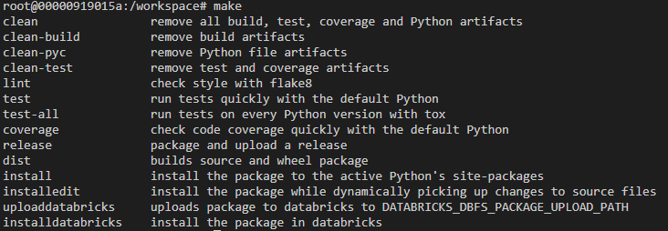
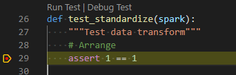

# Python Package - ddo_transfor

## Development setup

### Pre-requisites

- [Docker](https://www.docker.com/)
- [VSCode](https://code.visualstudio.com/)

### Steps to setup Development environment

1. Open VSCode from the **root of the Python project**. That is, the root of your VSCode workspace needs to be at `e2e_samples/parking_sensors/src/ddo_transform`. It should have `.devcontainer` and `.vscode` folders.
2. Create an `.env` file. Optionally, set the following environment variables.
    - If you will be uploading the package to a Databricks workspace as part of the Development cycle, you need to set the following:
      - **DATABRICKS_HOST** - Databricks workspace url (ei. [https://australiaeast.azuredatabricks.net](https://australiaeast.azuredatabricks.net))
      - **DATABRICKS_TOKEN** - PAT token to databricks workspace
      - **DATABRICKS_DBFS_PACKAGE_UPLOAD_PATH** - Path in the DBFS where the python package whl file will be uploaded when calling `make uploaddatabricks`.
      - **DATABRICKS_CLUSTER_ID** - Cluster Id of Databricks cluster where package will be installed when calling `make installdatabricks`
3. In VSCode command pallete (`ctrl+shift+p`), select `Remote-Containers: Reopen in container`. First time building the Devcontainer may take a while.
4. Run `make` to see options.
    

### Debugging unit tests

The Devcontainer should have ms-python extension installed and .vscode all the necessary settings. All you need to do is run `Python: Discover tests`, from the vscode command pallete. Now, all tests (currently located under the `src/ddo_transform/tests` folder) should have `Run test | Debug test` annotation:

### Dependency and artifact versions

When determining versions of base Docker images and dependency packages, make sure to align versions with the ones used in the Databricks runtime version currently used in deployment (at this time [Databricks Runtime 12.2 LTS](https://docs.databricks.com/release-notes/runtime/12.2.html)).

This includes:

- Java 8
- Scala 2.12
- Python 3.9.5
- Delta Lake 2.2.0

However, note that Databricks frequently backports features to its runtime. For example, [`whenNotMatchedBySource` was added in Delta Lake 2.3.0](https://github.com/delta-io/delta/pull/1511), but is [available](https://learn.microsoft.com/en-us/azure/databricks/delta/merge) in Databricks Runtime 12.2 LTS, which is documented to use Delta Lake 2.2.0. Therefore, Delta Lake 2.3.0 must be used for testing.

