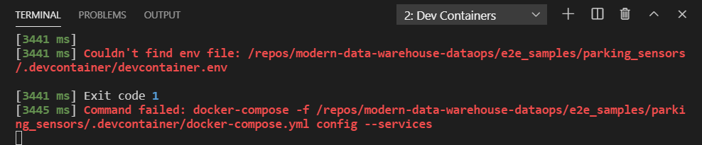

# Starting the dev container for Parking Sensors Demo

1. Clone the repository
2. Open the repository in vscode
3. Copy the `.envtemplate` to `devcontainer.env` within this folder `e2e_samples/parking_sensors_synapse/.devcontainer`
and update the values like described [here](../README.md#software-pre-requisites-if-you-use-dev-container)
4. Open the Command Palette (`Ctrl+Shift+P`) and search for `Remote-Containers: Open Folder in Container...`
5. Select `e2e_samples/parking_sensors_synapse/.devcontainer` and confirm

## Troubleshooting

If you encounter below error `Could not find env file` on build, please check if you completed [Step 3](../README.md#software-pre-requisites-if-you-use-dev-container)

