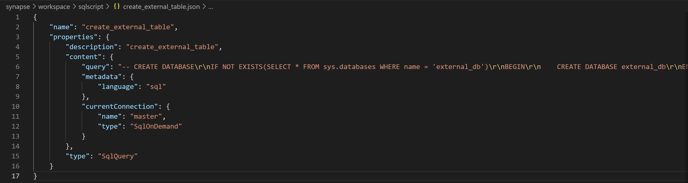
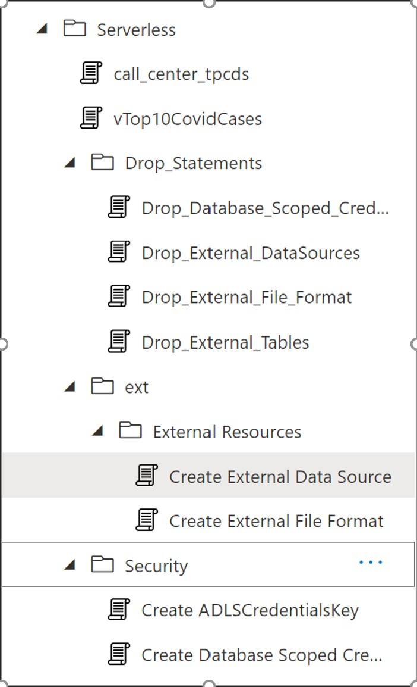

## SQL Server Operationalization and CI/CD
At the moment when I am writing this article Serverless SQL pool currently doesn’t have SSDT support. The best practice currently is to have a git repository with all the definitions of Views/External tables/Data Sources and other objects in SQL scripts inside git. 

Once your SQL scripts code is part of git repo then you can execute these SQL Scripts in a specific order to move your new code changes to your test/productions environment.
The first thing we need to do is to make our code available to a git repo. If we had SSDT support this step would be a lot easier and a lot intuitive but currently as this is not possible we have to figure out this thing a bit differently.  
There are few options to achieve this thing.
First Approach: Code your SQL serverless code as SQL scripts in the azure synapse workspace and saved them in the workspace. Now if you haven’t already configured your workspace to connect Azure DevOps repo or Git Hub repo then you have to do it now. Here this document helps you to do this. Once your workspace is connected to the Azure DevOps repository [in this article I am only considering Azure DevOps repos] then you can commit your code and your SQL scripts will be available as JSON files in the git repo. So we are halfway done only concern is our code is not available as SQL Scripts. 
The next thing we need to do is write a Power Shell script to extract these SQL commands from JSON files and build one SQL script which we can execute through one of the following power shell utilities. 
Executing scripts using PowerShell 
-	Via PowerShell 
 1.	Invoke-Sqlcmd ([Invoke-Sqlcmd (SqlServer) | Microsoft Docs Invoke-Sqlcmd (SqlServer) | Microsoft Docs](https://docs.microsoft.com/en-us/powershell/module/sqlserver/invoke-sqlcmd?view=sqlserver-ps)) 
 2.	Sqlcmd utility ([sqlcmd Utility - SQL Server | Microsoft Docs](https://docs.microsoft.com/en-us/sql/tools/sqlcmd-utility?view=sql-server-ver15)) 

Extracting SQL scripts from JSON is not an issue but we need to make sure the final SQL script is in a specific order so that we can execute without any error. Here again, we are missing the capabilities of DACPAC which does all the dependencies check out of the box.
Example Json file.


Without going into too much complexity here is how I am solving this dependency problem. In the workspace, I have a separate folder for serverless scripts which will help for filtering all the scripts related to serverless SQL. Under this folder, I have one folder for Drop_statements and this is important because you can’t have altered statements for external objects .e.g. External Data Sources, External Tables, etc 



For every creates statement you have to create a drop statement with IF exists to check.
IF  EXISTS (SELECT * FROM sys.objects WHERE object_id = OBJECT_ID(N'[dbo].[call_center_tpcds]') AND type in (N'U'))
DROP EXTERNAL TABLE [dbo].[call_center_tpcds]

- You have to extract the SQL script in the following order and then save it into the target .sql file.
 1.	Drop External Table statements
 2.	Drop External Data Sources 
 3.	Drop Database Scope Credentials
 4.	Drop File Formats

- If you save your scripts in specific folders and hierarchy as shown in the above screenshot you can use the below PowerShell script and generate a .sql file which your azure DevOps pipelines can use for execution.
You can save the below PowerShell script in your git repo with the name parsingSQLJson.ps1. It only expects the root folder relative path as parameter which contains all the JSON files with SQL Script.

```powershell
param
(
    [parameter(Mandatory = $false)] [String] $rootFolder='/home/vsts/work/1/s/workspace/sqlscript',
    [parameter(Mandatory = $false)] [String] $armTemplate
)

$sqlfiles = Get-ChildItem -PATH "$rootFolder/"Drop_External_Tables.json
write-host $($sqlfiles)
foreach ( $filename in $sqlfiles.name)
{   
    
    $jsonfile = Get-Content -PATH "$rootFolder/$filename" | ConvertFrom-Json
    $sqlscript = $($jsonfile.properties.content.query)
    $scriptFolderName = $($jsonfile.properties.folder.name)
    #Serverless/Drop_Statements

    if (Test-Path -Path "$rootFolder/extracted_sql"){

        }else {
            New-Item -ItemType Directory -Force -Path "$rootFolder/extracted_sql"
        }

        $sqlscript >> "$rootFolder/extracted_sql/deploy_sql.sql"
     
    
}

$sqlfiles = Get-ChildItem -PATH "$rootFolder/"Drop_External_DataSources.json
write-host $($sqlfiles)
foreach ( $filename in $sqlfiles.name)
{   
    
    $jsonfile = Get-Content -PATH "$rootFolder/$filename" | ConvertFrom-Json
    $sqlscript = $($jsonfile.properties.content.query)
    $scriptFolderName = $($jsonfile.properties.folder.name)
    #Serverless/Drop_Statements

    if (Test-Path -Path "$rootFolder/extracted_sql"){

        }else {
            New-Item -ItemType Directory -Force -Path "$rootFolder/extracted_sql"
        }

        $sqlscript >> "$rootFolder/extracted_sql/deploy_sql.sql"
     
    
}

$sqlfiles = Get-ChildItem -PATH "$rootFolder/"Drop_Database_Scoped_Credential.json
write-host $($sqlfiles)
foreach ( $filename in $sqlfiles.name)
{   
    
    $jsonfile = Get-Content -PATH "$rootFolder/$filename" | ConvertFrom-Json
    $sqlscript = $($jsonfile.properties.content.query)
    $scriptFolderName = $($jsonfile.properties.folder.name)
    #Serverless/Drop_Statements

    if (Test-Path -Path "$rootFolder/extracted_sql"){

        }else {
            New-Item -ItemType Directory -Force -Path "$rootFolder/extracted_sql"
        }

        $sqlscript >> "$rootFolder/extracted_sql/deploy_sql.sql"
     
}

$sqlfiles = Get-ChildItem -PATH "$rootFolder/"Drop_External_File_Format.json
write-host $($sqlfiles)
foreach ( $filename in $sqlfiles.name)
{   
    
    $jsonfile = Get-Content -PATH "$rootFolder/$filename" | ConvertFrom-Json
    $sqlscript = $($jsonfile.properties.content.query)
    $scriptFolderName = $($jsonfile.properties.folder.name)
    #Serverless/Drop_Statements

    if (Test-Path -Path "$rootFolder/extracted_sql"){

        }else {
            New-Item -ItemType Directory -Force -Path "$rootFolder/extracted_sql"
        }

        $sqlscript >> "$rootFolder/extracted_sql/deploy_sql.sql"
     
}

# Get Security Objects Definiation

$sqlfiles = Get-ChildItem -PATH "$rootFolder/"*.json
foreach ( $filename in $sqlfiles.name)
{   
    
    $jsonfile = Get-Content -PATH "$rootFolder/$filename" | ConvertFrom-Json
    $sqlscript = $($jsonfile.properties.content.query)
    $scriptFolderName = $($jsonfile.properties.folder.name)
    #Serverless/Drop_Statements

    if ($scriptFolderName -eq 'Serverless/Security')
    {
        write-host $($filename)
        $scriptName = $($jsonfile.name)
         
        if (Test-Path -Path "$rootFolder/extracted_sql"){

        }else {
            New-Item -ItemType Directory -Force -Path "$rootFolder/extracted_sql"
        }

        $sqlscript >> "$rootFolder/extracted_sql/deploy_sql.sql"
    } 
    
}

# Get External Sources Definiation

$sqlfiles = Get-ChildItem -PATH "$rootFolder/"*.json
foreach ( $filename in $sqlfiles.name)
{   
    
    $jsonfile = Get-Content -PATH "$rootFolder/$filename" | ConvertFrom-Json
    $sqlscript = $($jsonfile.properties.content.query)
    $scriptFolderName = $($jsonfile.properties.folder.name)
    #Serverless/Drop_Statements

    if ($scriptFolderName -eq 'Serverless/ext/External Resources')
    {
        write-host $($filename)
        $scriptName = $($jsonfile.name)
         
        if (Test-Path -Path "$rootFolder/extracted_sql"){

        }else {
            New-Item -ItemType Directory -Force -Path "$rootFolder/extracted_sql"
        }

        $sqlscript >> "$rootFolder/extracted_sql/deploy_sql.sql"
    } 
    
}

# Get External tables

$sqlfiles = Get-ChildItem -PATH "$rootFolder/"*.json
foreach ( $filename in $sqlfiles.name)
{   
    
    $jsonfile = Get-Content -PATH "$rootFolder/$filename" | ConvertFrom-Json
    $sqlscript = $($jsonfile.properties.content.query)
    $scriptFolderName = $($jsonfile.properties.folder.name)
    #Serverless/Drop_Statements

    if ($scriptFolderName -eq 'Serverless')
    {
        write-host $($filename)
        $scriptName = $($jsonfile.name)
         
        if (Test-Path -Path "$rootFolder/extracted_sql"){

        }else {
            New-Item -ItemType Directory -Force -Path "$rootFolder/extracted_sql"
        }

        $sqlscript >> "$rootFolder/extracted_sql/deploy_sql.sql"
    } 
    
}
```
- This PowerShell script will generate the deploy_sql.sql script under the rootFolder which is passed as a parameter.

# Second Approach:
- Before going to the next step where you can execute deploy_sql.sql script with PowerShell. I want to share the other alternative for extracting the SQL scripts. This time instead of extracting from JSON and saving each creates or alters statement in the workspace you can connect with SQL Serverless database and generate all the create statements by using PowerShell Open Source module dbatools for SQL server. 

- dbatools can’t extract external data sources information so that part you still have to code as described in First Approach. You can store the below code as dbatools_extract_DDL.ps1 and run it to generate the drop statements and also create a statement. For generating the create scripts you can pass the dropscripts parameter as false.

```powershell
param
(
    [parameter(Mandatory = $false)] [String] $synapseSqlName='analytics-synapse-ws',
    [parameter(Mandatory = $false)] [String] $databaseName='stg',
    [parameter(Mandatory = $false)] [String] $User = 'sqladminuser',
    [parameter(Mandatory = $false)] [String] $Password,
    [parameter(Mandatory = $false)] [Bool] $dropscripts=$true,
    [parameter(Mandatory = $false)] [Bool] $deleteDeployment=$false

)

$synapseSqlName = "$synapseSqlName-ondemand"
$PWord = ConvertTo-SecureString -String $Password -AsPlainText -Force
$Credential = New-Object -TypeName System.Management.Automation.PSCredential -ArgumentList $User, $PWord
$login = Get-Credential $Credential
$folderpre = "Create"

$options = New-DbaScriptingOption
$options.ScriptForCreateOrAlter = $true
if ($dropscripts -eq $true){
$options.ScriptDrops = $true
$options.IncludeIfNotExists = $true
$folderpre = "Drop"
}

$script = Get-DbaDbView -SqlInstance "$synapseSqlName.database.windows.net" -Database $databaseName -SqlCredential $login -ExcludeSystemView | Export-DbaScript -ScriptingOptionsObject $options -Passthru | Out-String
$script > $folderpre-DbaDbView.sql

$script = Get-DbaDbTable -SqlInstance "$synapseSqlName.database.windows.net" -Database $databaseName -SqlCredential $login | Export-DbaScript -ScriptingOptionsObject $options -Passthru | Out-String
$script > $folderpre-DbaDbTable.sql

$script = Get-DbaDbStoredProcedure -SqlInstance "$synapseSqlName.database.windows.net" -Database $databaseName -SqlCredential $login -ExcludeSystemSp | Export-DbaScript -Passthru | Out-String
$script > Get-DbaDbStoredProcedure.sql

$script = Get-DbaDbSchema -SqlInstance "$synapseSqlName.database.windows.net" -Database $databaseName -SqlCredential $login | Export-DbaScript -Passthru | Out-String
$script > Get-DbaDbSchema.sql

$script = Get-DbaDbUdf -SqlInstance "$synapseSqlName.database.windows.net" -Database $databaseName -SqlCredential $login -ExcludeSystemUdf | Export-DbaScript -Passthru | Out-String
$script > Get-DbaDbUdf.sql
```

# Azure DevOps Build and Release Pipelines:
Now we have found a way to extract the code and push it into the git repo. If you are following the first approach where you will store most of your code in synapse studio which is connected to git repo then you can use the parsingSQLJson.ps1 PowerShell script in your build pipeline which eventually extracts the deploy_sql.sql and publishes this has artifact which you can use in the release pipeline for deployment. 

```yaml
trigger:
  branches:
    include:
    - main
    - release/*
  paths:
    include:
    - mdw_devops/*

pr: none

variables:
  basePath: 'mdw_devops/'
  System.Debug: True
  buildPlatform: 'Any CPU'
  buildConfiguration: 'Release'

stages:
- stage: 'publish_artifacts'
  displayName: 'Publish Build Artifacts'
  jobs:
  - job: 'publish_static_artifacts'
    displayName: 'Publish Static Artifacts'
    pool:
      vmImage: 'Ubuntu-16.04'
    steps:
    - checkout: self

    - task: PublishBuildArtifacts@1
      inputs:
        PathtoPublish: 'workspace/_scripts/parsingSQLJson.ps1'
        ArtifactName: 'serverless_scripts'
      displayName: 'Publish SQL ServerLess Scripts'
    
    - task: PowerShell@2
      inputs:
        filePath: '$(Agent.BuildDirectory)/s/workspace/_scripts/parsingSQLJson.ps1'
      displayName: 'Parsing SQL Scripts'

    - task: PublishBuildArtifacts@1
      inputs:
        PathtoPublish: 'workspace/sqlscript/extracted_sql/'
        ArtifactName: 'serverless_sql_scripts'
      displayName: 'Publish SQL Scripts'
```

- Build pipeline provides you with artifacts for deployment in the release pipeline. Here I have a sample release pipeline that you can use for deploying your artifacts.

```yaml
 trigger: none

pr: none

resources:
  pipelines:
  - pipeline: ciartifacts
    source: mdw-ci-artifacts
    trigger: 
      branches:
      - main
  repositories:
  - repository: mdwdataops_adfpublish
    type: git
    name: mdw_devops/mdw_devops
    ref: workspace_publish

stages:
- stage: deploy_to_dev
  displayName: 'Deploy to DEV'  # In DEV, excludes publishing to synapseworkspace as this is a manual publish step
  variables:
  - group: synapse-release-dev
  - group: synapse-release-secrets-dev
  jobs:

  - template: templates/jobs/deploy-sql-serverless-job.yml
    parameters:
      environmentName: 'DEV'
      serviceConnection: 'im_ado_service_connection'
```
- The above release pipeline is using the below template for deploying synapse SQL Serverless.
```yaml
parameters:
- name: environmentName
  type: string
- name: serviceConnection
  type: string

jobs:
- deployment: deploy_synapse_sql_serverless
  displayName: 'Deploy to synapse sql serverless'
  pool:
    vmImage: 'windows-latest'
  variables:
    sqlProjName: ddo_azuresqldw_dw
  environment: ${{ parameters.environmentName }}
  strategy:
    runOnce:
      deploy:
        steps:
        - task: PowerShell@2
          displayName: 'Listing SQL Scripts'
          inputs:
            targetType: 'inline'
            script: Write-Host "##vso[task.setvariable variable=sqlfiles]$(Get-ChildItem -PATH '$(Pipeline.Workspace)/ciartifacts/serverless_sql_scripts/*.sql')"
                    Write-Host $sqlfiles
        
        - bash: |
            echo "##vso[task.setvariable variable=sqlfiles2]$(ls '$(Pipeline.Workspace)/ciartifacts/serverless_sql_scripts/' )" 
          displayName: "Set new variable value"

        # https://docs.microsoft.com/en-us/azure/devops/pipelines/tasks/deploy/sql-azure-dacpac-deployment?view=azure-devops

        - task: SqlAzureDacpacDeployment@1
          inputs:
            azureSubscription: ${{ parameters.serviceConnection }}
            AuthenticationType: 'server'
            ServerName: $(sqlsrvrName)-ondemand.database.windows.net
            DatabaseName: $(sqlServerlessDatabaseName)
            SqlUsername: '$(sqlsrvrUsername)'
            SqlPassword: '$(sqlsrvrPassword)'
            deployType: 'sqlTask'
            SqlFile: '$(Pipeline.Workspace)/ciartifacts/serverless_sql_scripts/deploy_sql.sql'
            #sqlAdditionalArguments: '/Variables:ADLSCredentialKey=$(datalakeKey)'
          displayName: 'Azure Synapse SQL Serverless'
```


