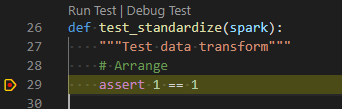

# Python Package - ddo_transfor

## Development setup

### Pre-requisites

- [Docker](https://www.docker.com/)
- [VSCode](https://code.visualstudio.com/)

### Steps to setup Development environment

1. Open VSCode from the **root of the Python project**. That is, the root of your VSCode workspace needs to be at `e2e_samples/parking_sensors/src/ddo_transform`. It should have `.devcontainer` and `.vscode` folders.
2. Create an `.env` file. Optionally, set the following environment variables.
    - If you will be uploading the package to a Databricks workspace as part of the Development cycle, you need to set the following:
      - **DATABRICKS_HOST** - Databricks workspace url (ei. [https://australiaeast.azuredatabricks.net](https://australiaeast.azuredatabricks.net))
      - **DATABRICKS_TOKEN** - PAT token to databricks workspace
      - **DATABRICKS_DBFS_PACKAGE_UPLOAD_PATH** - Path in the DBFS where the python package whl file will be uploaded when calling `make uploaddatabricks`.
      - **DATABRICKS_CLUSTER_ID** - Cluster Id of Databricks cluster where package will be installed when calling `make installdatabricks`
3. In VSCode command pallete (`ctrl+shift+p`), select `Remote-Containers: Reopen in container`. First time building the Devcontainer may take a while.
4. Run `make` to see options.
    

### Debugging unit tests

The Devcontainer should have ms-python extension installed and .vscode all the necessary settings. All you need to do is run `Python: Discover tests`, from the vscode command pallete. Now, all tests (currently located under the `src/ddo_transform/tests` folder) should have `Run test | Debug test` annotation:

