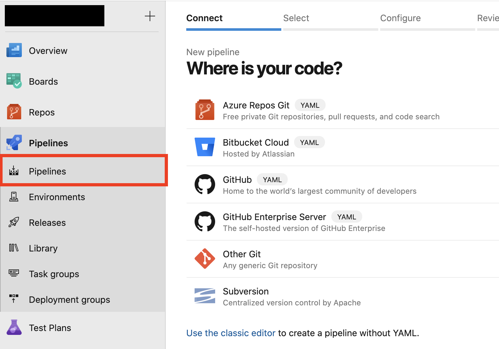
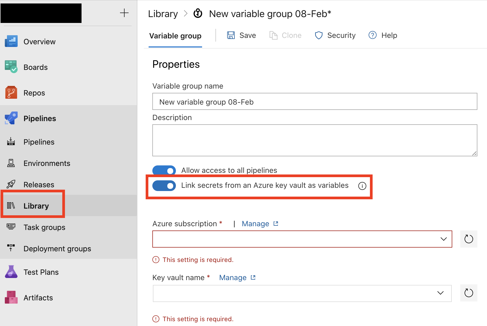

# Load Testing 

## Files:<hr>
- **IoTSimulator.ps1**: This powershell script spins up Azure Container Instances by using the [IoT Simulator](https://github.com/Azure-Samples/Iot-Telemetry-Simulator). It tears down all container instances after sending the load as well.
- **LoadTestCheckResult.ps1**: This powershell script gets the ingress and egress metrics for eventhub, and fails the load testing task if the total egress is smaller that the number of ingress. 
- **azure-pipeline.yml**: This azure pipeline runs the two powershell scripts above. You can adjust the load that you want to pass into the IoTSimulator.ps1 script by changing the variables.

## Setup: <hr>
### <u>Azure Pipelines</u>
Go to Azure DevOps -> Pipelines -> Select where your pipeline yaml and scripts exists. Remember to change the scriptPath configuration in the pipeline yaml to the path relative to your project root.
```
...
scriptPath: e2e_samples/temperature_events/LoadTesting/IoTSimulator.ps1
...
```


### <u>Variables</u>:
In the pipeline yaml, we would like to store some variables as secrets in keyvault. To use those keyvault secrets in azure pipeline, you can either:
- Use a [**Azure Keyvault task**](https://docs.microsoft.com/en-us/azure/devops/pipelines/tasks/deploy/azure-key-vault?view=azure-devops). However, you will need to manually edit the access policy in keyvault to give the service connection of this pipeline the right to access keyvault.
- Use a **Variable Group**. Go to Azure DevOps -> Pipelines -> Library: 
After selecting your service connection and click "Authorize", you do not need to manually edit the access policy in keyvault. In this load test example we chose to use the variable group instead of azure keyvault task, but whichever approach is fine.

Then, you can use the keyvault secrets directly in pipeline by specifying the variable group:
```
variables:
- group: load-testing-secrets
```

In this load test example, we stored the following in keyvault through terraform:

- *TemperatureDevice-name*: name of the eventhub. (Currently, eventhub namespace uses the same name as eventhub in our terraform.)
- *TemperatureDevice-conn*: connection string of the eventhub.
- *subscription-id*: subscription Id of the project.

### <u>Service Connections</u>

You will also need to create a service connection so that your pipeline can access/create resources in your azure subscription. Follow [this documentation](https://docs.microsoft.com/en-us/azure/devops/pipelines/library/service-endpoints?view=azure-devops&tabs=yaml) to set up the service connection.
