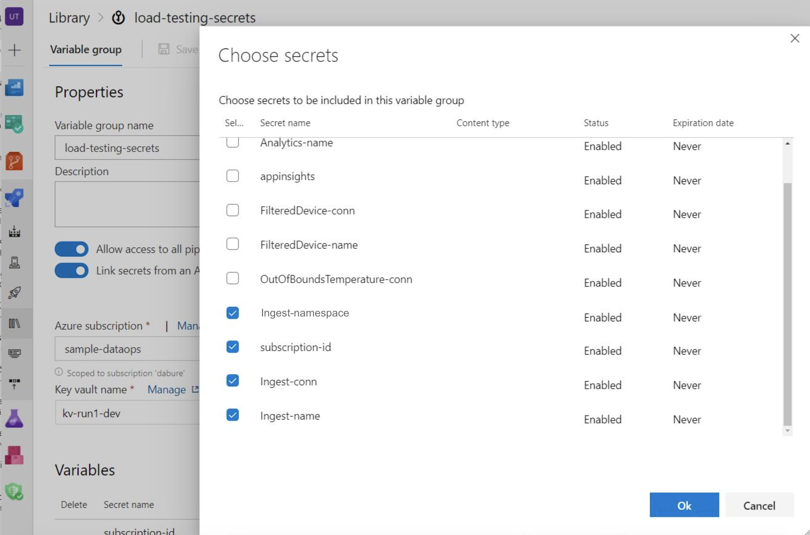

# Load Testing 

## Files:
- **IoTSimulator.ps1**: This powershell script spins up Azure Container Instances by using the [IoT Simulator](https://github.com/Azure-Samples/Iot-Telemetry-Simulator). It tears down all container instances after sending the load as well.
- **LoadTestCheckResult.ps1**: This powershell script gets the ingress and egress metrics for eventhub, and fails the load testing task if the total egress is smaller that the number of ingress. 
- **azure-pipeline.yml**: This azure pipeline runs the two powershell scripts above. You can adjust the load that you want to pass into the IoTSimulator.ps1 script by changing the variables.

## Setup:
### <u>Azure Pipelines</u>
Go to Azure DevOps -> Pipelines -> Select where your pipeline yaml and scripts exists. Remember to change the scriptPath configuration in the pipeline yaml to the path relative to your project root.
```
...
scriptPath: e2e_samples/temperature_events/LoadTesting/IoTSimulator.ps1
...
```


### <u>Variables</u>:
In the pipeline yaml, we would like to store some variables as secrets in keyvault. One of the approaches to access keyvault secrets in azure pipelines is to use a **Variable Group**. Go to Azure DevOps -> Pipelines -> Library: 
Select your Azure subscription, keyvault, and select the following secrets that are created by terraform:

- *Ingest-namespace*: eventhub namespace of the entry eventhub. 
- *Ingest-name*: name of the entry eventhub. 
- *Ingest-conn*: connection string of the entry eventhub.
- *subscription-id*: subscription Id of the project.

 

You are able to use these keyvault secrets directly in the pipeline, as the variable group is defined in the `azure-pipeline.yml` file
```
variables:
- group: load-testing-secrets
```
P.S. Remember to change the resource group and service connection name in the pipeline yaml.
```
- name: ResourceGroup
  value: rg-tempevt-dev
- name: ServiceConnection
  value: sample-dataops
```
### <u>Service Connections</u>

You will also need to create a service connection so that your pipeline can access/create resources in your azure subscription. Follow [this documentation](https://docs.microsoft.com/en-us/azure/devops/pipelines/library/service-endpoints?view=azure-devops&tabs=yaml) to set up the service connection.
