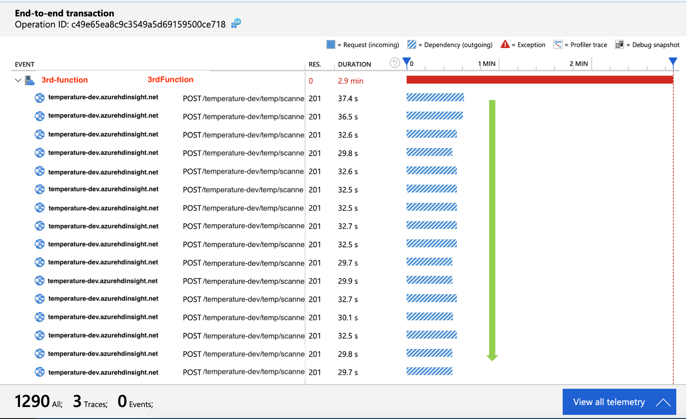

# Observability

## Application Insights
Azure function offers built-in integration with App insights. With App insights, we were able to gain insights to further improve our system by using various features/metrics that are available without extra configuration, such as Application Map and End-to-End Transaction details. We will explain how we used these features in our project to troubleshoot and improve our system in below sections.

### a. Distributed Tracing

**Distributed Tracing** is one of the key reasons that App Insights is able to offer useful features such as application map. In our system, events flow through several Azure Functions that are connected by Eventhubs. Nevertheless, App Insights is able to collect this correlation automatically. The correlation context are carried in the event payload and passed to downstream services. You can easily see this correlation being visualized in either Application Maps or End-to-End Transaction Details:


Here is a blog post that explains in detail how distributed tracing works for Eventhub-triggered Azure Functions: 

[Distributed Tracing Deep Dive for Eventhub Triggered Azure Function in App Insights](https://medium.com/swlh/correlated-logs-deep-dive-for-eventhub-triggered-azure-function-in-app-insights-ac69c7c70285)

### b. Application Map

Application Map shows how the components in a system are interacting with each other. In addition, it shows some useful information such as the average of each transaction duration, number of scaled instances and so on. 
From Application Map, we were able to easily tell that our calls to the database are having some problems which became a bottleneck in our system. By clicking directly on the arrows, you can drill into some metrics and logs for those problematic transactions.


### c. End-to-End Transaction Detail


End-to-End Transaction Detail comes with a visualization of each component's order and duration. You can also check the telemetries(traces, exceptions, etc) of each component from this view, which makes it easy to troubleshoot visually across components within the same transaction when an issue occured.  

As soon as we drilled down into the problematic transactions, we realized that our outgoing calls(for each event) are waiting for one and another to finish before making the next call, which is not very efficient. As an improvement, we changed the logic to make outgoing calls in parallel which resulted in better performance. Thanks to the visualization, we were able to easily troubleshoot and gain insight on how to further improve our system. 




### d. Azure Function Scaling
From Live Metrics, you can see how many instances has Azure Function scaled to in real time. 


However, the number of function instances is not available from any default metrics at this point besides checking the number in real time. If you are interested in checking the number of scaled instances within a past period, you can query the logs in Log Analytics (within App Insights) by using kusto query. For example:
```
traces
| where ......// your logic to filter the logs
| summarize dcount(cloud_RoleInstance) by bin(timestamp, 5m)
| render columnchart
```

