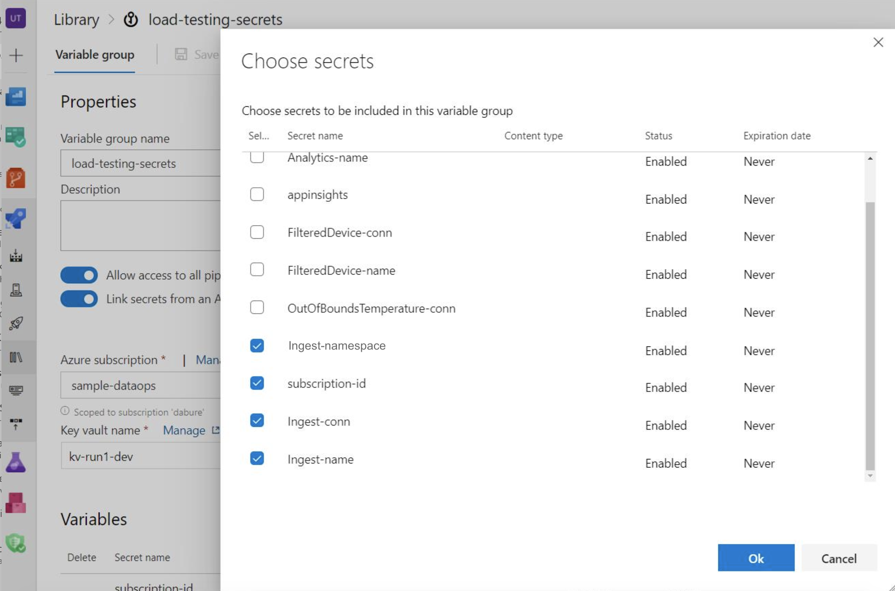

# Load Testing

## Files

- **IoTSimulator.ps1**: This powershell script spins up Azure Container Instances by using the [IoT Simulator](https://github.com/Azure-Samples/Iot-Telemetry-Simulator). It tears down all container instances after sending the load as well.
- **LoadTestCheckResult.ps1**: This powershell script gets the ingress and egress metrics for eventhub, and fails the load testing task if the total egress is smaller that the number of ingress.
- **loadtest-pipeline.yml**: This azure pipeline runs the two powershell scripts above. You can adjust the load that you want to pass into the IoTSimulator.ps1 script by changing the variables.

## Setup

<!-- TODO: Users will need to clone the repo first before than can set this up.-->

### Service Connections

Create a Service Connection named `sample-dataops`. You can another name if desired, if you edit the pipeline in later step.

You will need to create this service connection so that your pipeline can access/create resources in your azure subscription. Follow [this documentation](https://docs.microsoft.com/en-us/azure/devops/pipelines/library/service-endpoints?view=azure-devops&tabs=yaml) to set up the service connection.

### Azure Pipelines

Go to Azure DevOps -> Pipelines -> New pipeline -> Existing Azure pipelines YAML file

Manually enter `e2e_samples/temperature_events/loadtesting/loadtest-pipeline.yml` as the YAML path. If you are only using a part of this repository, remember to change the scriptPath configuration in the pipeline yaml to the path relative to your project root.

```yaml
...
# edit this path, if you didn't use the default
scriptPath: e2e_samples/temperature_events/loadtesting/IoTSimulator.ps1
...
```


### Variable group

In the pipeline yaml, we would like to store some variables as secrets in keyvault. One of the approaches to access keyvault secrets in azure pipelines is to use a **Variable Group**. Go to Azure DevOps -> Pipelines -> Library: 
Select your Azure subscription, keyvault, and select the following secrets that are created by terraform:

- *Ingest-conn*: connection string of the entry eventhub.
- *Ingest-name*: name of the entry eventhub.
- *Ingest-namespace*: eventhub namespace of the entry eventhub.
- *rg-name*: name of the resource group.
- *subscription-id*: subscription Id of the project.

 

You are able to use these keyvault secrets directly in the pipeline, as the variable group is defined in the `loadtest-pipeline.yml` file

```yaml
variables:
- group: load-testing-secrets
```

P.S. Remember to change the service connection name in the pipeline yaml if you created the service connection in a different name.

```yaml
- name: ServiceConnection
  value: sample-dataops
```
