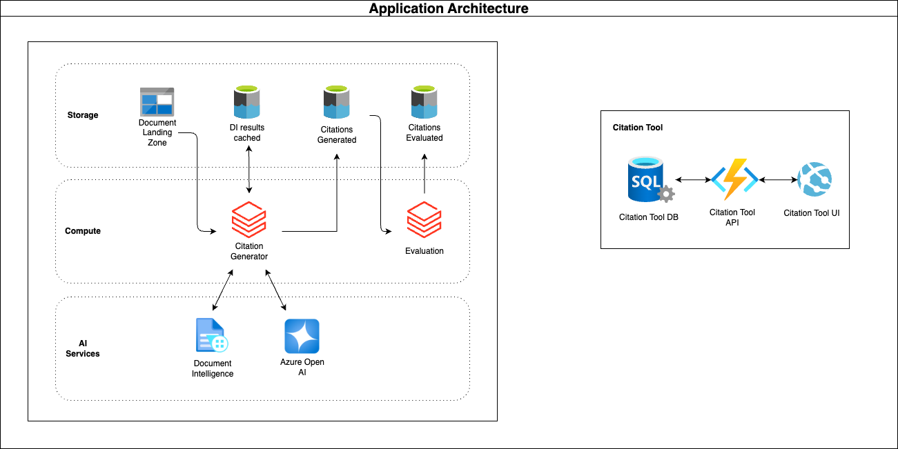

# Unstructured Data Processing  <!-- omit in toc -->

This is a reference implementation of an end to end data pipeline for processing unstructured data. The high level goal of this implementation is to:

- Ingest unstructured data as pdf documents
- Use Azure AI Services to extract and evaluate text data
- Enable human in the look feedback with a the citation tool
- Serve the data for a RAG application

As a reference implementation, this should serve as an experiment to deploy in a sandbox or dev environment to explore capabilities.

## Contents <!-- omit in toc -->

- [Architecture](#architecture)
- [Deploy Script Resources](#deploy-script-resources)
- [How to use the sample](#how-to-use-the-sample)
  - [Applying the Database Schema](#applying-the-database-schema)
- [Cleaning up](#cleaning-up)

## Architecture



## Deploy Script Resources

 The following resources are created within a net new resource group when the deploy script is run:

- Azure Databricks Service
- Azure storage account
- Key vault
- SQL Server
- SQL Database
- Event Grid System Topic (delete this)

A secondary Databricks-managed resource group is likewise created with the following resources:

- Managed Identity
- Storage account
- NAT gateway
- Public IP address
- Access Connector for Azure Databricks
- Network security group
- Virtual network

The following non-resources are also created:

- Entra ID Security Group containing the user

## How to use the sample

```bash
cd e2e_samples/unstructured_data

cp .envtemplate .env

# stop
# fill in .env with your required variables
# then
chmod +x ./deploy.sh

bash deploy.sh
```

### Applying the Database Schema

The above deploy script should add you to a security group used as the admin for the newly created SQL DB.

To apply the database schema, follow these steps:

1. Clone the [excitation tool](https://github.com/billba/excitation/tree/main) repository, and navigate to `reference-azure-backend/functions`.
2. Follow the README steps around locally running the Azure Function, being sure to plug in the newly created `SQL_DATABASE_NAME`, `SQL_SERVER_NAME` (only the portion preceding ".database.windows.net"), `BLOB_STORAGE_ACCOUNT_NAME`, and `BLOB_STORAGE_ACCOUNT_KEY` environment variables to the `local.settings.json` file. Ensure that the `SQL_DATABASE_SYNC` is set to `true`.
3. Run `npm install` and `npm start` from your terminal to locally run the Azure Function.
4. Navigate to your SQL database's Query Editor and confirm creation of all tables listed under the `reference-azure-backend/functions/src/entity` folder.

### Adding input data into Storage Account

There were 2 containers created as part of the infra setup in te storage account: `input-documents` and `di-results`.
Input docuemnts should be places in container `input-documents` and orginized in folders.

## Cleaning up

TODO: Destroy steps
