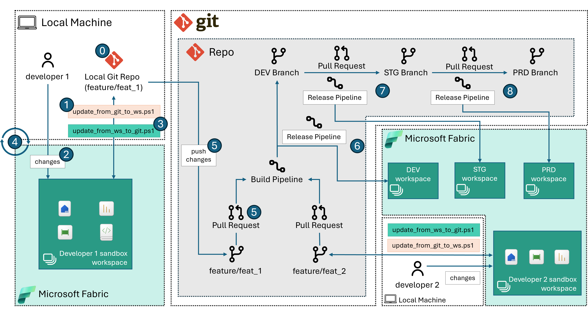

# Comprehensive CI/CD Approach

## How Does It Work?

### Using REST APIs for creating/updating Fabric items

Your chosen Git provider might not be in the [list of supported Git providers](https://learn.microsoft.com/en-us/fabric/cicd/git-integration/intro-to-git-integration?tabs=azure-devops#supported-git-providers) for Microsoft Fabric. If this is the case and you want a comprehensive solution to track your work with source control, this sample presents a way to use [Fabric REST APIs](https://learn.microsoft.com/rest/api/fabric/articles/using-fabric-apis) to integrate with other Git source control mechanisms beyond the supported list. A brief summary of the steps involved are:

1. Creating a Fabric workspace (if not existing already)
2. Creating/updating Fabric items in the workspace to reflect what is on the developer branch.
3. Working as needed in the Fabric workspace.
4. Updating changes from workspace to reflect them back in source control.

> **Note 1**: This sample follows a strategy where each feature branch is paired with a corresponding Fabric workspace, implementing a one-workspace-per-branch approach.
>
> **Note 2**: This example includes a set of Fabric items to demonstrate the functionality of the solution. You are welcome to substitute these with your own items. In doing so, we advise maintaining identifiers such as workspaceIds and LakehouseIds as parameters for Notebooks and Data Pipelines. Failure to do this may result in the script being unable to push your item definitions if they reference item ids that have been removed.

This approach assumes that the developer will operate by following the recommended workflow, as described below in the [Recommended Workflow](#recommended-workflow) section.

### Source control mechanism for Fabric items

This sample maintains a record of changes to Fabric items in source control to prevent the need for constant deletion and recreation of modified items. It does this by tracking the *Object Id*s (the GUIDs of the items in the Fabric workspace, as per the Fabric REST APIs) in an `item-config.json` configuration file.

All Fabric items come with a minimal definition (at the time of writing comprising of Name, Type and Description). Such minimal definition is stored in the `item-metadata.json` file.

Certain types of items in Fabric can have an [item definition](https://learn.microsoft.com/rest/api/fabric/articles/item-management/definitions/item-definition-overview). You can get this definition by using the [`getDefinition`](https://learn.microsoft.com/rest/api/fabric/core/items/get-item-definition) API. The result of this API call is saved in a file called `item-definition.json`.

To make things easier for developers, the definition, which is encoded in base64 in the `item-definition.json` file, is also stored in the repository. For instance, if the item is a Notebook, a notebook in ipynb format is saved in the repository. This is done by decoding the base64 data that the `getDefinition` API returns. This allows the developer to edit the notebook using their favorite IDE. Any changes made are then saved back in Fabric when the corresponding Fabric item is updated using the [`updateDefinition`](https://learn.microsoft.com/rest/api/fabric/core/items/update-item-definition) API.

All the files that compose a specific Fabric item are stored in a corresponding folder (`Item1Folder.ItemType` in the example below).

All these individual item folders are then stored in one main folder, named `fabric` in this sample.

### Understanding repository structure

The below folder structure offers a visual representation of how this code sample will organize source control files in the repository:

```fsys
/ (root of this project)
│
└───...
│
└───fabric
│   └───Item1Folder.ItemType
│   |   │   item-config.json
│   |   │   item-definition.json (optional)
│   |   │   item-metadata.json
│   |   │   (other optional files that may vary by item type)
│   |
│   └───Item2Folder.ItemType
│       │   ...
│
└───...
```

### Understanding The PowerShell Scripts

This sample uses PowerShell scripts to automate the CI/CD process. Below, you’ll find a brief overview of their purpose.

| Script/File | Description |
|--------|-------------|
|[.env](../config/.envtemplate)|Environment variables file - used to store the parameter values required by the scripts. Update the values as needed.|
|[update_from_git_to_ws.ps1](../src/update_from_git_to_ws.ps1)|Script to create a Fabric workspace (if non existing) and sync assets from source control (local git branch) to the workspace.|
|[update_from_ws_to_git.ps1](../src/update_from_ws_to_git.ps1)|Script to update the local repository from the item definitions in the Fabric workspace.|

> Note: to avoid committing secrets to your remote branch, make sure to ignore changes to the local version of your `.env` file.

### Understanding The DevOps Pipelines

The [DevOps Pipelines README](../devops/README.md) provides a comprehensive explanation of the functionality of the DevOps Pipelines showcased in this example.

## Set-up Instructions

### Pre-Requisites

- Powershell version 7+
- Local IDE with `git` command installed.
- A `bash` shell
- A DevOps source control system, like Azure DevOps or GitLab.
- A Fabric tenant with at least one capacity running.
  - If you don't have a Fabric tenant you can create a [Fabric trial](https://learn.microsoft.com/fabric/get-started/fabric-trial) and use a trial capacity instead.

### Setting Up Your GIT Repository

To use this sample it is advisable that you:

1. Create a brand new repository with your source control tool of choice.
2. Clone the entire repository locally to a directory of your choice.
3. Copy everything that is under [this sample's folder](./) to the directory from step 2.
4. Read remaining instructions.

### Deployment Steps

Create Build (CI) and Release (CD) pipelines from the YML definitions provided in this sample. To do so, refer to the information in the [DevOps pipeline readme](../devops/README.md).

### Recommended Workflow

The below picture illustrates these followed by a description of each of the numbered step:



**Step 0. Update environment variables and prepare for local development**:

- Verify that all the prerequisite software is installed and available in your system’s PATH.
- Create a copy of the [`.envtemplate`](../config/.envtemplate) file and rename it to `.env`

   ```bash
   cp ./config/.envtemplate ./config/.env
   ```

- Edit the newly created `.env` file, filling the required parameters (`TENANT_ID`, `ITEMS_FOLDER` and `FABRIC_CAPACITY_ID`)
- Load environment variables

   ```bash
   source config/.env
   ```

- Login to Azure CLI with your user or SPN/MI, use one of the below approaches:

   ```bash
   # User Login
   az login --use-device-code -t $TENANT_ID
   ```

   or

   ```bash
   # SPN Login
   az login --service-principal -u $APP_CLIENT_ID -p $APP_CLIENT_SECRET --tenant $TENANT_ID --allow-no-subscription
   ```

   or

   ```bash
   # MI Login
   az login --identity
   ```

- Refresh the Fabric token:

   ```bash
   ./src/refresh_api_token.sh
   ```

- In a `bash` shell run the following command. Replace `feat/feat_1` with your feature branch name and `dev` with your main development branch name. This commands creates a new feature branch locally from `dev` (or the specified branch). It then instructs git to disregard local modifications to any new or existing `item-config.json` file. The purpose of this is to prevent the `objectId`s in the `dev` branch from being replaced by the `objectId`s from the developer workspace during a commit. For more information see the [Source Control Mechanisms for Fabric Items](#source-control-mechanism-for-fabric-items) section.

    ```bash
    ./new_branch.sh feat/feat_1 dev
    ```

> Note: this approach will also work if no Fabric assets are present on your branch, but you will still need a folder for storing Fabric items definitions later.

**Step 1. Create/Update Fabric workspace and create Fabric items from local branch**:

- Run the [`update_from_git_to_ws.ps1`](../src/update_from_git_to_ws.ps1) script from the local repository folder. This step will create a new workspace and mirror what is on the repo to the workspace.
    > **CAUTION: Workspace items that are not in the local branch will be deleted from Fabric workspace.**

  - When running this for the first time on a new branch, utilize the `-resetConfig` setting it to `$true`. This ignores any existing `item-config.json` files and creates corresponding new objects in the workspace. This step is crucial as it prevents the script from failing due to a search for `objectId`s that are coming from the `dev` branch/workspace, which would not exist in the new Fabric workspace.

    ```bash
    pwsh
    ./src/update_from_git_to_ws.ps1 -workspaceName "<your-workspace-name>" -resetConfig $true
    ```

  - All other times you can omit the flag `-resetConfig` (it will default to `$false`).

    ```pwsh
    ./src/update_from_git_to_ws.ps1 -workspaceName "<your-workspace-name>" 
    ```

**Step 2. Develop in the Fabric workspace**:

- Work as needed in your Fabric workspace (you can find it in Fabric looking for the Workspace `$config.workspaceName`).

**Step 3. Sync the local branch with Fabric workspace**:

- Once you are ready to commit your changes to your branch, run the [`update_from_ws_to_git.ps1`](../src/update_from_ws_to_git.ps1). The script will update your local branch mirroring what is in your Fabric workspace. This creates/updates folders in the `$config.folder` on your local branch. For more information on folder structure see the [Source control mechanism for Fabric items](#source-control-mechanism-for-fabric-items) section.
    > **CAUTION: local branch items that are not in the workspace will be deleted from local branch.**

    ```pwsh
    ../src/update_from_ws_to_git.ps1 -workspaceName "<your-workspace-name>" 
    ```

**Step 4. Repeat until done**:

- Iterate between step 1 to step 3 as needed.
- If your token has expired, use the `refresh_api_token.sh` script to store a new token in the environment file.

**Step 5. Push changes and create a PR**:

- When happy with the changes, create a PR to merge the changes.

   > **CAUTION**: Make sure that when creating the PR no `item-config.json` files are pushed to `dev`. These files are created in each of the workspace item folder as part of Step 3. This file contains the *logical ids and object ids* to identify each of the assets. However, these vary from workspace to another hence these should not be checked in.
   >
   > **Note**: After the PR is merged it is recommended that the developer delete the feature branch. When, in the local development environment, the developer will switch back to the `dev` branch they will be warned that local changes to `.gitignore` and `item-config.json` files will be lost. There is no harm in doing this.

**Step 6. Follow PR approval process to DEV workspace**:

- When the PR is approved, devops Build and Release pipelines are triggered:

    1. the Build pipeline checks that no `item-config.json` files are being pushed to `dev`. For more information on usage of DevOps Pipelines in this sample, review the [DevOps Pipelines README](../devops/README.md).
    2. the release pipeline will mirror what is on `dev` to the development workspace by running `update_from_git_to_ws.ps1`.

**Step 7 and 8. Use Release pipeline to deploy to all environments/stages**:

- The release pipeline for STG and PRD can be identical or a variation to the release pipeline for DEV. For more information on usage of DevOps Pipelines in this sample, review the [DevOps Pipelines README](../devops/README.md).

## Common errors

- `Error response: Response status code does not indicate success: 400 (Bad Request)`
  - Likely one of the Fabric items you are trying to update has a definition containing errors. We advise maintaining identifiers such as workspaceIds and LakehouseIds as **parameters** for Notebooks and Data Pipelines. Failure to do this may result in the script being unable to push your item definitions if they reference item ids that have been removed.
- `Error response: Response status code does not indicate success: 401 (Unauthorized)`
  - Likely your user token has expired. Update it and source your params file and then try again.
  - If using Azure DevOps: if you are getting this error when running devops pipelines after refreshing the token variable, make sure you have toggled the secret variable type.
- `Error response: Response status code does not indicate success: 403 (Forbidden)`
  - Likely one of the Fabric items you are trying to update has a MIP label that prevents you from updating its definition.

- `Error response: Response status code does not indicate success: 404 (Not Found)`
  - Likely the capacity you specified cannot be used. Make sure that your Fabric capacity is available and running, it might have been paused, in this case you can resume it and re-run the script.
- `Error response: A parameter cannot be found that matches parameter name 'ResponseHeadersVariable'`
  - Likely you need to update your Powershell version to 7+.
