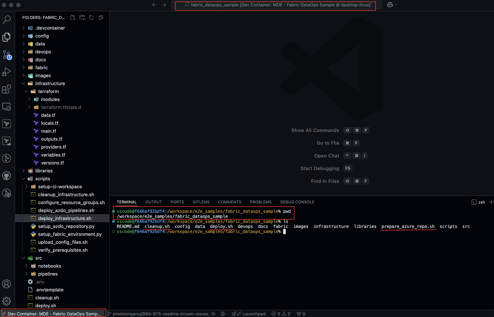

# Microsoft Fabric DataOps Sample <!-- omit in toc -->

Microsoft Fabric is an end-to-end analytics and data platform designed for enterprises that require a unified solution. It encompasses data movement, processing, ingestion, transformation, real-time event routing, and report building. Operating on a Software as a Service (SaaS) model, Fabric brings simplicity and integration to data and analytics solutions.

However, this simplification comes with a cost. The SaaS nature of Fabric makes the DataOps process more complex. Customer needs to learn new ways of deploying, testing, and handling workspace artifacts. The CI/CD process for Fabric workspaces also differs from traditional CI/CD pipelines. For example, using Fabric deployment pipelines for promoting artifacts across environments is a unique feature of Fabric, and doesn't have a direct equivalent in other CI/CD tools.

This sample aims to provide customers with a reference end-to-end (E2E) implementation of DataOps on Microsoft Fabric, covering non-functional aspects such as observability, security, data quality, and testing. It is designed as a reference implementation and should be customized to meet specific customer requirements.

## Contents <!-- omit in toc -->

- [Solution Overview](#solution-overview)
  - [Architecture](#architecture)
  - [Continuous Integration and Continuous Delivery (CI/CD)](#continuous-integration-and-continuous-delivery-cicd)
- [Key concepts](#key-concepts)
  - [DevOps process with Fabric workspaces](#devops-process-with-fabric-workspaces)
  - [Automated testing](#automated-testing)
    - [Unit testing](#unit-testing)
    - [Integration testing](#integration-testing)
  - [Build and release pipelines](#build-and-release-pipelines)
- [Understanding the sample](#understanding-the-sample)
  - [High-level deployment sequence](#high-level-deployment-sequence)
  - [Deployed resources](#deployed-resources)
  - [Pre-requisites](#pre-requisites)
  - [Software pre-requisites](#software-pre-requisites)
    - [If using dev container (Recommended)](#if-using-dev-container-recommended)
    - [If not using dev container](#if-not-using-dev-container)
  - [Familiarize yourself with known issues, limitations, and FAQs](#familiarize-yourself-with-known-issues-limitations-and-faqs)
- [How to use the sample](#how-to-use-the-sample)
  - [Initial infrastructure deployment](#initial-infrastructure-deployment)
    - [Deploying infrastructure using Terraform and Fabric APIs](#deploying-infrastructure-using-terraform-and-fabric-apis)
    - [Verifying the infrastructure deployment](#verifying-the-infrastructure-deployment)
  - [Running the application code](#running-the-application-code)
  - [Triggering the CI/CD pipelines](#triggering-the-cicd-pipelines)
    - [Key observations](#key-observations)
- [Cleaning up](#cleaning-up)
- [References](#references)

## Solution Overview

### Architecture

This sample utilizes a [standard medallion architecture](https://learn.microsoft.com/en-us/fabric/onelake/onelake-medallion-lakehouse-architecture). The following shows at a high-level the overall data pipeline architecture built on Microsoft Fabric, along with associated Azure components.


### Continuous Integration and Continuous Delivery (CI/CD)

Microsoft Fabric has a number of CI/CD workflow options as documented [here](https://learn.microsoft.com/fabric/cicd/manage-deployment). This sample utilizes [Option 1: Git-based deployment](https://learn.microsoft.com/fabric/cicd/manage-deployment#option-1---git--based-deployments).

The diagram below illustrates the complete end-to-end CI/CD process:


Here is a high-level summary of the steps involved:

- Deploy the sample infrastructure which creates three environments (dev, staging, prod) by default with Azure and Fabric resources.
- Create a new feature workspace using the [branch out to a new workspace](https://learn.microsoft.com/fabric/cicd/git-integration/manage-branches?tabs=azure-devops#scenario-2---develop-using-another-workspace) functionality. Develop and test the feature in the feature workspace.
- Open a pull request (PR) to merge the feature branch into the `dev` branch.
- The QA pipeline it triggered automatically when a PR is opened. The pipeline runs Python unit tests and Fabric unit tests to validate the changes.
- Once the PR is approved and merged, the build artifacts pipeline is triggered. This pipeline publishes configuration files and custom libraries as artifacts.
- The release pipeline is triggered once the build artifacts pipeline completes successfully. This pipeline uploads the config changes to the ADLS Gen2 storage account and deploys the Fabric items to the dev environment using Fabric Git sync and REST APIs.
- The same process is followed for the staging and production environments: a new PR is opened to merge changes from the `dev` branch to the `stg` branch, triggering the release pipeline to deploy to staging. This process is then repeated for the production environment.

## Key concepts

### DevOps process with Fabric workspaces

In this sample, the DevOps process occurs across five distinct environments, each corresponding to its own fabric workspace. These workspaces serve different purposes throughout the development and deployment lifecycle. Here are the details of each workspace:

- **Dev Workspace**: The `Dev` workspace serves as the central integration point where developers merge their individual `Feature` Workspaces. This workspace and its associated Git branch should not be modified directly; changes must be made through a pull request (PR) merge followed by a Git sync.

- **Feature Workspace**: The `Feature` workspaces are created from the `Dev` workspace to enable isolated development of new features without impacting the main codebase. Once development and unit testing are complete, the feature is merged back into the `Dev` workspace for integration with other changes.

- **Ephemeral Workspace**: The `Ephemeral` workspace is a temporary Fabric workspace created during the `QA Pipeline` to test changes in isolation before merging into the `Dev` workspace. It allows developers to independently validate their changes and confirm expected behavior before integration. The `Ephemeral` workspace is automatically created when a pull request (PR) is opened and is deleted upon PR completion.

- **Staging Workspace**: The `Staging` workspace replicates the production environment and is used for final integration testing and user acceptance testing (UAT). Once the code is validated in the `Dev` workspace, it is deployed to the `Staging` workspace for further testing before being released to production. A pull request (PR) is opened to merge changes from the `Dev` workspace to the `Staging` workspace.

- **Prod Workspace**: The `Prod` workspace is the live, production environment where only thoroughly tested and approved code is deployed. A pull request (PR) is opened to merge changes from the `Staging` workspace** to the `Prod` Workspace.

### Automated testing

Automated testing is an integral part of the CI/CD process to ensure the correctness of changes across different workspaces.  The process primarily involves two types of testing: [Unit testing](#unit-testing) and [Integration testing](#integration-testing).

#### Unit testing

Unit tests validate individual components or units of functionality within the code. There are two types of unit tests used in this solution:

- **Python unit tests**: These are standalone tests that validate the functionality of Python packages and modules used in the solution. They do not require the Fabric environment to execute and are independent of any workspace.

- **Fabric unit tests**: These tests validate the setup and configuration of the [Fabric environment](https://learn.microsoft.com/fabric/data-engineering/create-and-use-environment). They require a functioning Fabric workspace to execute and ensure that the environment works as expected.

#### Integration testing

Integration tests ensure that different components work together as expected. An example of an integration test would be running a data pipeline and verifying the output to confirm that the integrated solution works as expected.

### Build and release pipelines

Build and release pipelines automate the validation, building, and deployment of changes across different environments (dev, stg, prod etc.). The pipelines are divided into Continuous Integration (CI) and Continuous Deployment (CD) stages. Please check [build and release pipelines](./docs/build_and_release_pipelines.md) for detailed information.

## Understanding the sample

### High-level deployment sequence

At a high level, the deployment sequence proceeds as follows:

- Update the `.env` file with the required environment variables.
- Run the deployment script to create Azure and supported Fabric resources, **using either a service principal or managed identity** for authentication.
- Run the deployment script again, **this time using an Entra ID user** for authentication. This step will create the Lakehouse shortcut to the ADLS Gen2 storage account and deploy Fabric items that cannot be authenticated via service principal or managed identity.

Note that the sample uses multiple security groups and Entra ID types (managed identity, service principal, Entra user etc.). In some cases, there is a choice (using managed identity vs service principal) and in some cases it is required (e.g., certain Fabric REST APIs do not support sp/mi authentication). Please follow the [How to use the sample](#how-to-use-the-sample) section for detailed instructions.

### Deployed resources

While Fabric is an end-to-end platform, it works best when integrated with other Azure services such as Application Insights, Azure Key Vault, ADLS Gen2, Microsoft Purview and so. This dependency is also because customers have existing investments in these services and want to leverage them with Fabric.

The sample deploys both Azure and Fabric resources, primarily utilizing Terraform for resource provisioning. By default, the Terraform state is stored in a local backend; however, the configuration can be easily adjusted to use remote backends if needed.

Microsoft Fabric resources are deployed using the [Microsoft Fabric terraform provider](https://registry.terraform.io/providers/microsoft/fabric/latest/docs) whenever possible, or using [Microsoft Fabric REST APIs](https://learn.microsoft.com/rest/api/fabric/articles/) for resources that are still not supported by the terraform provider.

Here is a list of resources that are deployed:

- Azure Resources
  - Azure Data Lake Storage Gen2 (ADLS Gen2)
  - Azure Key Vault
  - Azure Log Analytics Workspace
  - Azure Application Insights
  - Optional: Microsoft Fabric Capacity (an existing Capacity can be used)
- Fabric Resources
  - Microsoft Fabric Workspace
  - Microsoft Fabric Lakehouse
  - Microsoft Fabric Cloud Connection to ADLS Gen2 Storage
  - ADLS Shortcut
  - Microsoft Fabric Environment
  - Microsoft Fabric Notebooks
  - Microsoft Fabric Data pipelines
- Azure DevOps Resources
  - Variable Group (two per environment with one with KeyVault integration for secrets)
  - Service Connection
  - Azure DevOps Pipelines
- Additional Resources
  - Fabric workspace GIT integration
  - Azure Role assignments to entra security group and workspace identity

Note that the script deploys the aforementioned resources across multiple environments (e.g., dev, staging, production). The environment details are specified as an array variable, `ENVIRONMENT_NAMES`, in the `.env` file.

### Pre-requisites

- An Entra user that can access Microsoft Fabric (Free license is enough).
- An existing Entra [security group](https://learn.microsoft.com/entra/fundamentals/concept-learn-about-groups) (referred to as sg-fabric-admins) for Fabric Workspace admins. This group is added as an admin to the deployed Fabric workspace.
  - Add the above user to this security group (sg-fabric-admins) to enable it to upload configuration files and reference data to ADLS Gen2, as the group is assigned the 'Storage Blob Data Contributor' (and 'Key Vault Secrets Officer') role during the deployment.
- An existing Entra [security group](https://learn.microsoft.com/entra/fundamentals/concept-learn-about-groups) (referred to as sp-deployment-admins) for the deployment admins.
- An Azure subscription with the following:
  - The subscription is [registered](https://learn.microsoft.com/azure/azure-resource-manager/management/resource-providers-and-types#register-resource-provider) for the `Microsoft.Fabric` and `Microsoft.OperationalInsights` resource providers.
  - Multiple resource groups to which your user should be granted [Contributor](https://learn.microsoft.com/azure/role-based-access-control/built-in-roles/privileged#contributor) and [User Access Administrator](https://learn.microsoft.com/azure/role-based-access-control/built-in-roles/privileged#user-access-administrator) privileged roles. These resource groups are used to deploy Azure resources for each environment. So, if you are planning to have three environments (dev, staging, production), you need three resource groups. The names of these resource groups are specified as an array variable, `RESOURCE_GROUP_NAMES`, in the `.env` file. You can use the [configure_resource_groups.sh](./scripts/configure_resource_groups.sh) script to create these resource groups and assign the necessary roles.
- A [managed identity](https://learn.microsoft.com/entra/identity/managed-identities-azure-resources/overview) OR a [service principal](https://learn.microsoft.com/entra/identity-platform/app-objects-and-service-principals)
  - Request that a Fabric administrator grant the above service principal or managed identity permission to [use Fabric APIs](https://learn.microsoft.com/rest/api/fabric/articles/identity-support#service-principals-and-managed-identities-support). To allow an app to use a service principal as an authentication method, the service principal must be added to the deployment admin's security group (sp-deployment-admins). This group is then mentioned in the tenant settings as shown below:

    

  - Grant the service principal or managed identity the `Contributor` and `User Access Administrator` privileged roles on the Azure resource group. For `User Access Administrator` role, you would need to add delegate condition during role assignment. A condition is an additional check to provide more fine-grained access control. Check the [documentation](https://learn.microsoft.com/azure/role-based-access-control/delegate-role-assignments-portal?tabs=template) for more details. During the deployment, the `Storage Blob Data Contributor` and the `Key Vault Secrets Officer` roles are granted to the newly created service principal for [Fabric workspace identity](https://learn.microsoft.com/fabric/security/workspace-identity) and the security group for the Fabric workspace admins (sg-fabric-admins). Here is a valid sample condition for the `User Access Administrator` role assignment:

    

  - The sample reuses the above service principal or managed identity in the Azure DevOps service connection. This service connection performs data plane operations, such as uploading files to ADLS Gen2 and accessing Key Vault secrets. For that, add these principals to the security group for the Fabric workspace admins (sg-fabric-admins).

- Microsoft Graph API permissions:
  - For service principal, grant the Graph API application permission `Group.Read.All` to read the security group properties.

    

  - For managed identity, assign the elevated [Directory Readers](https://learn.microsoft.com/en-us/entra/identity/role-based-access-control/permissions-reference#directory-readers) role to read the security group properties. For this, go to `Azure Active Directory > Roles and administrators > Directory Readers > Add assignment`, and add the the managed identity.

    

- Configure Fabric capacity administrators.
  - If you want to use an **existing** Fabric capacity, ensure that both your user account and the principal (service principal or managed identity) are [added as Capacity Administrators](https://learn.microsoft.com/fabric/admin/capacity-settings?tabs=fabric-capacity#add-and-remove-admins) to that capacity.
  - If you are creating a **new** Fabric capacity, you need to provide a list of users and principals (service principal or managed identity) that will be added as capacity admins in the `FABRIC_CAPACITY_ADMINS` environment variable. For users, mention 'userPrincipalName'. For service principal or managed identity, mention 'Object ID' of the corresponding service principal object (Enterprise application). Don't add spaces after the comma.
- Access to an Azure DevOps organization and project:
  - Contributor permissions to an Azure Repo in such Azure DevOps environment. The service principal or managed identity requires Contributor permissions as well. Refer to the [documentation](https://learn.microsoft.com/azure/devops/organizations/security/add-users-team-project#add-users-or-groups-to-a-project) for more details.

### Software pre-requisites

The sample includes a pre-configured dev container with all the necessary tools and dependencies. Using it is the recommended way to run the deployment scripts, as it helps avoid environment-related issues.

That said, if you prefer not to use the dev container, you can easily set up your local environment. Below are the software pre-requisites for both scenarios:

#### If using dev container (Recommended)

- [Docker](https://www.docker.com/)
- [VSCode](https://code.visualstudio.com/)
- [Visual Studio Code Remote Development Extension](https://marketplace.visualstudio.com/items?itemName=ms-vscode-remote.vscode-remote-extensionpack)

#### If not using dev container

- For Windows users, [Windows Subsystem For Linux](https://docs.microsoft.com/en-us/windows/wsl/install-win10)
- A bash shell with the following installed:
  - [Azure CLI](https://docs.microsoft.com/cli/azure/install-azure-cli?view=azure-cli-latest)
  - [Azure DevOps CLI](https://marketplace.visualstudio.com/items?itemName=ms-vsts.cli) extension
    - To install, run `az extension add --name azure-devops`
  - [jq](https://jqlang.github.io/jq/download/)
  - [Terraform](https://developer.hashicorp.com/terraform/install?product_intent=terraform)
  - [Python version 3.9+](https://www.python.org/downloads/) with `requests` package installed

### Familiarize yourself with known issues, limitations, and FAQs

Refer to the [known issues, limitations, and FAQs](docs/known_issues_limitations_and_faqs.md) page for details. Reviewing this page is highly recommended to understand the limitations, issues, and challenges you may encounter while building CI/CD pipelines for Fabric. It also provides workarounds and alternative approaches to overcome these challenges. This information will also help you understand why certain approaches are used in the infrastructure deployment scripts and Azure DevOps pipelines.

The document also includes a list of frequently asked questions (FAQs) that provide additional context and guidance on various aspects of the sample.

## How to use the sample

### Initial infrastructure deployment

#### Deploying infrastructure using Terraform and Fabric APIs

- Clone the repository:

  ```bash
  cd '<installation_folder>'
  # Repo clone
  git clone https://github.com/Azure-Samples/modern-data-warehouse-dataops.git
  ```

- Change the directory to the sample folder:

  ```bash
  cd ./modern-data-warehouse-dataops/fabric/fabric_dataops_sample
  ```

- Rename the [.envtemplate](./.envtemplate) file to `.env` and fill in the required environment variables. Here is a list of all the variables:

  ```text
  TENANT_ID: The Entra ID (Azure AD Tenant Id) of your Fabric tenant.
  SUBSCRIPTION_ID: The Azure subscription ID that will be used to deploy azure resources.
  ENVIRONMENT_NAMES: Space-separated array of deployment stages, development (dev), staging (stg), production (prod) etc., for your application. Example: ("dev" "stg" "prod")
  RESOURCE_GROUP_NAMES: Space-separated array of 'pre-existing' Azure resource groups corresponding to each environment. Example: ("rg-dev" "rg-stg" "rg-prod")
  BASE_NAME: The base name of the Fabric project. This name is used for naming the Azure and Fabric resources.
  # Service principal authentication: For managed identity or Entra ID user authentication, you can leave the following two variables blank.
  APP_CLIENT_ID: The service principal client ID.
  APP_CLIENT_SECRET: The service principal client secret.
  # Azure DevOps variables (The project, repository, branch, and folder must be created in advance)
  GIT_ORGANIZATION_NAME: The Azure DevOps organization.
  GIT_PROJECT_NAME: The Azure Devops project.
  GIT_REPOSITORY_NAME: Your repository under the Azure DevOps project.
  GIT_BRANCH_NAMES: Space-separated array of the GIT branches corresponding to each environment where Fabric items will be committed to. Example: ("dev" "stg" "prod")
  GIT_USERNAME="The username for committing the changes to Azure repo."
  GIT_PERSONAL_ACCESS_TOKEN="The personal access token of the above user."
  # Workspace admin variables
  FABRIC_WORKSPACE_ADMIN_SG_NAME: The name of the Entra security groups with admin members.
  # Fabric Capacity variables
  EXISTING_FABRIC_CAPACITY_NAME: The name of an existing Fabric capacity. If this is empty, then a new capacity will be created.
  FABRIC_CAPACITY_ADMINS: Comma-separated list. When creating a new Fabric capacity, these users/apps would be added as capacity admin. For users, mention "userPrincipalName". For principals (sp/mi), mention "Object ID". Don't add spaces after the comma. Example "yourusername@yourdomain,sp_mi_object_id"
  ```

  Most of these variables are self-explanatory. Here are a few additional notes:

  - The `BASE_NAME` variable is used as a suffix to name all the Azure and Fabric resources. If skipped, the terraform script will generated a random six character string and use it as the base name. It is recommended to use a random alphanumeric string of up to six characters.
  - The `APP_CLIENT_ID` and `APP_CLIENT_SECRET` variables are required only if you are using service principal authentication. If you are using Managed Identity authentication, you can leave these blank.
  - The `ENVIRONMENT_NAMES` array variable defined the deployment stages/environments. The script will deploy set of resources for each environment specified in this variable. It is highly recommended to use the default values ("dev" "stg" "prod") as-is. Refer to the [known issues, limitations, and FAQs](./docs/known_issues_limitations_and_faqs.md#what-are-the-implications-of-changing-default-values-in-the-env-file) page for more details.
  - The `RESOURCE_GROUP_NAMES` array variable defines the Azure resource groups corresponding to each environment. The script will deploy resources for each environment in the corresponding resource group. For example, you can define three resource groups for the three stages as ("rg-dev" "rg-stg" "rg-prod"). The length of `ENVIRONMENT_NAMES` and `RESOURCE_GROUP_NAMES` array variables must be the same. Note that the deployment script does not create these resource groups (see [here](./docs/known_issues_limitations_and_faqs.md#why-existing-resource-groups-are-required) for details) and you need to create them in advance as outlined in the [pre-requisites](#pre-requisites).
  - The `EXISTING_FABRIC_CAPACITY_NAME` variable is the name of an existing Fabric capacity. If you want to create a new capacity, leave this blank.
  - The `GITHUB_BRANCH_NAMES` array variable defines the Git branches for each environment where the Fabric items will be committed. The workspace in each environment is integrated with the corresponding Git branch. It is highly recommended to use the default values ("dev" "stg" "prod") as-is. The length of the `ENVIRONMENT_NAMES` and `GIT_BRANCH_NAMES` array variables must be the same.
  - The `GIT_USERNAME` and `GIT_PERSONAL_ACCESS_TOKEN` variables are used to setup the initial branch structure where a set of files are copied and committed to Azure repo before running the main deployment. The token should have a minimum of `Code -> Read & write` [scope](https://learn.microsoft.com/azure/devops/integrate/get-started/authentication/oauth?view=azure-devops#scopes). Refer to the [documentation](https://learn.microsoft.com/azure/devops/organizations/accounts/use-personal-access-tokens-to-authenticate) for more details.
  - The `FABRIC_CAPACITY_ADMINS` variable is a comma-separated list of users and service principals that will be added as capacity admins to the newly created Fabric capacity. If you are using an existing capacity, you can leave this blank. But in that case, make sure that your account and the principal (service principal or managed identity) are [added as Capacity Administrators](https://learn.microsoft.com/fabric/admin/capacity-settings?tabs=fabric-capacity#add-and-remove-admins) to that capacity, as mentioned in the [pre-requisites](#pre-requisites). Also, note that the "Object ID" for the service principal or managed identity is that of the enterprise application (service principal object) and not the application as shown below:

    

- [Optional] If you want to use the dev container, open the repository in VSCode. Make sure that docker is running and the remote development extension is installed (check the [pre-requisites](#if-using-dev-container-recommended) for details). Open the Command Palette (`Ctrl+Shift+P` on Windows, `Cmd+Shift+P` on Mac) and search for `Dev Containers: Open Folder in Container...`. Select `fabric/fabric_dataops_sample` folder and confirm. This will build the dev container and open a new VSCode window inside the container. Here is a screenshot of how it looks:

  

- Before running the actual deployment, the branching structure in the Azure repo needs to be created. This is done by running the [prepare_azure_repo.sh](./prepare_azure_repo.sh) bash script. As the script uses PAT token, there is no need to login to Azure CLI. The script relies on the `GIT_USERNAME` and `GIT_PERSONAL_ACCESS_TOKEN` environment variables for permissions, which are sourced from the `.env` file, to be set.

  ```bash
  ./prepare_azure_repo.sh
  ```

  This script iterates through the branches specified in `GITHUB_BRANCH_NAMES` and (re)creates them. The first branch is created based on the default branch of the Azure repo. For this branch, the requires files are copied from the local directory to Azure repository, and the changes are committed. The remaining branches are created based on the commit of the first branch. The following image shows the sample directory structure in the Azure repo after running the script:

  <!-- markdownlint-disable-next-line MD033 -->
  

- For the following step you have 2 authentication options:

  1. **Managed Identity authentication** (Recommended as it does not require dealing with secrets)
      - Create or use an existing Azure VM and assign it a Managed Identity. If you need to create a new VM, see the instructions [here](./docs/known_issues_limitations_and_faqs.md#how-to-use-a-managed-identity-for-authentication).
      - Connect to the VM and open a bash shell
      - Authenticate to Azure using the VM Managed Identity

        ```bash
        az login --identity
        ```

      - Execute following steps from this authenticated shell
  2. **Service Principal + Client Secret authentication** (Consider using [certificate credentials](https://registry.terraform.io/providers/microsoft/fabric/latest/docs/guides/auth_spn_cert) instead of secrets)
      - [Create a secret](https://registry.terraform.io/providers/microsoft/fabric/latest/docs/guides/auth_spn_secret#creating-client-secret) for the service principal. If you are not permitted to create secrets, request the secret from the team responsible for secret management.
      - Update `.env` file with the `APP_CLIENT_ID` and `APP_CLIENT_SECRET` values.
      - Import the environment variables file and authenticate to Azure with Service Principal

        ```bash
        source .env
        az login --service-principal -u $APP_CLIENT_ID -p $APP_CLIENT_SECRET --tenant $TENANT_ID --allow-no-subscription
        ```

      - Execute following steps from this authenticated shell

- Review [deploy.sh](./deploy.sh) script and see if you want to adjust the derived naming of variable names of Azure/Fabric resources. The Azure and Fabric resources are created using Terraform. The naming of the Azure resources is derived from the `BASE_NAME` environment variable. Please review the [main.tf](./infrastructure/terraform/main.tf) file to understand the naming convention, and adjust it as needed.

- Run the [deploy.sh](./deploy.sh) script from the authenticated shell in the previous step to deploy the Azure and Fabric resources:

  ```bash
  ./deploy.sh
  ```

  The script is designed to be idempotent. Running the script multiple times will not result in duplicate resources. Instead, it will either skip or update existing resources. However, it is recommended to review the script, the output logs, and the created resources to ensure everything is as expected.

  Also, note that the bash script calls a python script [setup_fabric_environment.py](./scripts/setup_fabric_environment.py) to upload custom libraries to the Fabric environment.

- From this step onward, you will need to authenticate using your user context. Authenticate **with user context** (required for the second run) and run the setup script again:

  ```bash
  source .env
  az config set core.login_experience_v2=off
  az login --tenant $TENANT_ID
  az config set core.login_experience_v2=on
  ./deploy.sh
  ```

  This time, the script will create the Lakehouse shortcut to your ADLS Gen2 storage account. All previously deployed resources will remain unchanged. Fabric items whose REST APIs and terraform provider don't support service principal / managed identity authentication (i.e. data pipelines and others) will be deployed with user context authentication.

#### Verifying the infrastructure deployment

Once the deployment is complete, you can verify the resources created in the Azure portal and the Fabric portal. Below is a list of the created resources along with their default names:

| Resource type | Default name | Deployed via |
| --- | --- | --- |
| Azure - Storage Account (ADLS Gen2) | 'st`BASE_NAME`' | Terraform |
| Azure - Key Vault | 'kv-`BASE_NAME`' | Terraform |
| Azure - Log Analytics workspace | 'la-`BASE_NAME`' | Terraform |
| Azure - Application Insights | 'appi-`BASE_NAME`' | Terraform |
| Azure - Fabric Capacity | 'cap`BASE_NAME`' | Terraform |
| Azure DevOps - Variable Group | 'vg-`BASE_NAME`-`ENVIRONMENT_NAME`' | Terraform |
| Microsoft Fabric - Workspace | 'ws-`BASE_NAME`' | Terraform |
| Microsoft Fabric - Lakehouse | 'lh_`BASE_NAME`' | Terraform |
| Microsoft Fabric - Cloud Connection | 'conn-adls-st`BASE_NAME`' | Fabric REST API |
| Microsoft Fabric - ADLS Shortcut | 'sc-adls-main' | Fabric REST API |
| Microsoft Fabric - Environment | 'env-`BASE_NAME`' | Terraform |
| Microsoft Fabric - Setup Notebook | 'nb-setup' | Terraform |
| Microsoft Fabric - Standardize Notebook | 'nb-standardize' | Terraform |
| Microsoft Fabric - Transform Notebook | 'nb-transform' | Terraform |
| Microsoft Fabric - Main Pipeline | 'pl-main' | Terraform |

Below is a screenshot of the Azure resources that are created:


Below is a screenshot of the Fabric resources that are created:


Note that all Fabric items, except for the Fabric pipeline, are owned by the service principal ('app-fabric-sp' in this case) used for the deployment. The Fabric pipeline is owned by the user who authenticated in the user context.

When you open the lakehouse, you will see the shortcut to the ADLS Gen2 storage account, as shown below:


Additionally, note that the Fabric workspace Git integration has been configured. You can review the Azure DevOps repository to locate the branch and folder where the Fabric items have been committed, as shown below:


_**Note: Please note that the Fabric notebooks and pipeline deployed are under development and subjected to future changes._

### Running the application code

This sample deploys the following three Fabric notebooks:

1. [nb-setup](./src/notebooks/00_setup.ipynb): Creates the required database schemas and tables for the parking sensors application and ingests data in `Bronze` layer.
2. [nb-standardize](./src/notebooks/02_standardize.ipynb): Cleans and validates the raw parking sensors data and stores it in `Silver` layer.
3. [nb-transform](./src/notebooks/03_transform.ipynb): Transforms the data in silver layer into dimensions and facts and stores it in `Gold` layer.

The execution of these notebooks is orchestrated via a Fabric data pipeline [pl-main](./src/pipelines/00-main.json).

Here are the instructions to run the application:

1. The sample deploys multiple Fabric workspaces corresponding to each environment. Login to [Microsoft Fabric](https://app.fabric.microsoft.com/) and select the workspace corresponding to your development environment.

2. Enable [high concurrency mode](https://learn.microsoft.com/fabric/data-engineering/configure-high-concurrency-session-notebooks-in-pipelines#configure-high-concurrency-mode) for Fabric pipelines in the spark settings of the workspace.

3. Open the Fabric data pipeline `pl-main` and run it. The pipeline is pre-populated with values for required parameters related to workspace and lakehouse. Successful execution of pipeline will look as shown below:


### Triggering the CI/CD pipelines

Once you have successfully run the Fabric data pipeline, the next step is to create a new workspace, make some changes, and create a pull request to merge the changes into the dev branch. Follow these steps to proceed:

- Open the Fabric workspace corresponding to the dev environment.
- Use the [Branch out to new workspace](https://learn.microsoft.com/fabric/cicd/git-integration/manage-branches?tabs=azure-devops#scenario-2---develop-using-another-workspace) functionality to create a new feature workspace. This branch-out operation creates a new feature branch from the dev branch, sets up a new Fabric workspace, integrates it with the feature branch, and syncs the Fabric items. Here is a GIF showing the process:

  

- Once the sync is complete, make a simple change in the setup notebook `nb-setup` (or anywhere else) and selectively commit the change to the feature branch.

  

- Once the changes are committed, create a pull request to merge the changes from the feature branch to the dev branch in Azure DevOps. This will trigger the [QA pipeline](./devops/templates/pipelines/azure-pipelines-ci-qa.yml) to validate the changes in an ephemeral workspace. You won't be able to complete the PR until the QA pipeline completes successfully.

  

- During the QA pipeline run, you need to do an interactive login to Azure CLI to authenticate with your user context. Open the page `https://microsoft.com/devicelogin` and enter the code displayed in the pipeline.

  

- Once the QA pipeline completes successfully, you can merge the changes into the dev branch. Afterwards, you can run the [pl-ci-qa-cleanup](./devops/templates/pipelines/azure-pipelines-ci-qa-cleanup.yml) pipeline to delete the ephemeral workspace. You need to pass the `PR_ID` as the pipeline variable. Note that this is an adhoc pipeline and is not triggered automatically. This pipeline also requires interactive login to Azure CLI as shown above.

  

- There is another pipeline, [pl-ci-publish-artifacts](./devops/templates/pipelines/azure-pipelines-ci-artifacts.yml), that is triggered when a PR merges changes to the following files for different environments (dev, stg, prod etc.):
  - Configuration data in `/config` folder.
  - Reference data in `/data` folder.
  - Custom libraries in `/libraries` folder.
  - Fabric Environment configuration in `/fabric/fabric_environment` folder.
  - Unit tests in `/fabric/tests` folder.

  This pipeline publishes artifacts for respective environments. You can see the artifacts published in the pipeline run as shown below:

  

#### Key observations

If you have followed the steps above carefully, you will observe the following:

- The lakehouse created in the feature workspace is empty.
- The Fabric environment in the feature workspace is shown as uncommitted.
- The notebooks in the feature workspace has the dev lakehouse attached as the default lakehouse.
- The workspace settings for the feature workspace are different from those in the dev workspace.
- The Fabric workspace UI does not provide an option to visually compare the changes. It only shows that the items are 'Modified' but there is no way to see the actual changes.
- ...

Please refer to [known issues, limitations, and FAQs](./docs/known_issues_limitations_and_faqs.md) for a detailed understanding of these observations and how to address them.

## Cleaning up

Once you have finished with the sample, you can delete the deployed resources by running the [cleanup script](./cleanup.sh). You will need to authenticate **with user context** as shown below:

  ```bash
  source .env
  az config set core.login_experience_v2=off
  az login --tenant $TENANT_ID
  az config set core.login_experience_v2=on
  ./cleanup.sh
  ```

The cleanup script performs the following actions:

- The Azure, Microsoft Fabric and Azure DevOps resources, deployed via Terraform, are removed.
- The Fabric connection to ADLS Gen2 storage is deleted.
- The Azure Key Vaults are purged.
- The intermediate Terraform files created during deployment process including state files are removed.
- The Azure Devops pipelines are deleted.
- The Azure Devops pipelines definition files created (with substituted values) in the `/devops` folder are removed.

Note that the script does not remove Azure repo branches or their contents. You can manually delete them from the Azure DevOps portal if needed. Note that the branches will be recreated when you run the [prepare_azure_repo.sh](./prepare_azure_repo.sh) script again.

## References

- [Single-tech Sample - Fabric DataOps](./../../fabric/fabric_ci_cd/README.md)
- [Single-tech Sample - Multi-git Fabric DataOps](./../../fabric/fabric_cicd_gitlab/README.md)
- [E2E Sample - MDW Parking Sensors](./../../databricks/parking_sensors/README.md)
