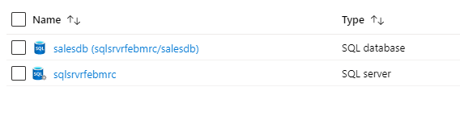
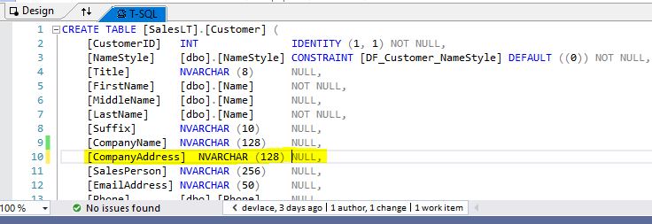
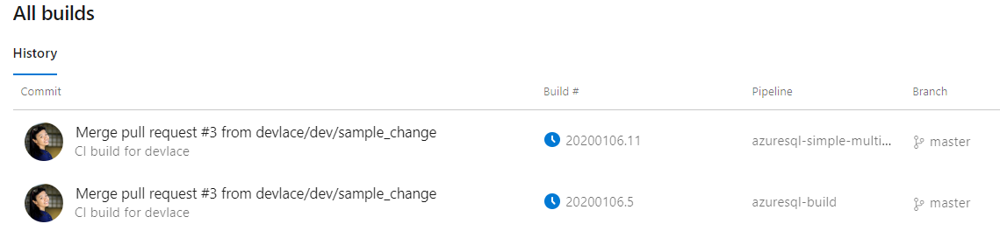

# Azure SQL Database

[Azure SQL Database](https://azure.microsoft.com/en-au/services/sql-database/) is a relational database commonly used in the MDW architecture, typically in the serving layer. The following samples demonstrates how you might build CI/CD pipelines to deploy changes to
Azure SQL Database.

## Contents

1. [Key Concepts](./README.md#key-concepts)
   1. [Build and Release](./README.md#build-and-release)
      1. [Azure DevOps Pipelines](./README.md#azure-devops-pipelines)
         1. [Validate Pull Request](./README.md#azure-devops-pipelines)
         2. [Build Pipeline](./README.md#azure-devops-pipelines)
         3. [Simple Multi-stage Pipeline](./README.md#azure-devops-pipelines)
         4. [Multi-stage Pipeline with pre-deployment test](./README.md#azure-devops-pipelines)
      2. [Github Actions Pipelines (coming soon)](./README.md#github-actions-pipelines)
   2. [Testing](./README.md#testing)
   3. [Observability and Monitoring](./README.md#observability-and-monitoring)
2. [How to use the samples](./README.md#how-to-use-the-samples)
   1. [Prerequisites](./README.md#prerequisites)
   2. [Setup and Deployment](./README.md#setup-and-deployment)
   3. [Deployed resources](./README.md#deployed-resources)
   4. [Running the samples](./README.md#running-the-samples)
      1. [Releasing a change through the simple multi-stage pipeline](./README.md#releasing-a-change-through-the-simple-multi-stage-pipeline)
   5. [Cleanup](./README.md#cleanup)

---------------------

## Key concepts

### Build and Release (CI/CD)

#### Azure DevOps Pipelines

The following are some sample [Azure DevOps](https://docs.microsoft.com/en-us/azure/devops/?view=azure-devops) pipelines. To deploy these samples, see [How to use the samples](./README.md#how-to-use-the-samples).

1. **Validate Pull Request** [[azure-pipelines-01-validate-pr](pipelines/azure-pipelines-01-validate-pr.yml)]
   - This pipeline builds the [DACPAC](https://docs.microsoft.com/en-us/sql/relational-databases/data-tier-applications/data-tier-applications?view=sql-server-ver15) and runs tests (if any). This is triggered only on PRs and is used to validate them before merging into `main`. This pipeline does not produce any artifacts.

2. **Build Pipeline** [[azure-pipelines-02-build](pipelines/azure-pipelines-02-build.yml)]
   - This pipeline builds the DACPAC and publishes it as a [Build Artifact](https://docs.microsoft.com/en-us/azure/devops/pipelines/artifacts/build-artifacts?view=azure-devops&tabs=yaml). Its purpose is to produce the Build Artifact that may be consumed by a[Release Pipeline (classic)](https://docs.microsoft.com/en-us/azure/devops/pipelines/release/?view=azure-devops).

3. **Simple Multi-Stage Pipeline** [[azure-pipelines-03-simple-multi-stage](pipelines/azure-pipelines-03-simple-multi-stage.yml)]
   - This pipeline demonstrates a simple [multi-stage pipeline](https://docs.microsoft.com/en-us/azure/devops/pipelines/get-started/multi-stage-pipelines-experience?view=azure-devops).
   - It has two stages:
        1. Build - builds the DACPAC and creates a [Pipeline Artifact](https://docs.microsoft.com/en-us/azure/devops/pipelines/artifacts/pipeline-artifacts?view=azure-devops&tabs=yaml).
        2. Deploy - deploys the DACPAC to a target AzureSQL instance.
   - Required Pipeline Variables:
     - **AZURESQL_SERVER_NAME** - Name of the AzureSQL server (ei. myserver.database.windows.net)
     - **AZURESQL_DB_NAME** - Name of the AzureSQL Database
     - **AZURESQL_SERVER_USERNAME** - Username of AzureSQL login
     - **AZURESQL_SERVER_PASSWORD** - Password of AzureSQL login

4. **Multi-Stage Pipeline with pre-deployment test** [[azure-pipelines-04-multi-stage-predeploy-test](pipelines/azure-pipelines-04-multi-stage-predeploy-test.yml)]
   - This pipeline expands on the simple multi-stage pipeline by introducing a middle pipeline stage which deploys the DACPAC first to a freshly restored copy of the production database prior to deployment to production. It has the ff. stages:
     1. Build
     2. Deploy to Test
        1. Restore Prod Db to Test Db.
        2. Deploy DACPAC to Test Db.
        3. Teardown Test Db.
     3. Deploy to Prod
   - This mimics, to a certain extent, a production release, as it is applying the expected changes to a copy of the production database. It also allows for potentially running additional tests run in this environment, along with capturing common schema change errors such as adding a non-nullable column without a default value.
   - Important considerations:
     - Depending on the size and pricing tier of your Production AzureSQL database, a restore might take several minutes to several hours. Consider batching changes and running this pipeline on a schedule (such as nightly) instead on every commit to `main`.
     - For simplicity purposes, the Test database is deployed in the same logical server as Production, however, in reality these should be completely separate servers.

### Testing

- [Create a Test Project for SQL Server Database Unit Testing](https://docs.microsoft.com/en-us/sql/ssdt/how-to-create-a-test-project-for-sql-server-database-unit-testing?view=sql-server-ver15)

### Observability / Monitoring

- [AzureSQL Database monitoring and tuning](https://docs.microsoft.com/en-us/azure/sql-database/sql-database-monitoring-tuning-index)

## How to use the samples

### Prerequisites

1. [Github account](https://github.com/)
2. [Azure Account](https://azure.microsoft.com/en-au/free/search/?&ef_id=Cj0KCQiAr8bwBRD4ARIsAHa4YyLdFKh7JC0jhbxhwPeNa8tmnhXciOHcYsgPfNB7DEFFGpNLTjdTPbwaAh8bEALw_wcB:G:s&OCID=AID2000051_SEM_O2ShDlJP&MarinID=O2ShDlJP_332092752199_azure%20account_e_c__63148277493_aud-390212648371:kwd-295861291340&lnkd=Google_Azure_Brand&dclid=CKjVuKOP7uYCFVapaAoddSkKcA)
   - *Permissions needed*: ability to create and deploy to an azure [resource group](https://docs.microsoft.com/en-us/azure/azure-resource-manager/management/overview), a [service principal](https://docs.microsoft.com/en-us/azure/active-directory/develop/app-objects-and-service-principals), and grant the [collaborator role](https://docs.microsoft.com/en-us/azure/role-based-access-control/overview) to the service principal over the resource group.
3. [Azure DevOps Account](https://azure.microsoft.com/en-us/services/devops/)
   - *Permissions needed*: ability to create [service connections](https://docs.microsoft.com/en-us/azure/devops/pipelines/library/service-endpoints?view=azure-devops&tabs=yaml) and [pipelines](https://docs.microsoft.com/en-us/azure/devops/pipelines/get-started/pipelines-get-started?view=azure-devops&tabs=yaml).

#### Software Prerequisites

1. For Windows users, [Windows Subsystem for Linux](https://docs.microsoft.com/en-us/windows/wsl/install-win10)
2. [Azure CLI 2.0.49+](https://docs.microsoft.com/en-us/cli/azure/install-azure-cli?view=azure-cli-latest)
3. [Azure DevOps CLI](https://marketplace.visualstudio.com/items?itemName=ms-vsts.cli)
4. [jq](https://stedolan.github.io/jq/)
5. For editing AzureSQL objects, [Visual Studio 2019](https://visualstudio.microsoft.com/vs/). For earlier version of Visual Studio, you may need to install [SQL Server Data Tools](https://docs.microsoft.com/en-us/sql/ssdt/download-sql-server-data-tools-ssdt?view=sql-server-ver15) separately.

### Setup and deployment

To setup the samples, run the following:

1. Ensure that:
   - You are logged in to the Azure CLI. To login, run `az login`.
   - Azure CLI is targeting the Azure Subscription you want to deploy the resources to.
      - To set target Azure Subscription, run `az account set -s <AZURE_SUBSCRIPTION_ID>`
   - Azure CLI is targeting the Azure DevOps organization and project you want to deploy the pipelines to.
      - To set target Azure DevOps project, run `az devops configure --defaults organization=https://dev.azure.com/MY_ORG/ project=MY_PROJECT`
2. Fork* and clone this repository. `cd` in to `single_tech_samples/azuresql`.
3. Set the following environment variables:
   1. **GITHUB_REPO_URL** - URL of your forked github repo
   2. **GITHUB_PAT_TOKEN** - a Github PAT token. Generate them [here](https://github.com/settings/tokens). This requires "repo" scope.
   Optionally, set the following environment variables
       1. **DEPLOYMENT_ID** - string appended to all resource names. *Default*: random five character string.
       2. **BRANCH_NAME**** - git branch with Azure DevOps pipelines definitions to deploy. *Default*: main.
       3. **RESOURCE_GROUP_NAME** - target resource group to deploy to
       4. **RESOURCE_GROUP_LOCATION** - location of target resource group
       5. **AZURESQL_SERVER_PASSWORD** - Password of the admin account for your AzureSQL server instance. Default: mdw-dataops-SqlP@ss-${DEPLOYMENT_ID}
          1. Username is set to *sqlAdmin*.
4. Run `./deploy.sh`.***

#### Additional notes

**Your forked repo will serve as the main repository which triggers all pipelines -- allowing you complete control over the sample solution as compared to using the main Azure-Samples repository directly. All pipeline definitions are also pulled from this fork*.

***The pipelines are deployed to use the `main` branch by default. This can be inconvenient when working on the pipelines in a different branch. You can set the BRANCH_NAME environment variable to override this behaviour. This makes it easier to test changes to your pipeline file. Be sure to push the changes in your yaml file to your repo before running the deployment script. Note that it does not change branch triggers.*

****Note that in case of any errors midway through the script, in order to rerun the deployment, you may need to perform some cleanup of any deployed resources. See [Cleanup](./README.md#Cleanup
) below.*

### Deployed resources

Once you've setup the sample, you should have the following deployed:

1. Azure resource group with a AzureSQL server and database called `salesdb`.
   

2. A service principal with collaborator rights over the deployed resource group.

3. Two Azure DevOps service connections found under `Project Settings > Service Connections`:
   1. **mdw-dataops-azure** - An AzureRM service connection configured with the Service Principal. This is used to deploy to the AzureSQL database.
   2. **github-mdw-dataops** - A Github service connection used to pull from the forked repository. It uses the Github PAT token to authenticate.

     

4. Three Azure DevOps pipelines found under `Pipelines > Builds`. See [Key concepts/Azure DevOps Pipelines](./README.md#Azure-DevOps-Pipelines) below for explanation of each:
   1. azuresql-validate-pr
   2. azuresql-build
   3. azuresql-simple-multi-stage

     .
     Each of the pipelines should have run (or is currently running) at least once.

### Running the samples

#### Releasing a change through the simple multi-stage pipeline

The following shows how to deploy changes to the AzureSQL database using the CI/CD pipelines.

1. In local clone of your forked repo, create a local branch of `main` and call it `dev/sample_change`. Checkout this branch.

     

2. Open the Visual Studio solution `src/ddo_samples_azuresql.sln`.

3. Add a new CompanyAddress column to the `SaleLT.Customer` table, as seen below.

     

4. Commit and push the change to the remote branch in Github.

     

5. Raise a Pull Request to merge `dev/sample_change` to `main`. This should trigger the the `azuresql-validate-pr` pipeline.

     

6. Typically, a code review would take place. After this, merge changes to `main` by completing the Pull Request. This should trigger the `azuresql-build` and `azuresql-simple-multi-stage`.

     

7. In Azure DevOps, navigate to the `azuresql-simple-muli-stage` pipeline run. The second stage of this pipeline will deploy the changes to the AzureSQL Database.

     

8. Connect to the AzureSQL Database. Notice that the new column has been deployed.

     

Congratulations! You've deployed changes via CI/CD process.

### Cleanup

1. [Delete the Azure resource group](https://docs.microsoft.com/en-us/azure/azure-resource-manager/management/manage-resources-portal#delete-resources).
2. Delete Azure DevOps Pipelines.
   1. To delete via Web Portal, navigate to `Pipelines > Builds`. Delete the pipeline, click on the triple dots, and select delete.
   2. To delete via CLI, run `az pipelines list` to list ids. Then `az pipelines delete --id PIPELINE_ID`.
3. Delete Azure DevOps service connections.
   1. To delete via Web Portal, navigate to `Project Settings > Service Connections`. Select the connection, click on the triple dots, and select delete.
   2. To delete via CLI, run `az devops service-endpoint list` to list ids. Then `az devops service-endpoint delete --id SERVICE_ENDPOINT_ID`.
