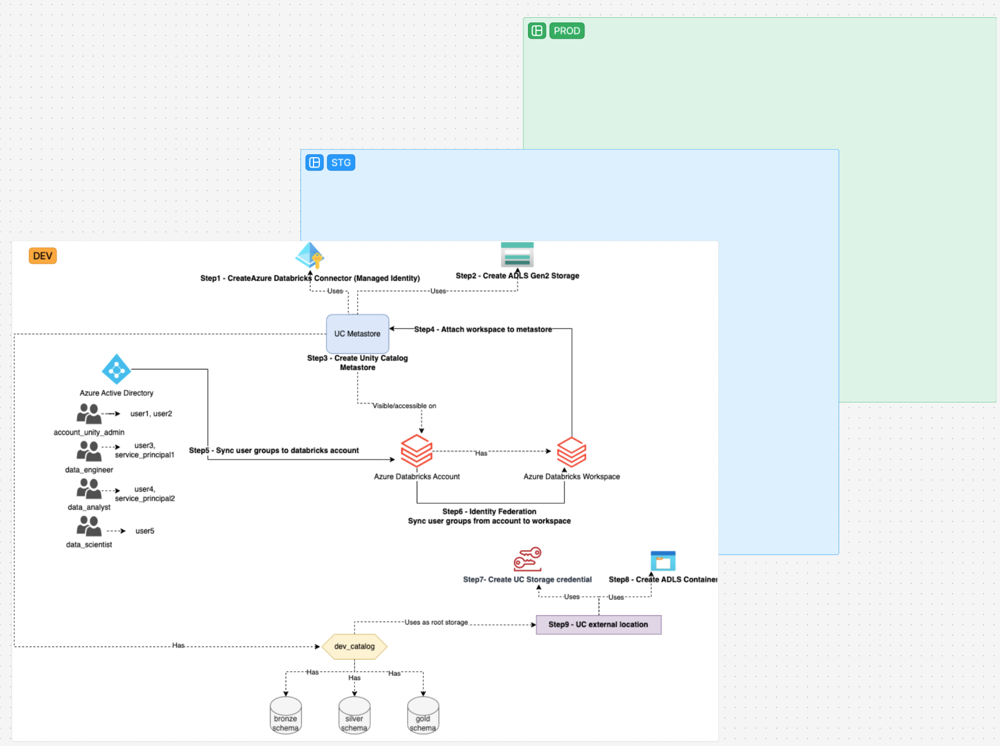

# Terraform Code for Multi Environment Databricks Medallion Deployment



## Overview

**`Infra/modules`** folder has three modules:
- **`adb-workspace`** - Deploys Databricks workspace
- **`metastore-and-users`** - Creates Databricks Connector, Creates Storage Account, Give storage access rights to connector, Creates Metastore / Assigns Workspace to Metastore, and Finally Retrieves alls users, groups, and service principals from Azure AD.
- **`adb-unity-catalog`** - Gives databricks access rights to the connector, Creates containers in the storage account, and creates external locations for the containers. Creates unity catalog and grants permissions user groups. Finally, creates **`bronze` `silver` `gold`** schemas under the catalog and gives the required permissions to the user groups.

**NOTE** - *When **`adb-workspace`** module runs it creates databricks workspace, and by default it creates a metastore in the same region. Databricks allows only **ONE METASTORE** per region. **`metastore-and-users`** module deploys new metastore with our required configurations, but we have to delete existing metastore prior running the module*

## Entry Point

**`Infra/envs`** - Has three environments with required values to each environment. In this example we are defining **`development`** environment only.

**`Infra/envs/development/main.tf`** - references the three modules and passes the required values from `variables.tf` to the modules.

## How to Run

### Pre-requisites
- Clone the repository
- Install Terraform CLI if not installed already [Terraform Installation](https://learn.hashicorp.com/tutorials/terraform/install-cli)
- Install Azure CLI if not installed already [Azure CLI Installation](https://docs.microsoft.com/en-us/cli/azure/install-azure-cli)
- `Infra/envs/development/variables.tf` - Update the values as per your requirement

### Steps

**NOTE** - modules are dependant to each other, so we have to run the modules in the following order by commenting out the rest of the modules in the `main.tf` file

- `cd Infra/envs/development/main.tf`
- Comment out the modules in the `main.tf` file
  ```hcl
  module "azure_databricks_workspace" {
  source      = "../../modules/adb-workspace"
  region      = var.region
  environment = var.environment
  }

    // module "metastore_and_users" {
        ...
    }
    // module "adb_unity_catalog" {
        ...
    }
    ```

- Run the following command to deploy the workspace
    ```bash
    terraform init
    terraform plan
    terraform apply
    ```

- Once the workspace is deployed, delete the existing metastore from the databricks workspace. Go to the databricks workspace -> click top right `your_workspace_name` -> `Account management`. This will opens up admin level databricks account. Navigate to Catalog on the left side -> Select the metastore in the region and delete.


#### Uncomment next module in the `Infra/envs/development/main.tf` file
- 
  ```hcl
  module "azure_databricks_workspace" {
     ...
  }

  module "metastore_and_users" {
  source      = "../../modules/metastore-and-users"
  region      = var.region
  environment = var.environment
  }

    // module "adb_unity_catalog" {
        ...
    }
    ```

- Run the following command to deploy the metastore and users
    ```bash
    terraform init
    terraform plan
    terraform apply
    ```

#### Uncomment the final module in the `Infra/envs/development/main.tf` file

- 
  ```hcl
  module "azure_databricks_workspace" {
     ...
  }

  module "metastore_and_users" {
     ...
  }

  module "adb_unity_catalog" {
  source      = "../../modules/adb-unity-catalog"
  region      = var.region
  environment = var.environment
  }
  ```

- Run the following command to deploy the unity catalog
    ```bash
    terraform init
    terraform plan
    terraform apply
    ```
