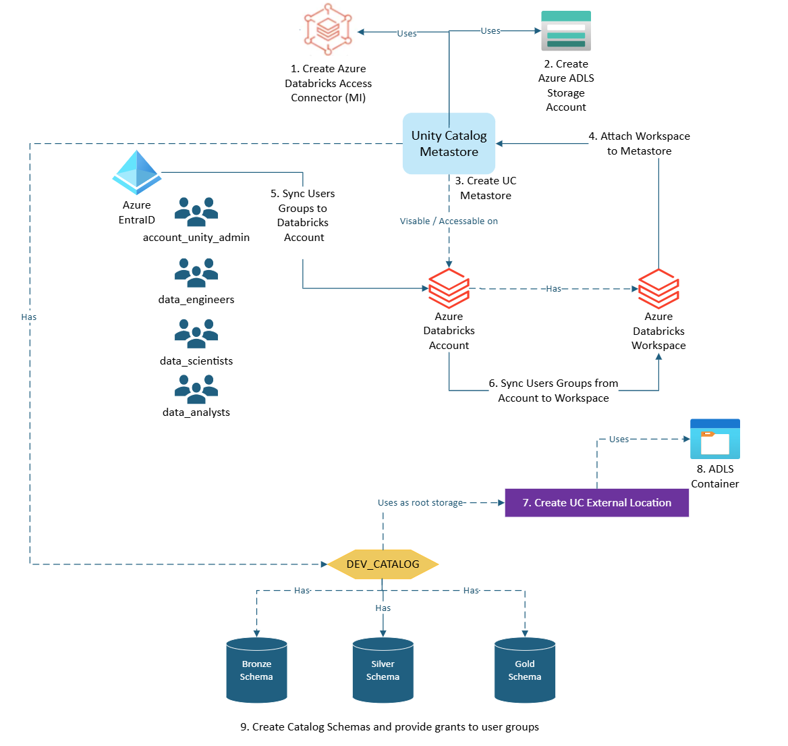

# Terraform Code for Multi Environment Databricks Medallion Deployment



## Overview

**`Infra/modules`** folder has three modules:
- **`adb-workspace`** - Deploys Databricks workspace
- **`metastore-and-users`** - Creates Databricks Connector, Creates Storage Account, Give storage access rights to connector, Creates Metastore / Assigns Workspace to Metastore, and Finally Retrieves alls users, groups, and service principals from Azure AD.
- **`adb-unity-catalog`** - Gives databricks access rights to the connector, Creates containers in the storage account, and creates external locations for the containers. Creates unity catalog and grants permissions user groups. Finally, creates **`bronze` `silver` `gold`** schemas under the catalog and gives the required permissions to the user groups.

**NOTE** - *When **`adb-workspace`** module runs it creates databricks workspace, and by default it creates a metastore in the same region. Databricks allows only **ONE METASTORE** per region. **`metastore-and-users`** module deploys new metastore with our required configurations, but we have to delete existing metastore prior running the module*

**NOTE** - *During script execution you will receive `Error: cannot create metastore: This account with id <Account_ID> has reached the limit for metastores in region <Region>` * error. This is because we have reached the limit of metastores in the region. To fix this, we need to delete existing metastore and re-run the script.*

## How to Run

### Pre-requisites
- Clone the repository
- Install Terraform CLI if not installed already [Terraform Installation](https://learn.hashicorp.com/tutorials/terraform/install-cli)
- Install Azure CLI if not installed already [Azure CLI Installation](https://docs.microsoft.com/en-us/cli/azure/install-azure-cli)
- `Infra/deployment/.env` - Update the values as per your requirement
- Have databricks admin level access. Login to get databricks account id [accounts.databricks.net](https://accounts.azuredatabricks.net/)

### Steps

1. Change directory to `Infra/deployment`
```bash
cd Infra/deployment
```

2. Login to Azure
```bash
az login
```

3. Set the subscription
```bash
az account set --subscription <subscription-id>
```

4. Make the script executable
```bash
chmod +x dev.deploy.sh
```

5. Run the script to deploy the modules sequentially
```bash
./dev.deploy.sh
```

## Destroy

### Steps

1. Change directory to `Infra/deployment`
```bash
cd Infra/deployment
```
2. Make the script executable
```bash
chmod +x dev.destroy.sh
```
3. Run the script to destroy the modules by passing 
```bash
./dev.destroy.sh --destroy
```

## Error Handling

In case of any script fails during resource creation, try rerun the script. It will reference the local state files, and will try again to create the resources.
