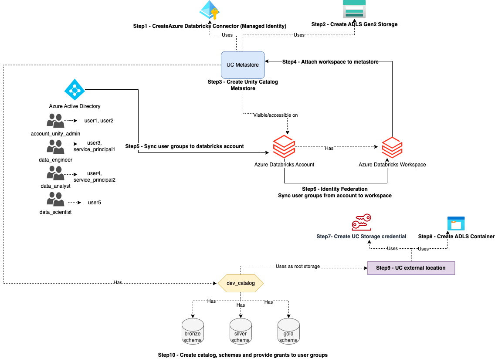

# Terraform Code for Multi-Environment Databricks Medallion Deployment



## Overview

The **`Infra/modules`** folder contains three modules:

- **`adb-workspace`**: Deploys the Databricks workspace.
- **`metastore-and-users`**: Creates the Databricks connector, provisions a storage account, grants storage access rights to the connector, creates the metastore, assigns the workspace to the metastore, and retrieves all users, groups, and service principals from Azure AD.
- **`adb-unity-catalog`**: Grants Databricks access rights to the connector, creates containers in the storage account, creates external locations for the containers, creates the Unity Catalog, grants permissions to user groups, and creates the **`bronze`**, **`silver`**, and **`gold`** schemas under the catalog with the required permissions.

**Note**: When the **`adb-workspace`** module runs, it creates a Databricks workspace and, by default, a metastore in the same region. Databricks allows only **one metastore** per region. The **`metastore-and-users`** module deploys a new metastore with our required configurations. Therefore, you must delete the existing metastore before running this module.

## Entry Point

The **`Infra/envs`** directory contains configurations for three environments. In this example, we define only the **`development`** environment.

The **`Infra/envs/development/main.tf`** file references the three modules and passes the required values from `variables.tf` to them.

## How to Run

### Prerequisites

- Clone the repository.
- Create Azure Entra ID groups: `"account_unity_admin"`, `"data_engineer"`, `"data_analyst"`, and `"data_scientist"`.
- Install the [Terraform CLI](https://learn.hashicorp.com/tutorials/terraform/install-cli) if not already installed.
- Install the [Azure CLI](https://docs.microsoft.com/en-us/cli/azure/install-azure-cli) if not already installed.
- Update `Infra/envs/development/variables.tf` with values as per your requirements.

### Steps

**Note**: The modules depend on each other, so run them in the following order by commenting out the other modules in the `main.tf` file.

1. Navigate to the environment directory:

    ```bash
    cd Infra/envs/development
    ```

2. Comment out the other modules in `main.tf`:

    ```hcl
    module "azure_databricks_workspace" {
      source      = "../../modules/adb-workspace"
      region      = var.region
      environment = var.environment
    }

    /* module "metastore_and_users" {
         ...
    }

    module "adb_unity_catalog" {
         ...
    } */
    ```

3. Deploy the workspace:

    ```bash
    terraform init
    terraform plan
    terraform apply
    ```

4. After the workspace is deployed, delete the existing metastore from the Databricks workspace:
    - In the Databricks workspace, click on the top-right corner (`your_workspace_name`) and select **Account Management**.
    - This opens the admin-level Databricks account. Navigate to **Catalog** on the left side.
    - Select the metastore in the region and delete it.

#### Deploy Metastore and Users

1. Uncomment the next module in `main.tf`:

    ```hcl
    module "azure_databricks_workspace" {
      ...
    }

    module "metastore_and_users" {
      source      = "../../modules/metastore-and-users"
      region      = var.region
      environment = var.environment
    }

    /* module "adb_unity_catalog" {
         ...
    } */
    ```

2. Deploy the metastore and users:

    ```bash
    terraform init
    terraform plan
    terraform apply
    ```

#### Deploy Unity Catalog

1. Uncomment the final module in `main.tf`:

    ```hcl
    module "azure_databricks_workspace" {
      ...
    }

    module "metastore_and_users" {
      ...
    }

    module "adb_unity_catalog" {
      source      = "../../modules/adb-unity-catalog"
      region      = var.region
      environment = var.environment
    }
    ```

2. Deploy the Unity Catalog:

    ```bash
    terraform init
    terraform plan
    terraform apply
    ```
