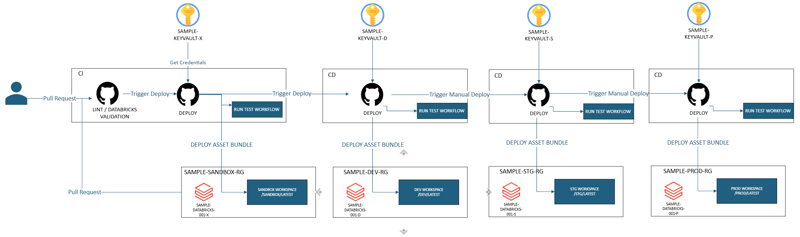

# Overview

This repository contains databricks deployment using terraform and databricks asset bundle deployment using Github Actions.

## Prerequisites

- Azure Subscription
- Deploy Azure Resources using Terraform Code. See [./Infra/README.MD](./Infra/README.md)

## Databricks Asset Bundle Deployment

In this sample we will deploy resources from sandbox environment to development environment using Databricks Asset Bundle Deployment.

### Folder Structure

The working directory : `./single_tech_samples/databricks/databricks_terraform` and is comprised of the following components:

- `./Infra` - Terraform code to deploy Azure Resources. See [./Infra/README.md](./Infra/README.md) for instructions on deploying Azure Resources into multiple environments.
- `tests` - Contains a simple Greeting Python script and a test script. These are used to create Databricks Workflows and run during the GitHub Actions CI/CD pipeline.
- `utils` - Contains the `generate-databricks-workflows.sh` script, which generates Databricks Workflows from the `tests` folder.
- `workflows` - Contains Databricks Workflows generated from the `tests` folder.
- `Taskfile.yml` - Contains two tasks:
  - `collect-tests` - Collects all the test workflows during the CI/CD pipeline run.
  - `run-tests` - Runs all the collected tests in the Databricks workspace during the CI/CD pipeline run.

### Pipelines

- `.github/workflows/adb-asset-bundle-linting.yml` - Pipeline to lint Databricks Python notebooks and workflows.
- `.github/workflows/adb-asset-bundle-sandbox-deployment.yml` - Pipeline to validate Databricks assets during `pull_request` and deploy to the sandbox environment once the PR is merged. Tests are run as part of the deployment in the sandbox environment.
- `.github/workflows/adb-asset-bundle-dev-deployment.yml` - Pipeline to validate, deploy, and run the same test flows in the development environment. It is triggered when the sandbox deployment is successful.

### Steps to see all in action

#### Pre-requisites

- Ensure Azure Login Credentials are setup in GitHub Secrets per environment.
- Ensure Sandbox and Development Resources are deployed in Azure using Terraform code in .

#### Steps

1. Create a new branch from `main` branch.
2. Create a pull request to merge the new branch to `main` branch with some small changes. You will see the pipeline `adb-asset-bundle-linting` running and `adb-asset-bundle-sandbox-deployment` pipeline validating databricks assets.
3. Once the PR is merged into the `main` branch, the `adb-asset-bundle-sandbox-deployment` pipeline will deploy the Databricks assets to the sandbox environment. You will observe the test workflows running in the Databricks Workflows within the sandbox environment. Once the test workflows are successful, the pipeline will complete successfully.
4. Once the sandbox deployment is successful, the `adb-asset-bundle-dev-deployment` pipeline will be triggered. This pipeline will deploy the Databricks assets to the development environment. You will observe the test workflows running in the Databricks Workflows within the development environment. Once the test workflows are successful, the pipeline will complete successfully.
