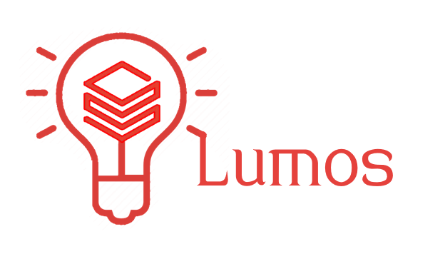

# Project LUMOS

<!-- markdownlint-disable MD033 -->

    <table style="border: 1px solid #FFF;border-collapse: collapse;">
    <tr>
        <td width=300>
        
        </td>
        <td style="color:green">
            This folder is specific to Projct LUMOS which is the execution engine for single technology samples on Azure Databricks. Please exclude this folder while merging to the MDW repository
        </td>
    </tr>
    </table>

## Milestones

    <table style="border: 0px solid #FFF;border-collapse: collapse;">
    <tr>
        <th>
            Session
        </th>
        <th>
            Date
        </th>
    </tr>
    <tr>
        <td>
            <a href = "Meeting_minutes/22nd_Jan_2021.md">Initial Brainstorming</a>
        </td>
        <td>
            22nd Jan ,2021
        </td>
    </tr>
    <tr>
        <td>
            <a href = "Meeting_minutes/23rd_Feb_2021.md">Qualification and Envision session</a>
        </td>
        <td>
            23rd Feb ,2021
        </td>
    </tr>
    </table>

<!-- markdownlint-enable MD033-->

## Important Links

Initial Brainstorming [Onenote](https://microsoft.sharepoint.com/teams/CSEFTEFY19/_layouts/OneNote.aspx?id=%2Fteams%2FCSEFTEFY19%2FShared%20Documents%2FCrew%20-%20Quokka%2FTeam%20Quokka&wd=target%28Product%20and%20Practise%20Contributions.one%7C406AD8E6-4EE8-458D-9B7D-07F1A161B8CD%2FModern%20Data%20Warehouse%7C94D4127C-B03D-4669-A1C4-F9844C12DE70%2F%29)

Notes from the envisioning session is captured [here](https://microsoft-my.sharepoint.com/:i:/p/anbadh/EVuhXTy1s7VBg60IUiGOBZkB4mENJVE3upfu1yr7_tMBkg?e=YKgBm1)
