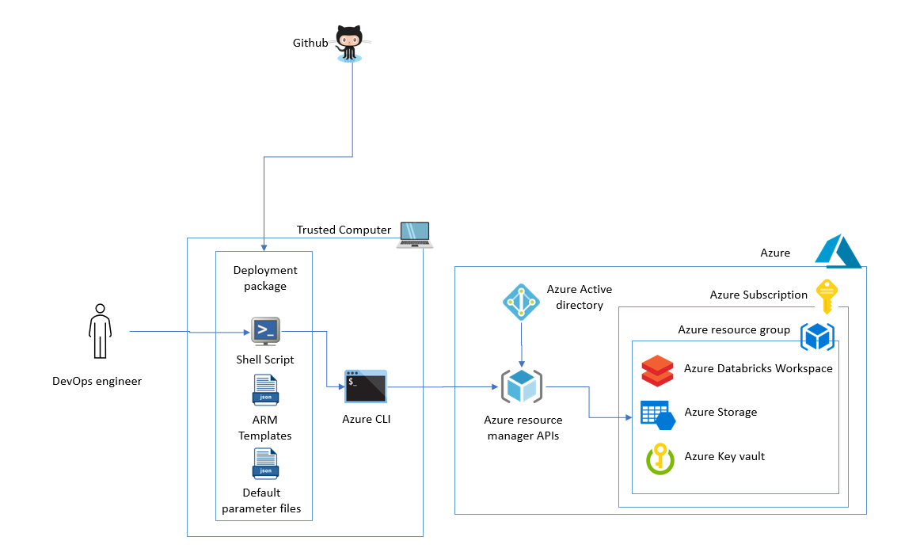
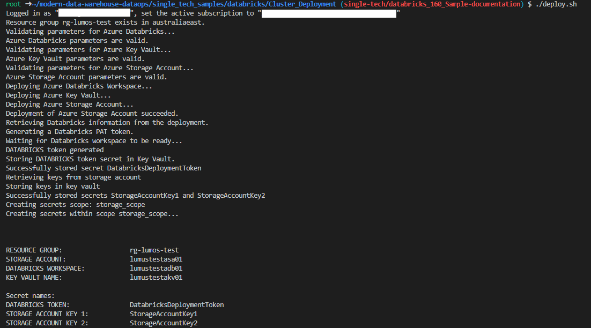
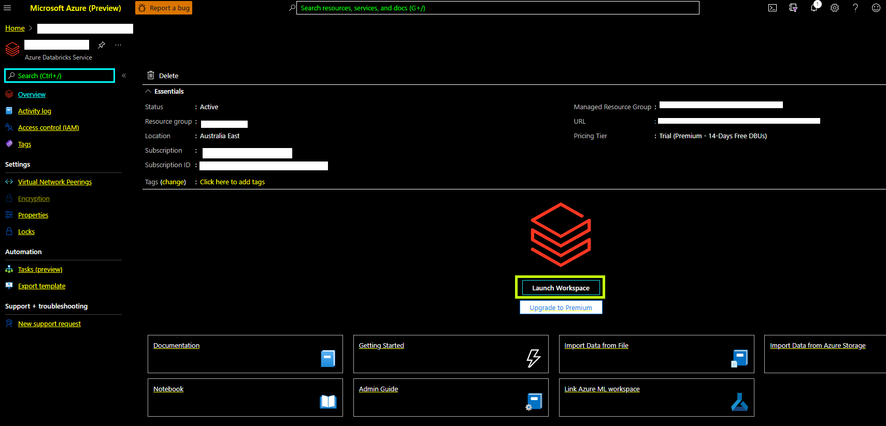
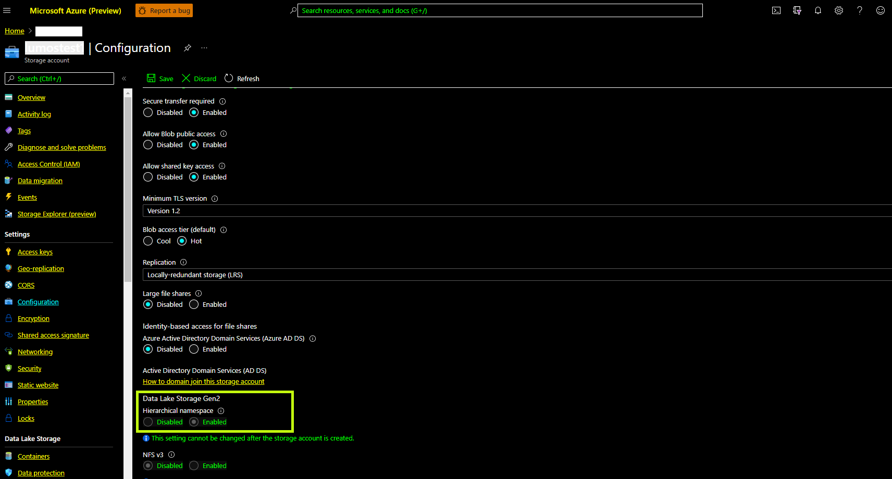
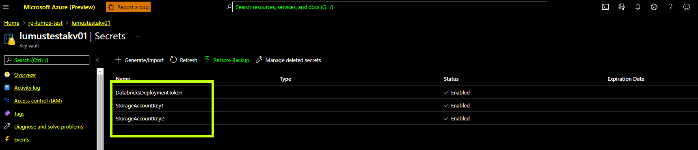
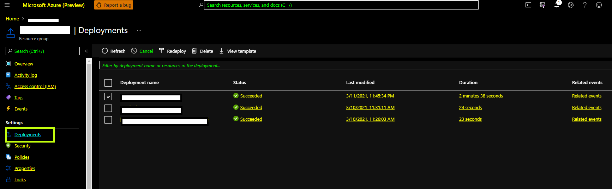
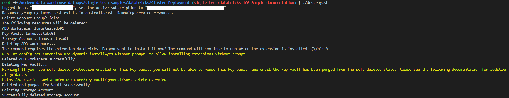

# Deploying a secure Azure Databricks environment using Infrastructure as Code

## Contents

- [Deploying a secure Azure Databricks environment using Infrastructure as Code](#deploying-a-secure-azure-databricks-environment-using-infrastructure-as-code)
  - [Contents](#contents)
  - [1. Solution Overview](#1-solution-overview)
    - [1.1. Scope](#11-scope)
    - [1.2. Architecture](#12-architecture)
      - [1.2.1. Patterns](#121-patterns)
    - [1.3. Technologies used](#13-technologies-used)
  - [2. Well-Architected Framework (WAF)](#2-well-architected-framework-waf)
    - [2.1. Cost Optimization](#21-cost-optimization)
    - [2.2. Operational Excellence](#22-operational-excellence)
    - [2.3. Performance Efficiency](#23-performance-efficiency)
    - [2.4. Reliability](#24-reliability)
    - [2.5. Security](#25-security)
  - [3. How to use this sample](#3-how-to-use-this-sample)
    - [3.1. Prerequisites](#31-prerequisites)
      - [3.1.1 Software Prerequisites](#311-software-prerequisites)
    - [3.2. Setup and deployment](#32-setup-and-deployment)
    - [3.3. Deployed Resources](#33-deployed-resources)
    - [3.4. Deployment validation](#34-deployment-validation)
    - [3.5. Clean-up](#35-clean-up)

## 1. Solution Overview

It is a recommended pattern for enterprise applications to automate platform provisioning to achieve consistent, repeatable deployments using Infrastructure as Code (IaC). This practice is highly encouraged by organizations that run multiple environments such as Dev, Test, Performance Test, UAT, Blue and Green production environments, etc. IaC is also very effective in managing deployments when the production environments are spread across multiple regions across the globe.

Tools like Azure Resource Manager (ARM), Terraform, and the Azure Command Line Interface (CLI) enable you to declaratively script the cloud infrastructure and use software engineering practices such as testing and versioning while implementing IaC.

This sample will focus on automating the provisioning of a basic Azure Databricks environment using the Infrastructure as Code pattern

### 1.1. Scope

The following list captures the scope of this sample:

1. Provision an Azure Databricks environment using ARM templates orchestrated by a shell script.
1. The following services will be provisioned as a part of the basic Azure Databricks environment setup:
   1. Azure Databricks Workspace
   2. Azure Storage account with hierarchical namespace enabled to support ABFS
   3. Azure key vault to store secrets and access tokens

Details about [how to use this sample](#3-how-to-use-this-sample) can be found in the later sections of this document.

### 1.2. Architecture

The below diagram illustrates the deployment process flow followed in this sample:

#### 1.2.1. Patterns

Following are the cloud design patterns being used by this sample:

- [External Configuration Store pattern](https://docs.microsoft.com/en-us/azure/architecture/patterns/external-configuration-store): Configuration for the deployment is persisted externally as a parameter file separate from the deployment script.
- [Federated Identity pattern](https://docs.microsoft.com/en-us/azure/architecture/patterns/federated-identity): Azure active directory is used as the federated identity store to enable seamless integration with enterprise identity providers.
- [Valet Key pattern](https://docs.microsoft.com/en-us/azure/architecture/patterns/valet-key): Azure key vault is used to manage the secrets and access toked used by the services.
- [Compensating Transaction pattern](https://docs.microsoft.com/en-us/azure/architecture/patterns/compensating-transaction#): The script will roll back partially configured resources if the deployment is incomplete.

### 1.3. Technologies used

The following technologies are used to build this sample:

- [Azure Databricks](https://azure.microsoft.com/en-au/free/databricks/)
- [Azure Storage](https://azure.microsoft.com/en-au/services/storage/data-lake-storage/)
- [Azure Key Vault](https://azure.microsoft.com/en-au/services/key-vault/)
- [Azure CLI](https://docs.microsoft.com/en-us/cli/azure/)
- [Azure Resource Manager](https://docs.microsoft.com/en-us/azure/azure-resource-manager/management/overview)

## 2. Well-Architected Framework (WAF)

This section highlights key pointers to align the services deployed in this sample to Microsoft Azure's Well-Architected Framework'.

### 2.1. Cost Optimization

1. Before the deployment, use the [Azure pricing calculator](https://azure.microsoft.com/en-us/pricing/calculator/) to determine the expected usage cost.

2. Appropriately select the [Storage redundancy](https://docs.microsoft.com/en-us/azure/storage/common/storage-redundancy) option

3. Leverage [Azure Cost Management and Billing](https://azure.microsoft.com/en-us/services/cost-management/) to track usage cost of the Azure Databricks and Storage services

4. Use [Azure Advisor](https://azure.microsoft.com/en-us/services/advisor/) to optimize deployments by leveraging the smart insights

5. Use [Azure Policies](https://azure.microsoft.com/en-us/services/azure-policy/) to define guardrails around deployment constraints to regulate the cost

### 2.2. Operational Excellence

1. Ensure that the parameters passed to the deployment scripts are validated

1. Leverage parallel resource deployment where ever possible. In the scope of this sample, all three resources can be deployed in parallel.

1. Validate compensation transactions for the deployment workflow.

### 2.3. Performance Efficiency

1. Understand billing for metered resources provisioned as a part of this sample.

1. Track deployment logs to monitor execution time to mine possibilities for optimizations.

### 2.4. Reliability

1. Define the availability requirements before the deployment and configure the storage and databricks service accordingly.

2. Ensure required capacity and services are available in targeted regions

3. Test the compensation transaction logic by explicitly failing a service deployment

### 2.5. Security

1. Ensure the right privileges are granted to the provisioned resources.

2. Cater for regular audits to ensure ongoing Vigilance.

3. Automate the execution of the deployment script and restrict the privileges to service accounts.

4. Integrate with the secure identity provider (Azure Active Directory)

## 3. How to use this sample

This section holds the information about usage instructions of this sample.

### 3.1. Prerequisites

The following are the prerequisites for deploying this sample :

1. [Github account](https://github.com/)
2. [Azure Account](https://azure.microsoft.com/en-au/free/search/?&ef_id=Cj0KCQiAr8bwBRD4ARIsAHa4YyLdFKh7JC0jhbxhwPeNa8tmnhXciOHcYsgPfNB7DEFFGpNLTjdTPbwaAh8bEALw_wcB:G:s&OCID=AID2000051_SEM_O2ShDlJP&MarinID=O2ShDlJP_332092752199_azure%20account_e_c__63148277493_aud-390212648371:kwd-295861291340&lnkd=Google_Azure_Brand&dclid=CKjVuKOP7uYCFVapaAoddSkKcA)
   - *Permissions needed*:  The ability to create and deploy to an Azure [resource group](https://docs.microsoft.com/en-us/azure/azure-resource-manager/management/overview), a [service principal](https://docs.microsoft.com/en-us/azure/active-directory/develop/app-objects-and-service-principals), and grant the [collaborator role](https://docs.microsoft.com/en-us/azure/role-based-access-control/overview) to the service principal over the resource group.

   - Active subscription with the following [resource providers](https://docs.microsoft.com/en-us/azure/azure-resource-manager/management/azure-services-resource-providers) enabled:
     - Microsoft.Databricks
     - Microsoft.DataLakeStore
     - Microsoft.Storage
     - Microsoft.KeyVault

#### 3.1.1 Software Prerequisites

1. [Azure CLI](https://docs.microsoft.com/en-us/cli/azure/) installed on the local machine
   - *Installation instructions* can be found [here](hhttps://docs.microsoft.com/en-us/cli/azure/install-azure-cli)
1. For Windows users,
   1. Option 1: [Windows Subsystem for Linux](https://docs.microsoft.com/en-us/windows/wsl/install-win10)
   2. Option 2: Use the dev container published [here](../.devcontainer) as a host for the bash shell.

### 3.2. Setup and deployment

> **IMPORTANT NOTE:** As with all Azure Deployments, this will **incur associated costs**. Remember to teardown all related resources after use to avoid unnecessary costs. See [here](#4.3.-deployed-resources) for a list of deployed resources.

Below listed are the steps to deploy this sample :

1. Fork and clone this repository. Navigate to (CD) `single_tech_samples/databricks/sample1_basic_azure_databricks_environment/`.

1. The sample depends on the following environment variables to be set before the deployment script is run:
  
    > - `DEPLOYMENT_PREFIX` - Prefix for the resource names which will be created as a part of this deployment
    > - `AZURE_SUBSCRIPTION_ID` - Subscription ID of the Azure subscription where the resources should be deployed.
    > - `AZURE_RESOURCE_GROUP_NAME` - Name of the containing resource group
    > - `AZURE_RESOURCE_GROUP_LOCATION` - Azure region where the resources will be deployed. (e.g. australiaeast, eastus, etc.)
    > - `DELETE_RESOURCE_GROUP` - Flag to indicate the cleanup step for the resource group

1. Run '/deploy.sh'
   > Note: The script will prompt you to log in to the Azure account for authorization to deploy resources.

   The script will validate the ARM templates and the environment variables before deploying the resources. It will also display the status of each stage of the deployment while it executes. The following screenshot displays the log for a successful run:

   > Note: `DEPLOYMENT_PREFIX` for this deployment was set as `lumustest`

    

### 3.3. Deployed Resources

The following resources will be deployed as a part of this sample once the script is executed:

1.Azure Databricks workspace.

2.Azure Storage with hierarchical namespace enabled.

3.Azure Key vault with all the secrets configured.

### 3.4. Deployment validation

The following steps can be performed to validate the correct deployment of this sample:

1. Users with appropriate access rights should be able to:

   1. launch the workspace from the Azure portal.
   2. Access the control plane for the storage account and key vault through the Azure portal.
   3. View the secrets configured in the Azure Key vault
   4. View deployment logs in the Azure resource group
   

### 3.5. Clean-up

Please follow the below steps to clean up your environment :

The clean-up script can be executed to clean up the resources provisioned in this sample. Following are the steps to execute the script:

1. Navigate to (CD) `single_tech_samples/databricks/sample1_basic_azure_databricks_environment/`.

2. Run '/destroy.sh'

The following screenshot displays the log for a successful clean-up run:

  
