# Deploying Enterprise-grade Azure Databricks environment using Infrastructure as Code aligned with Anti-Data-Exfiltration Reference architecture <!-- omit in toc -->

## Contents <!-- omit in toc -->

- [1. Solution Overview](#1-solution-overview)
  - [1.1. Scope](#11-scope)
  - [1.2. Architecture](#12-architecture)
    - [1.2.1. Patterns](#121-patterns)
  - [1.3. Technologies used](#13-technologies-used)
- [2. Well-Architected Framework (WAF)](#2-well-architected-framework-waf)
  - [2.1. Security](#21-security)
  - [2.2. Other considerations](#22-other-considerations)
- [3. How to use this sample](#3-how-to-use-this-sample)
  - [3.1. Prerequisites](#31-prerequisites)
    - [3.1.1 Software Prerequisites](#311-software-prerequisites)
  - [3.2. Setup and deployment](#32-setup-and-deployment)
  - [3.3. Deployed Resources](#33-deployed-resources)
  - [3.4. Deployment validation](#34-deployment-validation)
  - [3.5. Clean-up](#35-clean-up)
- [4. Next Step](#4-next-step)

## 1. Solution Overview

In [sample 1](../sample1_basic_azure_databricks_environment), we focused on deploying a basic Azure Databrick Environment with relevant services like Azure Storage Account and Azure Keyvault provisioned. However, an Enterprise-grade deployment of Databricks demands securing the environment to meet the organizational guardrails around cybersecurity and data protection.

In this sample we focus on hardening the security around the Azure Databricks environment by implementing the following:

1.[Azure Virtual Network](https://docs.microsoft.com/en-us/azure/virtual-network/virtual-networks-overview) - To achieve network isolation.

2.[Hub and Spoke Network topology](https://docs.microsoft.com/en-us/azure/architecture/reference-architectures/hybrid-networking/hub-spoke?tabs=cli)  - To implement [Perimeter networks](https://docs.microsoft.com/en-us/azure/cloud-adoption-framework/ready/azure-best-practices/perimeter-networks).

3.[Azure Private Links](https://docs.microsoft.com/en-us/azure/private-link/private-link-overview) - To secure connectivity with dependent PaaS services.

This sample is also aligned to the implementation pattern published by Databricks around [Data Exfiltration Protection with Azure Databricks](https://databricks.com/blog/2020/03/27/data-exfiltration-protection-with-azure-databricks.html).

The sample implements automating the provisioning of the required services and configurations using the [Infrastructure as Code](https://docs.microsoft.com/en-us/dotnet/architecture/cloud-native/infrastructure-as-code) pattern.

### 1.1. Scope

The following list captures the scope of this sample:

1. Provision an enterprise-grade, secure, Azure Databricks environment using ARM templates orchestrated by a shell script.
1. The following services will be provisioned as a part of this setup:
   1. Azure Databricks Data Plane configured to have no public IPs ([NPIP](https://docs.microsoft.com/en-us/azure/databricks/security/secure-cluster-connectivity)) deployed within an Azure Spoke Vnet.
   2. Azure Hub Vnet peered with the spoke Vnet.
   3. Azure firewall deployed into the hub Vnet configured to allow traffic only from the Azure Databricks Control plane as per IP routes published [here](https://docs.microsoft.com/en-us/azure/databricks/administration-guide/cloud-configurations/azure/udr).
   4. Azure Public Ip for the Firewall.
   5. Azure Routing tables with UDR (User Defined Routes) configured to enforce regulation of traffic through the firewall.
   6. Azure Data Lake Gen2 storage ABFS endpoint accessible only via Azure Private Link.
   7. Azure key vault to store secrets and access tokens accessible via Azure private link.

Details about [how to use this sample](#3-how-to-use-this-sample) can be found in the later sections of this document.

### 1.2. Architecture

The architecture of the solution is aligned with the security baselines for [Azure Databricks](https://docs.microsoft.com/en-us/azure/databricks/security/). The following diagram captures the high-level design.

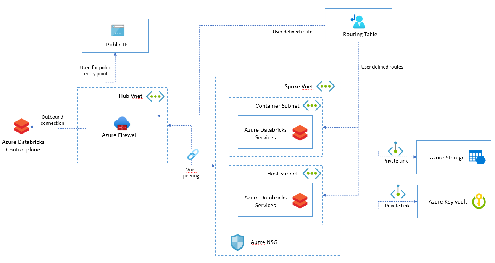

In this sample, a shell script is used to orchestrate the deployment. The following diagram illustrates the deployment process flow.

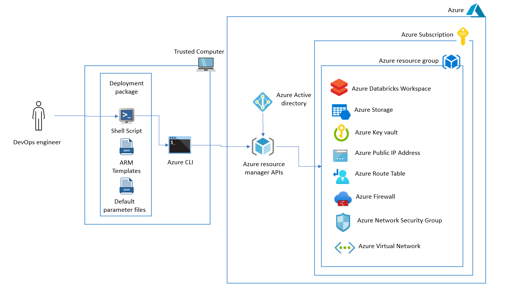

#### 1.2.1. Patterns

Following are the cloud design patterns being used by this sample:

- [External Configuration Store pattern](https://docs.microsoft.com/en-us/azure/architecture/patterns/external-configuration-store): Configuration for the deployment is persisted externally as a parameter file separate from the deployment script.
- [Federated Identity pattern](https://docs.microsoft.com/en-us/azure/architecture/patterns/federated-identity): Azure active directory is used as the federated identity store to enable seamless integration with enterprise identity providers.
- [Valet Key pattern](https://docs.microsoft.com/en-us/azure/architecture/patterns/valet-key): Azure key vault is used to manage the secrets and access toked used by the services.
- [Gatekeeper pattern](https://docs.microsoft.com/en-us/azure/architecture/patterns/gatekeeper): The Azure firewall acts as a gatekeeper for all external traffic flowing in.

### 1.3. Technologies used

The following technologies are used to build this sample:

- [Azure Databricks](https://azure.microsoft.com/en-au/free/databricks/)
- [Azure Storage](https://azure.microsoft.com/en-au/services/storage/data-lake-storage/)
- [Azure Key Vault](https://azure.microsoft.com/en-au/services/key-vault/)
- [Azure Virtual networks](https://docs.microsoft.com/en-us/azure/virtual-network/virtual-networks-overview)
- [Azure Firewall](https://docs.microsoft.com/en-us/azure/firewall/overview)
- [Azure Route tables](https://docs.microsoft.com/en-us/azure/virtual-network/manage-route-table)
- [Azure Public IP](https://docs.microsoft.com/en-us/azure/virtual-network/public-ip-addresses)
- [Azure Private Links](https://docs.microsoft.com/en-us/azure/private-link/private-link-overview)
- [Azure CLI](https://docs.microsoft.com/en-us/cli/azure/)
- [Azure Resource Manager](https://docs.microsoft.com/en-us/azure/azure-resource-manager/management/overview)

## 2. Well-Architected Framework (WAF)

This section highlights key pointers to align the services deployed in this sample to Microsoft Azure's Well-Architected Framework (WAF).

### 2.1. Security

This sample implementation focuses on securing the Azure Databricks Environment against Data Exfiltration, aligning it to the best practices defined in the [Security pillar](https://docs.microsoft.com/en-us/azure/architecture/framework/security/overview) of Microsoft Azure's Well-Architected Framework. Following are a few other guidance related to securing the Azure Databricks environment.

1. Ensure the right privileges are granted to the provisioned resources.

2. Cater for regular audits to ensure ongoing Vigilance.

3. Automate the execution of the deployment script and restrict the privileges to service accounts.

4. Integrate with the secure identity provider (Azure Active Directory).

### 2.2. Other considerations

- Cost Optimization

  - Before the deployment, use the [Azure pricing calculator](https://azure.microsoft.com/en-us/pricing/calculator/) to determine the expected usage cost.

  - Appropriately select the [Storage redundancy](https://docs.microsoft.com/en-us/azure/storage/common/storage-redundancy) option.

  - Leverage [Azure Cost Management and Billing](https://azure.microsoft.com/en-us/services/cost-management/) to track usage cost of the Azure Databricks and Storage services.

  - Use [Azure Advisor](https://azure.microsoft.com/en-us/services/advisor/) to optimize deployments by leveraging the smart insights.

  - Use [Azure Policies](https://azure.microsoft.com/en-us/services/azure-policy/) to define guardrails around deployment constraints to regulate the cost.

- Operational Excellence

  - Ensure that the parameters passed to the deployment scripts are validated.

  - Leverage parallel resource deployment where ever possible. In the scope of this sample, all three resources can be deployed in parallel.

  - Validate compensation transactions for the deployment workflow to reverse partially provisioned resources if the provisioning fails.

- Performance Efficiency

  - Understand billing for metered resources provisioned as a part of this sample.

  - Track deployment logs to monitor execution time to mine possibilities for optimizations.

- Reliability

  - Define the availability requirements before the deployment and configure the storage and databricks service accordingly.

  - Ensure required capacity and services are available in targeted regions.

  - Test the compensation transaction logic by explicitly failing a service deployment.

## 3. How to use this sample

This section holds the information about usage instructions of this sample.

### 3.1. Prerequisites

The following are the prerequisites for deploying this sample :

1. [Github account](https://github.com/)
2. [Azure Account](https://azure.microsoft.com/en-au/free/search/?&ef_id=Cj0KCQiAr8bwBRD4ARIsAHa4YyLdFKh7JC0jhbxhwPeNa8tmnhXciOHcYsgPfNB7DEFFGpNLTjdTPbwaAh8bEALw_wcB:G:s&OCID=AID2000051_SEM_O2ShDlJP&MarinID=O2ShDlJP_332092752199_azure%20account_e_c__63148277493_aud-390212648371:kwd-295861291340&lnkd=Google_Azure_Brand&dclid=CKjVuKOP7uYCFVapaAoddSkKcA)
   - *Permissions needed*:  The ability to create and deploy to an Azure [resource group](https://docs.microsoft.com/en-us/azure/azure-resource-manager/management/overview), a [service principal](https://docs.microsoft.com/en-us/azure/active-directory/develop/app-objects-and-service-principals), and grant the [collaborator role](https://docs.microsoft.com/en-us/azure/role-based-access-control/overview) to the service principal over the resource group.

   - Active subscription with the following [resource providers](https://docs.microsoft.com/en-us/azure/azure-resource-manager/management/azure-services-resource-providers) enabled:
     - Microsoft.Databricks
     - Microsoft.DataLakeStore
     - Microsoft.Storage
     - Microsoft.KeyVault
     - Microsoft.Network

#### 3.1.1 Software Prerequisites

1. [Azure CLI](https://docs.microsoft.com/en-us/cli/azure/) installed on the local machine
   - *Installation instructions* can be found [here](https://docs.microsoft.com/en-us/cli/azure/install-azure-cli)
1. For Windows users,
   1. Option 1: [Windows Subsystem for Linux](https://docs.microsoft.com/en-us/windows/wsl/install-win10)
   2. Option 2: Use the dev container published [here](../.devcontainer) as a host for the bash shell.

### 3.2. Setup and deployment

> **IMPORTANT NOTE:** As with all Azure Deployments, this will **incur associated costs**. Remember to teardown all related resources after use to avoid unnecessary costs. See [here](#4.3.-deployed-resources) for a list of deployed resources.

Below listed are the steps to deploy this sample :

1. Fork and clone this repository. Navigate to (CD) `single_tech_samples/databricks/sample2_enterprise_azure_databricks_environment/`.

1. The sample depends on the following environment variables to be set before the deployment script is run:
  
    > - `DEPLOYMENT_PREFIX` - Prefix for the resource names which will be created as a part of this deployment.
    > - `AZURE_SUBSCRIPTION_ID` - Subscription ID of the Azure subscription where the resources should be deployed.
    > - `AZURE_RESOURCE_GROUP_NAME` - Name of the containing resource group.
    > - `AZURE_RESOURCE_GROUP_LOCATION` - Azure region where the resources will be deployed. (e.g. australiaeast, eastus, etc.).
    > - `DELETE_RESOURCE_GROUP` - Flag to indicate the cleanup step for the resource group.
    >
1. **Optional Step**- Please note that the firewall rules configured in this sample are as per Microsoft Azure documentation captured [here](https://docs.microsoft.com/en-us/azure/databricks/administration-guide/cloud-configurations/azure/udr). The routes are configured for West US region. In case you need to deploy this sample in any other Azure region, please alter the [ARM template for the firewall](firewall/firewall.template.json) with the IP addresses for the target region.
1. Run '/deploy.sh'
   > Note: The script will prompt you to log in to the Azure account for authorization to deploy resources.

   The script will validate the ARM templates and the environment variables before deploying the resources. It will also display the status of each stage of the deployment while it executes. The following screenshot displays the log for a successful run:

   > Note: `DEPLOYMENT_PREFIX` for this deployment was set as `lumussample2`

    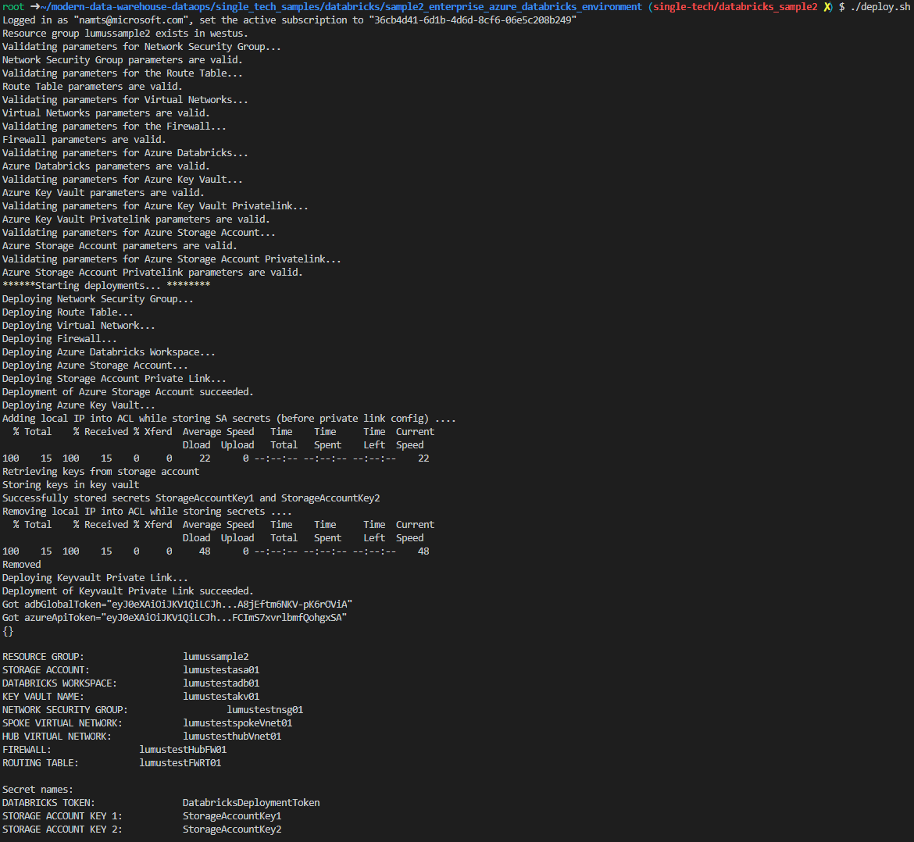

### 3.3. Deployed Resources

The following resources will be deployed as a part of this sample once the script is executed:

1.Azure Databricks workspace.

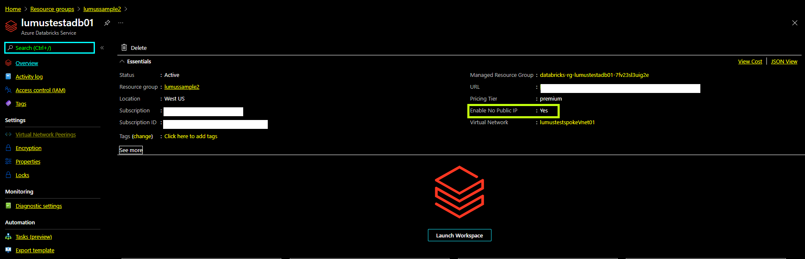

2.Azure Storage with hierarchical namespace enabled.

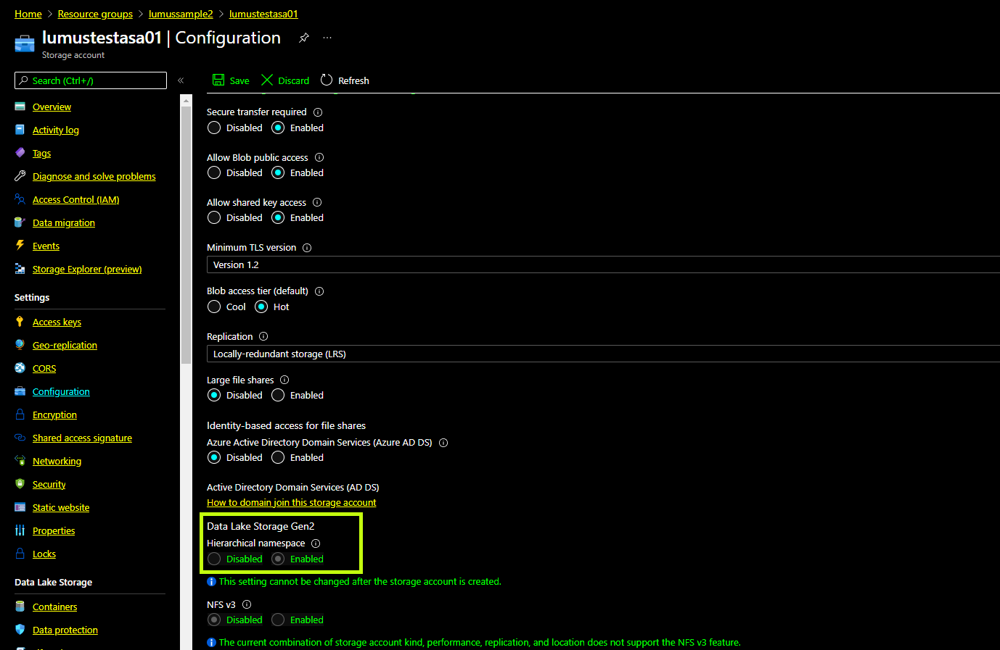

3.Azure Key vault with all the secrets configured.

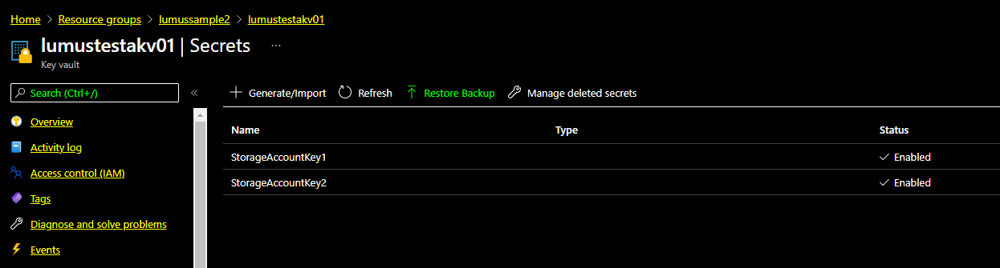

4.Azure Virtual Networks with Vnet peering between the hub and spoke Vnets
  
**Hub Vnet**
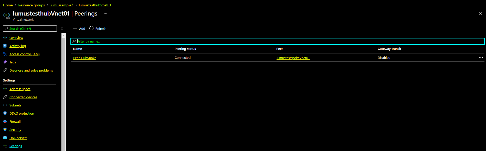

**Spoke Vnet**
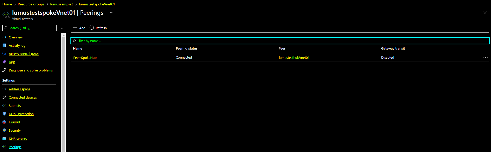

5.Azure Firewall with rules configured

**Network Rules**
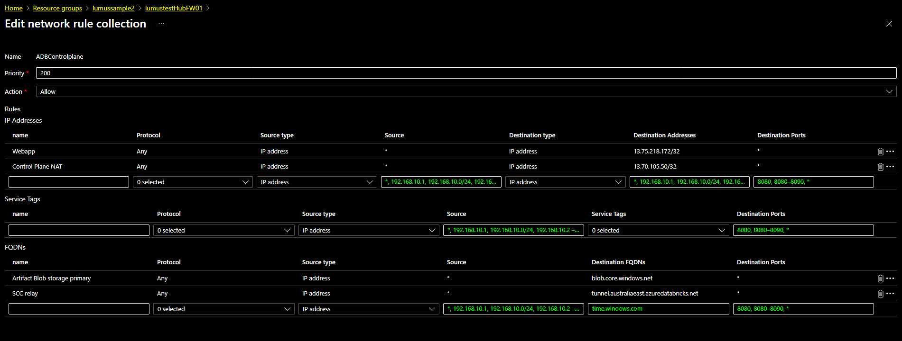

**Application Rules**
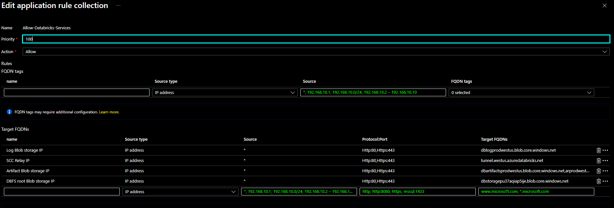

6.Azure public IP address associated with the firewall

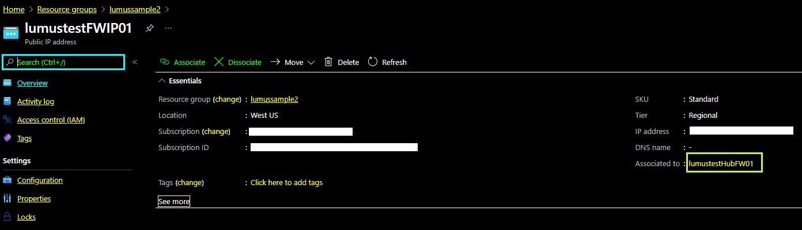

7.Azure Routing table with routes configured

**Subnets**
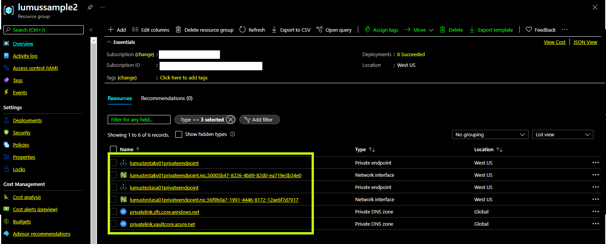

**Routes**
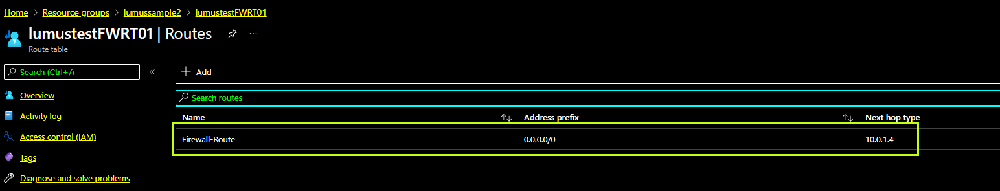

8.Azure Network Security Group

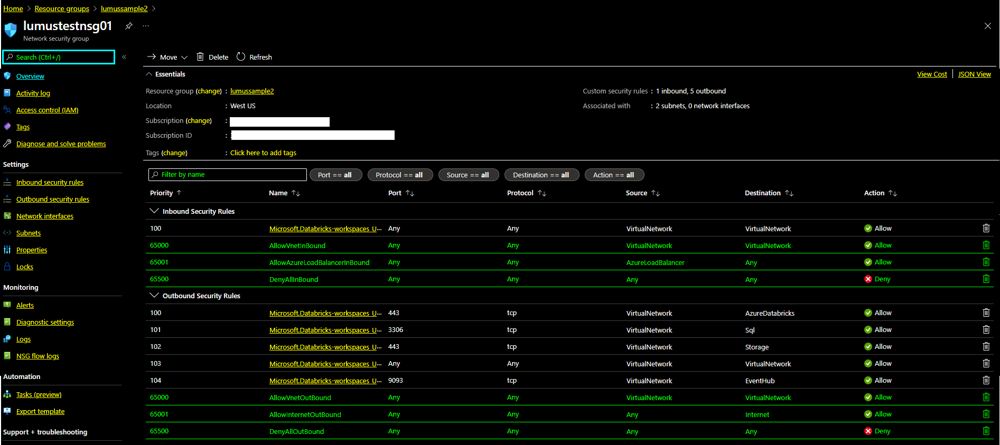

8.Azure Private Link

> **NOTE:** Configuring Private links require provisioning of Network Interface cards and Private DNS zones. The following screenshot illustrates the resources configured for two private links. One for the Storage and Another for Key vault.
>

### 3.4. Deployment validation

The following steps can be performed to validate the correct deployment of this sample:

1. Users with appropriate access rights should be able to:

   1. Launch the workspace from the Azure portal.
   2. Access the control plane for the storage account and key vault through the Azure portal.
   3. View the secrets configured in the Azure Key vault.
   4. View deployment logs in the Azure resource group
   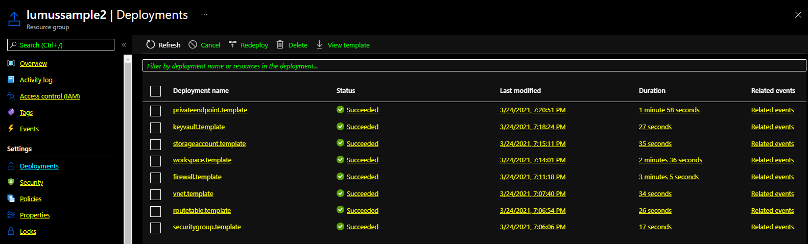.
   5. Key vault and storage is not accessible outside Azure Databricks workspace.
   6. Changing the firewall rules to deny traffic from the control plane will prevent the Azure Databricks cluster from functioning.
   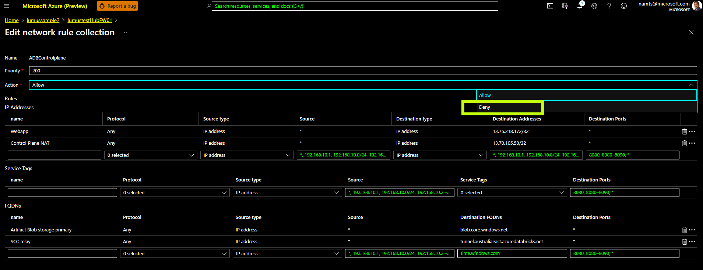.

### 3.5. Clean-up

The clean-up script can be executed to clean up the resources provisioned in this sample. Following are the steps to execute the script:

1. Navigate to (CD) `single_tech_samples/databricks/sample1_basic_azure_databricks_environment/`.

2. Run '/destroy.sh'

The following screenshot displays the log for a successful clean-up run:

  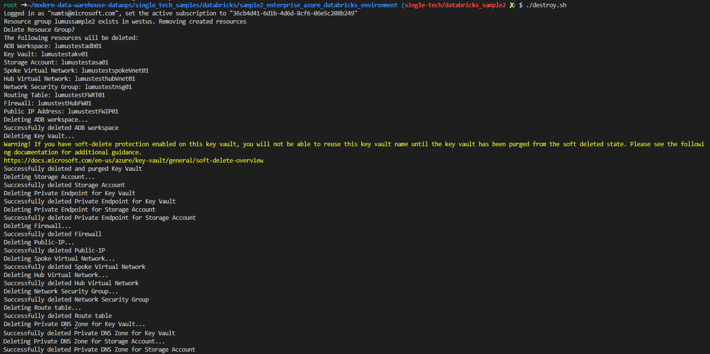

## 4. Next Step

[Cluster provisioning and enabling data access on a pre-provisioned Azure Databricks Workspace](../sample3_cluster_provisioning_and_data_access/README.md)
