# Azure Databricks CI/CD template <!-- omit in toc -->

## Contents <!-- omit in toc -->

- [1. Solution Overview](#1-solution-overview)
  - [1.1. Scope](#11-scope)
  - [1.2. Architecture](#12-architecture)
  - [1.3. Technologies used](#13-technologies-used)
- [2. How to use this template](#2-how-to-use-this-template)
  - [2.1. Prerequisites](#21-prerequisites)
  - [2.2. Infrastructure as Code (IaC)](#22-infrastructure-as-code-iac)
  - [2.3. Project Structure](#23-project-structure)
  - [2.4. The Notebook Approach](#24-the-notebook-approach)
    - [2.4.1 Repository setup](#241-repository-setup)
    - [2.4.2 DevOps pipeline setup](#242-devops-pipeline-setup)
    - [2.4.3 Import into DEV databricks workspace](#243-import-into-dev-databricks-workspace)
    - [2.4.4 Implement and run tests in DEV databricks workspace](#244-implement-and-run-tests-in-dev-databricks-workspace)
    - [2.4.5 Run test with pipelines](#245-run-test-with-pipelines)
    - [2.4.6 Deployment](#246-deployment)
  - [2.5. The Spark Python Approach](#25-the-spark-python-approach)
    - [2.5.1 Repository setup](#251-repository-setup)
    - [2.5.2 DevOps pipeline setup](#252-devops-pipeline-setup)
    - [2.5.3 Implement and run tests in VSCode](#253-implement-and-run-tests-in-vscode)
      - [2.5.3.1 Run tests using devcontainer](#2531-run-tests-using-devcontainer)
      - [2.5.3.2 Run tests in your local environment](#2532-run-tests-in-your-local-environment)
    - [2.5.4 Run test with pipelines](#254-run-test-with-pipelines)
    - [2.5.5 Deployment](#255-deployment)

## 1. Solution Overview

When building a project in databricks, we can start from a notebook and implement the business logic in Python or SparkSQL. Before go-production, we need to create CI/CD pipelines. To reduce the effort of build CI/CD pipelines, we build this git repository as template including sample notebooks and unit tests with CI/CD pipelines in Azure DevOps yaml files .

**It is the scaffolding of Azure databricks project.**

To make it easy extendable, the notebooks and python code only contain super simple logic, and the unit tests are implemented by pytest and [nutter](https://github.com/microsoft/nutter)

This template focuses on solutions of CI/CD pipeline, and demonstrates to support 2 approaches of spark application implementation, "notebook job" and "spark python job". A python package is also implemented and imported to notebooks and spark python job as library.

### 1.1. Scope

The following list captures the scope of this template:

1. Sample code, they are the two job types of databricks, plus a common python library
    1. Notebook Job.
    2. Spark Python Job.
    3. A python package as common library imported by "notebook" and "spark python"
2. Testing
    1. pytest for common library and spark python
    2. [nutter](https://github.com/microsoft/nutter) for notebooks

3. DevOps pipelines build, test and deploy the spark jobs.

Details about [how to use this sample](#2-how-to-use-this-template) can be found in the later sections of this document.

### 1.2. Architecture

The below diagram illustrates the deployment process flow followed in this template:

  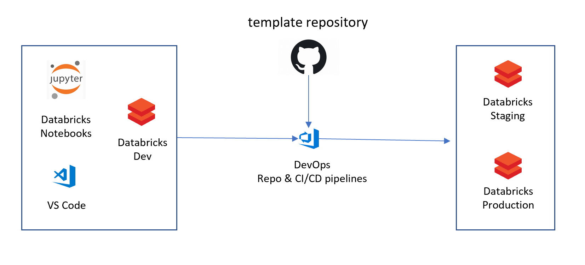

### 1.3. Technologies used

The following technologies are used to build this template:

- [Azure DevOps](https://azure.microsoft.com/en-us/services/devops/)
- [Azure Databricks](https://azure.microsoft.com/en-au/free/databricks/)
- [Azure Resource Manager](https://docs.microsoft.com/en-us/azure/azure-resource-manager/management/overview)
- [nutter](https://github.com/microsoft/nutter)
- [databricks cli](https://docs.microsoft.com/en-us/azure/databricks/dev-tools/cli/)
- [dbx](https://github.com/databrickslabs/dbx) - Databricks CLI eXtensions

## 2. How to use this template

This section holds the information about the instructions of this template.

### 2.1. Prerequisites

The following are the prerequisites for deploying this template :

1. [Github account](https://github.com/)
2. [Azure DevOps account](https://dev.azure.com)
3. [Azure account](https://portal.azure.com)
4. [Azure Databricks Workspace](https://azure.microsoft.com/en-us/services/databricks/)

### 2.2. Infrastructure as Code (IaC)

You need have 3 databricks workspace for 'develop', 'staging' and 'product'. You setup Azure Databricks services by the IaC samples from [here](https://github.com/Azure-Samples/modern-data-warehouse-dataops/tree/master/single_tech_samples/databricks)

### 2.3. Project Structure

```txt
|   .gitignore
|   pytest.ini
|   README.md
|   requirements.txt
|   setup.py
|               
+---common
|   |   module_a.py
|   |   __init__.py
|   |   
|   +---tests
|            module_a_test.py
|           
+---conf
|       deployment_notebook.json
|       deployment_notebook_new_cluster.json
|       deployment_spark_python.json
|       deployment_spark_python_new_cluster.json
|       
+---devops
|   |   lib-pipelines.yml
|   |   notebook-pipelines.yml
|   |   spark-python-pipelines.yml
|   |   
|   \---template
|           create-deployment-json.yml
|           deploy-lib-job.yml
|           deploy-notebook-job.yml
|           deploy-spark-python-job.yml
|           test-lib-job.yml
|           test-notebook-job.yml
|           test-spark-python-job.yml
|       
+---notebook_jobs
|   |   main_notebook_a.py
|   |   main_notebook_b.py
|   |   main_notebook_sql.py
|   |   module_b_notebook.py
|   |   
|   \---tests
|          main_notebook_a_test.py
|          main_notebook_b_test.py
|          main_notebook_sql_test.py
|          module_b_notebook_test.py             
|       
+---spark_python_jobs
    |   main.py
    |   __init__.py
    |   
    +---tests
        +---integration
        |      main_test.py
        |      __init__.py
        |           
        \---unit
               main_test.py
               __init__.py
```

### 2.4. The Notebook Approach

This is to support the job of [Notebook](https://docs.microsoft.com/en-us/azure/databricks/jobs ) and it is the typical approach of databricks application. In this template, there are 4 notebooks and 4 testing notebooks based on [nutter](https://github.com/microsoft/nutter)

- [main_notebook_a.py](./notebook_jobs/main_notebook_a.py)

    This notebook imports a library named "common.module_a" and uses the "add_mount" method.

    ```python
    from common.module_a import add_mount
    ```

- [main_notebook_b.py](./notebook_jobs/main_notebook_b.py)

    This notebook imports a method declared in the [module_b_notebook.py](./notebook_jobs/module_b_notebook.py).

    ```python
    %run ./module_b_notebook
    ```

- [module_b_notebook.py](./notebook_jobs/module_b_notebook.py)

    This notebook has a method and is used by the notebook [main_notebook_b.py](./notebook_jobs/main_notebook_b.py).

- [main_notebook_sql.py](./notebook_jobs/main_notebook_sql.py)

    This notebook shows how to use Spark Sql to process data.

- [tests/main_notebook_a_test.py](./notebook_jobs/tests/main_notebook_a_test.py)

    It is the [nutter](https://github.com/microsoft/nutter) based notebook testing, it runs the notebook as below.

    ```python
    %run ../main_notebook_a
    ```

    It compares the expected result with the actual

    ```python
    class Test1Fixture(NutterFixture):
        def __init__(self):
            self.actual_df = None
            NutterFixture.__init__(self)
            
        def run_test_transform_data(self):
            self.actual_df = transform_data(df)
            
        def assertion_test_transform_data(self):
            assert(self.actual_df.collect() == expected_df.collect())

        def after_test_transform_data(self):
            print('done')
    ```

- [tests/main_notebook_b_test.py](./notebook_jobs/tests/main_notebook_b_test.py)

    It is the [nutter](https://github.com/microsoft/nutter) based notebook testing, it runs the notebook as below.

    ```python
    %run ../main_notebook_b
    ```

    It compares the expected result with the actual

    ```python
    class Test1Fixture(NutterFixture):
        def __init__(self):
            self.actual_df = None
            NutterFixture.__init__(self)
            
        def run_test_transform_data(self):
            self.actual_df = transform_data(df)
            
        def assertion_test_transform_data(self):
            assert(self.actual_df.collect() == expected_df.collect())

        def after_test_transform_data(self):
            print('done')
    ```

- [tests/module_b_notebook_test.py](./notebook_jobs/tests/module_b_notebook_test.py)

    It is the [nutter](https://github.com/microsoft/nutter) based notebook testing, it runs the notebook as below.

    ```python
    %run ../module_b_notebook
    ```

    It compares the expected result with the actual

    ```python
    class Test1Fixture(NutterFixture):
        def __init__(self):
            self.actual_df = None
            NutterFixture.__init__(self)
            
        def run_test_add_mount(self):
            self.actual_df = add_mount(df, 10)
            
        def assertion_test_add_mount(self):
            assert(self.actual_df.collect() == expected_df.collect())

        def after_test_add_mount(self):
            print('done')
    ```

- [tests/main_notebook_sql.py](./notebook_jobs/tests/main_notebook_sql_test.py)

    It is the [nutter](https://github.com/microsoft/nutter) based notebook testing, it runs the notebook as below.

    ```python
    dbutils.notebook.run('../main_notebook_sql', 600)  
    ```

#### 2.4.1 Repository setup

The bash script below is to create a standalone git repository. You need to [create a project in Azure DevOps and create a repository in the project](https://docs.microsoft.com/en-us/azure/devops/organizations/projects/create-project?view=azure-devops&tabs=preview-page). And replace the **[your repo url]** in the code below with [your repository url](https://docs.microsoft.com/en-us/azure/devops/user-guide/code-with-git?toc=%2Fazure%2Fdevops%2Frepos%2Ftoc.json&bc=%2Fazure%2Fdevops%2Frepos%2Fbreadcrumb%2Ftoc.json&view=azure-devops).

```bash
mkdir [your project name]
cd [your project name]
git clone https://github.com/Azure-Samples/modern-data-warehouse-dataops.git 
cd modern-data-warehouse-dataops
git checkout single-tech/databricks-ops
git archive --format=tar single-tech/databricks-ops:single_tech_samples/databricks/sample4_ci_cd | tar -x -C ../
cd ..
rm -rf modern-data-warehouse-dataops

git init
git remote add origin [your repo url]
git add -A
git commit -m "first commit"
git push -u origin --all
git branch develop master
git branch staging develop
git branch production staging
git push -u origin develop
git push -u origin staging
git push -u origin production
```

After running the scripts, you can open the your repo url to check the code is pushed to the repository.

There are 3 branch in the repository:

- **develop branch** is the code base of development
- **staging branch** is for integration testing
- **production branch** is for production deployment

You can find the [document](https://docs.microsoft.com/en-us/azure/devops/repos/git/branch-policies?view=azure-devops) to set branch policy.

#### 2.4.2 DevOps pipeline setup

In this repo, there are several yml files which are the pipelines to support the CI/CD. you need to import the yml as build pipeline.

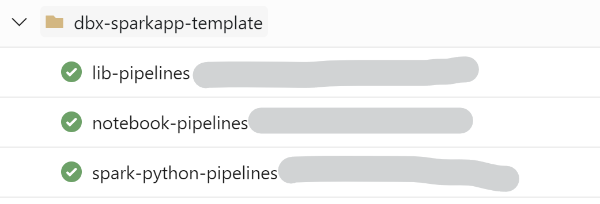

- Import [./devops/notebook-pipelines.yml](./devops/notebook-pipelines.yml) as build pipeline. This pipeline tests and uploads the notebooks to databricks workspace.

> Here is a [post](https://stackoverflow.com/questions/59067096/create-a-new-pipeline-from-existing-yml-file-in-the-repository-azure-pipelines) to introduce how to import a yaml file as Azure DevOps pipeline from Azure DevOps repository.

- Import [./devops/lib-pipelines.yml](./devops/lib-pipelines.yml) as build pipeline. This pipeline tests and uploads the python library to databricks cluster as a library.

You need to select branch to run the pipeline for different environments.

- Manually run the pipeline from **develop branch** to deploy the library to Databricks in develop environment
- Manually run the pipeline from **staging branch** to deploy the library to Databricks in staging environment
- Manually run the pipeline from **production branch** to deploy the library to Databricks in production environment

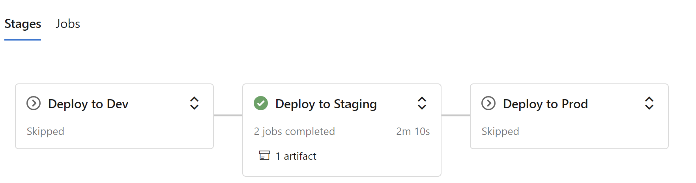

> If no library is required in your notebooks project, you need remove the Import statement in notebooks.

- Create 3 Variable Group as the names below.
  - Databricks-dev-environment
  - Databricks-stg-environment
  - Databricks-prod-environment

    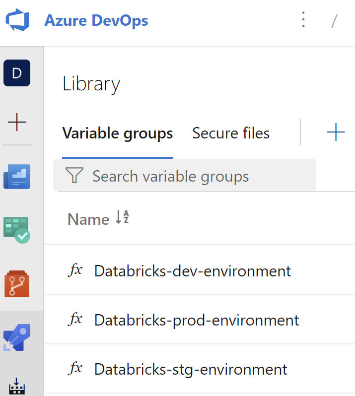

  Each variable group has 3 variables:

  - **databricksClusterId_[dev|stg|prod]**: the id of Databricks cluster.
  - **databricksDomain_[dev|stg|prod]**: the url of Databricks workspace.
  - **databricksToken_[dev|stg|prod]**: the access token of Databricks.

    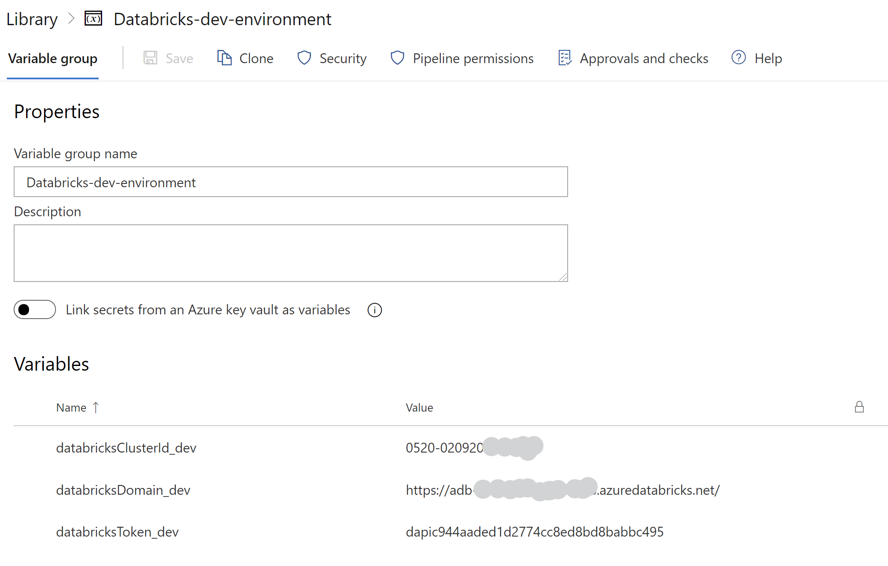

> Here are the [document](https://docs.microsoft.com/en-us/azure/devops/pipelines/library/variable-groups?view=azure-devops&tabs=classic) of how to create variable groups, and the [document](https://docs.databricks.com/dev-tools/api/latest/authentication.html#generate-a-personal-access-token) of how to get the token.

#### 2.4.3 Import into DEV databricks workspace

Follow this [document](https://docs.microsoft.com/en-us/azure/databricks/repos) you can import the notebooks from the repository to databricks workspace.

  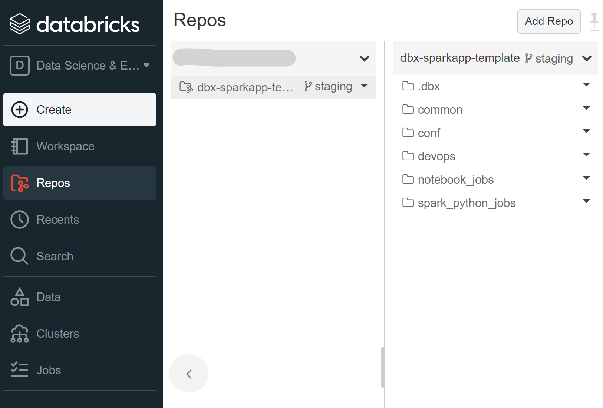

#### 2.4.4 Implement and run tests in DEV databricks workspace

- Switch to **develop branch**.
- Open one of the notebook to edit.
- Open the relevant testing notebook to run and check.
- Commit and push the changes to **develop branch**.

  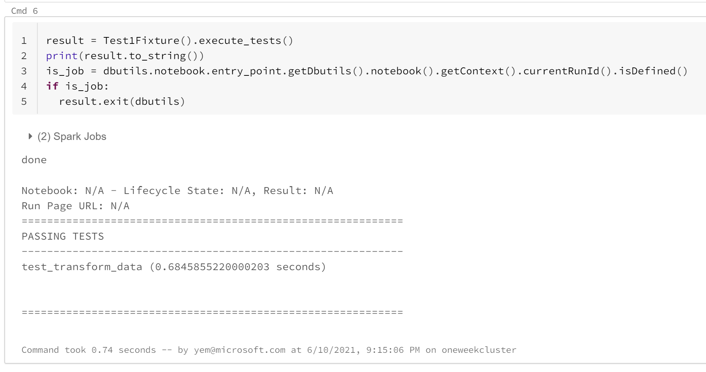

#### 2.4.5 Run test with pipelines

- Create a pull request from **develop branch** to **staging branch**
- Complete the merge, it triggers the pipeline to run tests at staging databricks cluster.

Or

- Manually run the pipeline from **staging branch**

  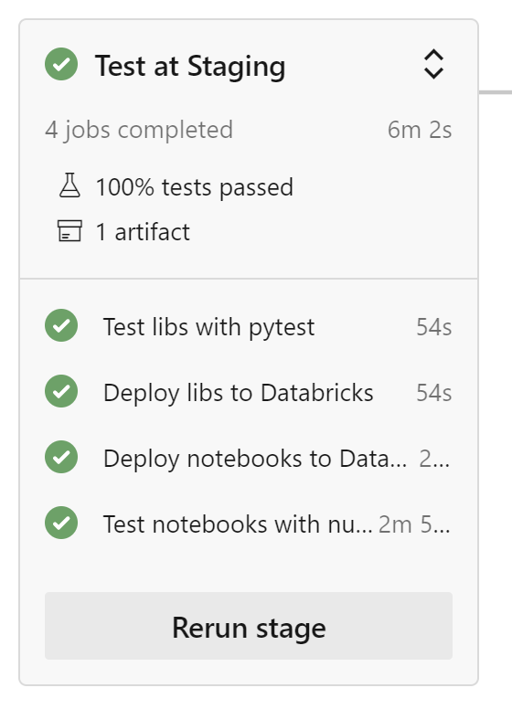

#### 2.4.6 Deployment

- Create a pull request from **staging branch** to **production branch** or directly run the pipeline on release branch.
- It triggers the pipeline to run tests and import notebooks into production databricks workspace.

Or

- Manually run the pipeline from **production branch**

>The pipeline does not create job with the notebooks.

  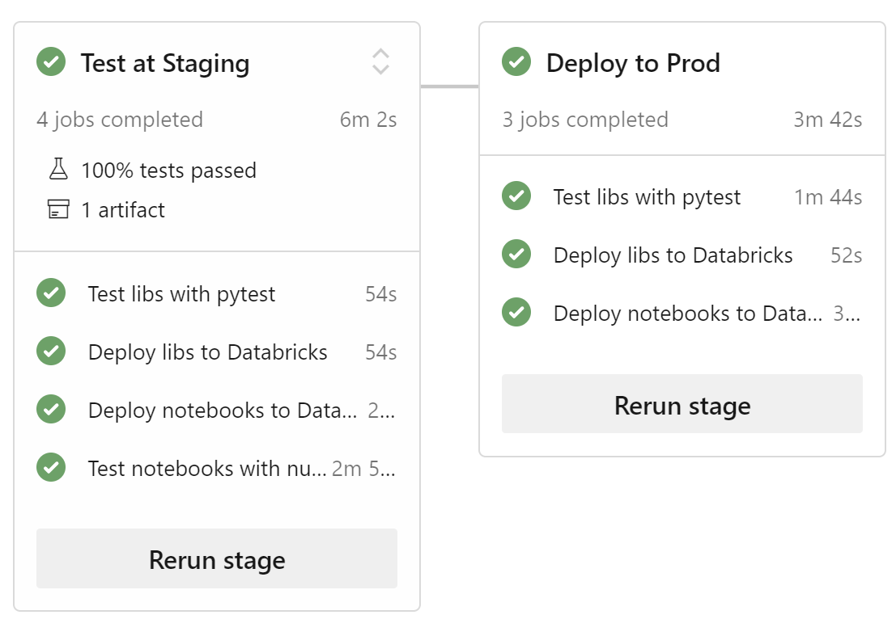

### 2.5. The Spark Python Approach

This is to support the job of [Spark Submit](https://docs.microsoft.com/en-us/azure/databricks/jobs). In this approach, you can develop Spark application in local IDE and submit to Databricks cluster to run it.

#### 2.5.1 Repository setup

Please follow [2.4.1 Repository setup](#241-Repository-setup)

#### 2.5.2 DevOps pipeline setup

In this repo, there are several yaml files, which are the pipelines to support the CI/CD. You need to import the yaml as build pipeline.

- Import [./devops/spark-python-pipelines.yml](./devops/spark-python-pipelines.yml) as build pipeline. This pipeline tests and uploads the notebooks to databricks workspace.

#### 2.5.3 Implement and run tests in VSCode

- Clone the repo into your local folder and open the folder with VSCode

##### 2.5.3.1 Run tests using devcontainer

- If needed, install Microsoft VSCode Remote-Containers extension
- In VSCode, open Command Pallete and type ```Remote-Containers: Open Folder in Container...```
- Choose the folder named ```***\sample4_ci_cd```
- Wait for the devcontainer to start and then in the VSCode terminal window, run the script below to start the tests.

```bash
pytest common/tests
pytest spark_python_jobs/tests/unit
```

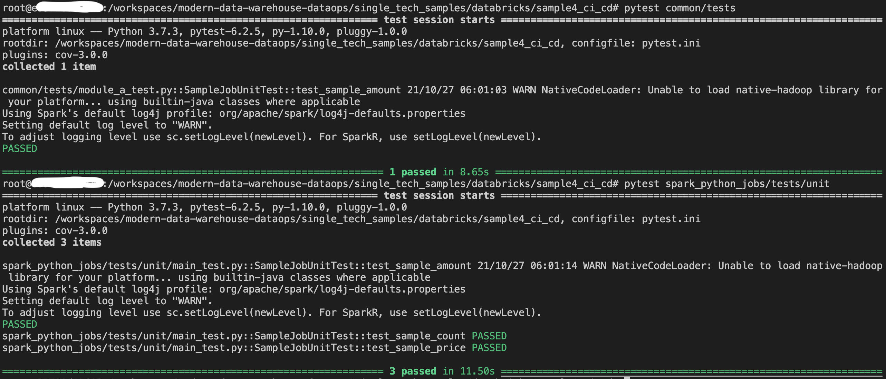

##### 2.5.3.2 Run tests in your local environment

- Setup local Spark with this [document](https://sigdelta.com/blog/how-to-install-pyspark-locally/)
- Open a cmd terminal window and run the script below to setup the project development.

```bash
pip install -r requirements.txt
```

- Edit [main.py](./spark_python_jobs/main.py) file in VSCode.

- In  cmd terminal window and run the script below to start the tests.

```bash
pytest common/tests
pytest spark_python_jobs/tests/unit
```

  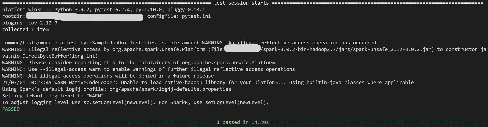
  
#### 2.5.4 Run test with pipelines

- Commit and push the changes to **develop branch**.
- Create a pull request from **develop branch** to **staging branch**
- Complete the merge, it will trigger the pipeline to run tests at staging databricks cluster.

Or

- Manually run the pipeline from **staging branch**

  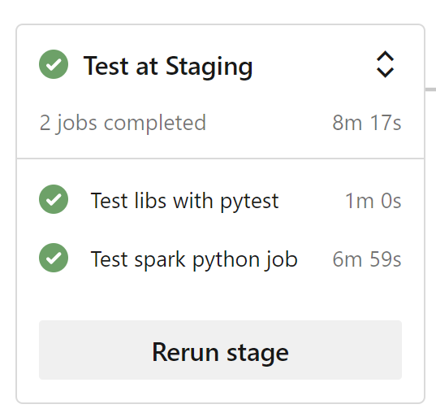

#### 2.5.5 Deployment

- Create a pull request from **staging branch** to **production branch** or directly run the pipeline
- Complete the merge, it will trigger the pipeline to run tests and create a job in production databricks.

Or

- Manually run the pipeline from **production branch**

  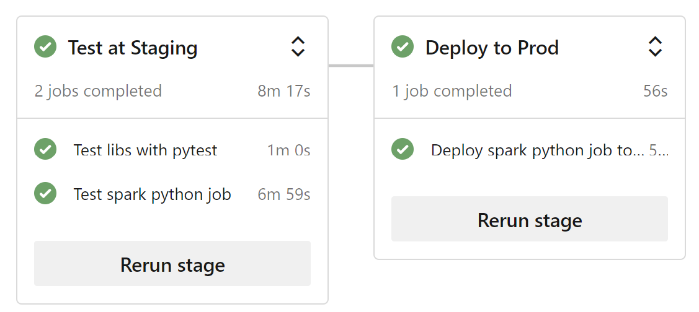
  