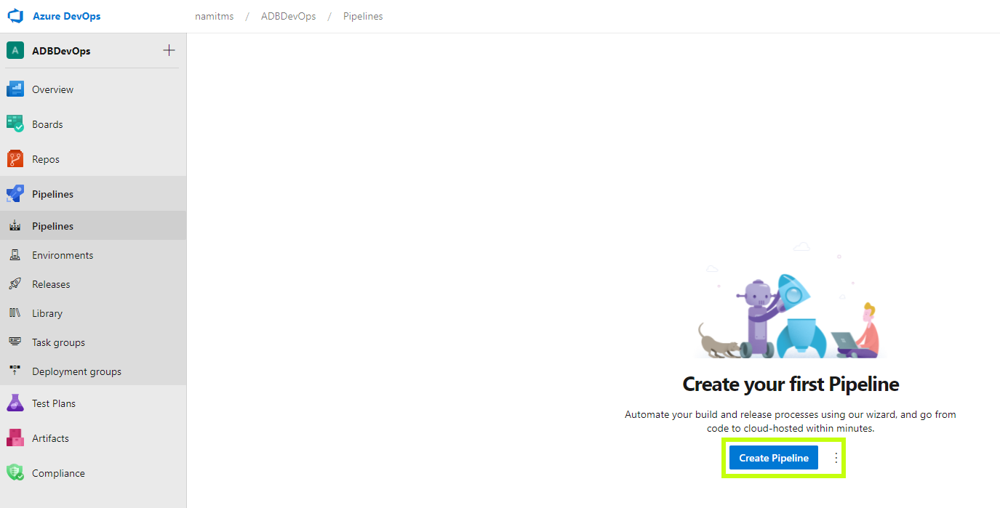
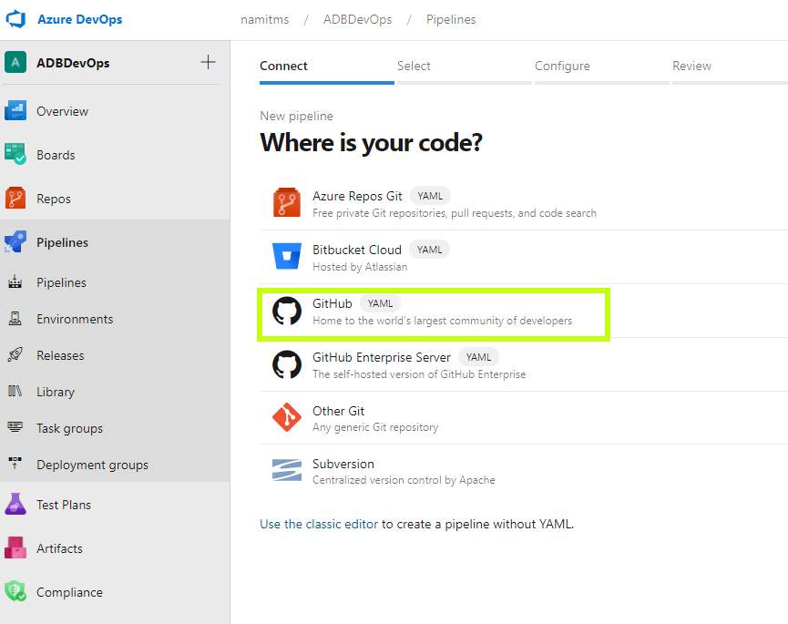
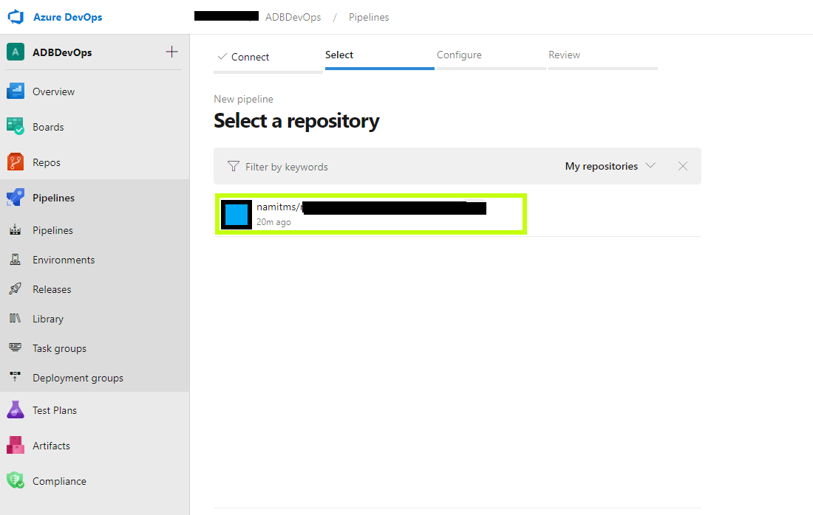
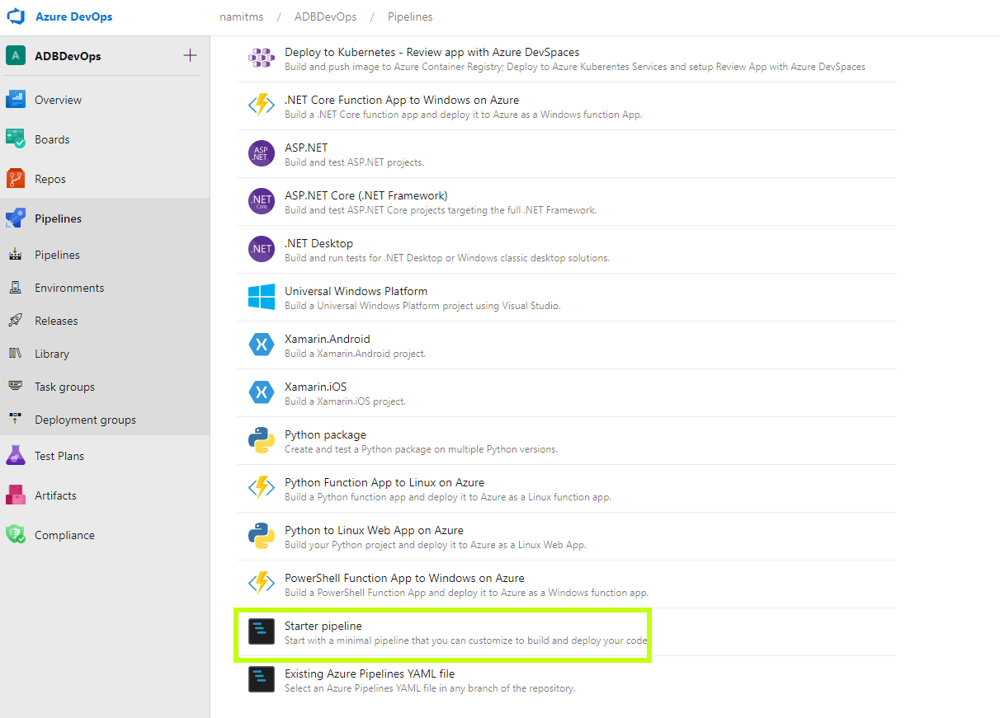
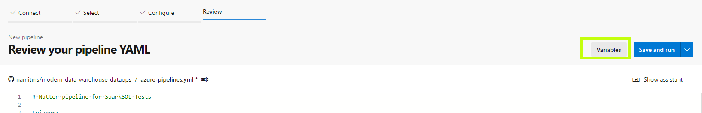
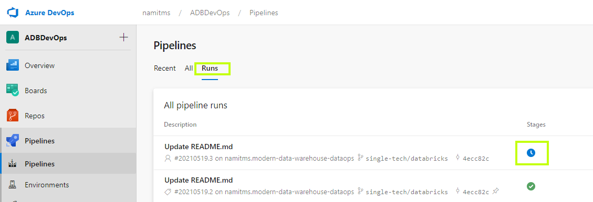
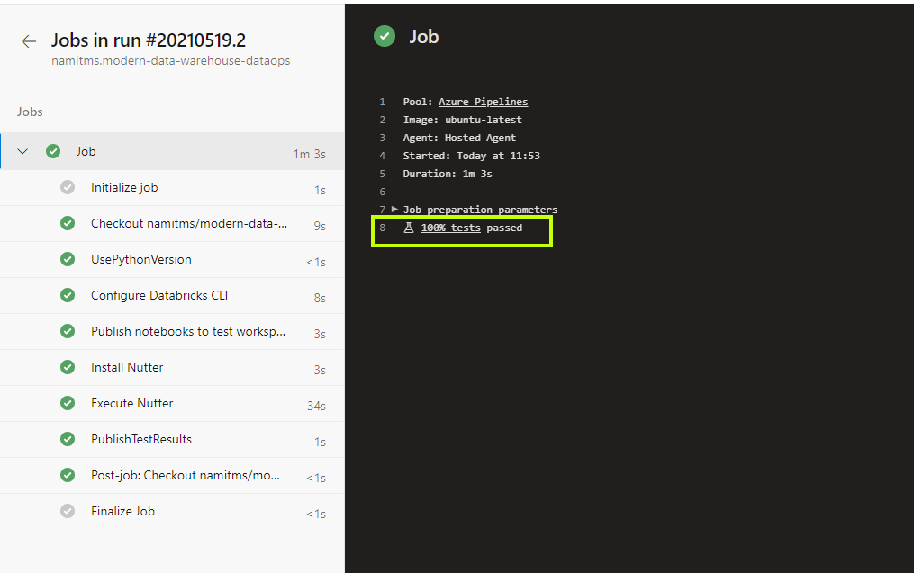
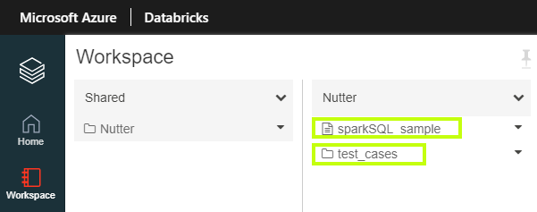
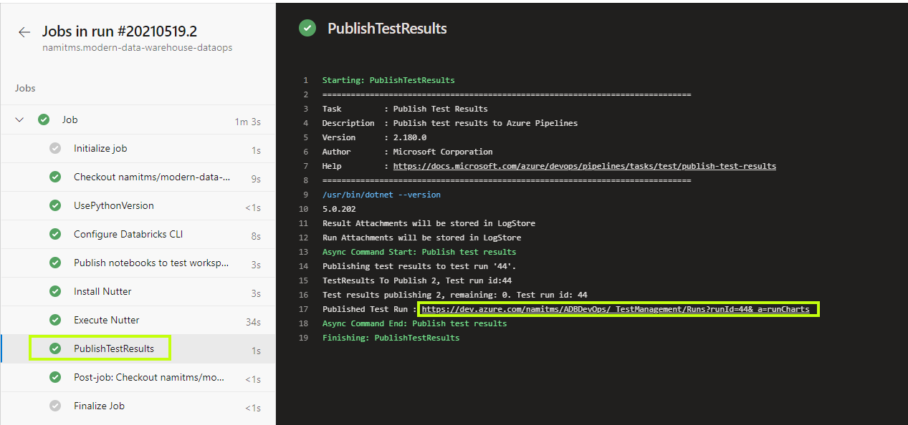
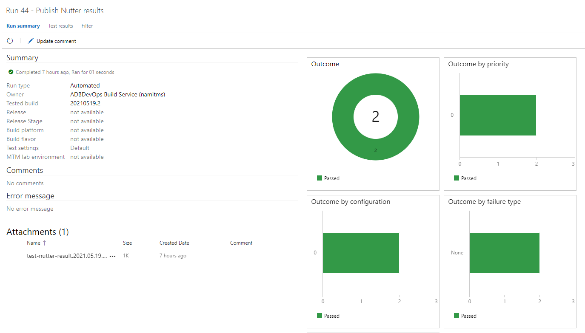

# Unit testing SparkSQL Notebooks using Nutter <!-- omit in toc -->

## Contents <!-- omit in toc -->

- [1. Solution Overview](#1-solution-overview)
  - [1.1. Scope](#11-scope)
  - [1.3. Technologies used](#13-technologies-used)
- [2. How to use this sample](#2-how-to-use-this-sample)
  - [2.1. Prerequisites](#21-prerequisites)
    - [2.1.1 Software Prerequisites](#211-software-prerequisites)
  - [2.2. Setup and deployment](#22-setup-and-deployment)
  - [2.3. Deployed Resources](#23-deployed-resources)
  - [2.4. Deployment validation](#24-deployment-validation)
  - [2.5. Clean-up](#25-clean-up)

## 1. Solution Overview

The objective of this sample is to demonstrate how SparkSQL notebooks deployed within Azure DAtabricks can be unit tested. This sample uses the [Microsoft Nutter](https://github.com/microsoft/nutter) framework as a tool to author and execute unit tests. The solution also demonstrates how the Azure DevOps pipeline can be used to set up Continues Delivery of SparkSQL notebook and the test cases.

### 1.1. Scope

The following list captures the high-level scope of this sample:

1. Create a sample SparkSQL notebook with 2 queries.
2. Create test cases to verify the correctness of the SparkSQL queries.
3. Create a sample Azure DevOps pipeline to deploy the SparkSQL notebook and the test cases to run and verify it on an existing Azure Databricks environment from Sample 3 ([Cluster provisioning and enabling data access on a pre-provisioned Azure Databricks Workspace](../../sample3_cluster_provisioning_and_data_access/README.md)).

### 1.3. Technologies used

The following technologies are used to build this sample:

- [Azure Databricks](https://azure.microsoft.com/en-au/free/databricks/)
- [Azure Storage](https://azure.microsoft.com/en-au/services/storage/data-lake-storage/)
- [Azure Key Vault](https://azure.microsoft.com/en-au/services/key-vault/)
- [Azure DevOps](https://azure.microsoft.com/en-au/services/DevOps/)
- [Microsoft Nutter](https://github.com/microsoft/nutter)

## 2. How to use this sample

This section holds the information about usage instructions of this sample.

### 2.1. Prerequisites

> Note: Running [Sample 1](../../sample1_basic_azure_databricks_environment/README.md) (for provisioning the Azure Databricks Service) and [Sample 3](../../sample3_cluster_provisioning_and_data_access/README.md) (for creating the cluster and mounting the required data sources) are preconditions for this sample to work.

The following are the prerequisites for deploying this sample :

1. [Github account](https://github.com/)
2. [Azure Account](https://azure.microsoft.com/en-au/free/search/?&ef_id=Cj0KCQiAr8bwBRD4ARIsAHa4YyLdFKh7JC0jhbxhwPeNa8tmnhXciOHcYsgPfNB7DEFFGpNLTjdTPbwaAh8bEALw_wcB:G:s&OCID=AID2000051_SEM_O2ShDlJP&MarinID=O2ShDlJP_332092752199_azure%20account_e_c__63148277493_aud-390212648371:kwd-295861291340&lnkd=Google_Azure_Brand&dclid=CKjVuKOP7uYCFVapaAoddSkKcA)
   - *Permissions needed*:  The ability to create and deploy to an Azure [resource group](https://docs.microsoft.com/en-us/azure/azure-resource-manager/management/overview), a [service principal](https://docs.microsoft.com/en-us/azure/active-directory/develop/app-objects-and-service-principals), and grant the [collaborator role](https://docs.microsoft.com/en-us/azure/role-based-access-control/overview) to the service principal over the resource group.

   - Active subscription with the following [resource providers](https://docs.microsoft.com/en-us/azure/azure-resource-manager/management/azure-services-resource-providers) enabled:
     - Microsoft.Databricks
     - Microsoft.DataLakeStore
     - Microsoft.Storage
     - Microsoft.KeyVault

3. [Azure DevOps Account](https://azure.microsoft.com/en-au/services/DevOps/)

#### 2.1.1 Software Prerequisites

1. [DevOps for Azure Databricks](https://marketplace.visualstudio.com/items?itemName=riserrad.azdo-databricks) plugin must be installed on your Azure DevOps instance.

### 2.2. Setup and deployment

Below listed are the steps to deploy this sample :

1. Fork and clone this repository. Navigate to (CD) `\single_tech_samples\databricks\sample4_ci_cd\notebook-sparksql`.

2. On your Azure DevOps instance, perform the following steps:
   1. Install [DevOps for Azure Databricks](https://marketplace.visualstudio.com/items?itemName=riserrad.azdo-databricks) if not already installed.

   2. Create a new Pipeline by following the below steps:
      1. Navigate to Pipeline blade and select 'Create Pipeline'
        
      2. Select Git Hub Adapter for the repo
        
      3. Point to the repo which you have previously forked
        
      4. Under configure tab, select the pipeline type as "Starter Pipeline"
        
      5. Replace the code for the pipeline with the code from the `ci-pipeline.yml` file under the [DevOps Folder](./devops/ci-pipeline.yml)
        
      6. Select the 'variables' button to set the environment variables
        
      7. Populate the following environment variables
         1. `notebook_folder_path` - Set it to "$(System.DefaultWorkingDirectory)/single_tech_samples/databricks/sample4_ci_cd/notebook-sparksql/notebooks".
         2. `clusterID` - Set the cluster ID for your existing Azure Databricks cluster. Details to find the cluster ID can be found [here](https://docs.microsoft.com/en-us/azure/databricks/workspace/workspace-details).
         3. `databricks_host` - Set the Databricks host URL for the existing Azure Databricks Service. Details to find the host URL can be found [here](https://docs.databricks.com/dev-tools/api/latest/authentication.html).
         4. `databricks_token` - Set the DAtabricks PAT token for the existing Azure Databricks service. Details to generate a token can be found [here](https://docs.databricks.com/dev-tools/api/latest/authentication.html).
         5. `test_search_folder` - Set this to `/Shared/` for default behavior.
         6. `workspace_folder` - Set this to `/Shared/Nutter` for default behavior.
3. Run the pipeline
4. Navigate to the run details page to view the run logs
   
5. On successful execution, you should see the following results.
   

### 2.3. Deployed Resources

The pipeline will copy the [Sample SparkSQL](notebooks/main_notebook.sql) Notebook and the notebook with the [nutter tests](notebooks/tests/main_notebook_test.py) to the target workspace as it runs. you should be able to navigate to the Azure Databricks Workspace to view these files

### 2.4. Deployment validation

The result of the test runs is published by the `PublishTestResult` Task.

A successful run will result in an inference page as shown below:

### 2.5. Clean-up

Executing the cleanup scripts from [Sample 3](../../sample3_cluster_provisioning_and_data_access/README.md) will also clean up the notebooks deployed by this sample.
