# Spark Application with Notebooks

## Sample Notebooks

Here is a sample spark application with notebooks and testing notebooks.

- [main_notebook.py](./main_notebook.py)

    The notebook uses Spark DataFrame API to process a data, and it imports a method declared in the [module_a_notebook.py](./main_notebook.py). The code below shows how to include the notebook.

    ```python
    %run ./module_a_notebook
    ```

- [module_a_notebook.py](./module_a_notebook.py)

    This notebook has a method and is used by the notebook [main_notebook.py](./main_notebook.py).

- [main_notebook_sql.py](./main_notebook_sql.py)

    This notebook shows how to use Spark Sql to process data.

- [tests/main_notebook_test.py](./tests/main_notebook_test.py)

    It is the [nutter](https://github.com/microsoft/nutter) based notebook testing, it run the notebook as below.

    ```python
    %run ../main_notebook
    ```

    It compares the expected result with the actual

    ```python
    class Test1Fixture(NutterFixture):
        def __init__(self):
            self.actual_df = None
            NutterFixture.__init__(self)
            
        def run_test_transform_data(self):
            self.actual_df = transform_data(df)
            
        def assertion_test_transform_data(self):
            assert(self.actual_df.collect() == expected_df.collect())
    ```

- [tests/module_a_notebook_test.py](./tests/main_notebook_test.py)

    It is the [nutter](https://github.com/microsoft/nutter) based notebook testing, it runs the notebook as below.

    ```python
    %run ../module_a_notebook
    ```

    It compares the expected result with the actual

    ```python
    class Test1Fixture(NutterFixture):
        def __init__(self):
            self.actual_df = None
            NutterFixture.__init__(self)
            
        def run_test_add_mount(self):
            self.actual_df = add_mount(df, 10)
            
        def assertion_test_add_mount(self):
            assert(self.actual_df.collect() == expected_df.collect())
    ```

- [tests/main_notebook_sql.py](./tests/main_notebook_sql.py)

    It is the [nutter](https://github.com/microsoft/nutter) based notebook testing, it run the notebook as below.

    ```python
    dbutils.notebook.run('../main_notebook_sql', 600)
    ```

## Installing a project from the template

```bash
git clone https://github.com/Azure-Samples/modern-data-warehouse-dataops.git 
cd modern-data-warehouse-dataops
git checkout single-tech/databricks-ops
git archive --format=tar single-tech/databricks-ops:single_tech_samples/databricks/sample4_ci_cd/notebook | tar -x -C ../
cd ..
rm -rf modern-data-warehouse-dataops

git init
git remote add origin <your repo url>
git add -A
git commit -m "first commit"
git push -u origin --all
```

## How to setup and run the CI pipeline

The yaml file of the ci pipeline is [./doveops/ci-pipeline.yml](./doveops/ci-pipeline.yml)

1. In the project pipeline page, click the "New pipeline" Button.

    

2. Select the Azure Repo Git option.

    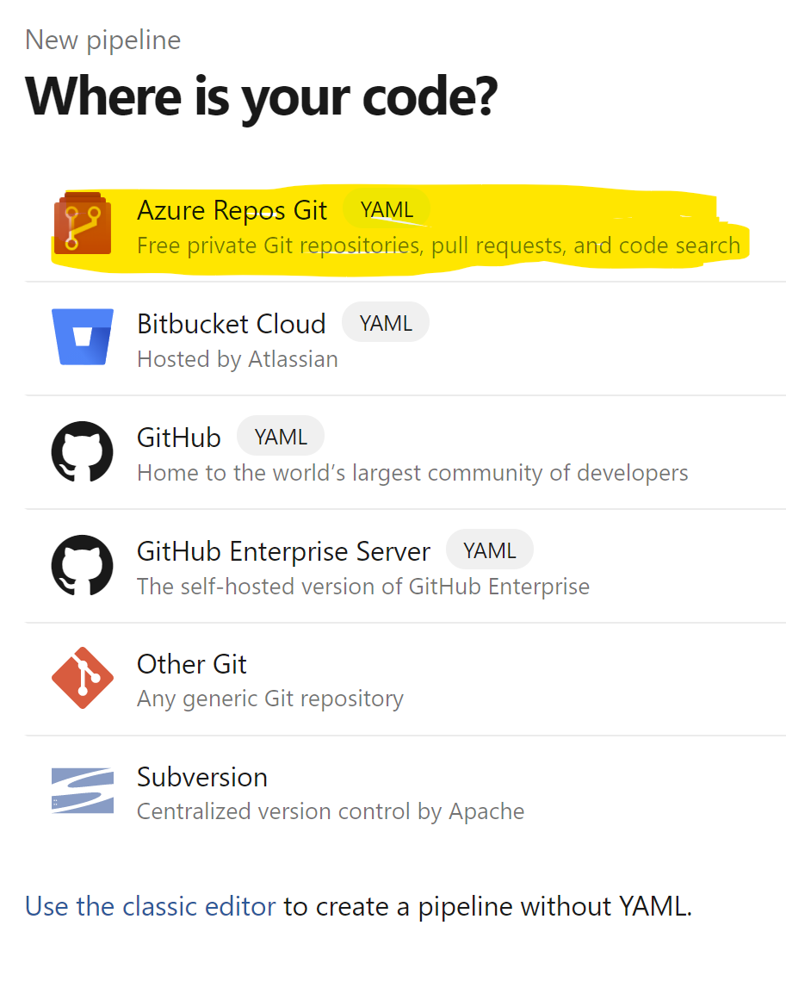

3. Select the repository which has the ci-pipeline.yml file.

    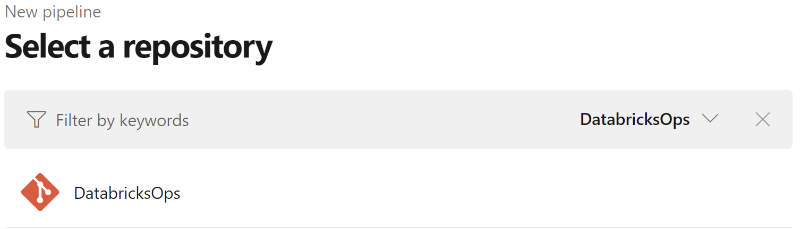

4. Select the Existing Azure Pipelines YAML file.

    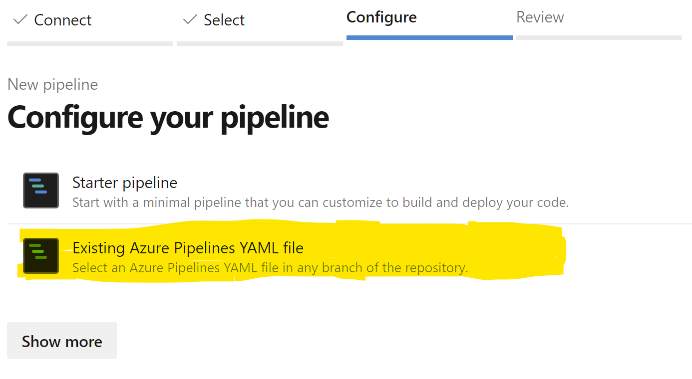

5. Select the branch and Path to the  the ci-pipeline.yml file.

    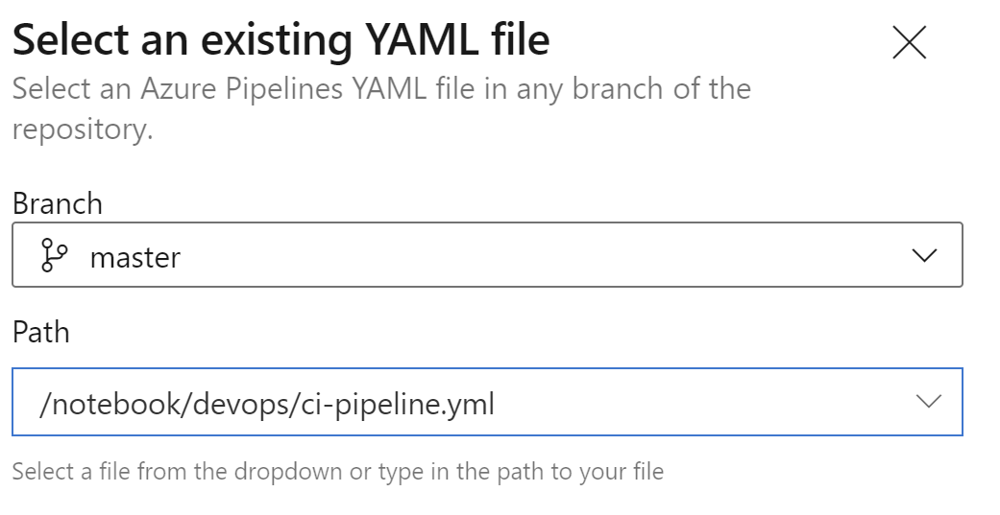

6. Review the pipeline and click Save.

    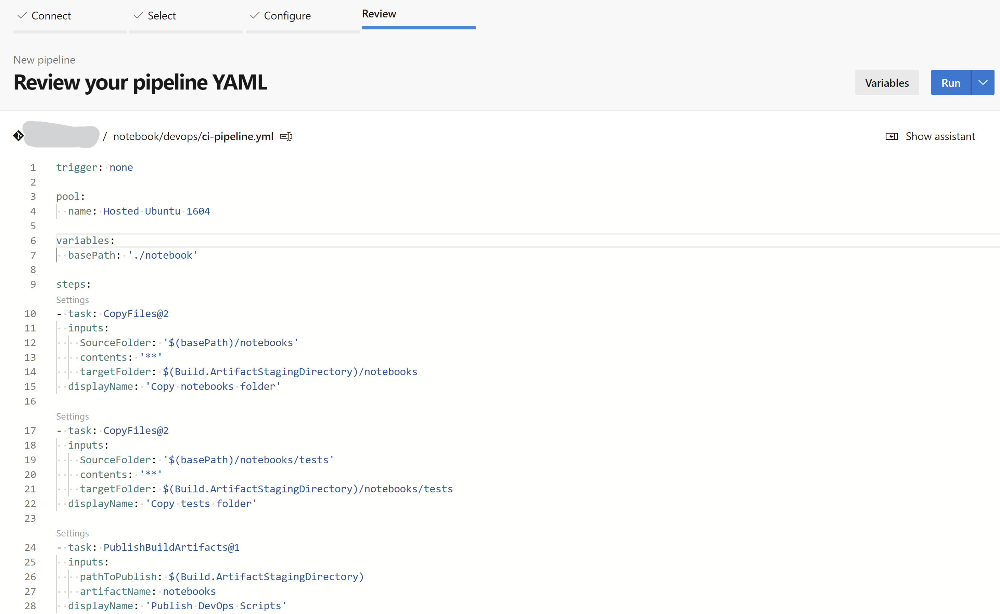

7. Rename the pipeline, such as "dbx_ci_pipeline".

    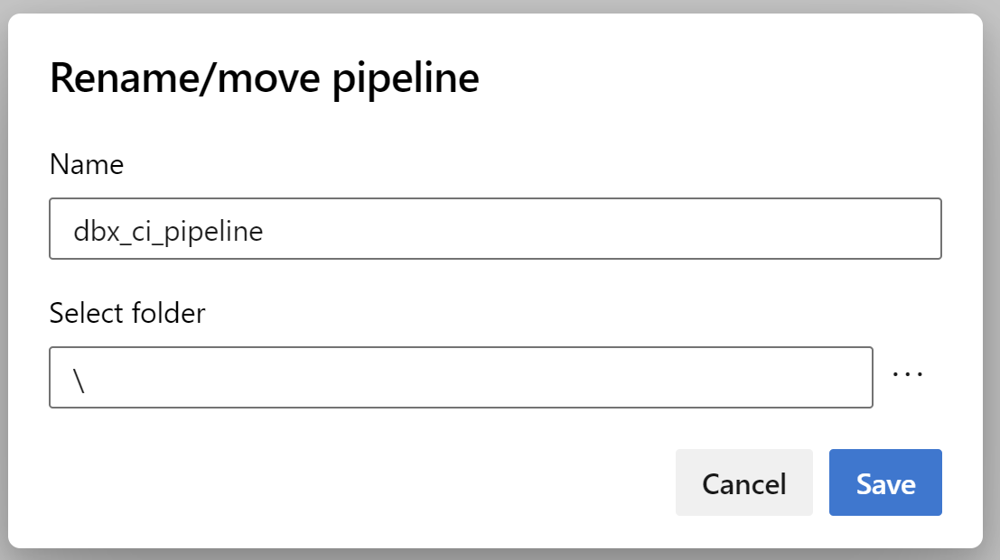

8. Run the pipeline.

    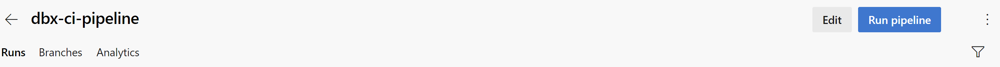

9. Check the result.

    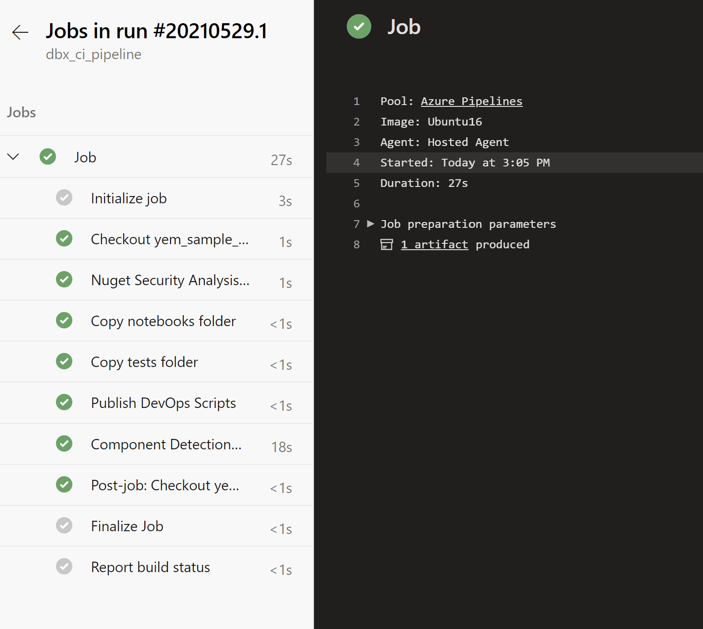

## How to setup and run the CD pipeline

The yaml file of the cd pipeline is [./doveops/cd-pipeline.yml](./doveops/cd-pipeline.yml.

the first 6 steps is the same as ci-pipeline.

1. In the project pipeline page, click the "New pipeline" Button.

    

2. Select the Azure Repo Git option.

    

3. Select the repository which has the ci-pipeline.yml file.

    

4. Select the Existing Azure Pipelines YAML file.

    

5. Select the branch and path of the cd-pipeline.yml file.

    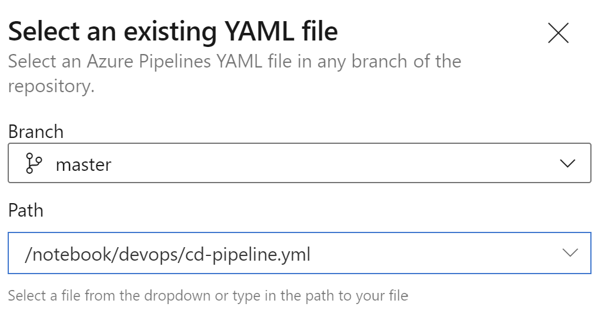

6. Change the name of ci pipeline created in last step, such as 'dbx_ci_pipeline', and create a Varibale Group in Library.

    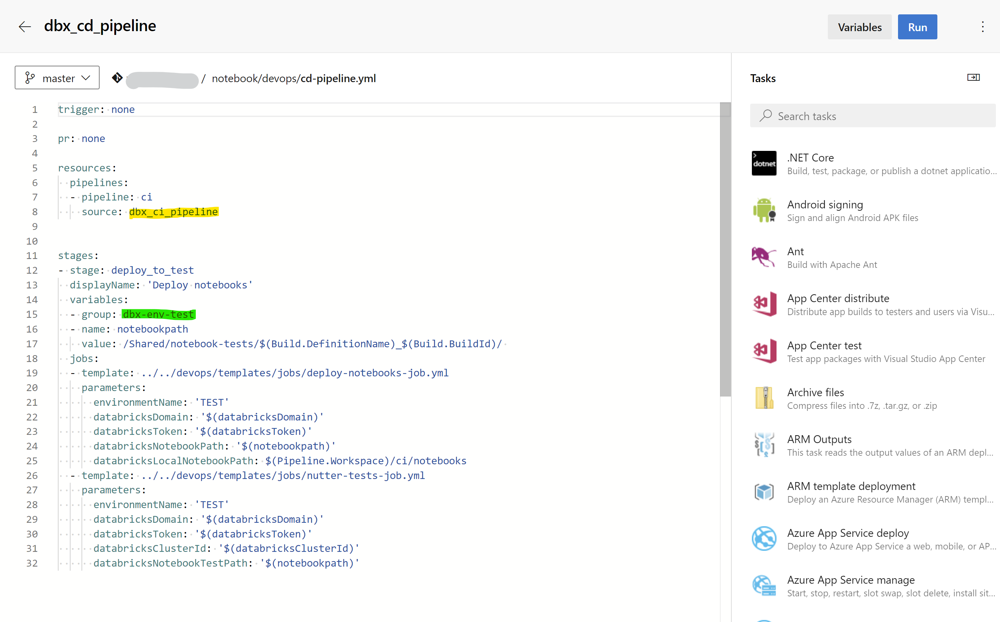

7. Rename the pipeline, such as "dbx_cd_pipeline".

    

8. Create Variable Group.

    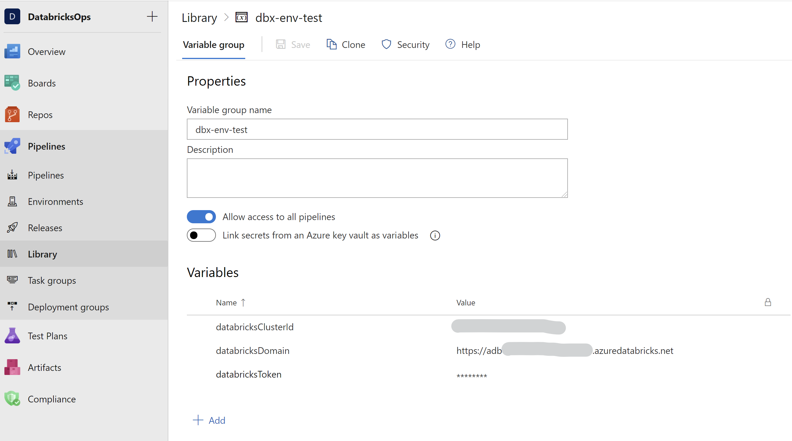

    The variable group has 3 variables:

    - **databricksClusterId**: the id of Databricks cluster
    - **databricksDomain**: the url of Databricks
    - **databricksToken**: the access token of Databricks, Here is [a docuemnt how to get the token](https://docs.databricks.com/dev-tools/api/latest/authentication.html#generate-a-personal-access-token).

9. Run the pipeline.

    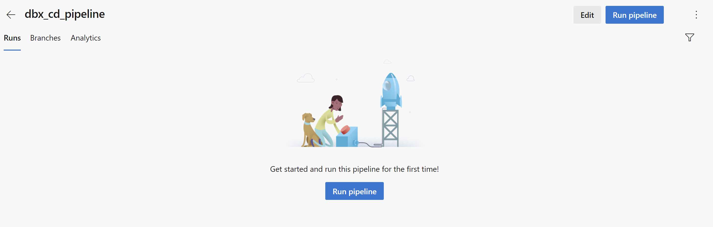
    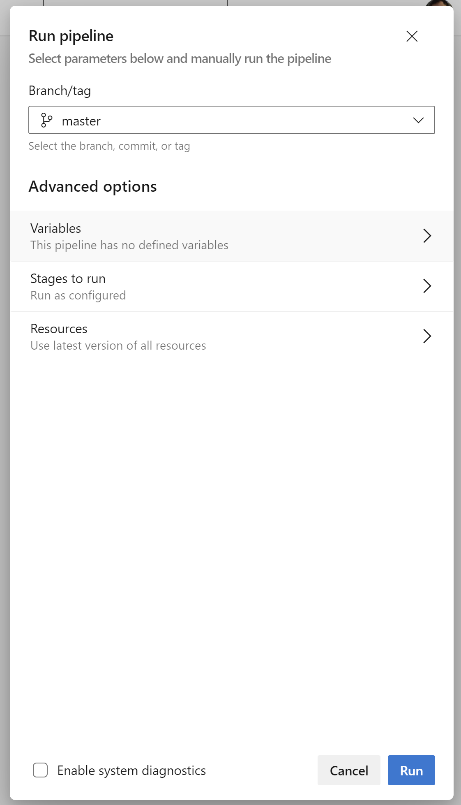

10. Check the result.

    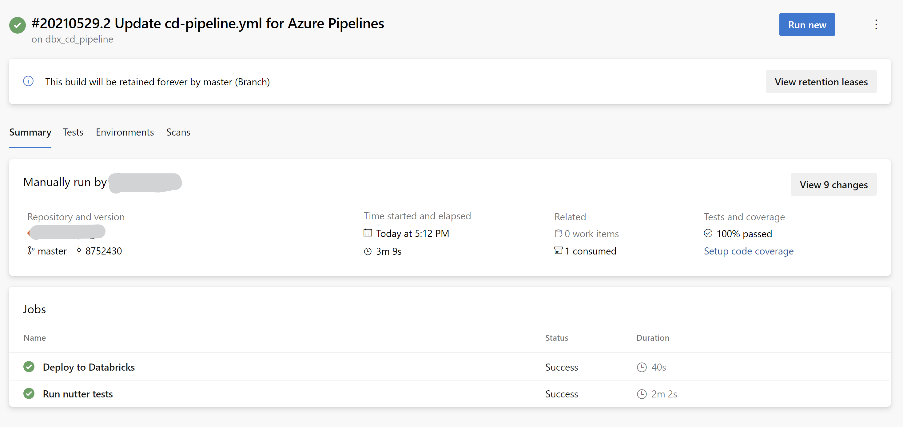
