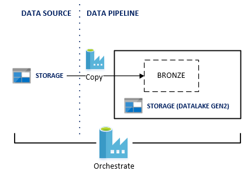
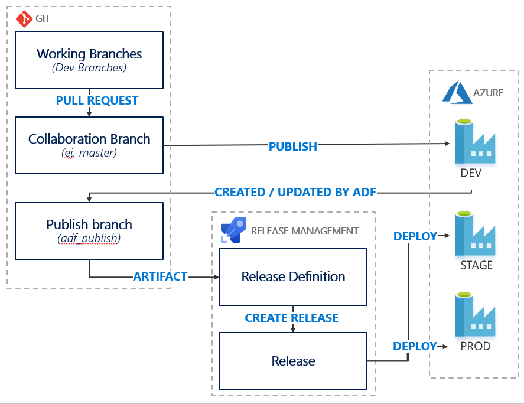
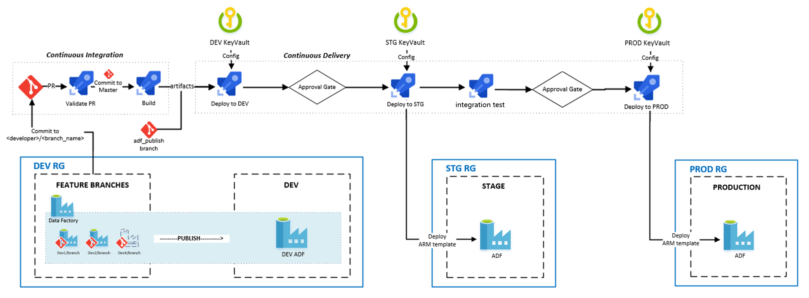
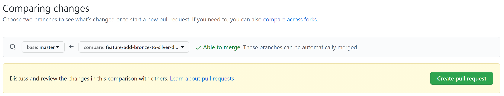
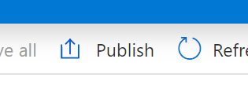
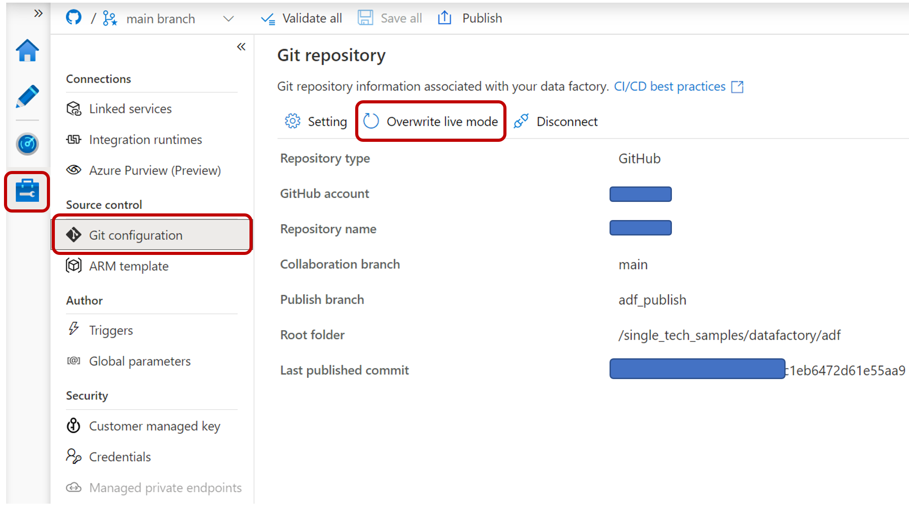
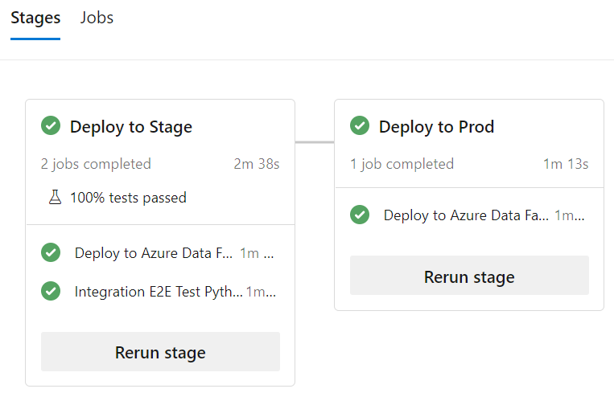
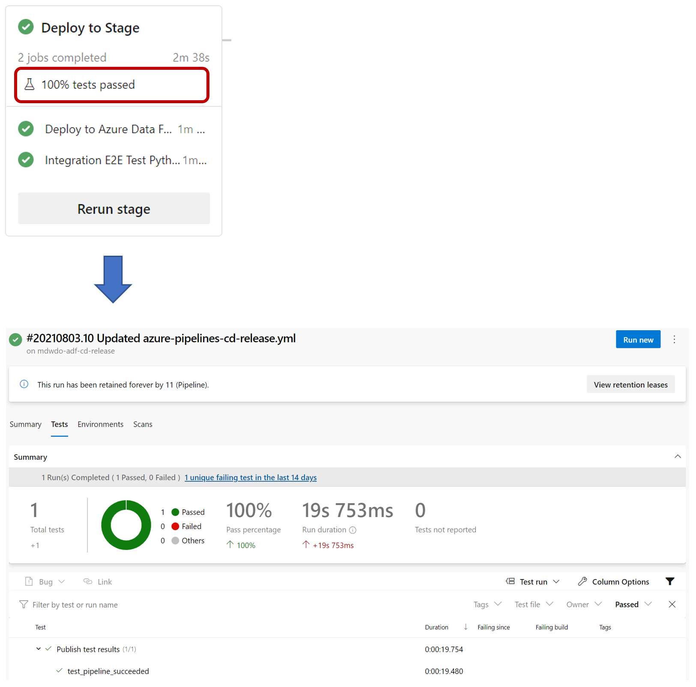
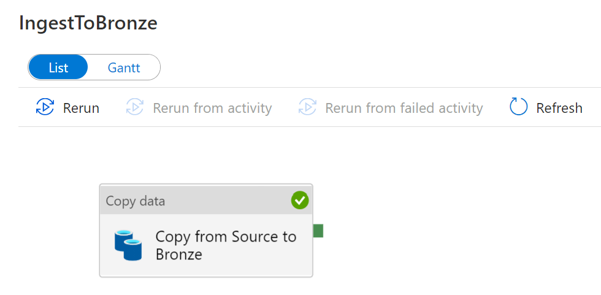

# DataOps with Azure Data Factory <!-- omit in toc -->

This sample demonstrates how to apply DevOps with Azure Data Factory (ADF) by source controlling the data flows, and using a CI/CD pipeline to propagate changes in the data flows to the staging and production environment

## Contents <!-- omit in toc -->

- [Solution Overview](#solution-overview)
  - [Architecture](#architecture)
  - [Continuous Integration and Continuous Delivery](#continuous-integration-and-continuous-delivery)
  - [Technologies used](#technologies-used)
- [Key Learnings](#key-learnings)
  - [1. Add data pipelines to source control](#1-add-data-pipelines-to-source-control)
  - [2. Publish data pipelines in an automated fashion with CI/CD pipelines](#2-publish-data-pipelines-in-an-automated-fashion-with-cicd-pipelines)
  - [3. Store secrets used by the pipelines in Key Vault](#3-store-secrets-used-by-the-pipelines-in-key-vault)
- [Key Concepts](#key-concepts)
  - [Working with ADF and git](#working-with-adf-and-git)
  - [Data Lake Organization](#data-lake-organization)
  - [Build and Release Pipeline](#build-and-release-pipeline)
  - [Environments](#environments)
    - [Build and Release Sequence](#build-and-release-sequence)
    - [Resources](#resources)
- [How to use the sample](#how-to-use-the-sample)
  - [Prerequisites](#prerequisites)
    - [Software pre-requisites](#software-pre-requisites)
  - [Setup and Deployment](#setup-and-deployment)
    - [Deployed Resources](#deployed-resources)
  - [Known Issues, Limitations and Workarounds](#known-issues-limitations-and-workarounds)

## Solution Overview

This solution sets up an [Azure Data Lake Gen2](https://docs.microsoft.com/en-us/azure/storage/blobs/data-lake-storage-introduction) storage account, with a folder structure that enables data tiering (bronze, silver, gold), and an [Azure Data Factory](https://azure.microsoft.com/en-au/services/data-factory/)(ADF) instance with linked services connecting to the data lake, to a separate file share and a [key vault](https://azure.microsoft.com/en-us/services/key-vault/) for secrets.

The Azure Data Factory contains a simple pipeline taking data from the file share and ingesting it to the bronze folder.

The ADF Pipeline definitions are stored in a git repository, and the CI/CD pipelines defined in Azure DevOps takes the produced ARM templates and deploys these across environments. And how to leverage [pytest-adf](https://github.com/devlace/pytest-adf) do the integration testing.

The main purpose of this sample is not to showcase the data flows, but rather how to work with source control, and continuous delivery to ensure that the data flows are properly versioned, that you can re-create old datasets, and that any new changes are propagated to all environments.

### Architecture

The following shows the simple architecture of the Azure Data Factory Data Pipeline.

### Continuous Integration and Continuous Delivery

The following shows the logical flow of performing CI/CD with Azure Data Factory.

The following shows the overall CI/CD process as built with Azure DevOps Pipelines.

### Technologies used

- [Azure Data Factory](https://azure.microsoft.com/en-au/services/data-factory/)
- [Azure Data Lake Gen2](https://docs.microsoft.com/en-us/azure/storage/blobs/data-lake-storage-introduction)
- [Azure Key Vault](https://azure.microsoft.com/en-us/services/key-vault/)
- [Azure DevOps](https://azure.microsoft.com/en-au/services/devops/)
- [pytest-adf](https://github.com/devlace/pytest-adf)

## Key Learnings

The following summarizes key learnings and best practices demonstrated by this sample solution

### 1. Add data pipelines to source control

As with other code, pipelines generated in Azure Data Factory should be backed by source control.

This has many benefits, among others:

- Allows for collaboration between team members. Ideally changes to the data flow should be done through pull requests, with code reviews, to ensure good code quality.
- Allows for versioning of data flows, and returning to earlier versions to re-create a dataset
- Ensures that the data flows are not lost even if the Azure Data Factory is deleted.

### 2. Publish data pipelines in an automated fashion with CI/CD pipelines

- Include all artifacts needed to build the data pipeline from scratch in source control. This includes infrastructure-as-code artifacts, database objects (schema definitions, functions, stored procedures, etc), reference/application data, data pipeline definitions and data validation and transformation logic.
- There should be a safe, repeatable process to move changes through dev, test and finally production
- Ensure data pipelines are functioning as expected through [automated integration tests](tests/integrationtests/tests/README.md).

### 3. Store secrets used by the pipelines in Key Vault

- Maintain a central, secure location for sensitive configuration such as database connection strings, file server keys, etc, that can be accessed by the appropriate services within the specific environment.
- In this example we secure the secrets in one KeyVault per environment, and set up a linked service in ADF to query for the secrets.

## Key Concepts

### Working with ADF and git

ADF has built in git integration, and stores all the pipelines, datasets, linked services etc. as ARM templates in source control.

A typical workflow for a git backed ADF instance looks like follows.

1. Create a new branch in ADF

   
2. Make changes to the data flows, save the changes and create a pull request

   
   
3. Once the pull request is approved and merged, publish the changes in ADF

   

This will publish all the changes to the adf_publish branch, this will in turn trigger the CI/CD pipelines for promotion to staging and production.

> NOTE: Only the ADF instance in the DEV environment should be backed by git. The data flows are propagated to the other environments by CI/CD pipelines

### Data Lake Organization

In this sample, we have chosen to create separate folders in the data lake for the different datasets/data products. You may also want to add a separate folder or storage area for `malformed` data (data that fails validation from bronze to silver), a separate `sys` folder for scripts, libraries or other binaries, and a `sandbox` area, for intermediate datasets or other assets used in the process of generating new data products.

If multiple teams work on the same data lake, one option is also to create a separate container for each team, with their own tiered structure, each team with their own Azure Data Factory to allow for separation of data, pipelines and data access.

> NOTE: To allow reading and writing of data lake folders from ADF, the ADF Managed Identity needs the [Storage Blob Data Reader and Storage Blob Data Contributor Role](https://docs.microsoft.com/en-us/azure/data-factory/connector-azure-blob-storage), this is configurable on the container level.

### Build and Release Pipeline

Both Build and Release Pipelines are built using Azure DevOps

### Environments

- **Dev** - the DEV resource group is used by developers to build and test their solutions.
- **Stage** - the STG resource group is used to test deployments prior to going to production in a production-like environment. Any integration tests are run in this environment
- **Production** - the PROD resource group is the final Production environment

Each environment has an identical set of resources

#### Build and Release Sequence

<!-- TODO: Add build and release sequence here -->

When a data flow developer clicks publish in ADF, this publishes the ARM template to the adf_publish branch which kicks off the CI/CD pipeline.

In the CI/CD pipeline, the following occurs:

1. Stop any existing ADF triggers in STG
2. Publish the ARM template to the STG environment
3. Restart any ADF triggers

This kicks off the PROD CI/CD pipeline.

**Optional** You can go into the pipeline and add a manual trigger for production.

> NOTE: all the resources that vary between environments, such as the data lake storage account, key vault etc. are exposed as ARM parameters. The [deploy-adf-job.yml](devops/templates/jobs/deploy-adf-job.yml) replaces the relevant parameters for each environment. If you add more linked services or other resources, make sure to update this pipeline.

#### Resources

- [Continuous integration and delivery in Azure Data Factory](https://docs.microsoft.com/en-us/azure/data-factory/continuous-integration-deployment)

## How to use the sample

### Prerequisites

1. [Github account](https://github.com/)
2. [Azure Account](https://azure.microsoft.com/en-au/free/search/?&ef_id=Cj0KCQiAr8bwBRD4ARIsAHa4YyLdFKh7JC0jhbxhwPeNa8tmnhXciOHcYsgPfNB7DEFFGpNLTjdTPbwaAh8bEALw_wcB:G:s&OCID=AID2000051_SEM_O2ShDlJP&MarinID=O2ShDlJP_332092752199_azure%20account_e_c__63148277493_aud-390212648371:kwd-295861291340&lnkd=Google_Azure_Brand&dclid=CKjVuKOP7uYCFVapaAoddSkKcA)
   - *Permissions needed*: ability to create and deploy to an azure [resource group](https://docs.microsoft.com/en-us/azure/azure-resource-manager/management/overview), a [service principal](https://docs.microsoft.com/en-us/azure/active-directory/develop/app-objects-and-service-principals), and grant the [collaborator role](https://docs.microsoft.com/en-us/azure/role-based-access-control/overview) to the service principal over the resource group.
3. [Azure DevOps Project](https://azure.microsoft.com/en-us/services/devops/)
   - *Permissions needed*: ability to create [service connections](https://docs.microsoft.com/en-us/azure/devops/pipelines/library/service-endpoints?view=azure-devops&tabs=yaml), [pipelines](https://docs.microsoft.com/en-us/azure/devops/pipelines/get-started/pipelines-get-started?view=azure-devops&tabs=yaml) and [variable groups](https://docs.microsoft.com/en-us/azure/devops/pipelines/library/variable-groups?view=azure-devops&tabs=yaml).

#### Software pre-requisites

- For Windows users, [Windows Subsystem For Linux](https://docs.microsoft.com/en-us/windows/wsl/install-win10)
- [az cli 2.6+](https://docs.microsoft.com/en-us/cli/azure/install-azure-cli?view=azure-cli-latest)
- [az cli - application insights extension](https://docs.microsoft.com/en-us/cli/azure/ext/application-insights/monitor/app-insights?view=azure-cli-latest)
  - To install, run `az extension add --name application-insights`
- [Azure DevOps CLI](https://marketplace.visualstudio.com/items?itemName=ms-vsts.cli)
  - To install, run `az extension add --name azure-devops`
- [jq](https://stedolan.github.io/jq/)

### Setup and Deployment

> **IMPORTANT NOTE:** As with all Azure Deployments, this will **incur associated costs**. Remember to teardown all related resources after use to avoid unnecessary costs. See [here](#deployed-resources) for list of deployed resources.

This deployment was tested using WSL 2 (Ubuntu 20.04)

1. **Initial Setup**
   1. Ensure that:
      - You are logged in to the Azure CLI. To login, run `az login`.
      - Azure CLI is targeting the Azure Subscription you want to deploy the resources to.
         - To set target Azure Subscription, run `az account set -s <AZURE_SUBSCRIPTION_ID>`
      - Azure CLI is targeting the Azure DevOps organization and project you want to deploy the pipelines to.
         - To set target Azure DevOps project, run `az devops configure --defaults organization=https://dev.azure.com/<MY_ORG>/ project=<MY_PROJECT>`
   2. **Import** this repository into a new Github repo. See [here](https://help.github.com/en/github/importing-your-projects-to-github/importing-a-repository-with-github-importer) on how to import a github repo. Importing is necessary for setting up git integration with Azure Data Factory.
   3. Set the following **required** environment variables:
       - **GITHUB_REPO** - Name of your imported github repo in this form `<my_github_handle>/<repo>`
       - **GITHUB_PAT_TOKEN** - a Github PAT token. Generate them [here](https://github.com/settings/tokens). This requires "repo" scope.

       Optionally, set the following environment variables:
       - **RESOURCE_GROUP_LOCATION** - Azure location to deploy resources. *Default*: `westus`.
       - **AZURE_SUBSCRIPTION_ID** - Azure subscription id to use to deploy resources. *Default*: default azure subscription. To see your default, run `az account list`.
       - **RESOURCE_GROUP_NAME_PREFIX** - name of the resource group. This will automatically be appended with the environment name. For example: `RESOURCE_GROUP_NAME_PREFIX-dev-rg`. *Default*: mdwdo-ado-${DEPLOYMENT_ID}.
       - **DEPLOYMENT_ID** - string appended to all resource names. This is to ensure uniqueness of azure resource names. *Default*: random five character string.
       - **AZDO_PIPELINES_BRANCH_NAME** - git branch where Azure DevOps pipelines definitions are retrieved from. *Default*: main.

      To further customize the solution, set parameters in `arm.parameters` files located in the `infrastructure` folder.

2. **Deploy Azure resources**
   1. Clone locally the imported Github Repo, then `cd` into the `single_tech_samples/datafactory` folder of the repo
   2. Run `./deploy.sh`.
      - After a successful deployment, you will find `.env.{environment_name}` files containing essential configuration information per environment. See [here](#deployed-resources) for list of deployed resources.
   3. As part of the deployment script, this updated the Azure DevOps Release Pipeline YAML definition to point to your Github repository. **Commit and push up these changes.**
      - This will trigger a Build and Release which will fail due to a lacking `adf_publish` branch -- this is expected. This branch will be created once you've setup git integration with your DEV Data Factory and publish a change.

3. **Setup ADF git integration in DEV Data Factory**
    1. In the Azure Portal, navigate to the Data Factory in the **DEV** environment.
    2. Click "Author & Monitor" to launch the Data Factory portal.
    3. On the landing page, select "Set up code repository". For more information, see [here](https://docs.microsoft.com/en-us/azure/data-factory/source-control).
    4. Fill in the repository settings with the following:
        - Repository type: **Github**
        - Github Account: **your_Github_account**
        - Git repository name: **imported Github repository**
        - Collaboration branch: **main**
        - Root folder: **/single_tech_samples/datafactory/adf**
        - Import Existing Data Factory resource to repository: **Selected**
        - Branch to import resource into: **Use Collaboration**
    5. When prompted to select a working branch, select **main**

   > **IMPORTANT NOTE:** Only the **DEV** Data Factory should be setup with Git integration. Do **NOT** setup git integration in the STG and PROD Data Factories.

4. **Trigger an initial Release**

   1. In the **DEV** Data Factory portal, click `Publish` to publish changes.
      - Publishing a change is **required** to generate the `adf_publish` branch which is required in the Release pipelines.
      - Tips：in some case after you click the 'Publish' button and publish succeed then you check the `adf_publish` there is no any data factory ARM Template json code here, please try Data Factory portal -> Manage -> Git Configuration -> Overwrite live mode then check `adf_publish` branch again ARM Template should be there.
      
   2. In Azure DevOps, notice a new run of the Build Pipeline (**mdw-adf-ci-artifacts**) off `main`.
   3. After completion, this should automatically trigger the Release Pipeline (**mdw-adf-cd-release**). This will deploy the artifacts across environments.
      - You may need to authorize the Pipelines initially to use the Service Connection for the first time.
      - Integration tests are automatically performed before the deployment to the Prod environment
      
      - If you want check more information about test results, you can view the test report
       
   4. **Optional**. Trigger the Data Factory Pipelines per environment.
      1. In the Data Factory portal of each environment, navigate to "Author", then select the `ParkingSensors\IngestToBronze` pipeline.
      2. Select "Trigger > Trigger Now".
      3. To monitor the run, go to "Monitor > Pipeline runs".
      

Congratulations!! 🥳 You have successfully deployed the solution and accompanying Build and Release Pipelines.

#### Deployed Resources

After a successful deployment, you should have the following resources:

- In Azure, **three Resource Groups** (one per environment) each with the following Azure resources.
  - **Data Factory** - with pipelines, datasets, linked services, triggers deployed and configured correctly per environment.
  - **Data Lake Store Gen2** and a **Service Principal (SP)** with Storage Contributor rights assigned.
  - **Blob storage** and a **Service Principal (SP)** with Storage Contributor rights assigned.
  - **KeyVault** with all relevant secrets stored.
- In Azure DevOps
  - **Two Azure Pipelines**
    - mdwdo-adf-cd-release - Release Pipeline
    - mdwdo-adf-ci-artifacts - Build Pipeline
  - **Three Variables Groups** - two per environment
    - mdwdo-adf-release-dev
    - mdwdo-adf-release-secrets-dev**
    - mdwdo-adf-release-stg
    - mdwdo-adf-release-secrets-stg**
    - mdwdo-adf-release-prod
    - mdwdo-adf-release-secrets-prod**
  - **Four Service Connections**
    - **Three Azure Service Connections** (one per environment) each with a **Service Principal** with Contributor rights to the corresponding Resource Group.
      - mdwdo-adf-serviceconnection-dev
      - mdwdo-adf-serviceconnection-stg
      - mdwdo-adf-serviceconnection-prod
    - **Github Service Connection** for retrieving code from Github
      - mdwdo-adf-github

Notes:

- **These variable groups are currently not linked to KeyVault due to limitations of creating these programmatically. See [Known Issues, Limitations and Workarounds](#known-issues-limitations-and-workarounds)

### Known Issues, Limitations and Workarounds

The following lists some limitations of the solution and associated deployment script:

- Azure DevOps Variable Groups linked to KeyVault can only be created via the UI, cannot be created programmatically and was not incorporated in the automated deployment of the solution.
  - **Workaround**: Deployment add sensitive configuration as "secrets" in Variable Groups with the downside of duplicated information. If you wish, you may manually link a second Variable Group to KeyVault to pull out the secrets. KeyVault secret names should line up with required variables in the Azure DevOps pipelines. See [here](https://docs.microsoft.com/en-us/azure/devops/pipelines/library/variable-groups?view=azure-devops&tabs=yaml#link-secrets-from-an-azure-key-vault) for more information.
- Azure DevOps Environment and Approval Gates can only be managed via the UI, cannot be managed programmatically and was not incorporated in the automated deployment of the solution.
  - **Workaround**: Approval Gates can be easily configured manually. See [here](https://docs.microsoft.com/en-us/azure/devops/pipelines/process/environments?view=azure-devops#approvals) for more information.

If you've encountered any issues, please file a Github issue with the relevant error message and replication steps.
