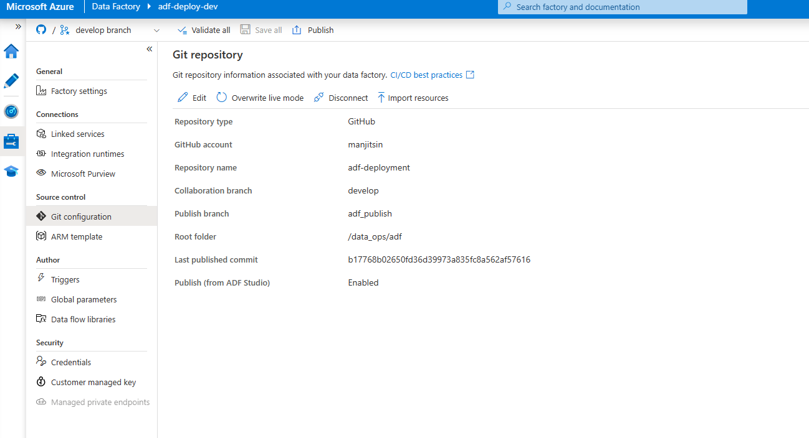
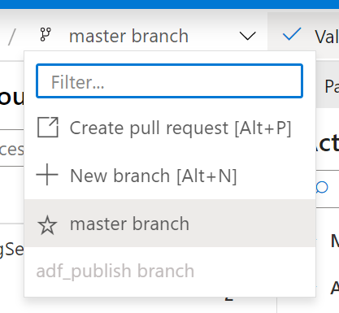
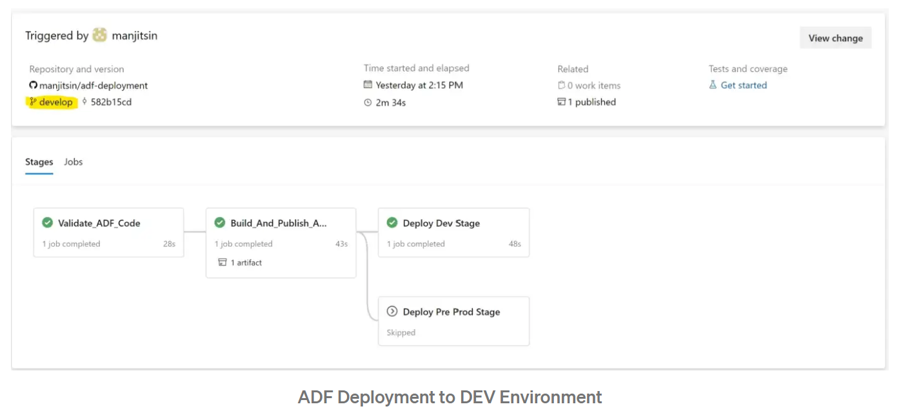

# Sample Steps for Deployment of ADF

In this sample, we will do the CI/CD for Azure Data Factory using Automatic Publish method. This sample eliminates the manual step of clicking the `Publish` button in ADF to publish the changes.

## Creating the Infra

The first step is to create the infra required for deploying the sample. Here are the steps to create infra-

1. Run the [deploy_infra.sh](./scripts/deploy_infra.sh) file from  the terminal.
    - This script will create the infra in Azure.
    - It will also create the service connection in Azure DevOps.
    - It will create a Variable Group in Azure DevOps.

    Make sure that all the required environment variables are set before running the script.

## Working with ADF and git

ADF has the git integration capability, which can store all the pipelines, datasets, linked services etc. as ARM templates in source control.

A typical workflow for a git backed ADF instance looks like follows.

1. Link your Git to ADF. Navigate to **Manage** Tab in ADF Portal, Select and Configure the **Git Configuration** Option.

    

2. Create a new branch in ADF

   
3. Make the changes in ADF like creating a pipeline or linked service. You can also copy the content of `adf` folder present in the current directory and paste it in the location where you linked ADF to repo.

4. Once the changes are done, create a pull request and get it merged.

> NOTE: Only the ADF instance in the DEV environment should be backed by git. The data flows are propagated to the other environments by CI/CD pipelines.

## Creating the AzDO Pipeline

Till now the infra is created, ADF is linked to Git and your changes are implemented. Now we need to deploy the ADF changes to Dev Environment.

For creating the pipeline, we will run the [deploy_azdo_pipeline.sh](./scripts/deploy_azdo_pipelines.sh) script. Make sure to set the proper environment variables that will help in configuring the YAML Location in Pipeline.

The YAML Pipeline file is present [here](./pipelines/adf-deployment.yml).

If you want to know about the ADF Deployment Pipeline, check out the main [README.md](../README.md) file present in the current directory.

## Run the Pipeline

Once the Pipeline is created, you can run the pipeline to deploy the ADF on `Dev` Environment.

## Deploy To NEW Environment

If you want to deploy the ADF to a new environment(stage), add a new stage in the YAML Pipleine file. For reference, check the [ADF Deployment YAML Pipeline for Multi Env file.](./pipelines/adf-deployment-multi-env.yml)
