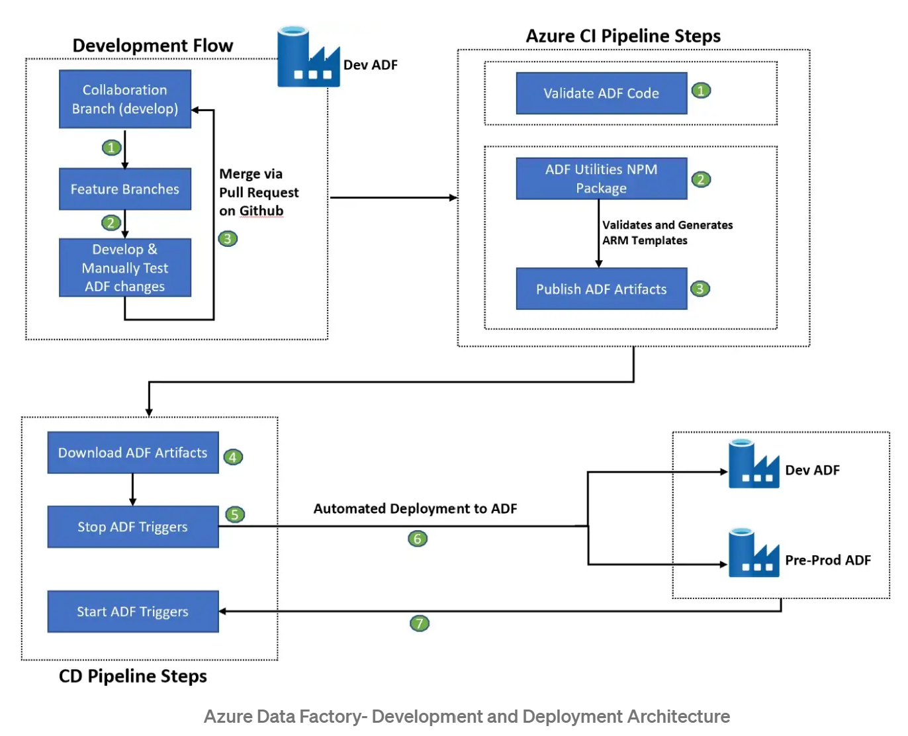
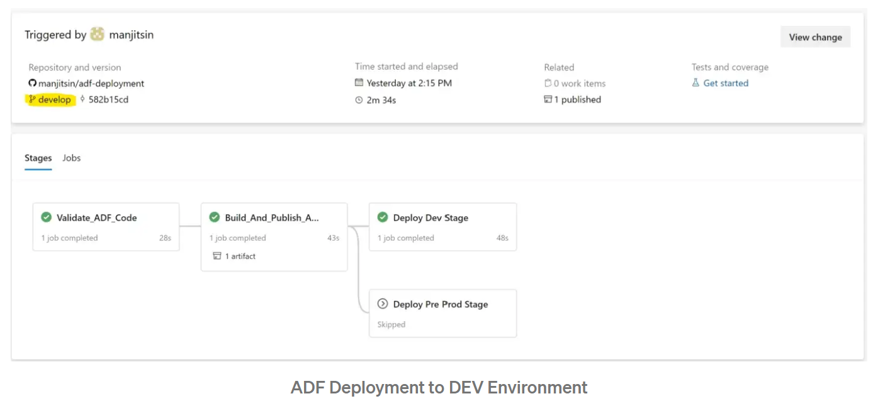
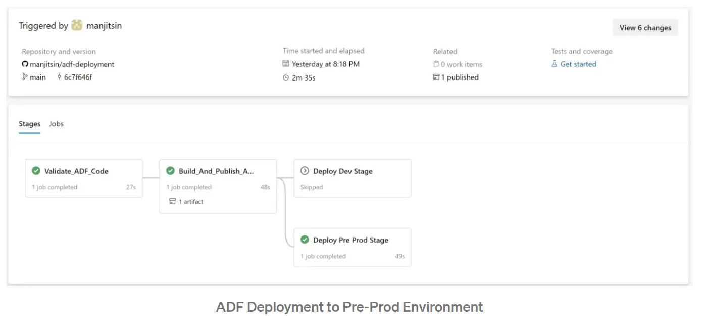

# Automated Publish and CI/CD for Azure Data Factory

This sample demonstrates the deployment of Azure Data Factory using Automated Publish Method. Usually, the Azure Data Factory deployment requires Manual Publish setup where the developer publishes the ADF changes manually from the portal. This step generates ARM Templates which are used in deployment steps.

In this sample, the need to manually publish step has been eliminated by using a publicly available npm package @microsoft/azure-data-factory-utilities for automated publishing. With this, the ARM templates can be generated automatically without any manual intervention.

## ADF Introduction

Azure Data Factory is a cloud-based, fully managed, serverless data integration service for data movement and transformation. It enables users to create, schedule, and orchestrate data pipelines that move data between various on-premises and cloud-based data sources to a central data store. The pipelines can be used to perform complex data transformations, including data enrichment, data validation, and data migration.

In ADF, CI/CD essentially means deploying the various data factory entities such as linked service, triggers, pipelines, datasets etc. to a new environment automatically using [Azure Pipelines](https://learn.microsoft.com/en-us/azure/devops/pipelines/get-started/what-is-azure-pipelines?view=azure-devops).

### ADF Modes

1) ADF consists of two modes namely `live mode` and `Git Mode`.

- Live mode is the standalone ADF which is not connected to Git. All operations on ADF happens via Portal.

- Git Mode is when ADF is connected to Git and all the ADF entities are stored as code in Git.

2)Git integration in ADF consists of selecting two branches Collaboration branch and Publish branch.
3)Collaboration branch is where all the feature branch is merged (will be mapped to ‘develop’ branch for our case). Publish branch is where all the changes including auto generated ARM templates gets published (by default, ADF creates ‘adf_publish’ branch for that).

> NOTE: Only the ADF instance in the DEV environment should be linked to git. The deployment are propagated to the other environments by CI/CD pipelines.

## Solution Overview



We will deploy the above architecture. Let's understand the components and the deployment procedure in detail

### Deploying the Environment

Before staring the pipeline, the infra needs to provisioned. **[Follow this infra deployment guide](./DEPLOYMENT_STEPS.md)** to provison the infra required for CI/CD of ADF.

### Development Flow in ADF

- Navigate to Dev ADF Portal(linked to Git).
- In Git Mode, create a new branch(feature_1) from your collaboration branch(develop).
- Develop and test your changes in feature branch of ADF Portal.
- Create a PR from feature branch to collaboration branch in GitHub.
- Once PR is reviewed and merged, the changes will be automatically deployed in ADF Live Mode.

### ADF CI

In the CI stage, the following steps happens

- Validating ADF Code - The ADF resources(Linked Services, Pipelines, Datasets, Triggers etc) that are stored in Git is validated in this step. It's an optional step.
- Generate the ARM Templates using ADF NPM Packages.
- Publish the ARM Templates as artifacts to be used in deployment stage.

### ADF CD

- The deployment step starts with downloading the artifacts published in CI stage.
- Stop the ADF triggers before doing the deployment.
- Deployment on ADF via ARM Templates Deployment step.
- Starting the ADF Triggers.

## **ADF DEPLOYMENT STEPS**

> NOTE: We will be following Gitflow based model instead of Trunk Based to deploy the ADF resources. That means, we will have a separate dedicated branch to deploy into an environment.

### **Pre-requisites - Adding the package.json**

Before you start creating the pipeline, you will have to create a `package.json` file. This file will contain the details to obtain the ADFUtilities package. You have to manually create this file. The content of the file is given below:

1) In the repository, we will create a ‘build’ folder (Folder name can be anything).
2) Inside the folder, create a package.json file.
3) Paste the below code block in package.json file.
This NPM package will use this JSON file find the ADFUtilities package.

```json
{
    "scripts":{
        "build":"node node_modules/@microsoft/azure-data-factory-utilities/lib/index"
    },
    "dependencies":{
        "@microsoft/azure-data-factory-utilities":"^0.1.5"
    }
}
```

### **Creating the Azure YAML Pipeline**

The Azure YAML Pipeline file will contain stages for CI and CD with required tasks in each stages.

1) The Pipeline file starts with declaring the variables block. In this Pipeline file, we have stored the variables in Azure DevOps variable groups.
2) In our example, there are two variable groups corresponding to dev and pre-prod environment.
3) The variables needed in Variable groups are- azure_subscription_id, azure_service_connection_name, resource_group_name, azure_data_factory_name.
4) There is two more variable present in pipeline-

    `adf_code_path` which is the path in repo where our ADF code is stored. This is the same place that you choose as `Root folder` while linking Git with ADF.

    `adf_package_file_path` - This is the path in repo where the `package.json` file is present. This file is used to generate the ARM Templates.

```yaml
variables:

  - ${{ if eq(variables['build.SourceBranchName'], 'develop') }}:
      - group: adf-dev

  - ${{ if eq(variables['build.SourceBranchName'], 'main') }}:
      - group: adf-pre-prod

  - name: adf_code_path
    value: "$(Build.SourcesDirectory)/data_ops/adf"        #replace with the ADF resources folder.

  - name: adf_package_file_path
    value: "$(Build.SourcesDirectory)/build/"              #replace with the package.json folder.

```

### CI Process (Build Stage)

In the Build stage, the goal is to validate the ADF Code, retrieve the files from the ‘develop’ branch of the git repository and automatically generate the ARM templates for the Deployment stage.

The Build stage consists of 5 steps

1)Declare a stage “Build_And_Publish_ADF_Artifacts” which will contain the Build steps.

```yaml
    - stage: Build_And_Publish_ADF_Artifacts
      jobs:
        - job: Build_Adf_Arm_Template
          displayName: 'ADF Generate ARM template'
          steps:
```

2)Next, you need to install the dependencies. Azure provides a tool ADFUtilities. This package is used to validate and create the deployment template. In order to install this package, we need to install Node.js and NPM package management.

```yaml
- task: NodeTool@0
  inputs:
    versionSpec: '10.x'
  displayName: 'Install Node.js'

- task: Npm@1
  inputs:
    command: 'install'
    workingDir: '$(adf_package_file_path)'
    verbose: true
  displayName: 'Install NPM Package'
  
  ```

3)Validate the Data Factory resource code in the repository. This calls the `validate` function along with the path where the ADF code is stored in repo. The working directory is where the ADFUtilities is installed.

```yaml
- task: Npm@1
  displayName: 'Validate ADF Code'
  inputs:
    command: 'custom'
    workingDir: '$(adf_package_file_path)' 
    customCommand: 'run build validate $(adf_code_path) /subscriptions/$(azure_subscription_id)/resourceGroups/$(resource_group_name)/providers/Microsoft.DataFactory/factories/$(azure_data_factory_name)' 
```

4)The next step is to Generate ARM template from Azure Data Factory source code. The ‘export’ function is used to output the ARM template in the ‘ArmTemplate’ folder inside the working Directory.

```yaml
- task: Npm@1
  displayName: 'Validate and Generate ARM template'
  inputs:
    command: 'custom'
    workingDir: '$(adf_package_file_path)'
    customCommand: 'run build export $(adf_code_path) /subscriptions/$(azure_subscription_id)/resourceGroups/$(resource_group_name)/providers/Microsoft.DataFactory/factories/$(azure_data_factory_name) "ArmTemplate"'
```

5)Finally, ARM template is generated and Published as a Pipeline artifact. This will create an artifact with name name ‘adf-artifact-$(Build.BuildNumber)’.

```yaml
- task: PublishPipelineArtifact@1
  displayName: Download Build Artifacts - ADF ARM templates
  inputs:
    targetPath: '$(Build.SourcesDirectory)/.pipelines/ArmTemplate' #replace with the package.json folder.
    artifact: 'adf-artifact-$(Build.BuildNumber)'
    publishLocation: 'pipeline'
```

### **CD Process (Deployment Stage)**

The main goal of Deployment stage is to deploy the ADF resources. This process is achieved by deploying the ARM templates generated in Build stage.

The Deployment stage consists of following steps-

1.Create a new stage ‘Deploy_to_Dev’. Ensure this stage only runs if
    - the CI Build stage is successful;
    - code is merged on PR;
    - The pipeline is triggered from develop branch.

```yaml
- stage: Deploy_to_Dev
  condition: and(succeeded(), ne(variables['Build.Reason'], 'PullRequest'), eq(variables['build.SourceBranchName'], 'develop'))
  displayName: Deploy To Development Environment
  dependsOn: Build_And_Publish_ADF_Artifacts
  jobs: 
    - job: Deploy_Dev
      displayName: 'Deployment - Dev'
      steps:
```

2.Download the ARM artifacts that was Published in the Build stage. By default, the Pipeline artifacts are published in $(Pipeline.Workspace) folder.

```yaml
- task: DownloadPipelineArtifact@2
  displayName: Download Build Artifacts - ADF ARM templates
  inputs: 
    artifactName: 'adf-artifact-$(Build.BuildNumber)'
    targetPath: '$(Pipeline.Workspace)/adf-artifact-$(Build.BuildNumber)'
```

3)ADF can contain Triggers to run the ADF Pipelines according to some condition or schedule. It’s a best practice to STOP the triggers during deployment so that ADF pipeline does not get triggered while Deployment is running. This is an optional but an important step.

```yaml
- task: toggle-adf-trigger@2
  displayName: STOP ADF Triggers before Deployment
  inputs:
    azureSubscription: '$(azure_service_connection_name)'
    ResourceGroupName: '$(resource_group_name)'
    DatafactoryName: '$(azure_data_factory_name)'
    TriggerFilter: 'Dataload_Trigger'  #Name of the trigger. Leave empty if you want to stop all trigger
    TriggerStatus: 'stop'
```

4)This is the step where the deployment happens. The ARM Templates are deployed from the artifacts. The overrideParameterscontains the custom values like the linked service where we override the default values with the custom values.

```yaml
- task: AzureResourceManagerTemplateDeployment@3
  displayName: 'Deploying to Production'
  inputs:
    deploymentScope: 'Resource Group'
    azureResourceManagerConnection: '$(azure_service_connection_name)'
    subscriptionId: '$(azure_subscription_id)'
    action: 'Create Or Update Resource Group'
    resourceGroupName: '$(resource_group_name)'
    location: '$(location)'
    templateLocation: 'Linked artifact'
    csmFile: '$(Pipeline.Workspace)/adf-artifact-$(Build.BuildNumber)/ARMTemplateForFactory.json'
    csmParametersFile: '$(Pipeline.Workspace)/adf-artifact-$(Build.BuildNumber)/ARMTemplateParametersForFactory.json'
    overrideParameters: '-factoryName $(azure_data_factory_name) -adls_connection_properties_typeProperties_url "https://$(azure_storage_account_name).dfs.core.windows.net/" -databricks_connection_properties_typeProperties_existingClusterId $(azure_databricks_cluster_id) -keyvault_connection_properties_typeProperties_baseUrl "https://$(azure_keyvault_name).vault.azure.net/"'
    deploymentMode: 'Incremental'
```

5)After deployment is completed, Start the ADF triggers which was stopped in Step-3, so that ADF Pipelines can continue to run according to their configured schedule.

```yaml
 - task: toggle-adf-trigger@2
   displayName: START ADF Triggers after Deployment
   inputs:
    azureSubscription: '$(azure_service_connection_name)'
    ResourceGroupName: '$(resource_group_name)'
    DatafactoryName: '$(azure_data_factory_name)'
    TriggerFilter: 'Dataload_Trigger' #Name of the trigger. Leave empty if you want to start all trigger
    TriggerStatus: 'start'
```

> NOTE: Note: In order to successfully deploy ADF, make sure that the service principal or the Managed identity have sufficient access to the Azure resources linked to ADF. For example - Key Vault, Azure Databricks, Storage Account.



## **Deployment to New Environment**

- In the above section, we saw the Development flow and the deployment happening on same ADF Dev Environment(Development on Git Mode and Deployment on Live Mode).
- In this section, we will deploy the ADF to a completely new environment(Pre-Prod). It will make use of the same artifacts that are generated in Build stage, and then the `overrideParameters` will be used to override the values corresponding to new environment.

```yaml
- stage: Deploy_to_PreProd
  condition: and(succeeded(), ne(variables['Build.Reason'], 'PullRequest'), eq(variables['build.SourceBranchName'], 'main'))
  displayName: Deploy Pre Prod Stage
  dependsOn: Build_And_Publish_ADF_Artifacts
  jobs: 
      - job: Deploy_PreProd
        displayName: 'Deployment - PreProd'
        steps:
        - task: DownloadPipelineArtifact@2
          displayName: Download Build Artifacts - ADF ARM templates
          inputs: 
            artifactName: 'adf-artifact-$(Build.BuildNumber)'
            targetPath: '$(Pipeline.Workspace)/adf-artifact-$(Build.BuildNumber)'

        - task: toggle-adf-trigger@2
          inputs:
            azureSubscription: '$(azure_service_connection_name)'
            ResourceGroupName: '$(resource_group_name)'
            DatafactoryName: '$(azure_data_factory_name)'
            TriggerFilter: 'Dataload_Trigger'
            TriggerStatus: 'stop'

        - task: AzureResourceManagerTemplateDeployment@3
          inputs:
            deploymentScope: 'Resource Group'
            azureResourceManagerConnection: '$(azure_service_connection_name)'
            subscriptionId: '$(azure_subscription_id)'
            action: 'Create Or Update Resource Group'
            resourceGroupName: '$(resource_group_name)'
            location: '$(location)'
            templateLocation: 'Linked artifact'
            csmFile: '$(Pipeline.Workspace)/adf-artifact-$(Build.BuildNumber)/ARMTemplateForFactory.json'
            csmParametersFile: '$(Pipeline.Workspace)/adf-artifact-$(Build.BuildNumber)/ARMTemplateParametersForFactory.json'
            overrideParameters: '-factoryName "$(azure_data_factory_name)" -adls_connection_properties_typeProperties_url "https://$(azure_storage_account_name).dfs.core.windows.net/" -databricks_connection_properties_typeProperties_existingClusterId $(azure_databricks_cluster_id) -keyvault_connection_properties_typeProperties_baseUrl "https://$(azure_keyvault_name).vault.azure.net/"'
            deploymentMode: 'Incremental'

        - task: toggle-adf-trigger@2
          inputs:
            azureSubscription: '$(azure_service_connection_name)'
            ResourceGroupName: '$(resource_group_name)'
            DatafactoryName: '$(azure_data_factory_name)'
            TriggerFilter: 'Dataload_Trigger'
            TriggerStatus: 'start'
```



**[Here is the link to full YAML Pipeline.](./pipelines/adf-deployment.yml)**

## **Adding Custom(New) Parameters in ARM Templates**

Sometimes the parameter that you want to override might not be present in the ARM Template parameters file. In that case, you will not be able to override that parameter when deploying to a new environment. In order to get the parameter in ARM Template parameters file, you need to do the following steps:

1) Navigate to ADF Portal and go to `Manage Tab`.
2) Under the ARM Template section, Click on `Edit parameter configuration` to load the JSON file.
3) Go to the required section. For example - If your parameter was in Linked Service, then you can go to `Microsoft.DataFactory/factories/linkedServices` section.
4) Under `typeProperties`, you will see many properties mentioned there. Add the parameter that you want to include in ARM Template parameter file.
5) Click on Ok. This will generate a file called **[`arm-template-parameters-definition.json`](./adf/arm-template-parameters-definition.json)** in the repo where ADF code is present.
6) Run the Pipeline again, and you will see the new parameter in the Template Parameter file of Artifacts.

## **Summary**

The above pipeline completes the CI/CD Process for Azure Data Factory. By creating an Azure DevOps pipeline, we have successfully automated our data pipeline deployment process.

This approach eliminates the need to manually click on the ‘Publish’ button. In the below section, we will extend this solution to deploy the artifact into a new (Pre-Prod) environment.
