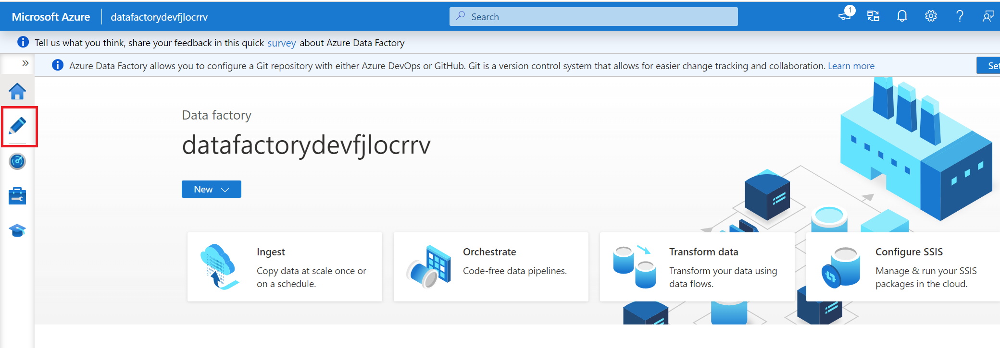
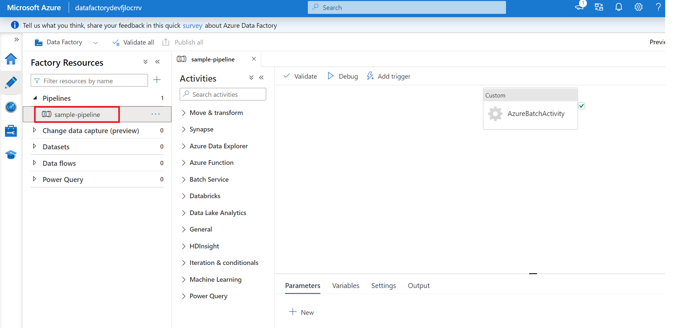
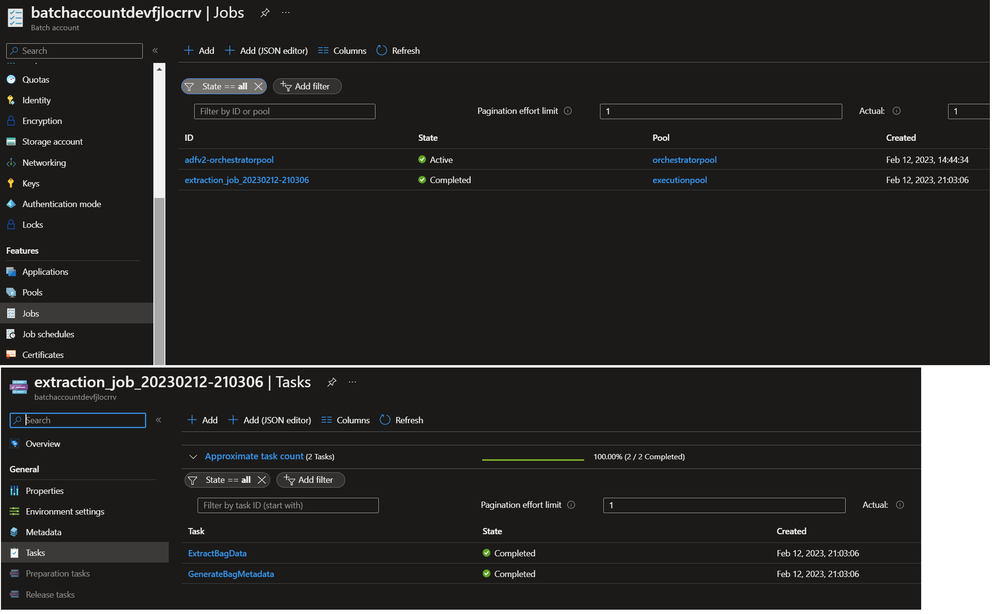
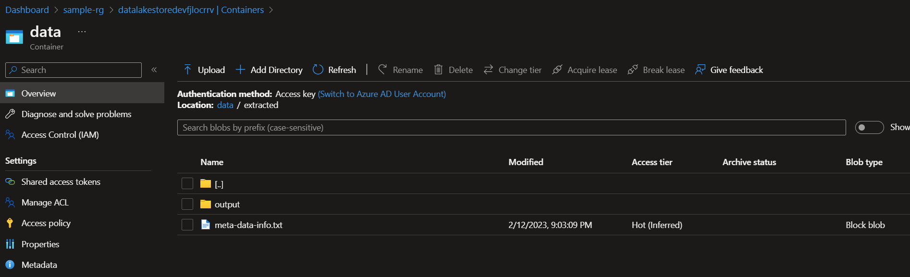
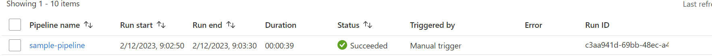

# Running container workloads from Azure Data Factory on Azure Batch <!-- omit in toc -->

## Contents <!-- omit in toc -->

- [Solution Overview](#solution-overview)
  - [Scope](#scope)
  - [Use Case](#use-case)
  - [Architecture](#architecture)
  - [Technologies used](#technologies-used)
- [How to use this sample](#how-to-use-this-sample)
  - [Prerequisites](#prerequisites)
    - [Software Prerequisites](#software-prerequisites)
  - [Setup and deployment](#setup-and-deployment)  
  - [Deployment validation and Execution](#deployment-validation-and-execution)
  - [Clean-up](#clean-up)
  - [Resources](#resources)

## Solution Overview

This solution demonstrates the data pre-processing process by running Azure Batch container workloads from Azure Data Factory.

Azure Batch is a great option for data pre-processing. However, there are certain technical challenges and limitations when it comes to processing large files, autoscaling batch nodes and triggering batch workloads from Azure Data Factory. Some of these challenges and limitations are explained below:

- Auto-scaling issues(slow spin-up times for new nodes)

   To process workloads, the processor code needs to be deployed on the Azure Batch nodes. Thus, all the dependencies required by the application are to be installed on the batch nodes as well.

   Azure Batch provides the option of startup task which can be used to install the required dependencies. However, if there are numerous required dependencies, the readiness of the nodes would be delayed, consequently impacting auto-scaling. This is because each newly spun-up node will require time to become ready for processing the workloads. This setup time can vary from 3-30 minutes depending on the list of dependencies required by the processor code.

   _**Best Practice:**_ Containerize application and run the container workloads on Azure Batch.

- Working with large files

   When processing large files, it is not logical to download the files onto the batch nodes from the storage account, extract their contents, and then upload them back to the storage account. This approach necessitates ensuring that the nodes have sufficient attached storage or performing some form of cleansing to free up space after the job is completed. Moreover, additional time will be expended in the process of downloading and uploading the contents to the storage account.

   _**Best Practice:**_ Mount storage accounts onto the batch nodes and access the data directly. Please note here that NFS mounts are not supported on windows nodes. Please check the [supported configurations](https://learn.microsoft.com/azure/batch/virtual-file-mount?tabs=windows#supported-configurations) for the details.

- Triggering azure batch container workloads from Azure datafactory

   Azure datafactory does not support triggering batch container workloads directly via its [custom activity](https://learn.microsoft.com/en-us/azure/data-factory/transform-data-using-custom-activity). The below [architecture](#architecture) explains how to over come this limitation.

   This sample will focus on provisioning an Azure Batch account, Azure Data Factory and other required resources where you can run the ADF pipeline to see how the data pre-processing can be done on huge volume of data in an efficient and scalable manner.  

### Scope

The following list captures the scope of this sample:

- Provision an ADF, Azure Batch and required storage acounts and other resources.
- The following services will be provisioned as a part of this sample setup:
  - VNet with one subnet
  - Azure Data Factory
  - Azure Batch Account
  - ADLS account with a sample data(.bag) file
  - Azure Storage account for azure batch resources
  - Key Vault
  - User Assigned Managed Identity

Details about [how to use this sample](#how-to-use-this-sample) can be found in the later sections of this document.

### Use Case

For this sample use case, a sample [ros bag](http://wiki.ros.org/Bags/Format) file in an ADLS Gen2 account will be picked by ADF pipeline for pre-processing via Azure Batch.

In actual production scenarios, it is ideal to have two ADLS accounts, one representing the raw zone and the other representing the extracted zone. However, for the sake of simplicity in this case, both the raw and extracted zones will reside within the same ADLS account. The pipeline will select the ROS bag file from the raw zone and send it to Azure Batch for extraction. Within Azure Batch, the file can be simultaneously extracted by one or more processors. For this sample, a single `sample-processor` will be utilized, which will be packaged as a docker image and pushed to the container registry. Azure Batch will employ this image to create a container and execute the extraction process, subsequently storing the extracted contents in the extracted zone. Once the extraction is complete, the ADF pipeline can proceed to the next step, either to process the extracted data or invoke other pipelines.


Details about [how to run the pipeline](#deployment-validation-and-execution) can be found in the later sections of this document.

### Architecture

The high-level design is depicted in the diagram below, showcasing the integration between ADF and Azure Batch for executing container workloads on Azure Batch.


#### **Architecture Design Components**

- **Raw Zone:** This is an ADLS account where the ingested data lands.

- **Extracted Zone:** This is an ADLS account where the extracted data will be stored.

- **ADF Pipeline:** This is an ADF pipeline which can have a scheduled trigger to pick data from raw zone and sends it to azure batch for extraction.

- **Azure Batch:**  It will extract the bag file data and stored the extracted contents to extracted zone. Azure Batch has following components:

  - **Orchestrator Pool:** This is a batch pool which runs a batch application, see [sample here](src/orchestrator-app/README.md) on an ubuntu node. ADF pipeline uses a custom activity to invoke this application. This application acts as an orchestrator for creating jobs and tasks and monitoring those for completion on execution pool described below.

  - **Execution Pool:** This is a a batch pool which is responsible for running container work loads. This pool has start up task configuration where it mounts the raw and extracted ADLS zones as NFS mounts to its nodes and when containers are spinned to process the actual workloads and the same mounts are mounted to containers as well via container run options. Orchestrator pool creates jobs and tasks for execution pool.

      ADLS storage mounts on execution pool nodes and containers will help containers to process large files without downloading the locally.

- **Application Insights:** It monitors the health of execution and orchestrator pool nodes. We can integrate the application insights with azure batch application and the container images for end to end tracing of jobs.

- **Azure Container Registry(ACR):**  In this sample execution pool is configured with a azure container registry to pull container images, but we can have any container registry configured.

- **Managed Identity:** This is a user assigned managed identity which will be assigned to both of the batch pools and batch pool will use it to access any other required resources like container registry, keyvault, storage account etc.

### Technologies used

The following technologies are used to build this sample:

- [Azure Data Factory](https://azure.microsoft.com/products/data-factory/)
- [Azure Batch](https://azure.microsoft.com/en-us/products/batch)
- [Azure Storage(ADLS)](https://azure.microsoft.com/en-au/services/storage/data-lake-storage/)
- [NFS Mounts](https://learn.microsoft.com/en-us/azure/storage/blobs/network-file-system-protocol-support-how-to)

## How to use this sample

This section holds the information about usage instructions of this sample.

### Prerequisites

1. [Github account](https://github.com/)
2. [Azure Account](https://azure.microsoft.com/en-gb/free/)
   - *Permissions needed*:  The ability to create and deploy to an Azure [resource group](https://docs.microsoft.com/en-us/azure/azure-resource-manager/management/overview)

   - Active subscription with the following [resource providers](https://docs.microsoft.com/en-us/azure/azure-resource-manager/management/azure-services-resource-providers) enabled:

     - Microsoft.Storage
     - Microsoft.DataFactory
     - Microsoft.KeyVault
     - Microsoft.Batch
     - Microsoft.ContainerRegistry

#### Software Prerequisites

1. [Azure CLI](https://docs.microsoft.com/en-us/cli/azure/) installed on the local machine

   - *Installation instructions* can be found [here](https://docs.microsoft.com/en-us/cli/azure/install-azure-cli)
2. [Terraform](https://www.terraform.io/)
   - *Installation instructions* can be found [here](https://developer.hashicorp.com/terraform/downloads)
3. [Docker Desktop](https://www.docker.com/get-started/)
   - *Installation instructions* can be found [here](https://www.docker.com/products/docker-desktop/)
4. For Windows users,
   1. Option 1: [Windows Subsystem for Linux](https://docs.microsoft.com/en-us/windows/wsl/install-win10)
   2. Option 2: Use the devcontainer published [here](./.devcontainer) as a host for the bash shell, it has all the pre-requisites installed.
      For more information about Devcontainers, see [here](https://code.visualstudio.com/docs/remote/containers).

### Setup and deployment

1. Clone this repository.

   ```shell
   git clone https://github.com/Azure-Samples/modern-data-warehouse-dataops.git
   ```

2. [Deploy all the azure resources required for the sample](deploy/terraform/README.md)
3. [Deploy a sample ADF pipeline.](deploy/adf/README.md)
4. [Publish a sample-processor image to your azure container registry.](src/sample-processor/README.md)
5. [Deploy a sample orchestrator app to azure batch pool.](src/orchestrator-app/README.md)

### Deployment validation and Execution

The following steps can be performed to validate the correct deployment and execution of the sample:

1. Go to your azure portal and select your resource group.
2. Select the azure data factory, and click on Launch Studio (Azure Datafactory Studio).
3. Select Author pipreines.

   

4. From the pipelines open sample-pipeline.

   

5. From the pipelines options Add trigger select Trigger now.
6. Once the pipeline runs, it will create a job for orchestartor pool with the name `adfv2-orchestratorpool` and a task under it to invoke orchestrator app `extract.py` entry file.
7. Orchestrator app will create an extract job and a couple of tasks for execution pool.

   

   ```shell
   Note: Those tasks are actually the container works loads and sample-processor image deployed as a part of deploymemt steps will be used for executing the tasks.
   ```

8. Once the execution pool tasks are completed, a sample rosbag file will be extracted to the `extracted/output` folder and a ros metadata info(`meta-data-info.txt`) will be generated in the `extarcted` folder.

   

9. Your ADF piepline will be marked as completed.

   

### Clean-up

Please follow the steps in the [clean-up section](deploy/terraform/README.md#clean-up-the-whole-infrastructure)

### Resources

- [Data operations for autonomous vehicle operations](https://learn.microsoft.com/en-us/azure/architecture/example-scenario/automotive/autonomous-vehicle-operations-dataops)

- [Parallel processing with Azure Batch.](https://learn.microsoft.com/en-us/azure/batch/batch-technical-overview#run-parallel-workloads)

- [Autoscaling with Azure Batch](https://learn.microsoft.com/en-us/azure/batch/batch-automatic-scaling)

- [Running Azure Batch from Azure Data Factory(ADF)](https://learn.microsoft.com/en-us/azure/batch/tutorial-run-python-batch-azure-data-factory)
