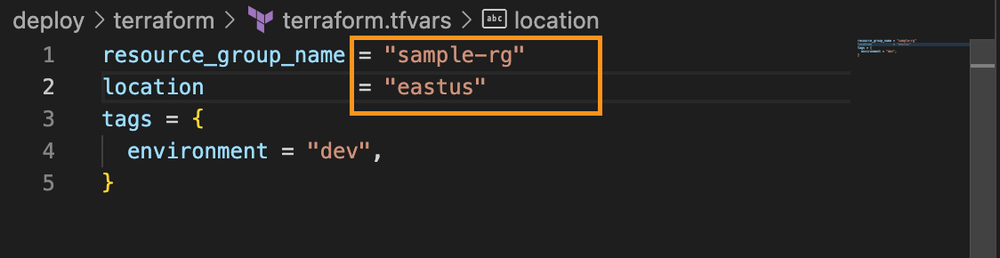
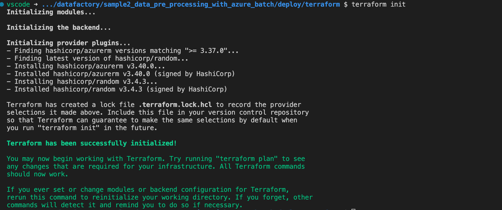
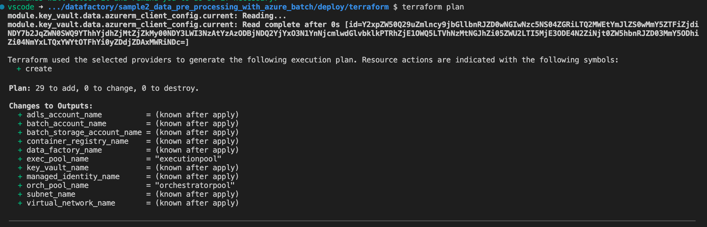
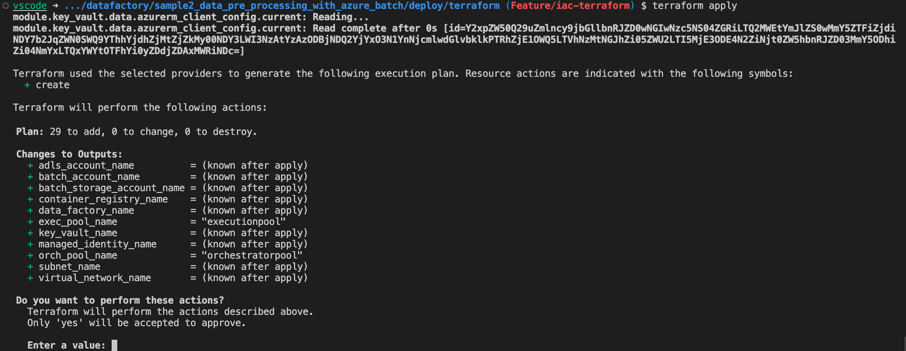
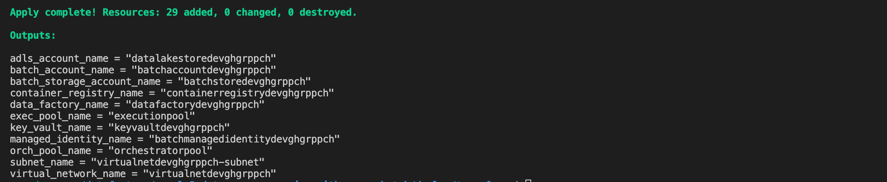
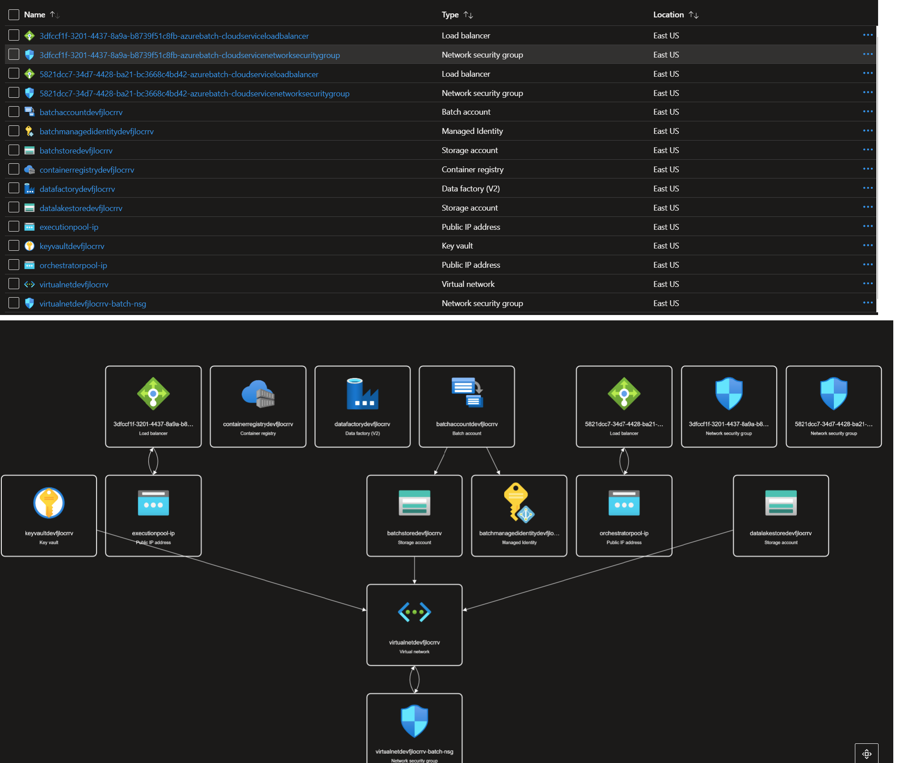
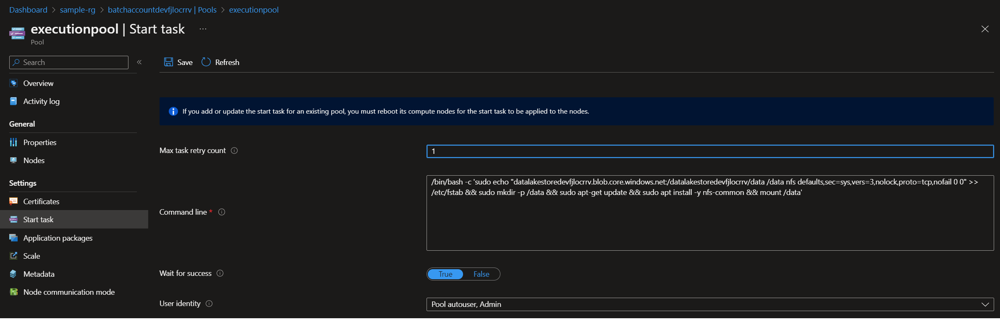
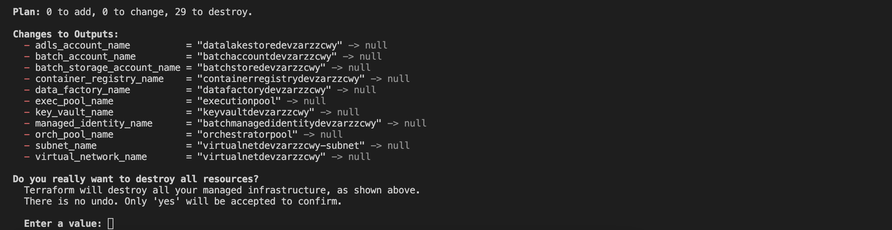

# Deploying Azure Resources

Azure resources required for this sample can be deployed by setting up your pre-requisites mentioned here in your local environment, or alternatively you can use the [this](../../.devcontainer) devcontainer with pre-installed dependencies.

## Deployment steps

1. Go to the directory containing all the terraform scripts to setup a new environment.

    ```shell
    cd ./single_tech_samples/datafactory/sample3_data_pre_processing_with_azure_batch/deploy/terraform 
    ```

2. Login to your Azure account.

    ```shell
    az login
    az account set -s <YOUR AZURE SUBSCRIPTION ID>
    ```

3. Create a resource group.

    ```shell
    az group create --name <YOUR-RESOURCE-GROUP-NAME> --location <YOUR-RESOURCE-GROUP-LOCATION>

    e.g
    az group create --name sample-rg --location eastus

    ```

4. In the `terraform.tfvars` file, update the resource group and location parameters.

    

5. After the resource group has been successfully created and you have set the resource group and location parameters in `terraform.tfvars` file, run the following terraform commands to deploy all the resources in your resource group.

    ```shell
    terraform init
    ```

    

    ```shell
    terraform plan
    ```

    

    ```shell
    terraform apply
    ```

    

    

    Note:- Copy the output with resource names to your notepad, you will need their names in further scripts. If you don't copy then you can always get it from azure portal by navigating to your resource group.

### Deployed Resources

After the successful execution of `terraform apply` following resources will be created in your resource group. From Azure portal you can navigate to your resource group for more details about the deployed resources.

- Virtual Network with a Subnet
- Azure Data Factory
- Azure Batch
  - Azure Batch IP Addresses
  - Azure Batch Security Group
  - Azure Batch Pools
- Azure Data Lake Storage Account
- Azure Blob Storage Account
- Azure Container Registry
- Azure Key Vault
- User Assigned Managed Identity dedicated to Azure batch



> Azure Batch will have two pools orchestratorpool and execution pool. Execution pool will be responsible for executing the container workloads. It will mount the datelake data container as local drive and can access it directly. Startup task of executionpool has the script to mount your datalake account.



### Clean-up the whole infrastructure

Please follow the below steps to clean up your environment :

1. Go to the terraform directory

    ```shell
    cd ./single_tech_samples/datafactory/sample3_data_pre_processing_with_azure_batch/deploy/terraform 
    ```

2. Run the following command to clean up your environment and destroy all the resources

    ```shell
    terraform destroy
    ```

    

3. Delete your resource group.

    ```shell
    az group delete --name <YOUR-RESOURCE-GROUP-NAME>
    ```

### Best Practices

It is ideal to configure a storage account to use as a remote backend for your terraform state files. For simplicity's sake, we have not configured a remote backed and by default terraform will use the local backend to save all the state files.

For learning more about configuring a remote backend and its advantages, follow this [link](https://developer.hashicorp.com/terraform/language/settings/backends/configuration)

[Back to deployment steps](../../README.md#setup-and-deployment)
