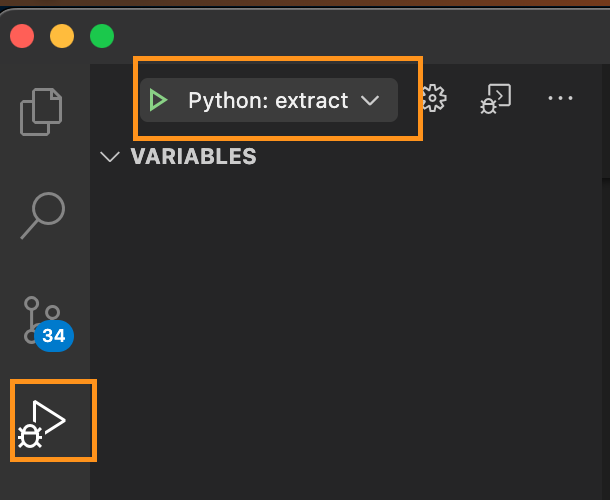

# Batch Orchestrator App

This is a sample code for an orchestrator app which runs as an Azure Batch application on the orchestrator pool of the [reference architecture](../../README.md#architecture). It can be zipped and uploaded as an application which gets invoked from Azure Data Factory(ADF) via its custom activity.

This sample application accepts two parameters `inputFile` and `outputPath` as parameters. You need to invoke the below command from ADF custom activity:

```shell
python3 app/extract.py --inputFile <Your sample bag file path> --outputPath <Your output path where bag file will be exatracted>

In the sample we are running it as :

python3 app/extract.py --inputFile /data/raw/sample-data.bag --outputPath /data/extracted

```

Note: In this sample we have a azure data lake storage account(ADLS) which has a container `data` with two folders `raw` and `extracted`. This `data` container is mounted on the azure batch pool nodes and data can be read and written directly to the ADLS account. For more details refer to the [deployed resouces](../../deploy/terraform/README.md#deployed-resources) documentation.

## Steps to package and upload this sample application to Azure Batch

1. `cd modern-data-warehouse-dataops/single_tech_samples/datafactory/sample3_data_pre_processing_with_azure_batch/src/orchestrator-app`

2. Create a `.env` file in the `orchestrator-app/app` folder with the name of your keyvault and azure container registry.

    ```shel
    vim app/.env
    ```

    ```shell
    AZ_KEYVAULT_NAME="<YOUR-KEYVAULT-NAME>"
    AZ_ACR_NAME="<YOUR-ACR-NAME>"
    ```

    Note: Refer to [deployed resources](../../deploy/terraform/README.md#deployed-resources) to get your keyvault name and ACR name.

3. Create a zip of your app folder.

    ```shell
    zip -r app.zip app
    ```

4. Login to your azure account if not already logged in.

    ```shell
    az login
    az account set -s <YOUR AZURE SUBSCRIPTION ID>
    ```

5. Create an Azure Batch application and link it to the orchestrator pool.

    ```shell
    AZ_RESOURCE_GROUP="<YOUR-RESOURCEGROUP-NAME>"
    AZ_BATCH_ACCOUNT_NAME="<YOUR-BATCH-ACCOUNT-NAME>"
    AZ_BATCH_ORCHESTRATOR_POOL_ID="<YOUR-ORCHESTRATION-POOL-NAME>"
    AZ_BATCH_ACCOUNT_URL="<YOUR-BATCH-ACCOUNT-URL>"
    AZ_BATCH_APP_VERSION="1.0.0"

    az batch application package create --application-name orchestratorapp --name $AZ_BATCH_ACCOUNT_NAME --resource-group $AZ_RESOURCE_GROUP --package-file app.zip --version-name $AZ_BATCH_APP_VERSION

    az batch application set --application-name orchestratorapp --name $AZ_BATCH_ACCOUNT_NAME --resource-group $AZ_RESOURCE_GROUP --default-version $AZ_BATCH_APP_VERSION

    az batch pool set --pool-id $AZ_BATCH_ORCHESTRATOR_POOL_ID --account-name $AZ_BATCH_ACCOUNT_NAME --account-endpoint $AZ_BATCH_ACCOUNT_URL --application-package-references 'orchestratorapp'

    ```

    Note: Refer to [deployed resources](../../deploy/terraform/README.md#deployed-resources) for populating resource names.

6. Restart orchestrator pool nodes, this is required to pull the uploaded application on the batch nodes. For more details refer to the [documentation](https://learn.microsoft.com/en-us/azure/batch/batch-application-packages)

    ```shell
    nodes=$(az batch node list --pool-id $AZ_BATCH_ORCHESTRATOR_POOL_ID --account-name $AZ_BATCH_ACCOUNT_NAME --account-endpoint $AZ_BATCH_ACCOUNT_URL --query "[].id" -o tsv)
    for id in $nodes
    do
        echo "Rebooting node: $id"
        az batch node reboot --node-id $id --pool-id $AZ_BATCH_ORCHESTRATOR_POOL_ID  --account-name $AZ_BATCH_ACCOUNT_NAME --account-endpoint $AZ_BATCH_ACCOUNT_URL
    done
    ```

### Debugging and troubleshooting orchestrator app locally

1. Open orchestrator-app in visual studio code

    ```shell
    code modern-data-warehouse-dataops/single_tech_samples/datafactory/sample3_data_pre_processing_with_azure_batch/src/orchestrator-app
    ```

    Note:- This is provided with dev container setup, VS code will prompt for `Re-Open in Container`

2. Once the dev container is ready, rename `env.template` to `.env` and provide values to the following settings:

    ```shell
    RUN_ENVIRONMENT="LOCAL"
    AZ_BATCH_ACCOUNT_URL="<YOUR_BATCH_ACCOUNT_URL>"
    AZ_BATCH_ACCOUNT_NAME="<YOUR_BATCH_ACCOUNT_NAME>"
    AZ_BATCH_EXECUTION_POOL_ID="<YOUR_BATCH_EXECUTION_POOL_ID>"
    AZ_BATCH_KEY="<YOUR-BATCH-KEY>"
    ```

3. Set `extract.py` as your current file and select the `Run` tool to run `Python:extract`

    

    Note: `.vscode\launch.json` contains a sample extract task configuration which passes sample arguments to the orchestrator app. The path used is actually a mounted path of the ADLS account where a sample file exists.

[Back to deployment steps](../../README.md#setup-and-deployment)
