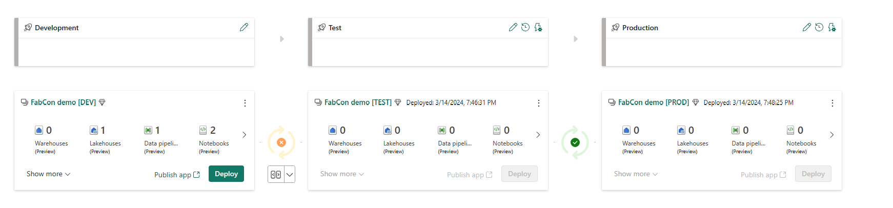
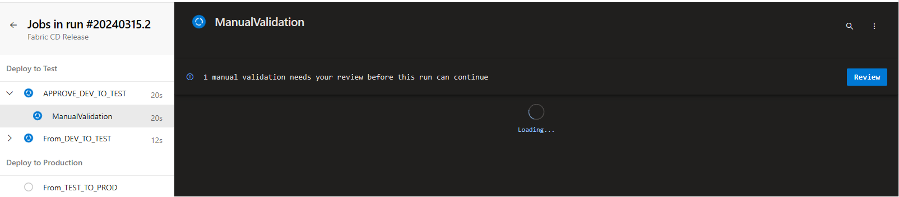
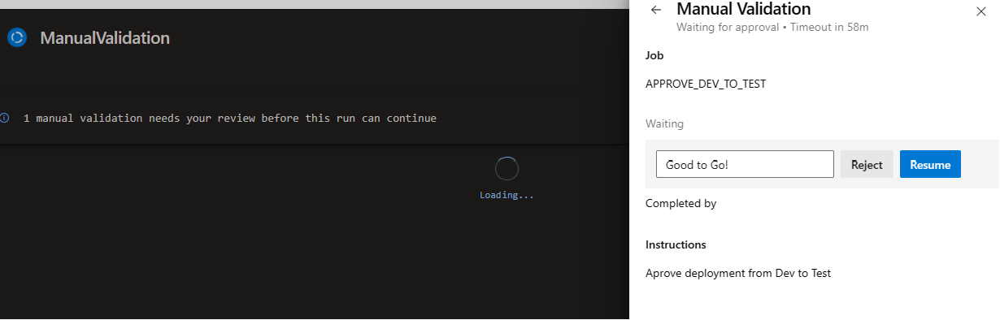
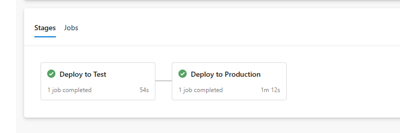
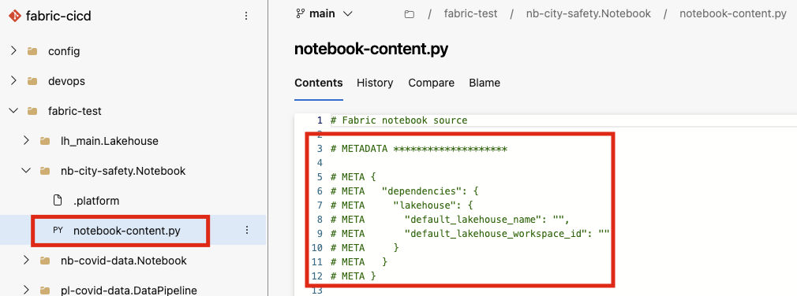

# Fabric CI/CD Sample <!-- omit in toc -->

This repo contains a code sample for establishing a CI/CD process for Microsoft Fabric workspaces. The code is intended to be used as a jump-start for a new project on Microsoft Fabric. At present, the code has several limitations; however, the objective is to continuously improve its capabilities in sync with the advancements of Fabric.

## Contents <!-- omit in toc -->

- [Architecture](#architecture)
- [How to use the sample](#how-to-use-the-sample)
  - [Pre-requisites](#pre-requisites)
  - [Execute bootstrap script](#execute-bootstrap-script)
  - [Fabric CI/CD pipelines](#fabric-cicd-pipelines)
    - [CI process](#ci-process)
    - [CD process - Using Fabric deployment pipeline APIs](#cd-process---using-fabric-deployment-pipeline-apis)
- [Understanding bootstrap script](#understanding-bootstrap-script)
  - [List of created resources](#list-of-created-resources)
  - [Hydrating Fabric lakehouse](#hydrating-fabric-lakehouse)
    - [Using Fabric notebooks](#using-fabric-notebooks)
    - [Using Fabric data pipelines](#using-fabric-data-pipelines)
- [Known issues and limitations](#known-issues-and-limitations)
  - [Passing the Fabric bearer token](#passing-the-fabric-bearer-token)
  - [Implications of using Fabric deployment pipelines for CD](#implications-of-using-fabric-deployment-pipelines-for-cd)
  - [Direct changes made to the "main" branch](#direct-changes-made-to-the-main-branch)
  - [Engineers kicking off the deployment pipeline manually via Fabric UI](#engineers-kicking-off-the-deployment-pipeline-manually-via-fabric-ui)
  - [Handing Notebook's default Lakehouse](#handing-notebooks-default-lakehouse)
  - [Existing Workspace Warning](#existing-workspace-warning)
  - [Several run attempts might lead to strange errors](#several-run-attempts-might-lead-to-strange-errors)
  - [The pagination issue with the Fabric REST APIs for list operations](#the-pagination-issue-with-the-fabric-rest-apis-for-list-operations)
- [Alternate approaches for promoting changes to higher environments](#alternate-approaches-for-promoting-changes-to-higher-environments)
  - [Using Fabric GIT APIs only](#using-fabric-git-apis-only)
  - [Using advanced CI/CD sample](#using-advanced-cicd-sample)
- [Other useful utility scripts](#other-useful-utility-scripts)
  - [Script to upload file in GIT repo to Fabric lakehouse](#script-to-upload-file-in-git-repo-to-fabric-lakehouse)
- [References](#references)

## Architecture


The architecture diagram above showcases a sample CI/CD process for Microsoft Fabric. The process starts with the bootstrap script that automates the creation of initial Fabric workspaces (Dev, Test, and Prod) for a project. The script creates Azure resources (Fabric capacity), Fabric workspaces, deployment pipelines, Lakehouse, notebooks, data pipelines, and connects the workspaces to the GIT repository. The script also hydrates the Fabric Lakehouse by triggering the execution of the Fabric notebooks and data pipelines. For detailed information about the bootstrap script, see the [Understanding bootstrap script](#understanding-bootstrap-script) section.

As part of the development lifecycle, the developer would create a new "feature" branch out of the "main" branch (the one which is linked to the dev workspace). The developer would also create a private workspace and link it to the "feature" branch. This syncs workspace with the latest code in the "feature" branch. The developer can now make the required changes in this isolated environment. For more details, see the [Develop using another workspace](https://learn.microsoft.com/fabric/cicd/git-integration/manage-branches#develop-using-another-workspace) documentation.

One the changes are made, the developer would commit the changes to the "feature" branch. When the changes are ready to be promoted, the developer would create a pull request to merge the "feature" branch into the "main" branch. The pull request would trigger the Continuous Integration (CI) process that would build, test, and validate the changes. The CI process is not showcased in this repository at present and will be added moving forward, however the CI scope is represented on the architecture diagram for better understanding.

The Continuous Deployment (CD) process is demonstrated using Azure DevOps pipelines. Due to the lack of service principal (SP) support, the Azure DevOps pipelines are required to be triggered manually for now. The CD process is implemented using Fabric deployment pipelines APIs. One of the variant of CD pipelines has the option of approval gates before allowing the deployment to Test and to Production.The CD process includes the creation of variable groups in Azure DevOps and running the release pipeline in Azure DevOps. For more details, see the [Fabric CI/CD pipelines](#fabric-cicd-pipelines) section.

_Note that the private workspace needs to be created manually by the developer for now. There is an upcoming feature in Fabric to automate the creation of private workspaces when a new branch is created. The sample will be updated to include this feature once it is available._

## How to use the sample

### Pre-requisites

- Ensure *always* latest Fabric Token is added to the .env file (see instructions below).
- [Azure CLI](https://docs.microsoft.com/cli/azure/install-azure-cli?view=azure-cli-latest) and [jq](https://jqlang.github.io/jq/download/) are installed.
- Ensure that correct Azure account is being used.
- Access to Azure DevOps organization and project.
- An Azure Repo. Currently, only [Git in Azure Repos](https://learn.microsoft.com/azure/devops/user-guide/code-with-git?view=azure-devops) with the _same tenant_ as the Fabric tenant is supported.

### Execute bootstrap script

Here are the steps to use the bootstrap script:

1. Clone the repository:

    ```bash
    # Optional
    az login --tenant "<tenant_id>"
    az account set -s "<subscription_id>"
    cd "<installation_folder>"
    # Repo clone
    git clone https://github.com/Azure-Samples/modern-data-warehouse-dataops.git
    ```

1. Change the directory to the sample folder:

    ```bash
    cd ./modern-data-warehouse-dataops/single_tech_samples/fabric/fabric_ci_cd
    ```

1. Rename the [.envtemplate](./.envtemplate) file to `.env` and fill in the necessary environment variables. Here is the detailed explanation of the environment variables:

    ```bash
    AZURE_SUBSCRIPTION_ID='Azure Subscription Id'
    AZURE_LOCATION='The location where the Azure resources will be created'
    CAPACITY_ADMIN_EMAIL='The email address of the Fabric capacity admin. This should be from the same tenant where capacity is being created.'
    EXISTING_CAPACITY_NAME="The name of the existing Fabric capacity. This name is required if you want to use an existing capacity instead of creating a new one."
    FABRIC_PROJECT_NAME='The name of the Fabric project. This name is used for naming the Fabric resources.'
    FABRIC_DOMAIN_NAME="The name of the Fabric domain. It can be an existing domain."
    FABRIC_SUBDOMAIN_NAME="The name of the Fabric subdomain. It can be an existing subdomain."
    FABRIC_BEARER_TOKEN='The bearer token for calling the Fabric APIs.'
    ORGANIZATION_NAME='Azure DevOps organization name'
    PROJECT_NAME='Azure DevOps project name'
    REPOSITORY_NAME='Azure DevOps repository name'
    BRANCH_NAME='Azure DevOps branch name. This branch should already exist in the repository.'
    DIRECTORY_NAME='The directory used by Fabric to sync the workspace code. It can be "/" or any other sub-directory. If specifying a sub-directory, it must exist in the repository.'
    WORKSPACE_ADMIN_UPNS='UserPrincipalName (UPN) list of the workspace admins. These users will have admin access to the Fabric workspaces. The values are separated by space.'
    PIPELINE_ADMIN_UPNS='UserPrincipalName (UPN) list of the pipeline admins. These users will have admin access to the Fabric deployment pipeline. The values are separated by space.'
    ```

1. Review the various flags in the [bootstrap.sh](./bootstrap.sh) script and set them as needed. Here is a list of the flags:

    | Flag                                | Description                                                           | Default value | Required environment  variables                                                                         |
    | :---------------------------------- | :-------------------------------------------------------------------- | :------------ |  :----------------------------------------------------------------------------------------------------- |
    | deploy_azure_resources              | Flag to deploy Azure resources.                                       | false         | If set to false:</br>`EXISTING_CAPACITY_NAME`</br>If set to false:</br>`AZURE_SUBSCRIPTION_ID`</br>`AZURE_LOCATION`</br>`CAPACITY_ADMIN_EMAIL`                               |
    | create_workspaces                   | Flag to create new Fabric workspaces.                                 | true          | `FABRIC_PROJECT_NAME`                                                                                  |
    | setup_deployment_pipeline           | Flag to create a deployment pipeline and assign workspaces to stages. | true          | `FABRIC_PROJECT_NAME`                                                                                  |
    | create_default_lakehouse            | Flag to create a default Lakehouse.                                   | true          | -                                                                                                   |
    | create_notebooks                    | Flag to create Fabric notebooks.                                      | true          | -                                                                                                   |
    | create_pipelines                    | Flag to create Fabric data pipelines.                                 | true          | None                                                                                                   |
    | trigger_notebook_execution          | Flag to trigger the execution of Fabric notebooks.                    | true          | -                                                                                                   |
    | trigger_pipeline_execution          | Flag to trigger the execution of Fabric data pipelines.               | true          | -                                                                                                   |
    | should_disconnect                   | Flag to disconnect the workspaces from the GIT repository.            | false         | -                                                                                                   |
    | connect_to_git                      | Flag to connect the workspaces to the GIT repository.                 | true          | `ORGANIZATION_NAME`</br>`PROJECT_NAME`</br>`REPOSITORY_NAME`</br>`BRANCH_NAME`</br>`DIRECTORY_NAME` |
    | create_domain_and_attach_workspaces | Flag to create a domain and attach workspaces to it.                  | false         | `FABRIC_DOMAIN_NAME`</br>`FABRIC_SUBDOMAIN_NAME`                                                       |
    | add_workspace_admins | Flag to add admin(s) to the workspaces.                 | false         | `WORKSPACE_ADMIN_UPNS`                                                      |
    | add_pipeline_admins | Flag to add admin(s) to the deployment pipeline.         | false         | `PIPELINE_ADMIN_UPNS`                                                       |
    | create_azdo_variable_groups | Flag to create Azure DevOps variable groups for each environment and adding variables.         | true         | -                                                       |

    Creating Fabric capacities and domains requires elevated privileges. And for that reason, the flags `deploy_azure_resources` and `create_domain_and_attach_workspaces` are set to `false` by default. If you are a Fabric administrator and wish to create new capacity, domain and/or subdomain, set these flags to `true`.

    Also, the flags `add_pipeline_admins` and `add_workspace_admins` are advanced options which allows you to add multiple admins to the deployment pipeline and workspaces respectively. These flags are set to `false` by default. If you wish to add admins, set these flags to `true` and provide the [UPN](https://learn.microsoft.com/en-us/entra/identity/hybrid/connect/plan-connect-userprincipalname#what-is-userprincipalname) of the admins in the `WORKSPACE_ADMIN_UPNS` and `PIPELINE_ADMIN_UPNS` environment variables respectively. Currently, the script only supports adding users as admins; it doesn't support adding Microsoft Entra groups or service principals as admins.

    If you are toggling other flags, make sure to set the required environment variables accordingly and review the script to understand the implications.

1. Run the bootstrap script:

    ```bash
    ./bootstrap.sh
    ```

    The script is designed to be idempotent. Running the script multiple times will not result in duplicate resources. Instead, it will either skip or update existing resources. The only exception is when Azure DevOps variable groups which are deleted and recreated. However, it is recommended to review both the script and the created resources to ensure everything is as expected.

Good Luck!

### Fabric CI/CD pipelines

#### CI process

The CI process is not showcased in this repository at present and will be added moving forward, however the CI scope is represented on the architecture diagram for better understanding.

There are some gaps to achieve the full automation at the moment, namely the lack of support for SPs.

#### CD process - Using Fabric deployment pipeline APIs

For the CD process, the Azure DevOps pipelines provided in the sample are meant to be triggered manually, and the trigger can be easily implemented by changing the "trigger:" property in the yml file.

It is important to refer, that despite of the current repository being located on GitHub, the user will need a second repository on Azure DevOps to synchronize the Fabric artifacts definitions - this is because the git integration with Fabric is solely working for Azure DevOps at the moment. As the CD piece is not yet fully automated, a possibility is to copy the entire devops folder to your Azure DevOps repository beside the Fabric artifacts. After the copy, the Azure repo folder structure should look like this:

```bash
├── devops
│   ├── devops_scripts
│   │   ├── run-deployment-pipelines.ps1
│   │   ├── update-workspace-from-git.ps1
│   ├── azdo-fabric-cd-release-with-approvals.yml
│   ├── azdo-fabric-cd-release.yml
├── <DIRECTORY_NAME>
│   ├── <Fabric artifacts would be synced here>
├── ...
```

Here, `DIRECTORY_NAME` is the directory where the Fabric artifacts are stored. This is the same directory that is specified as an environment variable in the [.envtemplate](./.envtemplate) file. The [devops](./devops/) folder contains the Azure DevOps pipeline files. Within devops, the [devops_scripts](./devops/devops_scripts/) folder contains the PowerShell script that triggers the Fabric deployment pipelines.

The bootstrap script creates Azure DevOps variable groups for each environment and adds the required variables. Here are the details about the variable groups, variables, and their default values:

- Variable group for "Development" environment: **vg-<FABRIC_PROJECT_NAME>-dev**

  ```text
  fabricRestApiEndpoint    Fabric Rest API endpoint               https://api.fabric.microsoft.com/v1
  workspaceName            Fabric workspace name                  ws-<FABRIC_PROJECT_NAME>-dev
  workspaceId              Fabric workspace Id                    derived in bootstrap script
  token                    Fabric bearer token                    <FABRIC_BEARER_TOKEN>
  pipelineName             Fabric deployment pipeline name        dp-<FABRIC_PROJECT_NAME>
  mainLakehouseName        Main Lakehouse name                    lh_main
  mainLakehouseId          Main Lakehouse Id                      derived in bootstrap script
  ```

- Variable group for "Test" environment: **vg-<FABRIC_PROJECT_NAME>-uat**

  ```text
  fabricRestApiEndpoint    Fabric Rest API endpoint               https://api.fabric.microsoft.com/v1
  workspaceName            Fabric workspace name                  ws-<FABRIC_PROJECT_NAME>-uat
  workspaceId              Fabric workspace Id                    derived in bootstrap script
  token                    Fabric bearer token                    <FABRIC_BEARER_TOKEN>
  pipelineName             Fabric deployment pipeline name        dp-<FABRIC_PROJECT_NAME>
  mainLakehouseName        Main Lakehouse name                    lh_main
  sourceStageName          Deployment source stage name           Development
  targetStageName          Deployment target stage name           Test
  sourceStageWorkspaceName Deployment source stage workspace name ws-<FABRIC_PROJECT_NAME>-dev
  sourceStageWorkspaceId   Deployment source stage workspace Id   derived in bootstrap script
  ```

- Variable group for "Production" environment: **vg-<FABRIC_PROJECT_NAME>-prd**

  ```text
  fabricRestApiEndpoint    Fabric Rest API endpoint               https://api.fabric.microsoft.com/v1
  workspaceName            Fabric workspace name                  ws-<FABRIC_PROJECT_NAME>-prd
  workspaceId              Fabric workspace Id                    derived in bootstrap script
  token                    Fabric bearer token                    <FABRIC_BEARER_TOKEN>
  pipelineName             Fabric deployment pipeline name        dp-<FABRIC_PROJECT_NAME>
  mainLakehouseName        Main Lakehouse name                    lh_main
  sourceStageName          Deployment source stage name           Test
  targetStageName          Deployment target stage name           Production
  sourceStageWorkspaceName Deployment source stage workspace name ws-<FABRIC_PROJECT_NAME>-dev
  sourceStageWorkspaceId   Deployment source stage workspace Id   derived in bootstrap script
  ```

Please note that if you have skipped the creation of above variable groups in the bootstrap script (Flag `create_azdo_variable_groups` set to false), you will need to create them manually in Azure DevOps and add the variables as mentioned above. Please refer to the [Azure DevOps documentation](https://learn.microsoft.com/azure/devops/pipelines/library/variable-groups?view=azure-devops&tabs=classic) for details.

Also, make sure that the token is still valid for the run, otherwise the pipeline will fail. For more information refer to [Fabric Token](#passing-the-fabric-bearer-token).

With that, you are now ready to create and run the CD pipelines in Azure DevOps. Follow the below steps:

- Create an Azure DevOps pipeline and copy the content from the [azdo-fabric-cd-release.yml](./devops/azdo-fabric-cd-release.yml) file located in the [devops](./devops/) directory into the AzDO pipeline. Note that there is also a variant of the pipeline with approvals, [azdo-fabric-cd-release-with-approvals.yml](./devops/azdo-fabric-cd-release-with-approvals.yml), that includes approval gates before allowing the deployment to Test and to Production. You can choose the pipeline that best fits your requirements.
- Update the name of the variable groups for each stage. For example, for the "deploy_to_test" stage, use the variable group `vg-<FABRIC_PROJECT_NAME>-uat`. Similarly, for the "deploy_to_production" stage, use the variable group `vg-<FABRIC_PROJECT_NAME>-prd`.
- Before you run the pipeline, make sure that the deployment pipeline exists and that the development workspace is assigned to the "Development" stage of the pipeline. Similarly, uat and prd workspaces should be assigned to the "Test" and "Production" stages respectively. This steps are automated in the bootstrap script.



Now you can manually trigger the execution. Triggers can be also defined in alignment with your development workflow requirements. This sample doesn't include triggers at the moment because of the dependency on the bearer token (The token expires after one hour).

The version with approvals, need manual intervention during the run. You will need to manually approve before the pipeline completes.







Once the execution is complete, both deployment stages, "Deploy to Test" and "Deploy to Production", in the Azure DevOps pipeline should be successful. To verify if the deployment was successful, navigate to Fabric -> Deployment pipelines to verify that all the Fabric artifacts were promoted to "Test" and to "Production" stages.

## Understanding bootstrap script

The bootstrap script is designed to automate the creation of initial Fabric workspaces for a project. The script is written in bash and uses bicep for deploying Azure resources and Fabric REST APIs to create Fabric items and GIT integration.

Here is a summary of the steps that the script performs:

- Creates an Azure resource group and a Fabric capacity. For using an existing capacity, set `deploy_azure_resources` to `false` and provide the existing capacity name using `EXISTING_CAPACITY_NAME` environment variable.
- Creates three Fabric workspaces for development (DEV), user acceptance testing (UAT), and production (PRD). If the workspaces already exist, the script fetch the corresponding workspace Ids and writes a warning message to validate that the existing workspaces are indeed connected to the intended capacity.
- Creates a deployment pipeline and assigns the workspaces to the stages. If any pipeline stage is already associated with a different workspace, it reassigns the new workspaces to the stage.
- Creates a Fabric Lakehouse `lh_main`.
- Creates two Fabric notebooks `nb-city-safety` and `nb-covid-data` by uploading the notebook files from the [src/notebooks](./src/notebooks/) directory. If the notebook already exists, the script skips the upload.
- Creates a Fabric data pipeline `pl-covid-data` by uploading the pipeline content from the [src/data-pipelines](./src/data-pipelines/) directory. If the pipeline already exists, the script skips the upload.
- Triggers the execution of the Fabric notebooks and data pipelines to hydrate the Fabric Lakehouse. See [Hydrating Fabric artifacts](#hydrating-fabric-artifacts) for more details.
- Connects the workspaces to the GIT repository and commits the changes. If the workspaces are already connected to the GIT repository, the script leaves it as is.
- All the workspaces changes are committed to the GIT repository.
- Creates the Fabric domain, subdomain or both and attaches the workspaces to it. If the domain and sub-domain already exist, the script attaches the workspaces to the existing ones.
- Add workspace admins and deployment pipeline admins to the workspaces and deployment pipeline respectively. If the admins are already added, the script skips the addition.
- Create Azure DevOps variable groups for each environment and add the required variables. If the variable groups are already present, it deletes and recreates them.

### List of created resources

Here is a table that lists the resources created by the bootstrap script. `<FABRIC_PROJECT_NAME>` is the variable that is set in the environment file.

|**Resource**|**Description**|**Default Naming**|
|:------------|:---------------|:------------------|
|Resource Group|Azure resource group that contains all the resources.|`rg-<FABRIC_PROJECT_NAME>`|
|Fabric Domain|Fabric domain to which the Fabric workspaces are associated with.|`<FABRIC_DOMAIN_NAME>`|
|Fabric Subdomain|Fabric subdomain to which the Fabric workspaces are associated with.|`<FABRIC_SUBDOMAIN_NAME>`|
|Fabric Capacity|Fabric capacity that contains the Fabric workspaces.|`cap<FABRIC_PROJECT_NAME>`|
|Fabric Workspaces|Three Fabric workspaces that are assigned to the Fabric capacity.|`ws-<FABRIC_PROJECT_NAME>-dev`</br>`ws-<FABRIC_PROJECT_NAME>-uat`</br>`ws-<FABRIC_PROJECT_NAME>-prd`|
|Deployment Pipeline|Fabric deployment pipeline with stages corresponding to the workspaces.|`dp-<FABRIC_PROJECT_NAME>`|
|Fabric Lakehouse|Fabric Lakehouse that contains the data lake.|`lh_main`|
|Fabric Notebooks|Fabric notebooks that contain the business logic.|`nb-city-safety`</br>`nb-covid-data`|
|Fabric Data Pipeline|Fabric data pipelines that contain the data processing logic.|`pl-covid-data`|
|AzDo Variable Groups|Azure DevOps variable groups for each environment.|`vg-<FABRIC_PROJECT_NAME>-dev`</br>`vg-<FABRIC_PROJECT_NAME>-uat`</br>`vg-<FABRIC_PROJECT_NAME>-prd`|

### Hydrating Fabric lakehouse

The code samples use [Microsoft open datasets](https://learn.microsoft.com/azure/open-datasets/overview-what-are-open-datasets) and support **parameter driven** executions. The following sections mention the two different ways processing.

#### Using Fabric notebooks

Fabric notebook [nb-city-safety.ipynb](./src/notebooks/nb-city-safety.ipynb) reads data from [Microsoft Open Datasets - city safety data](https://learn.microsoft.com/azure/open-datasets/dataset-new-york-city-safety?tabs=azureml-opendatasets) and populates Lakehouse tables. Here are the key steps:

- Data is extracted for multiple cities, one extract at a time, and loaded into a Lakehouse table.
- Two new columns are added during processing (`UTC time` and `City`).
- Data table load can be configured to run in `overwrite` or `append` mode.
- Count metrics are gathered towards the end of the process.

#### Using Fabric data pipelines

Fabric data pipeline [pl-covid-data](./src/data-pipelines/pl-covid-data-content.json) reads data from [Microsoft Open Datasets - Covid data](https://learn.microsoft.com/azure/open-datasets/dataset-covid-19-data-lake) and populates Lakehouse files. The Pipeline consists of two activities:

1. A `Set variable` activity which has the ability to modify the pipeline parameters and passes these values as "return values" to next process.
1. A Fabric notebook [nb-covid-data](./src/notebooks/nb-covid-data.ipynb) activity that performs the ETL operations. This is triggered by the success of first activity and uses the "return values" as input parameters for the execution.

Here are the key steps:

- The target file path is `<Lakehouse>/Files/covid_data/<covid-data-provider-name>/YYYY-MM/YYYY-MM-DD.parquet`.
- Latest (daily) files, at the time of execution are copied from each of the publisher location and stored as `YYYY-MM-DD.parquet`(based on the UTC time ) in the target location.
- Incase of re-runs on the same day, target files will be overwritten.

> *Due to the constraints in creation of linked services using REST APIs, the data pipeline example only includes activities which doesn't have any linked service references.*

## Known issues and limitations

### Passing the Fabric bearer token

This is due to a known limitation that the Fabric APIs don't have Service Principal (SP) support (See [Microsoft Documentation](https://learn.microsoft.com/rest/api/fabric/articles/using-fabric-apis#considerations-and-limitation)). Currently, the script uses the Fabric Bearer Token to authenticate with the Fabric API.

For now, the token has to be manually generated and passed to the script as an environment variable. This token is valid for one hour and needs to be refreshed after that. There are several ways to generate the token:

- **Using PowerShell**: The token can be generated by using the following PowerShell command:

    ```powershell
    [PS]> Connect-PowerBIServiceAccount
    [PS]> Get-PowerBIAccessToken
    ```

- **Using browser devtools (F12)**: If you are already logged into Fabric portal, you can invoke the following command from the Browser DevTools (F12) console:

    ```powershell
    > copy(powerBIAccessToken)
    ```

    This would copy the token in your clipboard that you can update in the .env file.

- **Acquiring the token programmatically**: A programmatic way of acquiring the access token can be found [here](https://learn.microsoft.com/rest/api/fabric/articles/get-started/fabric-api-quickstart#c-code-sample-for-acquiring-a-microsoft-entra-access-token).

### Implications of using Fabric deployment pipelines for CD

It should be noted that the GIT integration and deployment pipelines are optional features in the sense that you can have a workspace without attaching it to a GIT repository or a deployment pipeline. Also, the workspace GIT integration and deployment pipelines are independent features. i.e., You can have a workspace connected to a GIT repository without a deployment pipeline, and vice versa.

Now, each DEV workspace can have a state of changes that are not yet committed to the GIT repository. Let's term it as "local state". Similarly, there might be changes committed to the GIT repository but not yet synced to the DEV workspace. Let's term it as "remote state".

The possibility of having two different states for the changes has implications on the CI/CD process. As deployment pipeline is associated with the workspaces, and is independent of GIT integration, it would trigger the deployment based on the "local state" of the workspace. This means that the deployment pipeline will trigger the deployment based on the changes that are not yet committed to the GIT repository, and would ignore the committed changes that are yet to be synced to the workspace. And this would result in inconsistent and incorrect deployments. The following diagram illustrates the issue:


- Initially, both the workspace and the GIT repository are in sync. This is represented by the `Local State: V0` in the diagram.
- The developer makes changes to the workspace and commits them to the GIT repository. However, the changes are not yet synced to the workspace. This is represented by the `Remote State: V1` in the diagram.
- Another developer makes changes to the workspace directly. These changes are not yet committed to the GIT repository. This is represented by the `Local State: V2` in the diagram.
- The deployment pipeline is triggered. It will deploy the changes in the `Local State: V2` to the target environment. The changes in the `Remote State: V1` are ignored.

To avoid such issues, the CD pipelines should follow the following steps in the sequence:

1. Sync the workspace with the GIT repository (with "PreferRemote" conflict resolution policy, and "allowOverrideItems" update option set to True).
1. Undo the changes in the workspace that are not yet committed to the GIT repository.
1. Kick-off the deployment pipeline.

For achieving the step 1, the script [update-workspace-from-git.ps1](./devops/devops_scripts/update-workspace-from-git.ps1) can be used. The script fetches the latest changes from the GIT repository and syncs the workspace with the latest changes. This script is already included in the [azdo-fabric-cd-release.yml](./devops/azdo-fabric-cd-release.yml) [azdo-fabric-cd-release-with-approvals.yml](./devops/azdo-fabric-cd-release-with-approvals.yml) release pipelines.

Unfortunately, the functionality to undo the local workspace changes is only available on Fabric UI, and can't be done programmatically for now. This is currently a limitation that you should be aware of. As soon as the undo APIs are available, the script will be updated to include this functionality.

### Direct changes made to the "main" branch

Ideally, the changes to the "main" branch should only be made through the "feature" branches and then merged into the "main" branch. This is to ensure that the changes are validated and tested before they are promoted to the "main" branch.

It's possible for the developers to make changes directly to the DEV workspace and push them to the "main" branch. To avoid this, [branch policies](https://learn.microsoft.com/azure/devops/repos/git/repository-settings?view=azure-devops&tabs=browser#branch-policies) in Azure DevOps can be setup to enforce the PR workflow. Please check the [official documentation](https://learn.microsoft.com/azure/devops/repos/git/branch-policies?view=azure-devops&tabs=browser) on how to set up branch policies in Azure DevOps. With branch policies in place, it's not possible to push changes directly to the "main" branch, but only through the PR workflow.

Please note that the sample doesn't enforce the PR workflow as of now. It's the responsibility of the project administrators to set up the branch policies in Azure DevOps.

Also, note that the sample doesn't prevent the developers from making local changes to the DEV workspace directly. The developers should be aware of this and should follow the PR workflow to promote the changes to the "main" branch. Once the APIs to undo the local workspace changes are available, the CD process would be able to handle this scenario.

### Engineers kicking off the deployment pipeline manually via Fabric UI

Depending on the permissions, it's possible for the engineers to kick off the deployment pipeline manually via the Fabric UI. This is not recommended as the deployment pipeline should be triggered only through the Azure DevOps pipelines. The deployment pipeline is created using the Fabric APIs and is associated with the workspaces. The manual triggering of the deployment pipeline via the Fabric UI might result in inconsistent deployments.

To avoid this scenario, ensure that the privileges to trigger the deployment pipeline are only with the Azure DevOps pipelines, the engineers should not have the permissions to trigger the deployment pipeline. Note that pipelines only have one permission, Admin, which is required for sharing, editing and deleting a pipeline. For more information about the permissions, see the [official documentation](https://learn.microsoft.com/fabric/cicd/deployment-pipelines/understand-the-deployment-process#permissions).

### Handing Notebook's default Lakehouse

You can choose to define a default lakehouse for your notebooks. This default lakehouse is then mounted to the runtime working directory, and you can read or write to the default lakehouse using a local path. The information about the default lakehouse gets added as metadata comments within the notebook definition as shown below:



This is a great feature to have, but it creates its own challenges for the CD process. When a notebook is promoted using deployment pipelines to a different workspace, the default lakehouse information doesn't get updated. This means that the notebook will still try to read or write to the default lakehouse of the source workspace. This can lead to inconsistent behavior and errors.

This can be avoided in two ways:

1. Avoid using the default lakehouse in the notebooks. Instead, use the actual lakehouse id and rely on the absolute path. This way, the notebook will always read or write to the correct lakehouse irrespective of the workspace it is associated with. This approach would generally work, but it might not be feasible in all scenarios.

2. Fabric supports parameterizing the default lakehouse for each notebook instance when deploying with deployment rules. Using "Default lakehouse rule", you can select a lakehouse to connect to the notebook in the target stage and set it as its default. For more information, please refer to the [official documentation](https://learn.microsoft.com/fabric/data-engineering/notebook-source-control-deployment#notebook-in-deployment-pipelines).

Unfortunately, setting the default lakehouse using the deployment rules is not yet supported through the Fabric APIs. This means that the default lakehouse information in the notebook definition is not updated when the notebook is promoted to a different workspace. The notebooks in the sample avoids this issue by using the approach 1, i.e., using absolute lakehouse path instead of the default one.

If you really want to use the default lakehouse, you can define the deployment rules manually in the Fabric UI after running the bootstrap script. This way, you can set the default lakehouse for each notebook instance in the target stage. These rules needs to be setup up once per notebook and will be applied automatically to all the subsequent deployments.

### Existing Workspace Warning

The script starts by creating a new capacity in Azure. If the capacity already exists, the script will fetch the Id based on the name. The script then tries to create new workspaces and associate them to the capacity.

Now, if the workspaces already exist, the script doesn't attempt to delete and recreate them as it might result in losing data and business logic. Instead, the script writes the following warning message:

```txt
[W] Workspace 'ws-fb-1-e2e-sample-uat' (999999999-9999-4f20-ac52-d8ce297dba31) already exists. Please verify the attached capacity manually.
```

As stated in the warning message, you might want to review the workspace and assign it to the right capacity manually. You can also choose to either delete the workspaces manually and attempt to run the script again, or turn off the flag at the beginning of the bootstrap script by setting create_workspaces variable to "false".

### Several run attempts might lead to strange errors

Because the scripts relies heavily on the Fabric API, there are a lot of reasons that it might fail. Here are some examples:

```txt
*[E] {"error":{"code":"Alm_InvalidRequest_WorkspaceHasNoCapacity","pbi.error":{"code":"Alm_InvalidRequest_WorkspaceHasNoCapacity","parameters":{},"details":[],"exceptionCulprit":1}}}[I] Assigned workspace '<ID>>' to stage '0' successfully.   
[I] Workspace ws-fb-1-e2e-sample-uat (ID)*

*[E] {"requestId":"<ID>>","errorCode":"UnsupportedCapacitySKU","message":"The operation is not supported over the capacity SKU"}*
```

If you are running into such issue, you might want to add additional debugging information to the script to understand the root cause of the issue. For a fresh start, you might want to delete the capacity and the workspaces and run the script again. An ideal execution of the script should look something like this:

```txt
[I] ############ START ############
[I] ############ Azure Resource Deployment ############
[I] Creating resource group 'rg-fabric-cicd'
[I] Deploying Azure resources to resource group 'rg-fabric-cicd'
[I] Capacity 'capfabriccicd' created successfully.
[I] ############ Workspace Creation ############
[I] Fabric capacity is 'capfabriccicd' (2a76fa8a-ee52-4251-968c-fc7b295fcbc0)
[I] Created workspace 'ws-fabric-cicd-dev' (8978c223-2ec9-4522-a172-073c4604e1f6)
[I] Created workspace 'ws-fabric-cicd-uat' (92d8d07a-ebe8-40ac-928f-bb29b7b7f13c)
[I] Created workspace 'ws-fabric-cicd-prd' (dc30ea98-704f-45e6-b9fd-2d985526da5a)
[I] ############ Deployment Pipeline Creation ############
[I] No deployment pipeline with name 'dp-fabric-cicd' found, creating one.
[I] Created deployment pipeline 'dp-fabric-cicd' (ed946d85-6370-4bc7-b134-af865a4fd1e4) successfully.
[I] Workspace ws-fabric-cicd-dev (8978c223-2ec9-4522-a172-073c4604e1f6)
[I] Existing workspace for stage '0' is .
[I] Assigned workspace '8978c223-2ec9-4522-a172-073c4604e1f6' to stage '0' successfully.
[I] Workspace ws-fabric-cicd-uat (92d8d07a-ebe8-40ac-928f-bb29b7b7f13c)
[I] Existing workspace for stage '1' is .
[I] Assigned workspace '92d8d07a-ebe8-40ac-928f-bb29b7b7f13c' to stage '1' successfully.
[I] Workspace ws-fabric-cicd-prd (dc30ea98-704f-45e6-b9fd-2d985526da5a)
[I] Existing workspace for stage '2' is .
[I] Assigned workspace 'dc30ea98-704f-45e6-b9fd-2d985526da5a' to stage '2' successfully.
[I] ############ Lakehouse Creation (DEV) ############
[I] Created Lakehouse 'lh_main' (51b03016-8a14-4c65-ae9a-ce0743fdfa35) successfully.
[I] ############ Notebooks Creation (DEV) ############
[I] Created Notebook 'nb-city-safety' (ff1a27c2-ea4b-4cbb-91c9-4883afed61fc) successfully.
[I] Created Notebook 'nb-covid-data' (d3fd147a-40ae-40d4-8c95-44cae3a96ac3) successfully.
[I] ############ Data Pipelines Creation (DEV) ############
[I] Created DataPipeline 'pl-covid-data' (3877e187-b966-41a9-a7db-a1113fafc39b) successfully.
[I] ############ Triggering Notebook Execution (DEV) ############
[I] Notebook execution triggered successfully.
[I] ############ Triggering Data Pipeline Execution (DEV) ############
[I] Data pipeline execution triggered successfully.
[I] ############ GIT Integration (DEV) ############
[I] Workspace connected to the git repository.
[I] The Git connection has been successfully initialized.
[I] Committed workspace changes to git successfully.
[I] ############ Creating (sub)domain attaching workspaces to it ############
[I] Created domain '<FABRIC_DOMAIN_NAME>' (81ef81ae-ca83-4c40-92e4-a7dfa7813824) successfully.
[I] Created subdomain '<FABRIC_SUBDOMAIN_NAME>' (84133035-ba3e-42ca-bd59-6e105f6de69e) successfully.
[I] Assigned workspaces to the (sub)domain successfully.
[I] ############ Adding Workspace Admins ############
[I] Workspace 'ws-fabric-cicd-dev' (8978c223-2ec9-4522-a172-073c4604e1f6)
[I] Added 'user1@contoso.com' as admin of the workspace.
[I] Added 'user2@contoso.com' as admin of the workspace.
[I] Workspace 'ws-fabric-cicd-uat' (92d8d07a-ebe8-40ac-928f-bb29b7b7f13c)
[I] Added 'user1@contoso.com' as admin of the workspace.
[I] Added 'user2@contoso.com' as admin of the workspace.
[I] Workspace 'ws-fabric-cicd-prd' (dc30ea98-704f-45e6-b9fd-2d985526da5a)
[I] Added 'user1@contoso.com' as admin of the workspace.
[I] Added 'user2@contoso.com' as admin of the workspace.
[I] ############ Adding Deployment Pipeline Admins ############
[I] Deployment pipeline 'dp-fabric-cicd' (ed946d85-6370-4bc7-b134-af865a4fd1e4)
[I] Added 'user1@contoso.com' as admin of the deployment pipeline.
[I] Added 'user2@contoso.com' as admin of the deployment pipeline.
[I] ############ Creating Azure DevOps Variable Groups ############
[I] Variable group 'vg-fabric-cicd-dev' already exists. Deleting it.
[I] Creating variable group: vg-fabric-cicd-dev
[I] Adding variable 'fabricRestApiEndpoint'
[I] Adding variable 'token'
[I] Adding variable 'pipelineName'
[I] Adding variable 'workspaceName'
[I] Adding variable 'workspaceId'
[I] Adding variable 'mainLakehouseName'
[I] Adding variable 'mainLakehouseId'
[I] Variable group 'vg-fabric-cicd-uat' already exists. Deleting it.
[I] Creating variable group: vg-fabric-cicd-uat
[I] Adding variable 'fabricRestApiEndpoint'
[I] Adding variable 'token'
[I] Adding variable 'pipelineName'
[I] Adding variable 'workspaceName'
[I] Adding variable 'workspaceId'
[I] Adding variable 'mainLakehouseName'
[I] Adding variable 'sourceStageName'
[I] Adding variable 'targetStageName'
[I] Adding variable 'sourceStageWorkspaceName'
[I] Adding variable 'sourceStageWorkspaceId'
[I] Variable group 'vg-fabric-cicd-prd' already exists. Deleting it.
[I] Creating variable group: vg-fabric-cicd-prd
[I] Adding variable 'fabricRestApiEndpoint'
[I] Adding variable 'token'
[I] Adding variable 'pipelineName'
[I] Adding variable 'workspaceName'
[I] Adding variable 'workspaceId'
[I] Adding variable 'mainLakehouseName'
[I] Adding variable 'sourceStageName'
[I] Adding variable 'targetStageName'
[I] Adding variable 'sourceStageWorkspaceName'
[I] Adding variable 'sourceStageWorkspaceId'
[I] ############ END ############
```

### The pagination issue with the Fabric REST APIs for list operations

The Fabric REST APIs to `List` things like workspaces, domains, items, etc. have the concept of pagination. If there are a lot of items, the initial API call returns a batch of items along with a `continuationToken` and `continuationUri` to fetch the next batch of items. If the `continuationToken` is not present in the response, it means that there are no more items to fetch.

The script doesn't handle pagination at the moment. It makes the initial call and assumes that all the items are fetched in the first batch. If there are more items to fetch, the script might wrongly assume that the item doesn't exist and try to create it. This is a known limitation with the script and will be addressed in the future.

## Alternate approaches for promoting changes to higher environments

### Using Fabric GIT APIs only

If you don't want to use the Fabric deployment pipelines for continuous delivery (CD), you can use the Fabric Git integration APIs and the GitFlow branching strategy to promote changes to higher environments. In this approach, each workspace is attached to a specific branch in the Git repository. To promote changes to higher environments, a new pull request is raised. When the changes are merged into the target branch, an Azure DevOps pipeline is triggered, which updates the target workspace from Git. The following diagram illustrates this process:


In the above diagram, there are three workspaces (ignoring 'private' workspaces), and each is linked to a different branch in the Git repository. The CI process remains the same where developers create their own 'Feature' branches and attach those branches to their 'private' workspaces. When the changes are ready to be promoted to the DEV workspace, a pull request is raised from the 'Feature' branch to the 'Main-Dev' branch. When the pull request is merged, an Azure DevOps pipeline is triggered, which updates the DEV workspace from the 'Main-Dev' branch. The same process is followed to promote the changes to the TEST and PROD workspaces. The changes are merged into the 'Main-Test' and 'Main-Prod' branches via PRs, and the corresponding Azure DevOps pipelines are triggered to update the TEST and PROD workspaces respectively using Fabric GIT APIs.

Please note that this approach is conceptual at this stage and not yet implemented in the sample. It has been included here to provide the audience with an alternative approach. Also, it's not really a continuous deployment process as the deployment is based on PR merges and not on code commits.

### Using advanced CI/CD sample

To be added.

## Other useful utility scripts

### Script to upload file in GIT repo to Fabric lakehouse

For config-driven data pipelines or notebooks, the config files are generally stored in the "Files" section of the Fabric Lakehouse. However, the Git integration with Fabric only syncs the lakehouse metadata, not the actual data files. Therefore, the config files must be version controlled outside of Fabric and uploaded to the lakehouse manually. Including this process in the CI/CD pipeline ensures that the latest config files are always available in the lakehouse, and can be promoted to the higher environments.

To facilitate that, the python script [upload-file-to-lakehouse.py](./scripts/lakehouse-file-upload/upload-file-to-lakehouse.py) uploads a file from a GIT repository to a Fabric lakehouse. The script uses a service principal with a client secret and uses Azure Data Lake APIs to authenticate and upload the file.

We plan to use this script in the future to automate the process of uploading "config" files from the Git repository to the Fabric Lakehouse as part of the CI/CD process.

## References

- [Microsoft Fabric REST API documentation](https://learn.microsoft.com/rest/api/fabric/articles/)
- [Introduction to deployment pipelines](https://learn.microsoft.com/fabric/cicd/deployment-pipelines/intro-to-deployment-pipelines)
- [Introduction to Git integration](https://learn.microsoft.com/fabric/cicd/git-integration/intro-to-git-integration)
