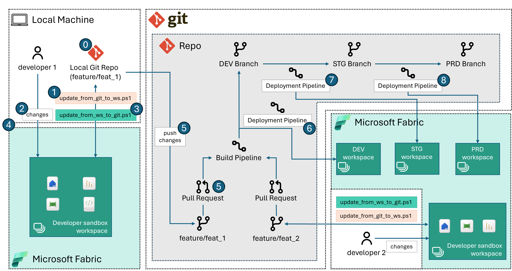

# Release Pipeline via DevOps Pipeline + REST API calls

This approach leverages REST API calls to make changes to Dev, Stg and Prod Fabric workspaces.

### Known Limitations

Microsoft Information Protection labels are now being enforced by Fabric but there is still not a way to set MIP labels via APIs. When MIP labels are defaulting to Restricted/Confidential, then some of the API calls in the below scripts might fail.


## Using Fabric Item APIs only

This approach comes handy when the source control tool you are using is not Azure DevOps as the 
current Git integration that Fabric offers only works for Azure DevOps.

The below picture illustrates the steps that this approach follows:



This approach assumes that the developer will operate in the following way:

0. Create new feature branch from `dev` (or any other development branch) and pull new feature 
branch locally.
    1. Open the bash shell and run the following to avoid later committing to the `dev` repo Fabric `objectId`s of the sandbox workspace
        ```sh
        git update-index --assume-unchanged $(git ls-files | grep "item.config.json" | tr '\n' ' ')
        ```
1. Run the [`update_from_git_to_ws.ps1`](../../src/option_2/update_from_git_to_ws.ps1) script from the local repository folder. This step will 
create a new workspace and mirror what is on the repo to the workspace. Note tha it will delete workspace
 items that are not on the repository. 
    1. when running input the required parameters, and in particular the folder on the local branch 
    where Fabric items reside. You can use the [`params.psd1`](../../src/option_2/params.psd1) file for loading your values into a config variable as follows:
        ```pwsh
        $config = Import-PowerShellDataFile .\src\option_2\params.psd1
        ```
    2. **IMPORTANT!** The first time this script is run after a new branch is created the developer 
    should use the flag `-resetConfig` setting it to `$true`. This assumes no `item.config.json` files are present and creates
    corresponding new objects in the workspace. This is needed because otherwise the script would fail being 
    unable to find the corresponding `objectId`s in the newly created Fabric workspace as it would be looking for the `objectId`s
     that are in the `dev` branch\workspace instead.
2. Work on the workspace as needed
3. When happy with the changes, the developer will run the [`update_from_ws_to_git.ps1`](../../src/option_2/update_from_ws_to_git.ps1). 
The script will mirror back from the workspace to the repository. It will also delete from the repository what is not in the workspace.
4. iterate between step 1 and step 3 as needed
5. When happy with the changes, developer creates a PR to `dev`
    1. Make sure that when creating the PR no `item.config.json` files are pushed to `dev`
6. When the PR is approved a devops Build and Release pipelines are triggered
    1. the Build pipeline checks that no `item.config.json` files are being pushed to `dev`
    2. the release pipeline will mirror what is on `dev` to the development workspace by running `update_from_git_to_ws.ps1`
7. The release pipeline for STG and PRD can be identical or a variation to the release pipeline for DEV, hence we are omitting it
